# Bulletins sample app

In this tutorial, you'll learn about installing, configuring, and using the **Bulletins** sample app.

## Overview

The Bulletins Power Apps app for Microsoft Teams provides a central location for all company communication such as broadcasts, memos, announcements, and company news. The app allows you to:

- Create bulletin posts.
- Categorize bulletin posts.
- Search and read posts.
- Bookmark posts to read later.

The Bulletins app solution consists of two apps.

- [Manage bulletins app](#manage-bulletins-app)

    - Manager experience for managing Bulletins app.
    - Allows managers to create, edit, and categorize posts read through the Bulletins app.

- [Bulletins app](#bulletins-app)

    - Central location for all company communication such as memos, broadcasts, and news.
    - Shows bulletins, FAQs, links, and contacts created using the **Manage bulletins** app.

## Prerequisites

Before using this app:

1. Find the app in Teams store.
2. Install the app.
3. Set up the app for the first use.

For details about the above steps, go to [Use sample apps from the Teams store](use-sample-apps-from-teams-store.md).

## Manage bulletins app

Manage bulletins app is the manager experience for Bulletins. This app is where you'll create, edit posts, and categorize posts that the users will read through the Bulletins app.

### Open the Manage bulletins app

To open the Manage bulletins app:

1. Sign in to Teams.

1. Select the Team.

1. Select the channel where you installed the **Bulletins** app.

1. Select the **Manage Bulletins** tab.

    

1. Select **Allow** if the app asks for your permissions to use the connectors.

1. You can learn more about extending this app capabilities on the splash screen. Select **Got it** to close the screen, and go to the app. To hide this message while opening this app again, select **Don't show this again** before you select **Got it**.

    

### Understand the Manage bulletins app interface

**Manage bulletins** app consists of the following capabilities.

1. **Bulletins tab** - Create, edit, and publish posts.

1. **FAQs tab** - Create, edit, and publish Frequently Asked Questions (FAQ) posts.

1. **Links and contacts tab** - Add categorized links and contacts responsible for link categories.

1. **Drafts** - Shows unpublished posts. Posts in draft (unpublished) aren't visible to users of the Bulletins app.

1. **New bulletin** - Write new bulletins.

1. **Information** - View more information about the Manage Bulletins app.

1. **Settings** - Change app settings.

1. **Published posts** -  View posts that are available to users of the Bulletins app.

### Categories for bulletins, FAQs, and links

Each bulletin post, FAQ, link, or contact has an associated category. To add, edit, or delete these categories:

1. Open the **Manage bulletins** app.

1. Select **Settings** () from the top-right side of the app.

    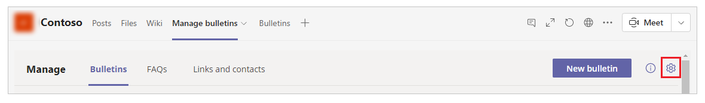

    - To add a category, select **Add category**.

        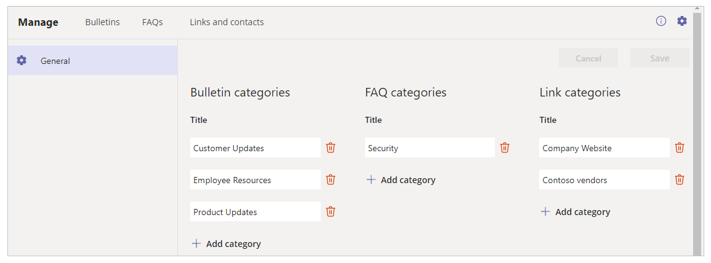

    - To delete a category, select **Delete**.

    - To edit a category, select the category, and update the name.

1. Select **Save**.

### Create a new bulletin post

A bulletin post is visible to users of the Bulletin app with the details that you enter while creating a bulletin.

To create a new bulletin post:

1. Open the **Manage bulletins** app.

1. Select **Bulletins** tab.

1. **New bulletin**.

1. Select a category.

1. To make the bulletin appear at the top of the list as a featured post, select the **Make it featured** drop-down, and select the desired time frame for which the post should be featured.

1. (Optional) If you want to schedule the post to appear at a later date, toggle **Schedule** to *On*, and specify a date/time when the post should appear to users in the Bulletins app.

1. In **Bulletin details** section, enter the details of the post.

    1. Add a cover image or video URL. This image or video will appear in the header of your post.

    1. Add a title.

    1. (Optional) Add a subtitle.

    1. Enter the text of your bulletin. Formatted text is supported using rich controls.

1. Bulletins allows authors to add a button that links to a website. For
    example, you may want to link to a SharePoint site that has more details
    about an announcement. To add a link button, enter a title for your button
    in the **Addd a button** section, then enter the URL for the website to
    which the button should hyperlink to.

1. Specify the author for the bulletin in the **Author** section.

1. Select **Save** from the top-right side of the screen.

1. If the post is ready for an approver to review it, toggle **Ready for review** to *On*.

1. To preview what the post will look like to users of the Bulletins app, select **Preview**.

1. When ready to publish the post for all users in the Bulletin app to see, select **Publish.**

### View post statistics

To view the number of people who have viewed and bookmarked a post, open the
post in **Manage bulletins** app. You'll see statistics regarding the number of views and bookmarks for the bulletin. You can also change the filter to show the statistics of the last 7 days, 30 days, or 6 months.

### Edit, delete, or unpublish a post

To modify or delete a bulletin post, or if you want to change a published post to a draft:

1. Open the **Manage bulletins** app.

1. Select the desired post from the list of published posts.

    - To delete a post, select **Delete**.

    - To change a published post to draft status, select **Unpublish**.

    - To edit a post, select **Edit**.

    

### Create FAQs post

If your post is in question, and answer format, use FAQs as the post type. 
To create an FAQs post, perform the following steps:

1. Open the **Manage Bulletins** app.

1. Select **FAQs** tab.

1. Select **New FAQ**.

    

1. Enter FAQ details.

    1. Select a category.

    1. Enter the question in **Question** text box.

    1. Enter the answer in the **Answer** rich-text box. This text box supports formatted text, such as bold, underline, and hyperlinks.

1. To make this FAQ a featured question in the FAQs section of the Bulletins app, toggle **Make it featured** to *Yes*.

1. If the FAQ is ready for an approver to review it, toggle **Ready for review** to *On*.

1. Select **Save** to save and publish the FAQ.

    

### Edit or delete a FAQ bulletin

To edit or delete a FAQ bulletin post:

1. Open the **Manage bulletins** app.

1. Select **FAQs** tab.

1. Select the FAQ that you want to edit or delete.

    - To edit the FAQ, update the category, question, or answer. And then, select **Save**

    - To delete the FAQ, select **Delete**

    

### Manage links and contacts

Links and contacts provide users of the Bulletins app with helpful information
about related website links and organization contacts whom they can contact with questions about bulletin categories. For example, if you have a category for safety in the Bulletins app, you might want to add a link to the safety
department SharePoint site and add the safety manager as a contact in the app
for the Safety category.

#### Add a link

To add a link to the Bulletins app:

1. Open the **Manage Bulletins** app.

1. Select **Links and contacts** tab.

1. Select **Add link**.

1. Add link details&mdash;*Title*, *Description*, *Category*, and *URL*.
      **Preview** section shows the link details as you enter.

1. Select **Save** to save the link.

    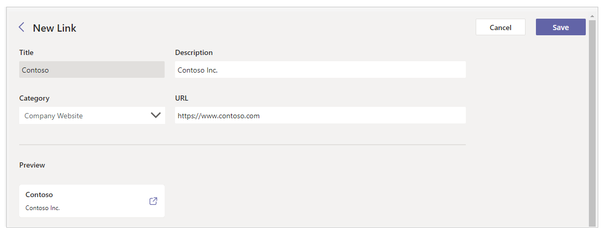

#### Edit, or delete a link

To edit, or delete a link:

1. Open the **Manage Bulletins** app.

1. Select **Links and contacts** tab.

1. Select the link that you want to edit, or delete.

    - To edit link, update information, and select **Save.**

    - To delete a link, select **Delete**.

    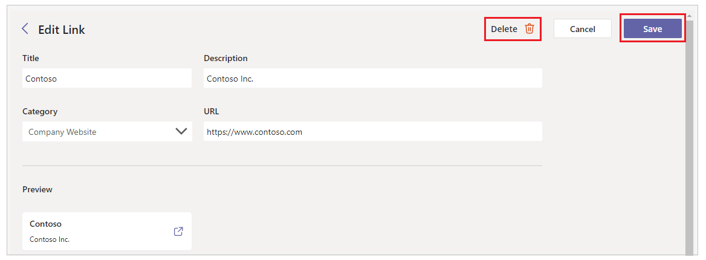

#### Add a contact

You can add internal, and external contacts to Bulletins to provide helpful
contacts related to bulletin categories.

##### Add an internal contact

To add a contact that is a member of your organization:

1. Open the **Manage Bulletins** app.

1. Select **Links and contacts** tab.

1. Select **Add contact**.

1. Toggle **Internal user** to *Yes*.

1. Search for the contact from the **Select a contact** dropdown.

1. Select **Category**.

1. Enter **Description**.
      **Preview** section shows the link details as you enter.

    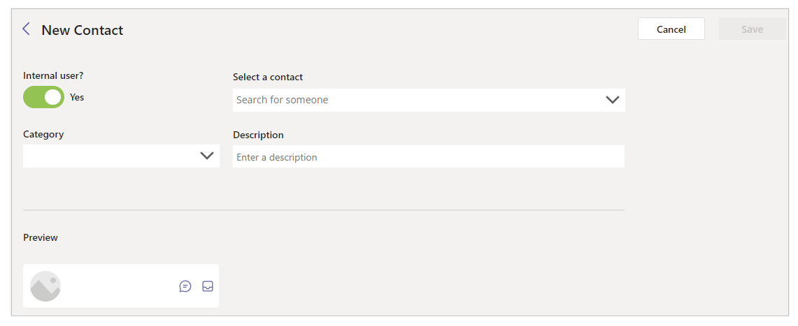

1. Select **Save**.

##### Add an external contact

To add a contact from outside of your organization:

1. Open the **Manage Bulletins** app.

1. Select **Links and contacts** tab.

1. Select **Add contact**.

1. Toggle **Internal user** to *No*.

1. Enter **Name**.

1. Select **Category**.

1. Enter **Description**.

1. Enter **Email Address** of contact.
      **Preview** section shows the link details as you enter.

    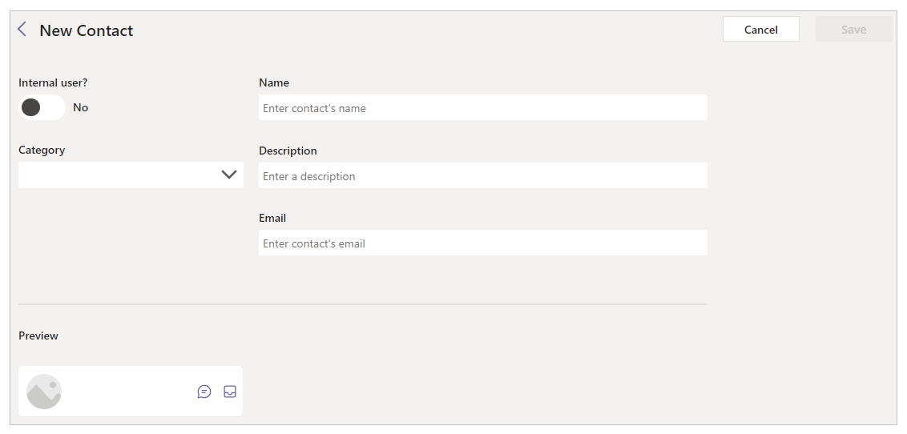

1. Select **Save**.

#### Edit or delete a contact

To edit, or delete a contact:

1. Open the **Manage Bulletins** app.

1. Select **Links and contacts** tab.

1. Select the contact that you want to edit, or delete.

    - To edit contact, update information, and select **Save.**

    - To delete contact, select **Delete**.

    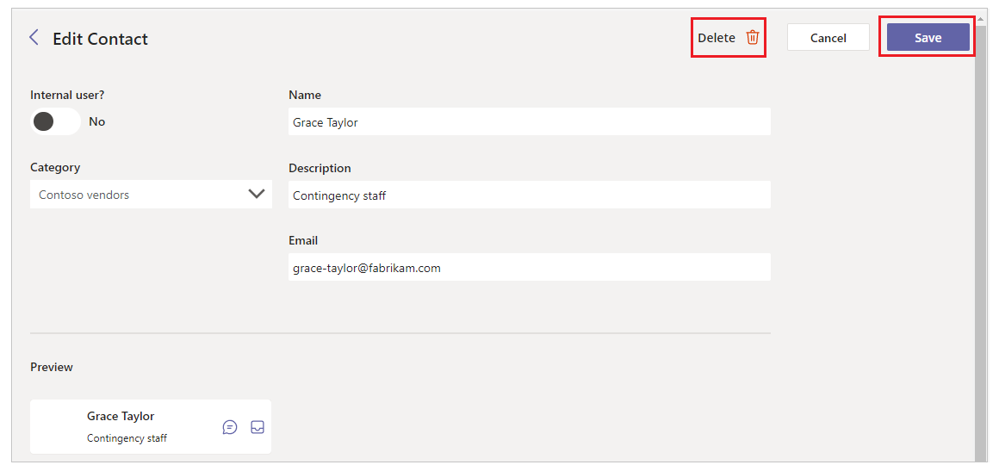

## Bulletins app

The **Bulletins** app in Microsoft Teams is a central location for all company
communication, such as memos, broadcasts, and news. The Bulletins app displays
bulletins, FAQs, links, and contacts created in the **Manage bulletins** app.

### Open the Bulletins app

1. Sign in to Teams.

1. Select the Team.

1. Select the channel where you installed the **Bulletins** app.

1. Select the **Manage Bulletins** tab.

    

1. Select **Allow** if the app asks for your permissions to use the connectors.

### Understand the Bulletins app user interface

The Bulletins app consists of the following capabilities.

1. **App areas** - switch between the different areas of the Bulletins app:

    1. **Home** - view the bulletin posts.

    1. **FAQs** - view frequently asked questions.

    1. **Links and contacts** - view links and contacts.

1. **Sort and filter** - change the order of the categories displayed in the app, and hide/unhide categories.

1. Search for bulletins.

1. **Category** - indicates the category for which the post tiles in this section apply. Featured bulletin posts are shown above other categories.

1. **Posts** - tiles displaying the image or video, title, and description of the post. Select the tile to view the post. Posts also indicate the age of the post’s publication.

    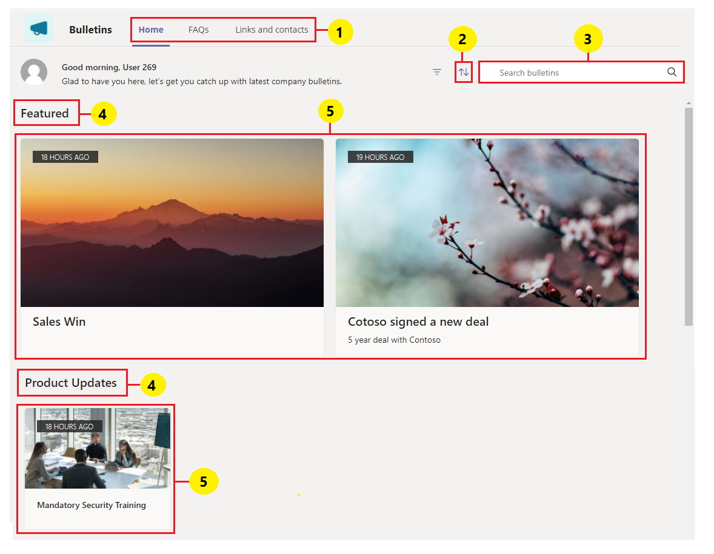

### View a post

To view a post, select the desired bulletin post tile. If a link button has been defined for the post, it'll be displayed at the bottom of the post. Select the button to view the link.

To close the post, select the **Close** button.

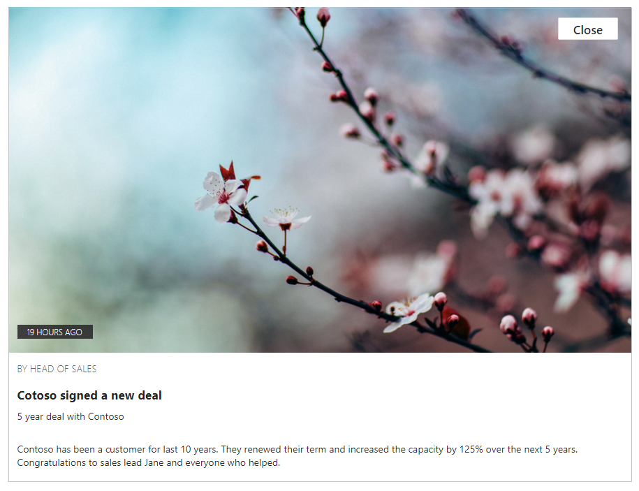

### View frequently asked questions (FAQs)

To view FAQs:

1. Open the **Bulletins** app.

1. Select **FAQs** tab.

1. Select the question. You can also search for the question.

    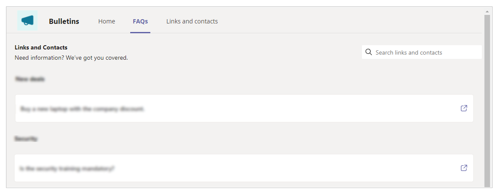

1. After reading the FAQs details, select **Close**.

### View links and contacts

The Bulletins app shows helpful links and contacts grouped by category.

To view links, and contacts:

1. Open the **Bulletins** app.

1. Select the **Links and contacts** tab.

1. Select the link or contact. You can also search use search option.

    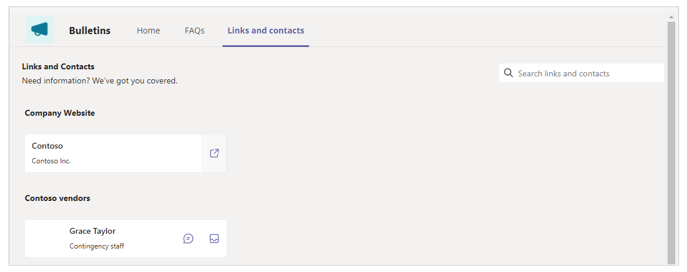

### See also

- [Sample apps FAQs](sample-apps-faqs.md)
- [Employee ideas sample app](employee-ideas.md)  
- [Issue Reporting sample app](issue-reporting.md)
- [Customize sample apps](customize-sample-apps.md)
