# Bulletins sample app

In this tutorial, you'll learn about installing, configuring, and using the **Bulletins** sample app.

## Overview

The Bulletins Power Apps app for Microsoft Teams provides a central location for all company communication such as broadcasts, memos, announcements, and company news. The app allows you to:

- Create bulletin posts.
- Categorize bulletin posts.
- Search and read posts.
- Bookmark posts to read later.

The Bulletins app solution consists of two apps.

- [Manage bulletins app](#manage-bulletins-app)

    - Manager experience for managing Bulletins app.
    - Allows managers to create, edit, and categorize posts read through the Bulletins app.

- [Bulletins app](#bulletins-app)

    - Central location for all company communication such as memos, broadcasts, and news.
    - Shows bulletins, FAQs, links, and contacts created using the **Manage bulletins** app.

## Prerequisites

Before using this app:

1. Find the app in Teams store.
2. Install the app.
3. Set up the app for the first use.

For details about the above steps, go to [Use sample apps from the Teams store](use-sample-apps-from-teams-store.md).

## Manage bulletins app

Manage bulletins app is the manager experience for Bulletins. This app is where you'll create, edit posts, and categorize posts that the users will read through the Bulletins app.

### Open the Manage bulletins app

To open the Manage bulletins app:

1. Sign in to Teams.

1. Select the Team.

1. Select the channel where you installed the **Bulletins** app.

1. Select the **Manage Bulletins** tab.

    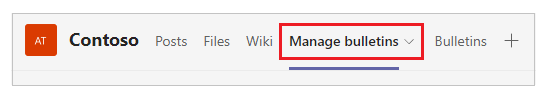

1. Select **Allow** if the app asks for your permissions to use the connectors.

1. You can learn more about extending this app capabilities on the splash screen. Select **Got it** to close the screen, and go to the app. To hide this message while opening this app again, select **Don't show this again** before you select **Got it**.

    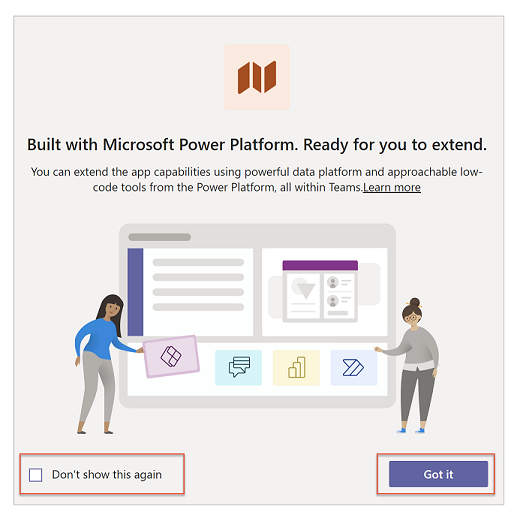

### Understand the Manage bulletins app interface

**Manage bulletins** app consists of the following capabilities.

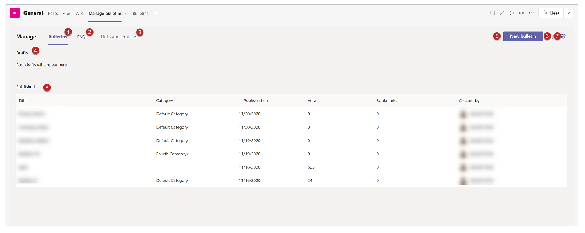

1. **Bulletins tab** - Create, edit, and publish posts.

1. **FAQs tab** - Create, edit, and publish Frequently Asked Questions (FAQ) posts.

1. **Links and contacts tab** - Add categorized links and contacts responsible for link categories.

1. **Drafts** - Shows unpublished posts. Posts in draft (unpublished) aren't visible to users of the Bulletins app.

1. **New bulletin** - Write new bulletins.

1. **Information** - View more information about the Manage Bulletins app.

1. **Settings** - Change app settings.

1. **Published posts** -  View posts that are available to users of the Bulletins app.

### Create a new bulletin post

A bulletin post is visible to users of the Bulletin app with the details that you enter while creating a bulletin.

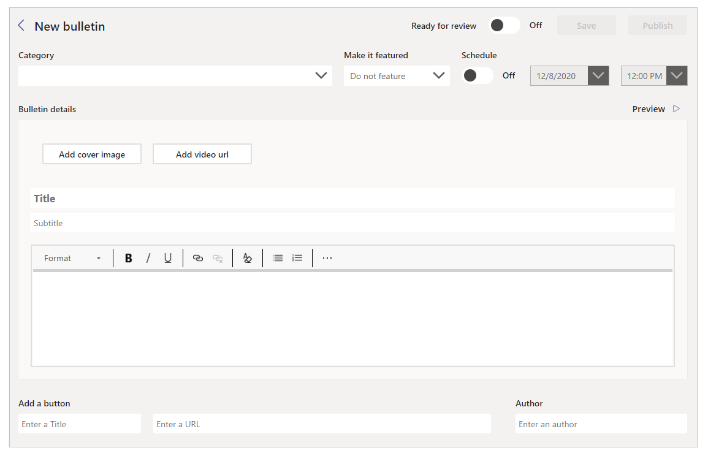

To create a new bulletin post:

1. Select **Bulletins** tab.

1. **New bulletin**.

1. Select a category.

1. To make the bulletin appear at the top of the list as a featured post, select the **Make it featured** drop-down, and select the desired time frame for which the post should be featured.

1. (Optional) If you want to schedule the post to appear at a later date, toggle **Schedule** to *On*, and specify a date/time when the post should appear to users in the Bulletins app.

1. In **Bulletin details** section, enter the details of the post.

    1. Add a cover image or video URL. This image or video will appear in the header of your post.

    1. Add a title.

    1. (Optional) Add a subtitle.

    1. Enter the text of your bulletin. Formatted text is supported using rich controls.

1. Bulletins allows authors to add a button that links to a website. For
    example, you may want to link to a SharePoint site that has more details
    about an announcement. To add a link button, enter a title for your button
    in the **Addd a button** section, then enter the URL for the website to
    which the button should hyperlink to.

1. Specify the author for the bulletin in the **Author** section.

1. Select **Save** from the top-right side of the screen.

1. If the post is ready for an approver to review it, toggle **Ready for review** to *On*.

1. To preview what the post will look like to users of the Bulletins app, select **Preview**.

1. When ready to publish the post for all users in the Bulletin app to see, select **Publish.**

### View post statistics

To view the number of people who have viewed and bookmarked a post, open the
post in **Manage bulletins** app. You'll see statistics regarding the number of views and bookmarks for the bulletin. You can also change the filter to show the statistics of the last 7 days, 30 days, or 6 months.

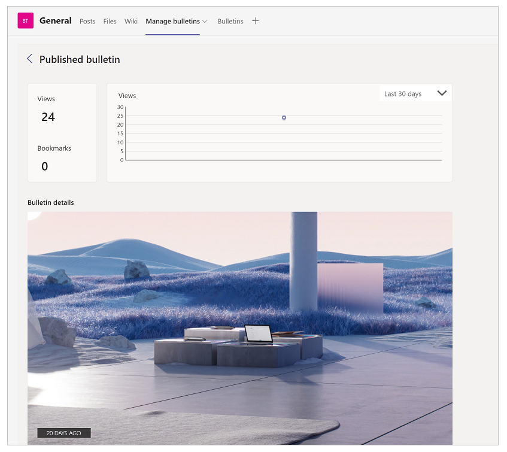

### Edit, delete, or unpublish a post

To modify or delete a bulletin post, or if you want to change a published post to a draft:

1. Open **Manage bulletins** app.

1. Select the desired post from the list of published posts.

    - To delete a post, select **Delete**.

    - To change a published post to draft status, select **Unpublish**.

    - To edit a post, select **Edit**.

    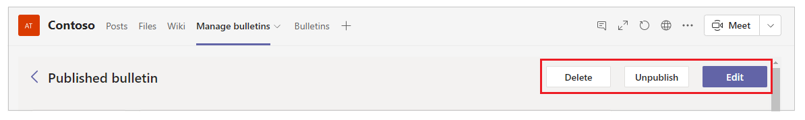

### Create FAQs post

If your post is in question, and answer format, use FAQs as the post type. 
To create an FAQs post, perform the following steps:

1. Open **Manage Bulletins** app.

1. Select **FAQs** tab.

1. Select **New FAQ**.

    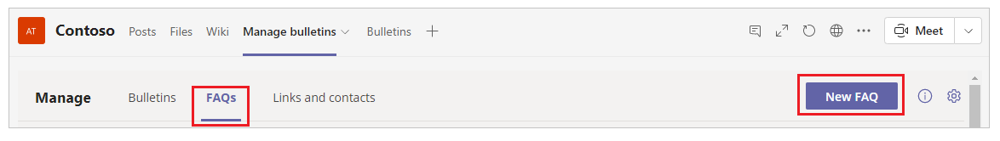

1. Enter FAQ details.

    1. Select a category.

    1. Enter the question in **Question** text box.

    1. Enter the answer in the **Answer** rich-text box. This text box supports formatted text, such as bold, underline, and hyperlinks.

1. To make this FAQ a featured question in the FAQs section of the Bulletins app, toggle **Make it featured** to *Yes*.

1. If the FAQ is ready for an approver to review it, toggle **Ready for review** to *On*.

1. Select **Save** to save and publish the FAQ.

    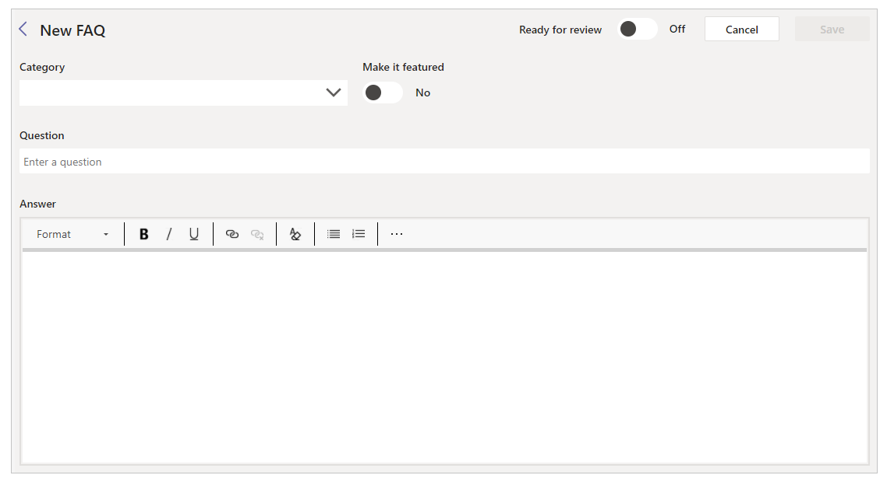

### Edit or delete a FAQ bulletin

To edit or delete a FAQ bulletin post:

1. Open **Manage bulletins** app.

1. Select **FAQs** tab.

1. Select the FAQ that you want to edit or delete.

    - To edit the FAQ, update the category, question, or answer. And then, select **Save**

    - To delete the FAQ, select **Delete**

    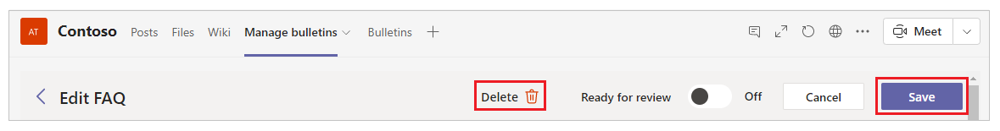

Manage links and contacts
-------------------------

Links and contacts provide users of the Bulletins app with helpful information
about related website links and organization contacts whom they can contact with
questions about bulletin categories. For example, if you have a category for
safety in the Bulletins app, you might want to add a link to the safety
department SharePoint site and add the safety manager as a contact in the app
for the Safety category.

Add a link
----------

To add a link to the Bulletins app, follow these steps:

1.  Open the **Manage Bulletins** app in Microsoft Teams

2.  Click **Links and contacts**

3.  Click **Add link**

4.  Add link details

    1.  Title

    2.  Description

    3.  Category

    4.  URL

5.  The **Preview** section will show the way the link will appear in the
    Bulletins app

6.  To close the new link form without saving the link, click **Cancel**

7.  To save the link, click **Save**

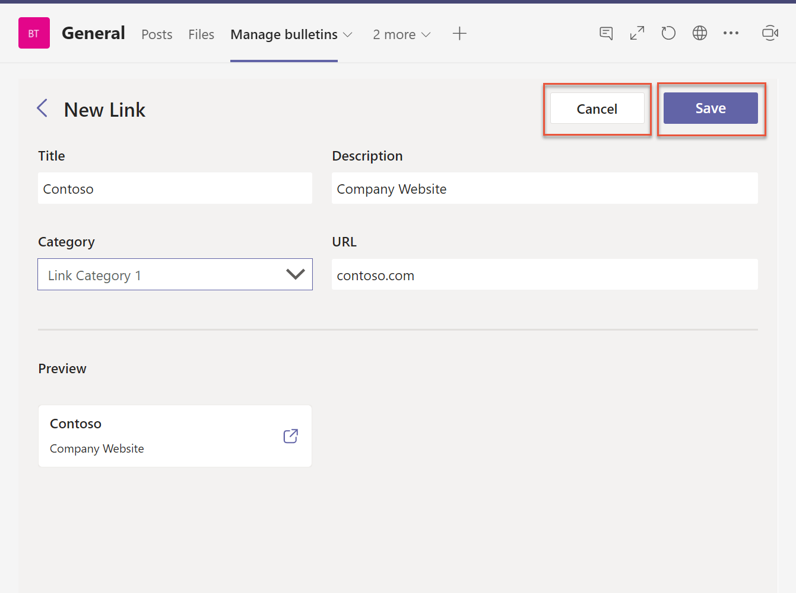

Edit or delete a link
---------------------

To modify or delete a link, perform the following steps:

1.  Open the **Manage bulletins** app in Microsoft Teams

2.  Click the **Links and contacts** tab

3.  Select the link that you wish to modify or delete

    1.  To delete a link, click **Delete**

    2.  To modify a link, change the text of the link, then click **Save.**

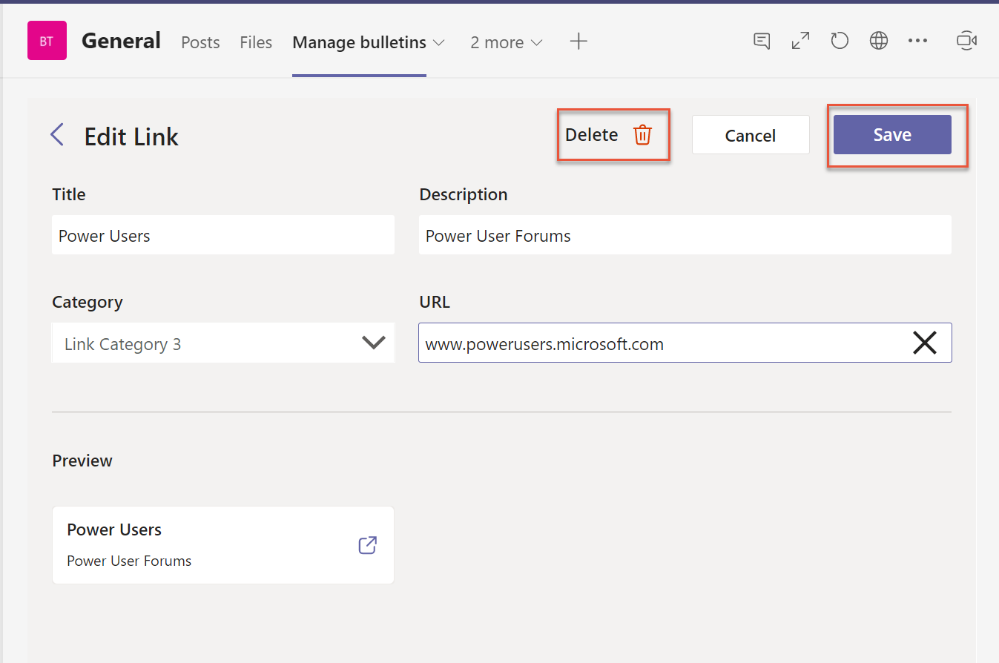

Add a contact
-------------

You can add internal and external contacts to Bulletins to provide helpful
contacts related to bulletin categories.

Add an internal contact
-----------------------

To add a contact that is a member of your organization, follow these steps:

1.  Open the **Manage bulletins** app in Microsoft Teams

2.  Click the **Links and contacts** tab

3.  Click **Add contact**

4.  To add an internal contact:

    1.  Toggle **Internal user** to **Yes**

    2.  Search for the contact from the **Select a contact** dropdown

    3.  Select **Category**

    4.  Enter description for contact you want users of Bulletins app to see for
        specified contact

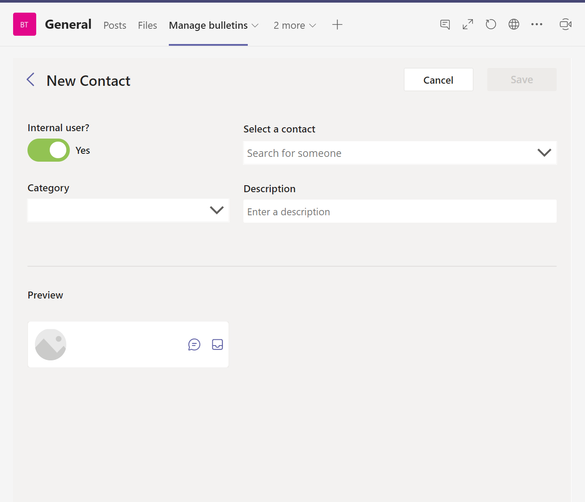

1.  To add an external contact who is not a member of your organization to the
    Bulletins app:

    1.  Toggle **Internal user** to **No**

    2.  Enter **Name**

    3.  Select **Category**

    4.  Add a **Description** that you want users or the Bulletins app to see
        for the contact

    5.  Enter **Email Address** of contact

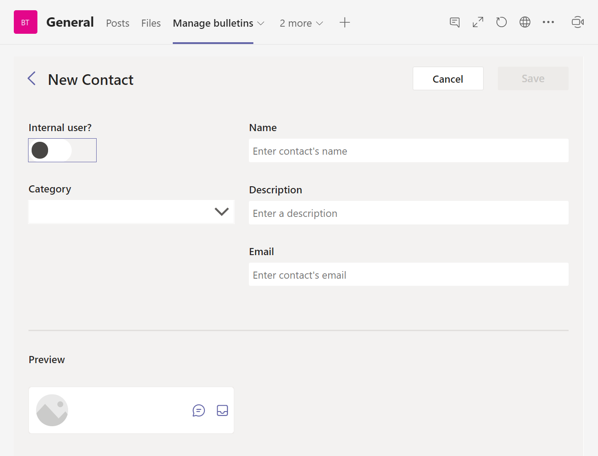

1.  The **Preview** area will display the way that the contact will appear to
    users of the Bulletin app

2.  To leave the contact form without saving, click **Cancel**

3.  To save the contact record, click **Save**

Edit or delete a contact
------------------------

To edit or delete a contact, open the contact from the **Links and contacts**
tab of the **Manage bulletins** app

-   To edit the contact, update the contact information and click **Save**

-   To delete the contact, click **Delete**

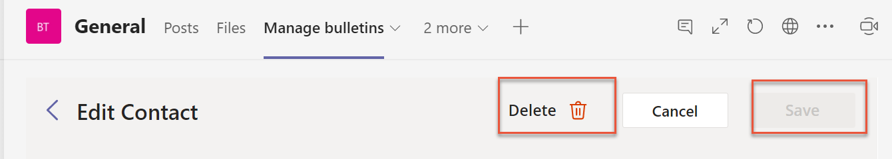

Update categories for bulletins, FAQs, and links
------------------------------------------------

To add or change the categories for bulletins, FAQ’s, or links, click Settings

-   To add a category, click **Add category**

-   To delete a category, click **Delete**

-   To rename a category, click the category title that you wish to modify and
    enter a new title

>   When finished, click **Save**

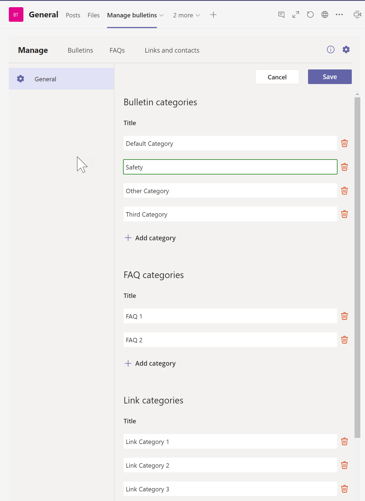

## Bulletins app

The Bulletins app in Microsoft Teams is a central location for all company
communication, such as memos, broadcasts, and news. The Bulletins app displays
bulletins, FAQs, links, and contacts created in the **Manage bulletins** app.

Opening the Bulletins app
-------------------------

1.  In Microsoft Teams, click the **Bulletins** tab

2.  The first time you run the Bulletins app, you will be prompted to allow the
    connections in the app—you must his allow to run the Bulletins app.

Understanding the Bulletins user interface
------------------------------------------

In this section, we describe the options available from the main screen of the
Bulletins app:

1.  App areas: navigate between the following areas of the Bulletins app

    1.  Home: view bulletin posts

    2.  FAQs: view frequently asked questions

    3.  Links and contacts: view helpful links and contacts

2.  Sort and filter: Change the order of the categories displayed in the app,
    and which categories are visible

3.  Search for bulletins

4.  Category: Indicates the category for which the post tiles in this section
    apply

5.  Posts: tiles displaying the image or video, title, and description of the
    post. Users may click the tile to view the post. Posts indicate the age of
    the post’s publication.

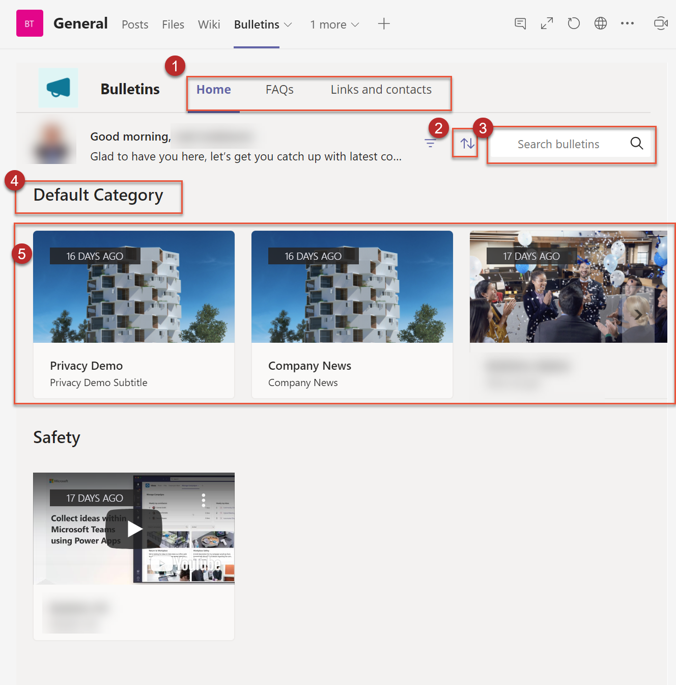

View a post
-----------

To view a post, click the desired bulletin post tile. The post will be
displayed. If a link button has been defined for the post, it will be displayed
at the bottom of the post. Click the button to view the link.

To close the post, click the **Close** button.

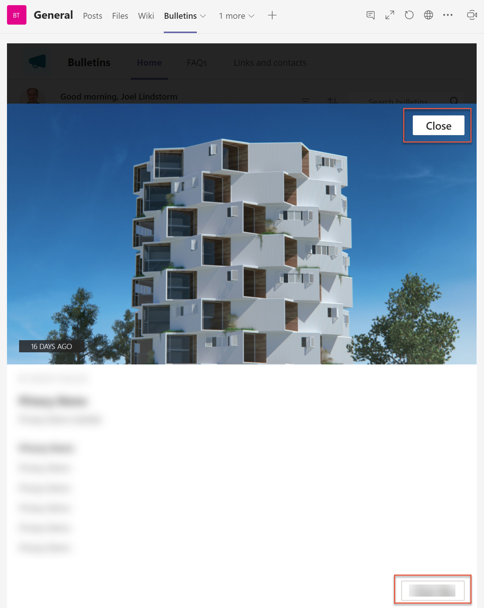

View frequently asked questions (FAQs)
--------------------------------------

To view FAQ’s in the Bulletins app in Microsoft Teams, perform the following
steps:

1.  Open the **Bulletins** tab in Microsoft Teams

2.  Click the **FAQs** tab of the Bulletins app

3.  Search for the question

4.  Click the question you wish to select

5.  FAQ form will display

6.  Click **Close** to close the FAQ form

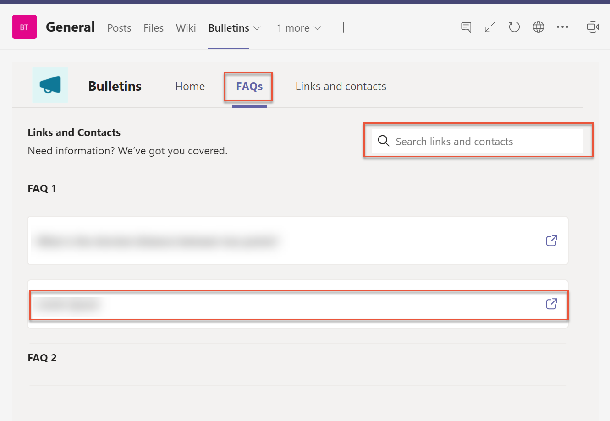

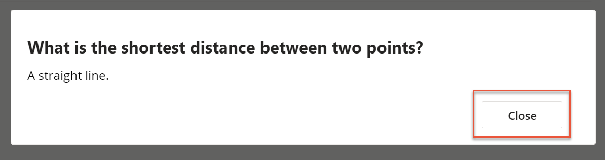

View links and contacts
-----------------------

The Bulletins app will provide users with helpful links and contacts grouped by
category. Follow these steps to find and view a link or contact:

1.  Open **Bulletins** tab in Microsoft Teams

2.  Clcik the **Links and contacts** tab

3.  Search for the desired contact or link in the search box and hit enter

4.  Search results will be displayed

5.  Click the link or contact to open the link or contact (links will open in a
    browser window).

    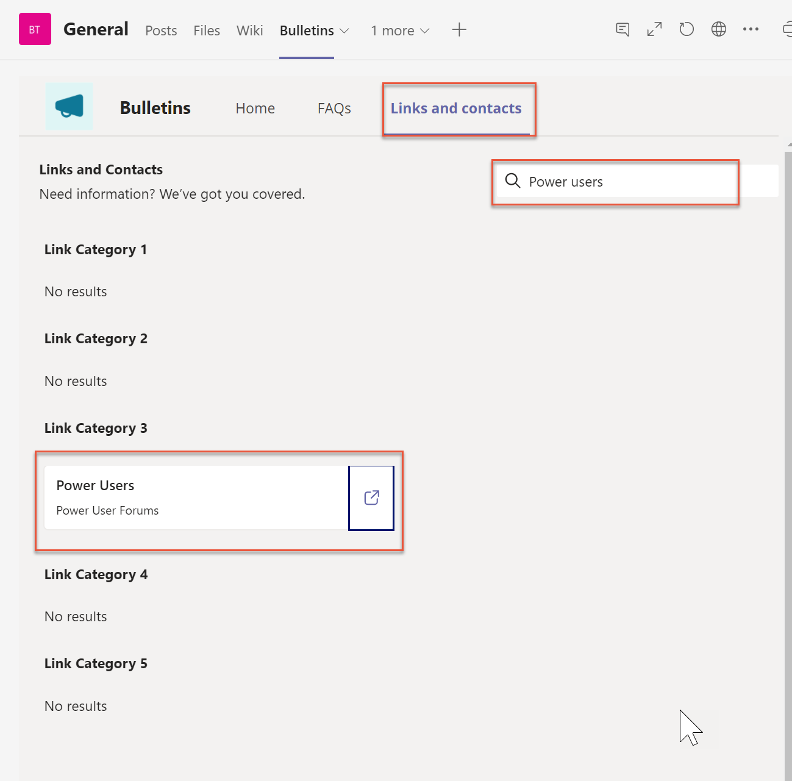
