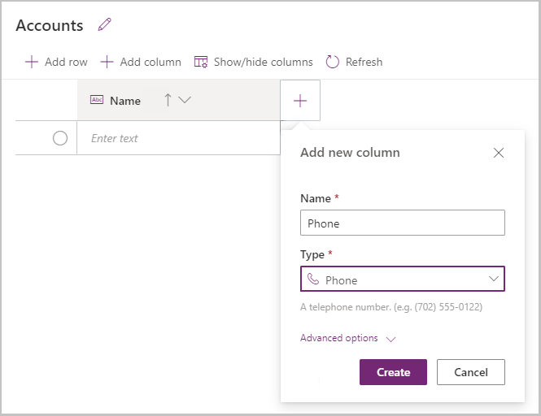
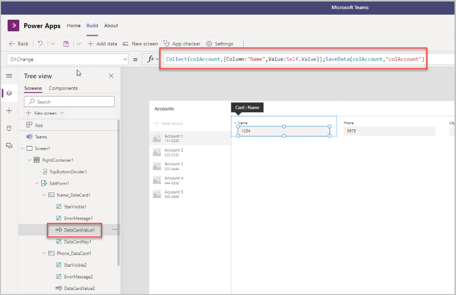
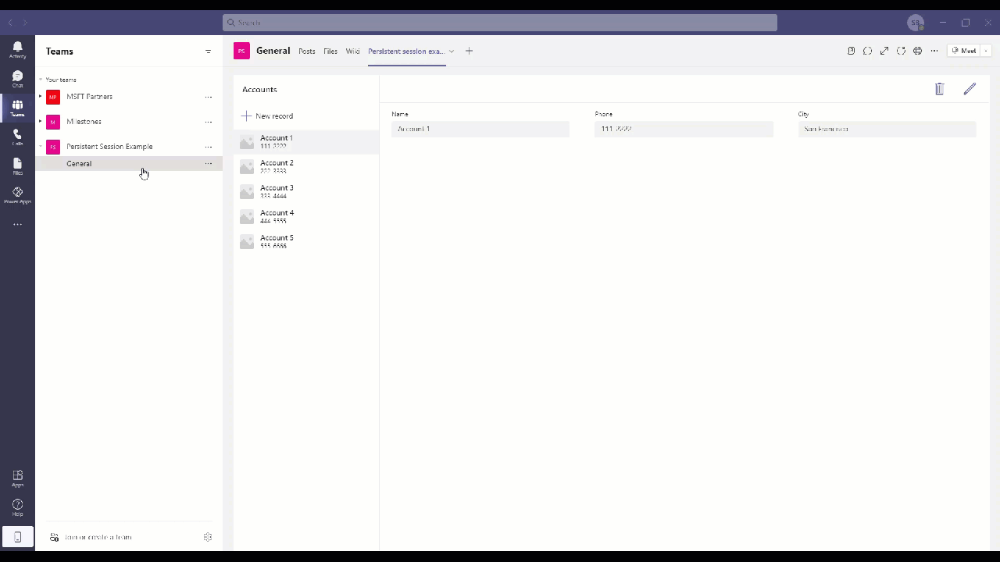

# Enable consistent experience across sessions using LoadData and SaveData functions

Microsoft Dataverse for Microsoft Teams delivers a built-in, low-code data platform for Teams. It provides relational data storage, rich data types, enterprise-grade governance, and one-click solution deployment. Dataverse for Teams enables everyone to easily build and deploy apps.

While there are numerous advantages of using Power Apps in Teams, one of the biggest design considerations is the ability to keep consistent experience across sessions.

While using an app, if we switch a tab in Teams to look at Wiki or Planner, or even chat with someone, the session data of the app is lost and we'd have to start the session from scratch. For example, if we're in the middle of an inspection using the Inspections app and we switch tabs even for a moment, all the data that was captured on the inspection would be lost and we'll have to recapture all that information.

In this article, we'll learn how to use the [LoadData() and SaveData() functions](../maker/canvas-apps/functions/function-savedata-loaddata.md) to store the session data within the app to avoid any loss of work because of switching tabs in Teams.

Watch this video to learn how to enable consistent experience across sessions:
> [!VIDEO https://www.microsoft.com/videoplayer/embed/RWL0DT]

## Prerequisites

To complete this lesson, we'd need the ability to create apps within Teams that is available as part of select Microsoft 365 subscriptions.

## Log in into Teams

Log in into Teams using Teams Desktop.

## Create a new Team

To create a new team:

1. Select the Teams tab.
1. Select **Join** or create a team on the bottom-left of the screen.
1. Select **Create a team from scratch**.
1. Select **Public** and give the team a name. In this example, we'd use "MSFT Partners".
1. Select **Create**.

The new team gets created and is listed under the Teams tab.


## Create a Power App in Teams

To create a Power Apps app in teams, we need to open Power Apps Studio in Teams as shown below.


1. Select **Power Apps** from the list of apps and pin it to the left-pane, and then select it.

    

1. Select **Start now** to create the first app.

1. Select the team for which this app is to be created—a Power Apps environment is created for that team (there's one Power Apps environment per team).

1. While the environment is being created, close the dialog box that says **Getting things ready**.

1. Select the **Build** tab on top, and in a few seconds the created app should appear in the list.

1. Open the app, and notice it gets created in the tablet layout/form factor by default.

    

1. Enter a name for the app **Persistent session example** app, and select **Save**.

    

    The app gets created with a gallery.

    

1. Select **Create new table** to create a new table.

1. Enter **Accounts**, and select **Create**.

    

1. Add two columns—**Phone** with data type of Phone, and **City** with data type of Text.

    

    

1. Add sample data to the three columns.

1. Repeat to add at least five records.

1. Select **Close**.

    

    The accounts table gets added as a data table

1. Select **Tree View** > Select **BrowseGallery1** > Select **Accounts** as the data source.

    

## Publish the app in Teams

1. Select **Publish to Teams**.

    

1. Select **Next**.

    

1. Select **+** to add the app to the "General" channel.

    

    

1. Go to the **Persistent Session Example** team, and notice the **Persistent session example** app shows up on the top as a tab.

    

## Testing the issue

1. Open the **Persistent session example** app from the **Persistent Session Example** team.

    

1. Select **New Record** to create a new account in the app.

1. Enter the name and phone number

1. Before you enter **City** and save the record, switch to a different tab (like Files or Wiki on top or a different team), and then come back to the app.

1. Notice that the data entered in the two columns is no longer available on the screen and is lost

    

## Solution: Use SaveData() and LoadData() functions

To resolve the above issue, we'll use the [LoadData() and SaveData() functions](../maker/canvas-apps/functions/function-savedata-loaddata.md). We'll create a collection for the data entered on a form as and when data is entered, and keep saving the data in the collection until the record has been committed or saved. This way, if the record hasn't been saved and we must tab out of the screen for some reason, the collection would have the saved data that would get loaded once we're back in the app. We'll also clear the collection once the record has been saved so that the collection is ready to capture new data when the next new record is being created.

1. Start with making sure that the changes we're applying are applicable only in the case of a new record. So, we're updating the variable **newMode** that will be used as a condition on the edit form to figure out what data needs to be displayed. Select **New record** and add the following formula on the **OnSelect** property of the button:

    ```powerapps-dot
    NewForm(EditForm1);
    UpdateContext({newMode: true})
    ```

    

1. Next, we'll add the data from the individual input controls to a collection, and then we'll save the data to a local file from that collection. Select the text input box—in our example it's the "DataCardValue1" of the "Name_DataCard1" on "EditForm1" for the **Name** field—enter the following formula in the **OnChange** property of the input field:

    ```powerapps-dot
    Collect(
        colAccount,    
        { Column:"Name",Value:Self.Value}
    );
    SaveData(colAccount,"colAccount").
    ```

    With this change, we're adding the data to a local cache so that if the user leaves the app, their data won't be lost.
    
    
    
    Similarly, enter the following code in the **OnChange** property for **Phone** (DataCardValue2):
    
    ```powerapps-dot
    Collect(colAccount, {Column:"Phone",Value:Self.Value});
    SaveData(colAccount,"colAccount");
    ```
    
    And enter the following code in **OnChange** property for **City** (DataCardValue3):
    
    ```powerapps-dot
    Collect(colAccount {Column:"City", Value:Self.Value});
    SaveData(colAccount, "colAccount");
    ```

1. Now we'll update the App OnStart so that if there's any data saved in the collection, that would get loaded on the start of the app.

    Go to the **App** > **OnStart** property, and add the following formula:

    ```powerapps-dot
    LoadData(colAccount,"colAccount", true)
    ```

    

1. Next, we need to update the **Default** property of the data fields so that when the page loads once we come back to the app, if data exists in the collection, it should show the data from the collection by default.

    Select the field **DataCard** and update the **Default** property of the data card to the following formula for the listed fields.
    
    For **Name** field, enter **Name_DataCard1:**
    
    ```powerapps-dot
    If(
        newMode && !IsBlank(
            Last(
                Filter(colAccount, Column = "Name")
            ).Value
        ),
        Last(
            Filter(colAccount, Column = "Name")
        ).Value,
        If(newMode, Blank(), ThisItem.Name)
    )
    ```
    
    
    
    Similarly, enter the following formula in the **Default** property formula for **Phone** (Phone_DataCard1):
    
    ```powerapps-dot
    If(
        newMode && !IsBlank(
            Last(
                Filter(colAccount, Column ="Phone")
            ).Value
        ),
        Last(
            Filter(colAccount, Column = "Phone")
        ).Value,
        If(newMode, Blank(), ThisItem.Phone)
    )
    ```
    
    And use the following formula for **City** (City_DataCard1):
    
    ```powerapps-dot
    If(
        newMode && !IsBlank(
            Last(
                Filter(colAccount, Column = "City")
            ).Value
        ),
        Last(
            Filter(colAccount, Column = "City")
        ).Value,
        If(newMode,Blank(), ThisItem.City)
    )
    ```

1. Now, we need to clear the collection in two scenarios:

    1. When the user submits the form, and the changes get saved.
    1. When the user selects the cancel button to cancel the changes.

    Use the following formula in the **OnSelect** property of the **Submit** button.

    ```powerapps-dot
    SubmitForm(EditForm1);
    UpdateContext({editMode: false, newMode: false});
    Clear(colAccount);
    SaveData(colAccount, "colAccount");
    ```

    

    Select the **Cancel** button, and enter the following formula:

    ```powerapps-dot
    ResetForm(EditForm1);
    UpdateContext({editMode: false, newMode: false});
    Clear(colAccount);
    SaveData(colAccount, "colAccount");
    ```

    

1. Publish the apps after making all the above changes by selecting **Publish to Teams**.

## Test the app again

1. Go to the team and run the app.

1. Select **+ New** record, and add the name and phone details for the new record.

1. Select another tab to move out of the app.

1. Come back to the app—it shows details of the first account.

1. Now, when we select **+ New** again, we'll see the Name and Phone details populated in those text input fields already. And we can resume adding the account we were adding before we had to tab out of the app.

    

## How we use SaveData and LoadData in the Inspection app

In the Inspection sample app, we use load data and save data on the inspection form—if a user is in the middle of an inspection, and they switch away from the apps in Teams (like to send someone a message), we don’t want them to lose their place in the inspection. When they return to the app tab in Teams, the app gives them the option to resume the in-progress inspection.

## Considerations

In Dataverse for Teams, there are some limits to the SaveData() and LoadData() capabilities.

- 1-MB limit on Teams Desktop.
- Doesn't work in a browser.
- Apps in mobile are limited by the amount of local storage available to the app.

### See also

- [Boards (preview) sample app](boards.md)
- [Bulletins sample app](bulletins.md)
- [Employee ideas sample app](employee-ideas.md)
- [Get connected (preview)](get-connected.md)  
- [Inspection sample apps](inspection.md)  
- [Issue reporting sample apps](issue-reporting.md)
- [Milestones sample app](milestones.md)
- [Perspectives (preview) sample app](perspectives.md)
- [Profile+ (preview) sample app](profile-app.md)
- [Customize sample apps](customize-sample-apps.md)
- [Sample apps FAQs](sample-apps-faqs.md)

[!INCLUDE[footer-include](../includes/footer-banner.md)]