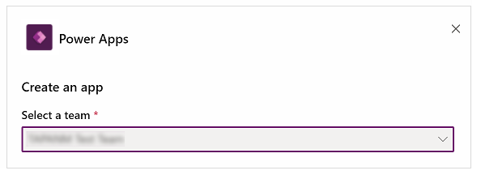
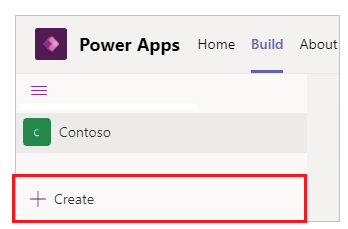

# Create additional apps from Microsoft Teams

Using the Power Apps app to create the [first app](create-first-app.md) in a team creates an environment. After an environment is available, you can create additional apps in the team by using several methods. Let's take a look at them.

## Create an app from the Power Apps home

Select **Create an app** from the Power Apps app to get started with creating an app.

When the team that you select already has an environment available, you're not prompted to install an environment. Instead, you can select **Create** to create the app.

## Create an app from the environment home

To create an app for the environment, you can also select the environment on the left pane, and then select **New**.

You can also select **Create** at the bottom of the environment list.

## Create an app while inside a team

To create an app while you're inside a team, go to the team and select the channel. Select **Add a tab** .

In the dialog box, select **Power Apps**, and then select **Create an app in Power Apps**.

## Create an app from the solution explorer

You can also select **New** \> **Canvas app**, and then select an app layout to
create an app. A canvas app is an app that you can create from scratch
or using any available template through Power Apps Studio. More
information: [Canvas apps terminology reference and definitions](overview-of-the-power-apps-app.md#canvas-apps-terminology-reference-and-definitions)

> [!TIP]
> Creating a canvas app using different methods doesn't affect which app features are available. If you want to change the app orientation and size after you selected a layout, go to [Change screen size and orientation of a canvas app](../maker/canvas-apps/set-aspect-ratio-portrait-landscape.md).

### See also

[Microsoft Teams integration object](use-teams-integration-object.md)  
[Use the Fluent UI controls](use-the-fluent-ui-controls.md)

[!INCLUDE[footer-include](../includes/footer-banner.md)]