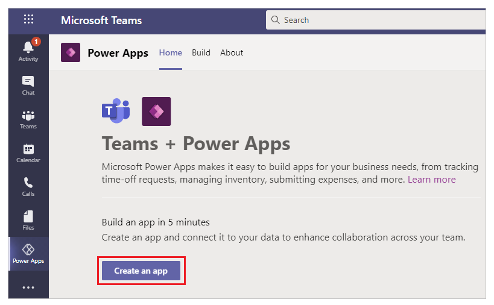
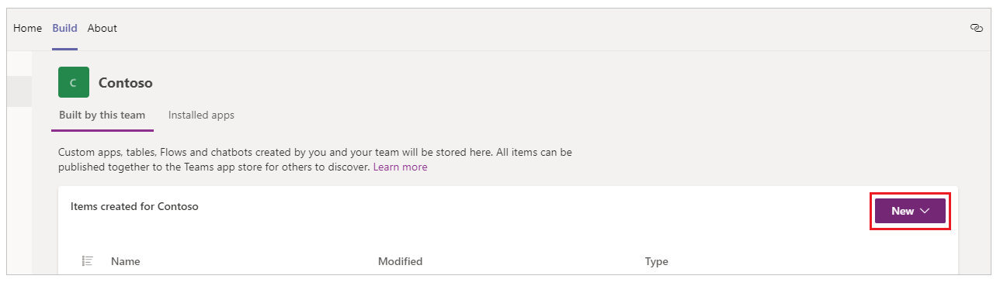
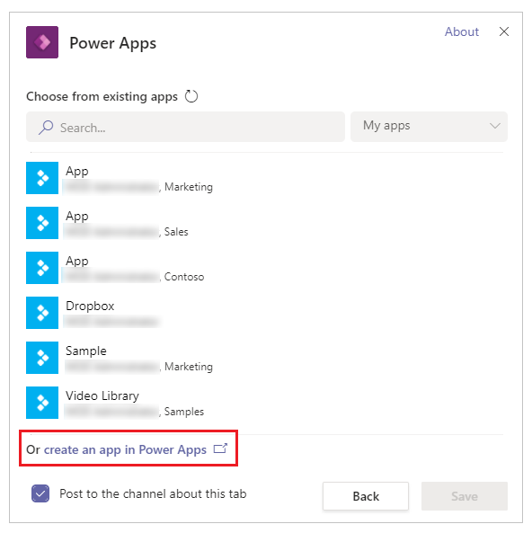
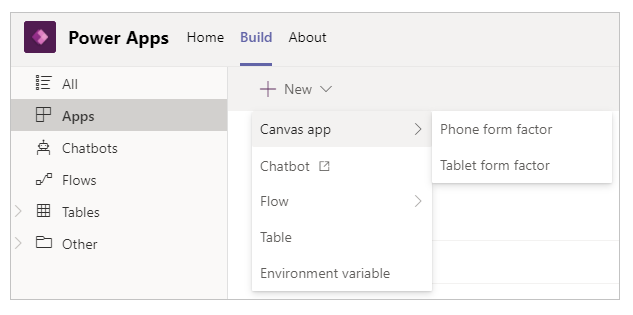

# Create additional apps from Teams

[!INCLUDE [cc-beta-prerelease-disclaimer.md](../includes/cc-beta-prerelease-disclaimer.md)]

Creating the [first app](create-first-app.md) inside a team using Power Apps app creates an environment. After an environment is available, you can create additional apps inside a team using several methods. Let’s take a look at several methods you can use to create an app.

## Create an app from Power Apps Home

Select **Create an app** from the Power Apps app to get started with creating an app.

When the team that you select already has an environment available, you’re not prompted about the need to install an environment. Instead, you can select **Create** to create the app.

## Create an app from the environment home

To create an app for the environment, you can also select the environment in the left pane and then select **New**.

You can also select **Create** at the bottom of the environments list.

## Create an app while inside a team

To create an app while you’re inside a team, go to the team and select the channel. Use  icon to add a tab.

From the open dialog box, select **Power Apps** and then, select **Create an app
in Power Apps**.

## Create an app from the solution explorer

You can also select **New \> Canvas app** and then select an app layout to
create an app. Canvas app is a Power Apps app that you can create from scratch
or using any available template through the Power Apps Studio. For more
information, go to Canvas apps terminology reference and definitions.

> [!TIP]
> Creating a canvas app using different methods doesn’t affect the available app features. If you want to change the app orientation and size after you selected a layout, go to [change the screen size and orientation of a canvas app](../maker/canvas-apps/set-aspect-ratio-portrait-landscape.md).

### See also

- [Use Teams integration object](use-teams-integration-object.md)
- [Use the Fluent UI controls](use-the-fluent-ui-controls.md)
