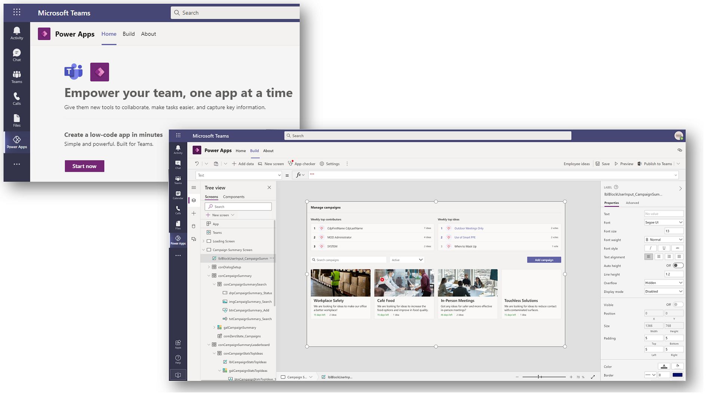

# Create apps in Microsoft Teams by using Power Apps (Preview)

[!INCLUDE [cc-beta-prerelease-disclaimer.md](../includes/cc-beta-prerelease-disclaimer.md)]

With the significant number of enterprise employees working remotely, and millions of them meeting and collaborating through Microsoft Teams, there's significant interest in building low-code and no-code applications that can make remote work easier and more productive.

Introducing [Project Oakdale](overview-data-platform.md), a built-in, low-code data platform for Teams that empowers you to build custom apps and workflows in Teams by using Power Apps and Power Automate. Project Oakdale&mdash;built on [Common Data Service](/powerapps/maker/common-data-service/data-platform-intro)&mdash;provides relational data storage, rich data types, enterprise-grade governance, and one-click solution deployment to the Teams app store.  

The new Power Apps app in Teams provides an integrated experience for app makers to create and edit apps and workflows within Teams, and quickly publish and share them for anyone on the team to use, without having to switch between multiple apps and services. With Power Apps Studio embedded in the Power Apps app in Teams and the new built-in data platform providing an easy-to-use, editable data table, you can quickly build apps based on custom data tables that are Teams-specific and scenario-specific.

> [!IMPORTANT]
> - This is a preview feature.
> - [!INCLUDE[cc_preview_features_definition](../includes/cc-preview-features-definition.md)]

To help organizations realize value faster, you can use *templates*, which are purpose-built apps for common application patterns that can be easily discovered and installed by members of the team. Although these templates can work without modification, members of the team can customize and extend them to meet the specific needs of their business.

Access and authorization align with the Microsoft Teams security model and include security groups that enable access for owners, members, and guests of the team that your app is associated with.

## Licensing requirements

The ability to create apps within Microsoft Teams will be available as part of select Microsoft 365 subscriptions. For detailed information, see [Licensing and restrictions](/power-platform/admin/about-teams-environment#licensing-and-restrictions) in the Power Platform admin guide.

## Get started with creating apps in Teams

There are two ways to use the apps created by using Power Apps in Teams:

- You can use the Power Apps app from the default Teams catalog as a personal app and create apps to share with teams in Teams. More information: [Install the Power Apps personal app](install-personal-app.md)

- You can install the apps created using Power Apps directly from the Microsoft Teams store. More information: [Use sample apps from Teams store](use-sample-apps-from-teams-store.md).

When you create an app in Teams with the Power Apps app for the first time, or install an app created with Power Apps from the app catalog for the first time, a new Project Oakdale environment is created for the selected team. The Project Oakdale environment is used to store, manage, and share team-specific data, apps, flows, and chatbots. Each team can have one Project Oakdale environment, and all data, apps, and flows created with the Power Apps app inside a team are available from that environment. More information: [About the Project Oakdale environment](/power-platform/admin/about-teams-environment)

## Get started with creating flows and chatbots in Teams

You can create:

- Power Automate flows by using the new Power Apps app in Teams. More information: [Create flows using the Power Apps app in Teams](/power-automate/teams/create-flows-power-apps-app)

- Chatbots by using the new Power Virtual Agents app in Teams. More information: [Power Virtual Agents in Teams](https://aka.ms/pva-teams-docs)

### Next steps

[Install the Power Apps personal app](install-personal-app.md) 
[Create your first app in Teams](create-first-app.md)

### Related topics
[Administer Project Oakdale environment](/power-platform/admin/about-teams-environment)
