# Create your first app in Microsoft Teams

You can create, edit, and delete [canvas apps](../maker/canvas-apps/getting-started.md) in Teams. If you're creating an app by using Power Apps in a Teams team for the first time, a new Dataverse for Teams environment will be created for you. More information: [About the Dataverse for Teams environment](/power-platform/admin/about-teams-environment)

Creating an app in Microsoft Teams is a quick and easy 3-step process.

1. [Create your app](#create-your-app)
1. [Create your first table](#create-your-first-table)
1. [Customize and publish your app](#customize-and-publish-your-app)

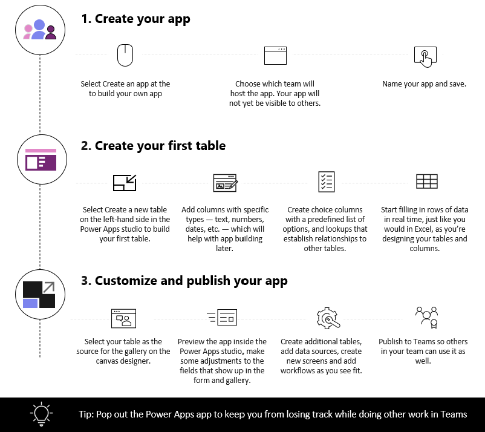

Watch this video to learn how to create your first app.
> [!VIDEO https://www.microsoft.com/videoplayer/embed/RWEmEP]

Now let's go through each step in detail.

## Create your app

After installing the Power Apps app from the Teams store:

1. Start Teams, and sign in.

1. In the left pane, select **Power Apps**, and then select **Start now**.

    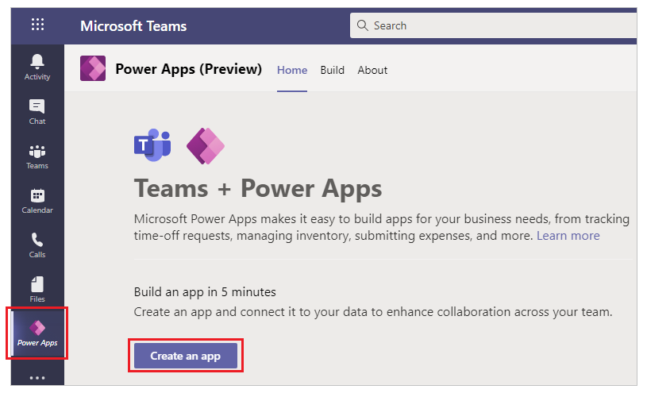

    > [!TIP]
    > If you don't see the **Power Apps** app in the left pane, select  (*More added apps*), and then select **Power Apps**.

    

1. You'll be prompted to select a team where you want to create the app. This is where the app will live. Team members can't see the app until you publish the app. You will also have an opportunity to share the app with colleagues within your company that are not part of the Team. More information: [Set permission and share apps with colleagues](set-perms-and-share.md)

    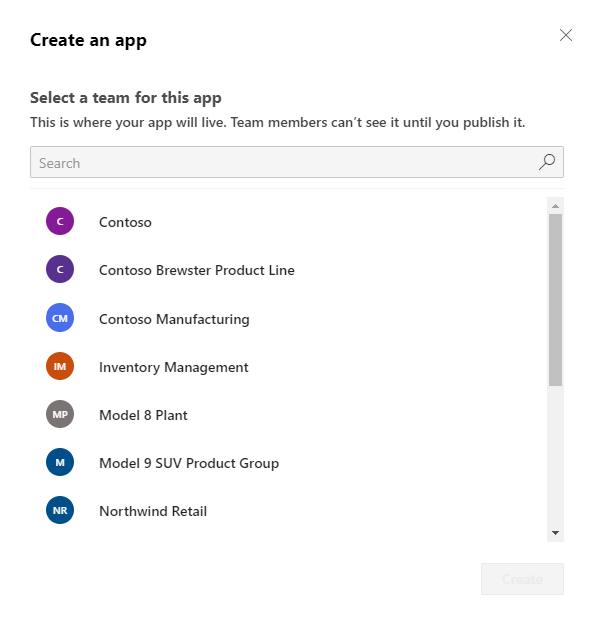

    If this is the first app being created in the selected team, a new Dataverse for Teams environment will be created for the selected team. You'll see a message about this when you select the team. More information: [About the Dataverse for Teams environment](/power-platform/admin/about-teams-environment)

    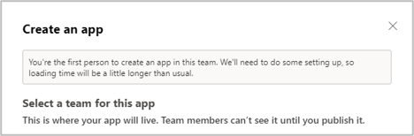

1. Select **Create**. You'll see a confirmation about the Dataverse for Teams environment being created, which might take some time. You'll be notified when the environment is available for you to create your first app with an email and a Teams notification.

    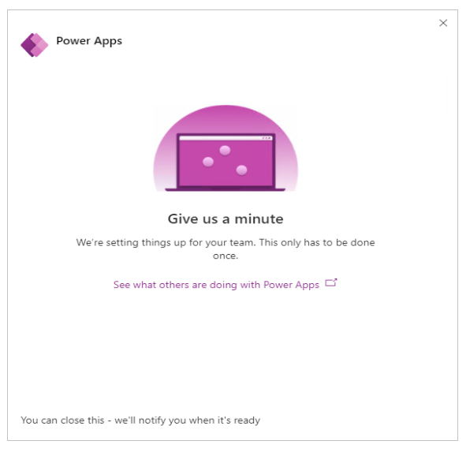

    > [!NOTE]
    > Environment creation will fail if the Teams team that you selected has *Hiddenmembership* enabled. If this happens, try creating the app in a different team. More information: [Hidden membership groups](known-issues-limitations.md#hidden-membership-groups)

1. Enter an app name, and then select **Save**.

    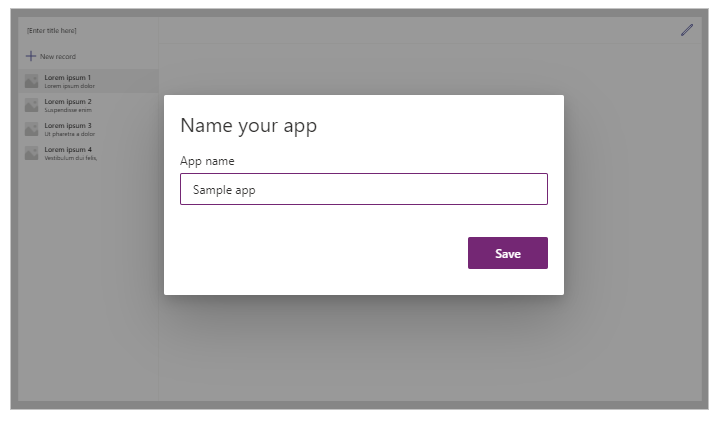

    > [!TIP]
    > An app template is included with the app by default, so that you can get started with creating your table and using the app. More information: [Understand Power Apps Studio](understand-power-apps-studio.md)

## Create your first table

Data for apps built in Teams lives in Dataverse for Teams environments as tables. Like other data experiences, you can add additional columns to track different attributes of each record before filling up the table with multiple rows of data.

> [!TIP]
> To learn about Dataverse for Teams tables in detail, go to [Overview of Dataverse for Teams](overview-data-platform.md).

To get started creating your first table:

1. Select **With data**.

    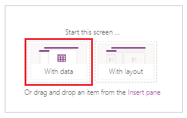

1. Select **Create new table**.

    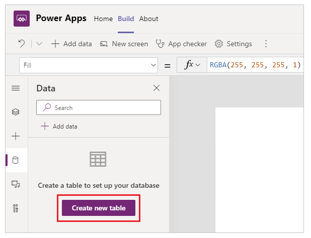

1. In the **Create a table** dialog box, type a meaningful name for your
new table that describes this dataset, and then select
**Create**.

1. After the table is created, you can add columns of different types, add rows, and
work with data in the visual editor.

   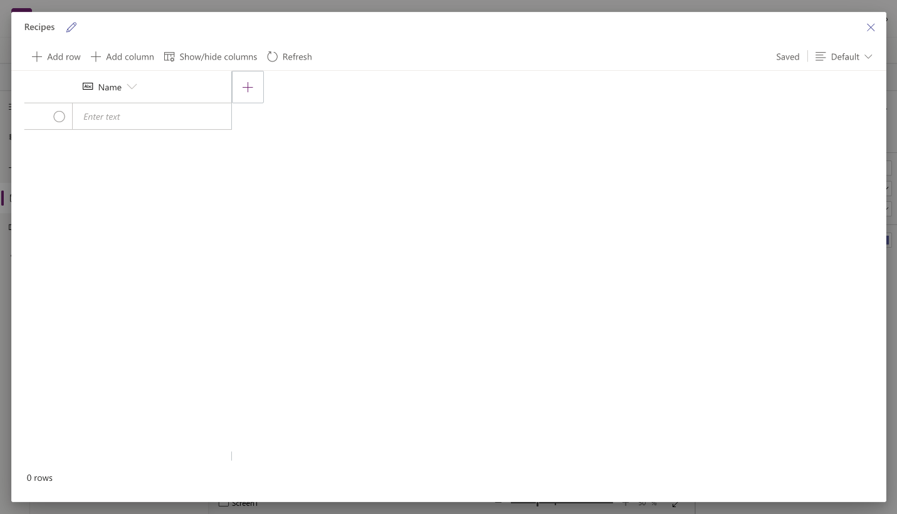

### Add columns to the table

To add a new column to track new data:

1. Select **Add column.**  

1. Enter a name that best describes your new column.

1. Select the type for your column.

    > [!TIP]
    > For more information about column types supported by the visual editor, go to [Supported column types](understand-power-apps-studio.md#supported-column-types). To add columns that aren't supported by
    the visual editor, create a table by using the solution explorer. More information: [Create tables](create-table.md)

1. If required, change **Advanced options** for the selected column type.

1. Select **Create**.

1. Repeat the previous steps to add the rest of the data columns.

### Add rows to the table

To add rows, select the empty row and start typing additional data, or
select **Add row**.

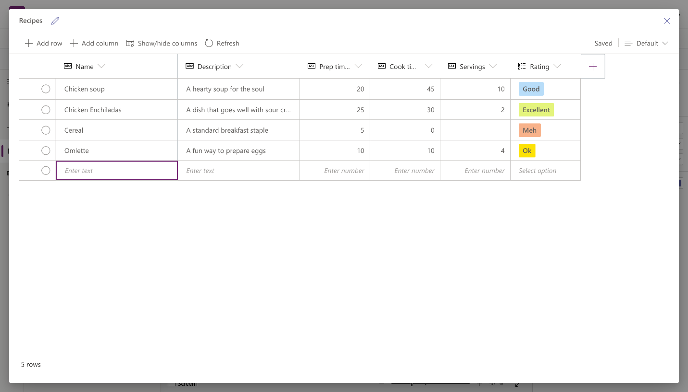

#### Paste the copied data into the table

You can paste up to **50 rows** of data into a table. To create new rows from the copied data, add empty rows in the table first. Adding new empty rows ensures pasting data from clipboard doesn't accidentally overwrite your existing data.

> [!CAUTION]
> Paste operations are automatically saved, and there's no undo option. Use caution when pasting data over existing rows since this action will overwrite your existing data in the table.

To paste the data from clipboard into the table:

1. Select the record that you want to add new records above or below.

1. Select **Insert row above**, or **Insert row below** to insert rows before or after existing rows.
    <br> For example, inserting row above the selected row:

    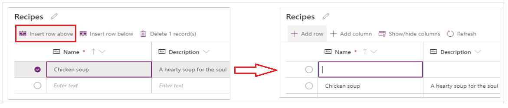

    To add rows at the top instead, select **Add row**.

    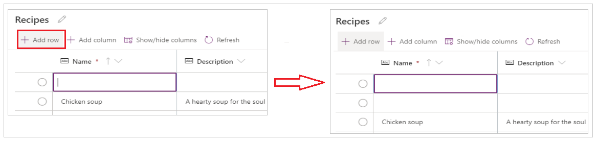

1. Repeat the above step to add more empty rows, as needed.

    > [!TIP]
    > If you're unsure of how many rows do you need, create additional empty rows before pasting data. Extra empty rows can be deleted later.

1. Select the top-left cell from the newly created rows.

    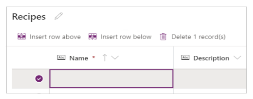

1. Paste the copied data.

    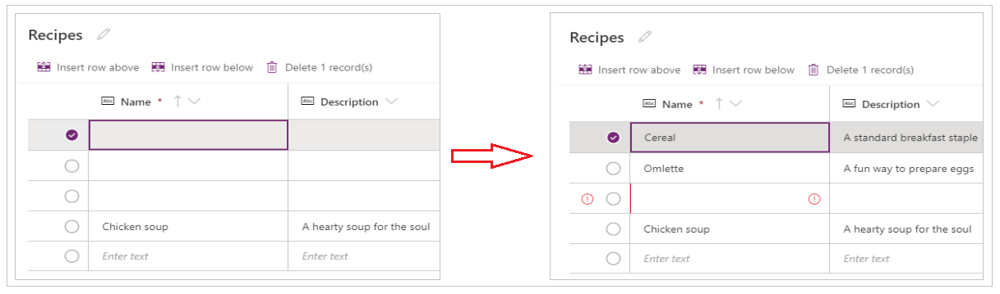

    > [!NOTE]
    > If you paste data when the cell is in edit mode (if you *double-clicked* top-left cell), the data is pasted inside the cell. If this problem happens, delete the incorrectly pasted data, select any other cell, select the top-left cell, and try to paste again.

    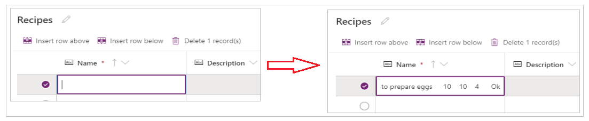

1. Remove any extra empty rows.

    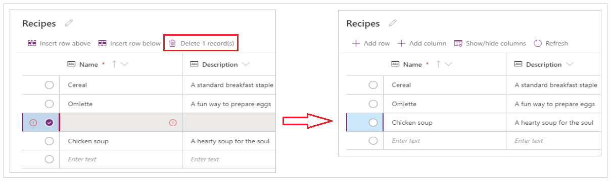

    > [!TIP]
    > To delete multiple rows that are together, select the top row, and press the **Shift** key on the keyboard. Keeping the key pressed, select the last row in the chunk of the rows that you want to delete. And then, select **Delete X record(s)**.

    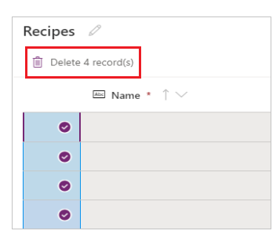

Changes to the table are automatically saved. However, check for errors, and fix them before you close the visual editor.

## Customize and publish your app

After you close the table, the app template that was added to the app screen by default is automatically refreshed to use the new table.

> [!NOTE]
> If you add additional data sources, such as a new table, or if you reopened the app, refer to [Manually connect data to the app](#manually-connect-data-to-the-app) to manually refresh the app with the new data.

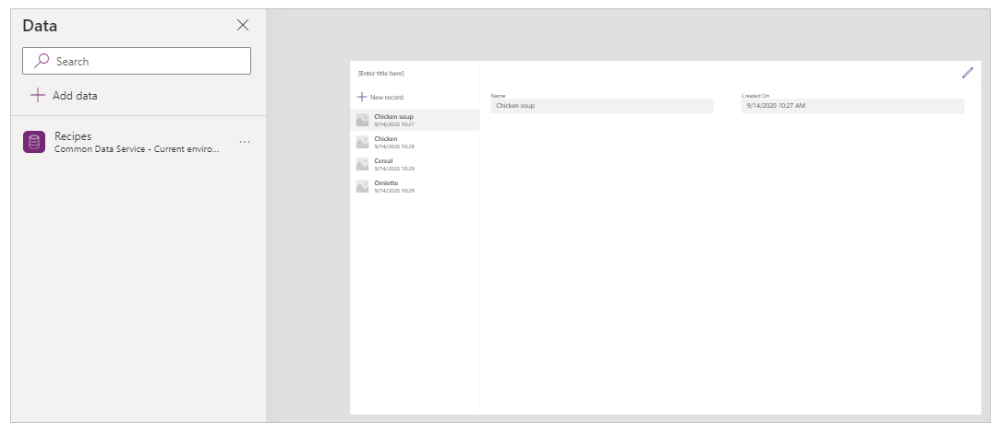

Depending on the number of fields you added to your table, the app template might need updates to the form and the gallery.

### Manually connect data to the app

The gallery and the edit form components on the screen automatically refresh with the data only for the first data source. If you add additional data sources, such as a new table, or if you reopened the app, you'll have to manually connect the data to the template gallery and form.

> [!TIP]
> Skip these steps if the app screen is already connected to the table that you created.

To manually connect to the new data:

1. Select the gallery, and then select the correct data source.

    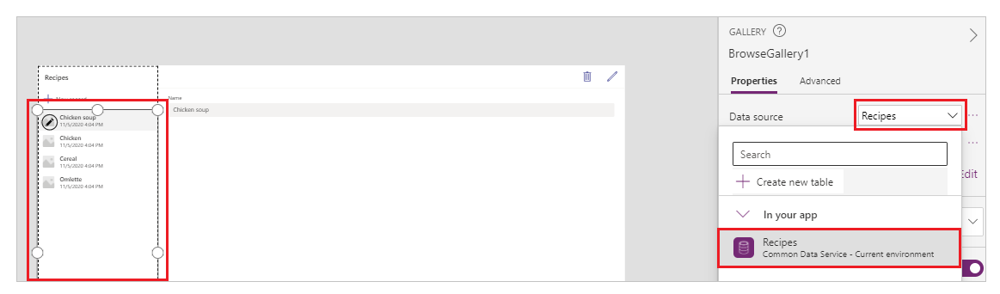

1. Select the form, and then select the correct data source.

    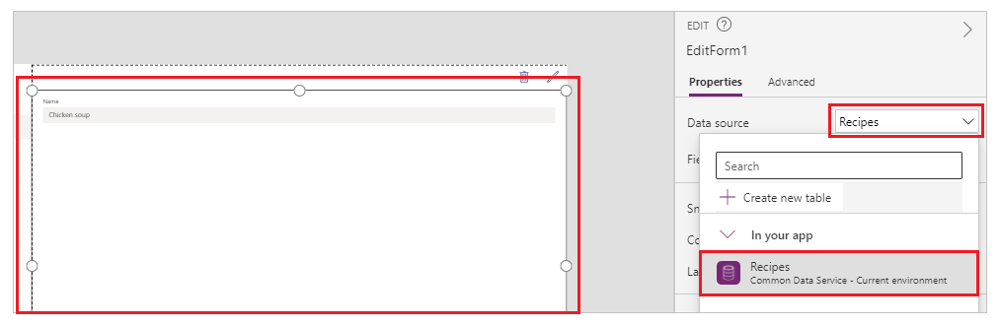

1. If you see any formula error, select **Edit in the formula bar**, and update the formula with the data source name.

    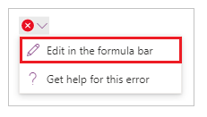

    For example, to change from using *Instructions* as the data source name for the edit form to *Recipes*, replace the name of the data source.

    Change from:

    ```powerapps-dot
    Remove(Instructions, selectedRecord); If(IsEmpty(Errors(Instructions, selectedRecord)),UpdateContext( {itemSelected:false, editMode:false, newMode:false, deleteMode:false}); Set(CurrentItem,First(Instructions)););
    ```
    Change to:

    ```powerapps-dot
    Remove(Recipes, selectedRecord); If(IsEmpty(Errors(Recipes, selectedRecord)),UpdateContext( {itemSelected:false, editMode:false, newMode:false, deleteMode:false}); Set(CurrentItem,First(Recipes)););
    ```

1. Repeat the earlier step to fix any additional formula errors.

### Update background color for the selected gallery record

The gallery shows records created earlier. However, the background color needs to change for a record when selected from the gallery to show the selection.

To update the selected item background color:

1. Select the gallery.

    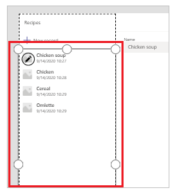

2. Select *TemplateFill* property from the property drop-down on the top-left.

    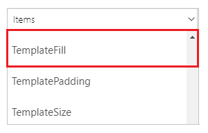

3. Update the *TemplateFill* property value in the formula bar to the following formula:

    ```powerapps-dot
    If(ThisItem.IsSelected, RGBA(0,0,0,.05), RGBA(0,0,0,0))
    ```

    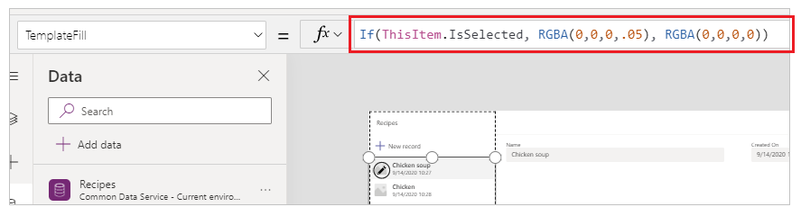

### Update fields on the form

The template shows two fields inside the form by default. To add more fields to the form:

1. Select the form.

    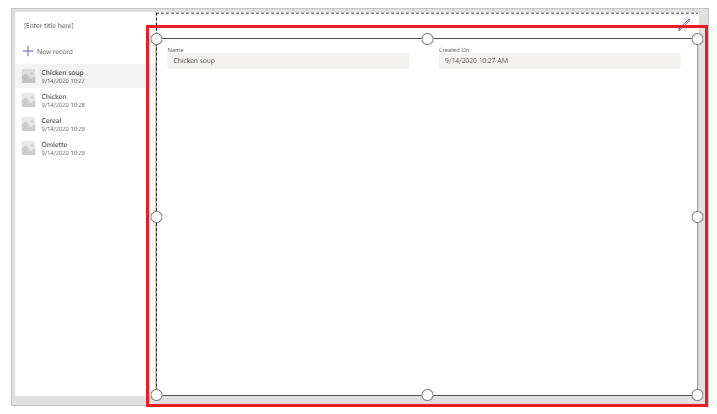

1. Select **Edit fields** from the property pane on the right.

    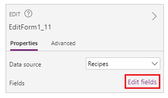

1. Select **Add fields**.

    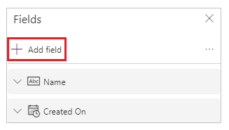

1. Select the fields that you want to add on the form.

    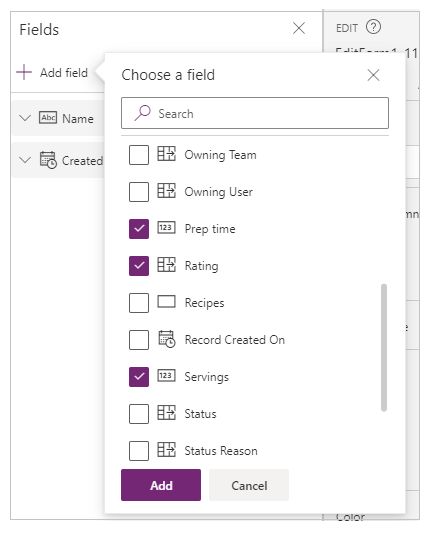

1. Select **Add**.

1. (Optional) Select fields to move up or down, or remove unwanted fields by selecting **Remove**.

    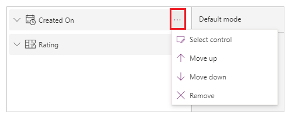

1. Close the fields pane.

Adding, removing, and reordering fields automatically updates the form.

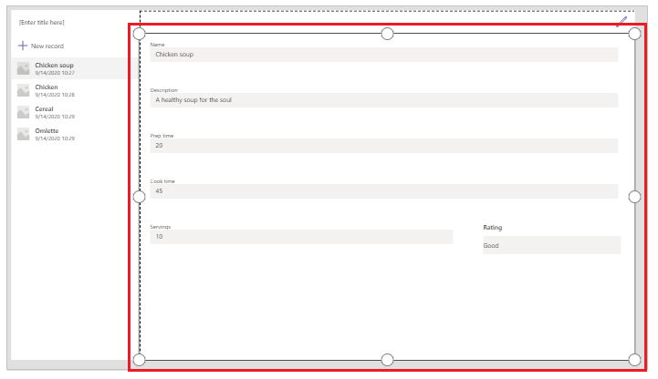

### Update fields in the gallery

The gallery on the default app template might need updates to reflect the fields from the table you created.

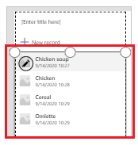

To update the fields in the gallery:

1. Select **Edit fields** from the property pane on the right.

    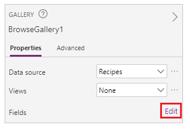

1. Select the drop-down menu for a gallery component (such as image, title, or subtitle) and change the selection to the field you want.

    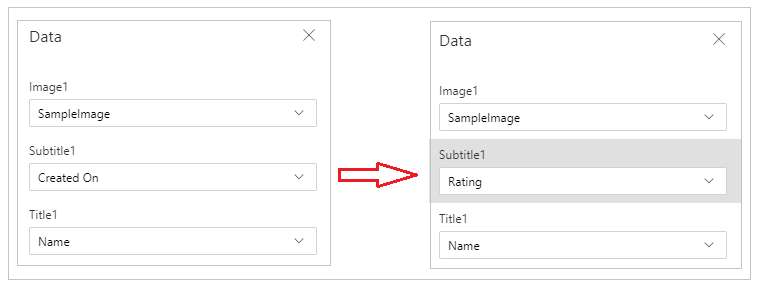

1. Close the data pane.

The gallery is updated with the selected changes.

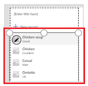

### Update the app title

To update the app title:

1. Select the label from the upper-left corner of the screen.

    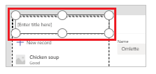

1. Change the *Text* property value from the properties pane on the right.

    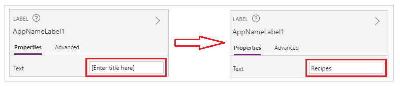

Verify all the changes you made to the app.

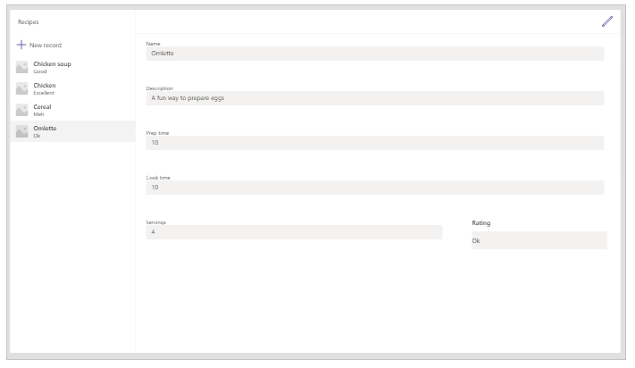

> [!TIP]
> For better responsiveness, the [data cards](../maker/canvas-apps/working-with-cards.md) by default have [**Width fit**](../maker/canvas-apps/controls/properties-size-location.md#size) property set to *On*. If you want to resize the data cards manually, select the data cards and then set the **Width fit** property to *Off* first.

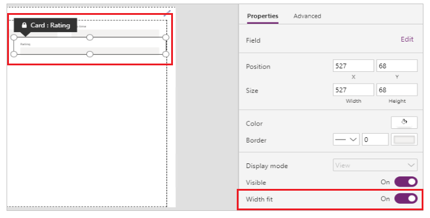

### Save and preview the app

Now that you've created your first app with data, you can save your changes and preview the app.

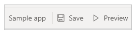

1. Select **Save**.

1. Select **Preview**.

    - To add a new record, select **New record** and fill in the form.
    - To edit a record, select the record from the left pane, and edit the values.
    - To close the preview, select **Close** or the **Esc** key.

### Publish and add app to Teams channel

Select **Publish to Teams** to publish the app so others in your team can use the app, and add the app to Teams channel. More information: [Publish and add an app to Teams](publish-and-share-apps.md)

Now that you've created your first app from a blank table, let's go through the
Power Apps interface, Studio, controls and how to create additional apps in
detail.

## Additional considerations for Microsoft 365 Group

When you select **Create** to create an app in the selected team, Power Apps automatically enables the selected team's Microsoft 365 Group for security. However, if the group can't be enabled for security, you'll see the following error: 

`The request failed with error: 'Insufficient privileges to complete the operation.' The tracking Id is '[xxxxxxx-xxxx-xxxx-xxxx-xxxxxxxxxxxx]'`.

To fix this issue, manually update the Microsoft 365 Group setting *SecurityEnabled* from
*False* to *True* by using PowerShell. For detailed steps, see [Share an app with Microsoft 365 Groups](../maker/canvas-apps/share-app.md#share-an-app-with-microsoft-365-groups). More information: [Microsoft 365 Groups and Microsoft Teams](/microsoftteams/office-365-groups)

### Enabling security for teams with same names

Team names aren't always unique. It's possible for more than one
team in Teams to share the same display name. For example, there might be
more than one team with the name "Inspection" in a tenant. However, the
Microsoft 365 Group associated with each team has a different *ObjectId* in
Azure Active Directory (Azure AD), even when the team names are the same. The *ObjectId* in
Azure AD for a Microsoft 365 Group is the same as the *GroupId* in
Teams for the associated team.

To find the **GroupId** (ObjectID in Azure AD) of a team:

1. Go to the team in Teams.

1. Select any channel in the team.

1. Select **More options** (...) from the upper-right corner, and then select **Get link to channel**.

    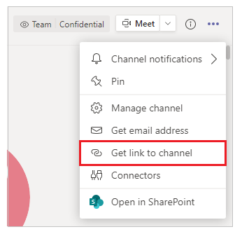

1. Copy the *GroupID* from the link.

    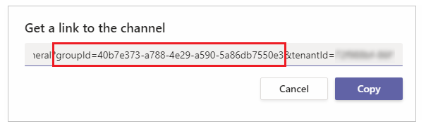

    You can also copy the channel link by selecting **Copy**, and then pasting it into a text editor
to get the *GroupID* value.

    `https://teams.microsoft.com/l/channel/19%3a06f038959c9f4387a35f5d776484cff2%40thread.tacv2/General?groupId=40b7e373-a788-4e29-a590-5a86db7550e3&tenantId=00000000-0000-0000-0000-0000000000000000`

1. Now that you have the correct team's **GroupID** (ObjectID in Azure AD), use the instructions in
[Share an app with Microsoft 365 Groups](../maker/canvas-apps/share-app.md#share-an-app-with-microsoft-365-groups)
to enable security for the team's Microsoft 365 Group.

## Next steps

[Overview of the Power Apps app](overview-of-the-power-apps-app.md)<br/>
[Understand Power Apps Studio](understand-power-apps-studio.md)<br/>
[Use the Fluent UI controls](use-the-fluent-ui-controls.md)<br/>
[Create additional apps](create-additional-apps.md)


[!INCLUDE[footer-include](../includes/footer-banner.md)]
