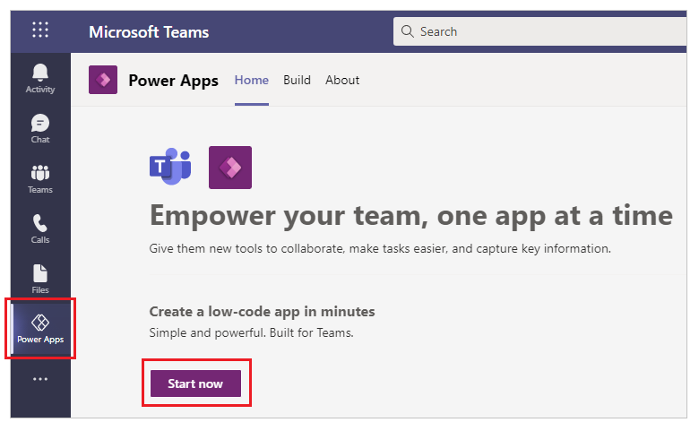
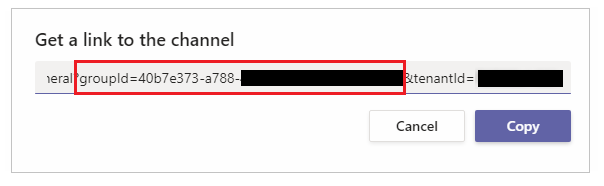
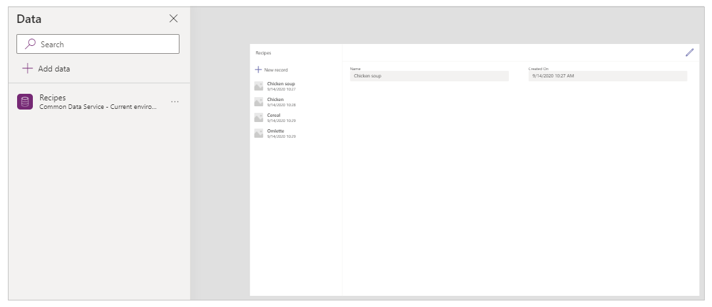

# Create your first app in Teams

[!INCLUDE [cc-beta-prerelease-disclaimer.md](../includes/cc-beta-prerelease-disclaimer.md)]

You can create, edit and delete [canvas apps](/powerapps/maker/canvas-apps/getting-started) within Teams. 

If you’re creating an app using Power Apps in a Teams team for the *first time*, a new Project Oakdale environment will be created for you. More information: [About the Project Oakdale environment](/power-platform/admin/about-teams-environment) 

## Get started with creating your first app

After installing the **Power Apps** app from the Teams store:

1. Start Teams and sign in.

1. In the left pane, select **Power Apps**, and then select **Create an app**.

    

1. You'll be prompted to select a team where you want to create the app. Select a team to create the app.

    

    If this is the first app being created in the selected team, a new Project Oakdale
environment will be created for the selected team and you'll see a message about this on selecting the team. For more information about the Project Oakdale environment, see [About the Project Oakdale environment](/power-platform/admin/about-teams-environment).

    

1. Select **Create**. You’ll see a confirmation about
the Project Oakdale environment being created, which might take time and you’ll be notified when the environment is available for you to create your first app.

    

## Creating an app inside a team with a Microsoft 365 Group

When you select **Create** to create an app in the selected team, Power Apps automatically enables the selected team’s Microsoft 365 Group for security. However, if the group can’t be enabled for security, you’ll see the following error:

`The request failed with error: 'Insufficient privileges to complete the operation.' The tracking Id is '[xxxxxxx-xxxx-xxxx-xxxx-xxxxxxxxxxxx]'`.

To fix this issue, manually update the Microsoft 365 Group setting *SecurityEnabled* from
*False* to *True* using PowerShell. For detailed steps, see [Share an
app with Microsoft 365
Groups](../maker/canvas-apps/share-app.md#share-an-app-with-office-365-groups).

For more information about how Microsoft 365 Groups work with Microsoft Teams,
see [Microsoft 365 Groups and Microsoft
Teams](https://docs.microsoft.com/microsoftteams/office-365-groups).

### Enabling security for teams with same names

Team names are not unique. It’s possible for more than one
team in Teams to share the same display name. For example, there may be
more than one team with the name “Inspection” in a tenant. However, the
Microsoft 365 Group associated with each team has a different *ObjectId* in
Azure Active Directory (Azure AD) even when the team names are the same. The *ObjectId* in
Azure AD for a Microsoft 365 Group is the same as the *GroupId* in Microsoft
Teams for the associated team.

To find the **GroupId** (ObjectID in Azure AD) of a team:

1.  Go to the Microsoft Teams team.

2.  Select any channel inside the team.

3.  Select **More options** (...) from the top-right corner, and select **Get link to channel**.

    

4.  Copy the *GroupID* from the link.

    

    You can also copy the channel link by selecting **Copy**, and then paste it to a text editor
to get the *GroupID* value instead.

    ```
    https://teams.microsoft.com/l/channel/19%3a06f038959c9f4387a35f5d776484cff2%40thread.tacv2/General?groupId=40b7e373-a788-4e29-a590-5a86db7550e3&tenantId=00000000-0000-0000-0000-0000000000000000
    ```

5. Now that you have the correct team’s **GroupID** (ObjectID in Azure AD), use the instructions at
[Share an app with Microsoft 365
Groups](/powerapps/maker/canvas-apps/share-app#share-an-app-with-office-365-groups)
to enable security for the team’s Microsoft 365 Group.

## Continue creating your first app

After your Project Oakdale environment has been created:

1. Select the **Build** tab to
view the environment created for your team.

    

1. Select **Create** to get started building your first app. This action opens
Power Apps Studio and you’re prompted to name your app. 

1. Enter an app name, and select **Save**.

    

    > [!TIP]
    > An app template is included with your the app by default so that you can get started with creating your table and using the app. To learn more about editing the app inside the Power Apps Studio, see [Understanding Power Apps Studio](understand-power-apps-studio.md).

### Update 

### Create your first table

Data for apps built in Teams lives inside Project Oakdale environments as tables. Like other data experiences, you can add additional columns to track different attributes of each record before filling up the table with multiple rows of
data.

> [!TIP]
> To learn about Project Oakdale tables in detail, see [Overview of Project Oakdale](overview-data-platform.md).

To get started creating your first table:

1. Select **Create new table**.

    

1. In the **Create a table** dialog box, type a meaningful name for your
new table that describes this dataset, and select
**Create**.

1. After the table is created, you can add columns of different types, add rows, and
work with data inside the table designer.

   

### Add columns in the table

To add a new column to track new data:

1.  Select **Add column.**  

1.  Enter a name that best describes your new column.

1.  Select the type for your column.

    > [!TIP]
    > For more information about column types supported by the table
    designer, see [Supported column types](understand-power-apps-studio.md#supported-column-types). To add columns not supported by
    the table designer, create a table using the **Build** tab. More information: [Create tables](create-table.md)

1.  If required, change **Advanced options** for the selected column type.

1.  Select **Create**.

1.  Repeat previous steps to add the rest of the data columns.

### Add rows in the table

To add rows, select the empty row and start typing additional data. You can also
select the **Add row** button instead.


### Update app template

After you close the table, the app template added to the app screen by default automatically refreshes to use the new table.



Depending on the number of fields you added to your table, the app template may need updates to the form and the gallery.

#### Update selected item background color

The gallery shows records created earlier. However, the background color needs to change for a record when selected from the gallery to show the selection.

To update the selected item background color:

1. Select the gallery.

    

2. Select *TemplateFill* property from the property drop-down on the top-left.

    

3. Update the *TemplateFill* property value in the formula bar to the following formula:

    ```powerapps-dot
    If(ThisItem.IsSelected, RGBA(0,0,0,.05), RGBA(0,0,0,0))
    ```

    

#### Update fields on the form

The template shows two fields inside the form by default. To add more fields to the form:

1. Select the form.

    

1. Select **Edit fields** from the property pane on the right.

    

1. Select **Add fields**.

    

1. Select the fields that you want to add on the form.

    

1. Select **Add**.

1. (Optional) Select fields to move up or down, or remove unwanted fields using remove.

    

1. Close the fields pane.

Adding, removing and reordering fields automatically updates the form:


#### Update fields in the gallery

The gallery on the default app template may need updates to reflect the fields from the table you created.


To update the fields in the gallery:

1. Select **Edit fields** from the property pane on the right.

    

1. Select the drop-down for a gallery component (such as image, title or subtitle) and change the selection to the required field.

    

1. Close the data pane.

The gallery is updated with selected changes:


#### Update app title

To update the app title:

1. Select the label from the top-left corner of the screen.

    

1. Change the *Text* property value from the properties pane on the right.

    

Verify all the changes to the app.


### Save and preview the app

Now that you've created your first app with data, you can save your changes, and preview the app.


1. Select **Save** to save the app.

1. Select **Preview** to preview the app.

    1. To add a new record, select **New record** and fill in the form.
    1. To edit a record, select the record from the left pane, and edit the values.
    1. To close the preview, select the close button, or press the **Esc** key on the keyboard.

## Add your app to Teams channel as a tab

To use the app as a tab in your Teams channel, you’ll need to save the app,
publish it, and then add it to your team’s channel.

1.  Go to your team in Microsoft Teams.

1.  Select the channel that you want to pin the app to, and then select +.

    

1.  Select **Power Apps** app.

    

1.  Select **Add**

1.  Select your app from the list, such as the **Sample app** app in this example, and select **Save** to add the app as a tab.

Now that you’ve created your first app from a blank table, let’s go through the
Power Apps interface, Studio, controls and how to create additional apps in
detail.

## Next steps

[Overview of the Power Apps app](overview-of-the-power-apps-app.md)<br/>
[Understand Power Apps Studio](understand-power-apps-studio.md)<br/>
[Use the Fluent UI controls](use-the-fluent-ui-controls.md)<br/>
[Create additional apps](create-additional-apps.md)
