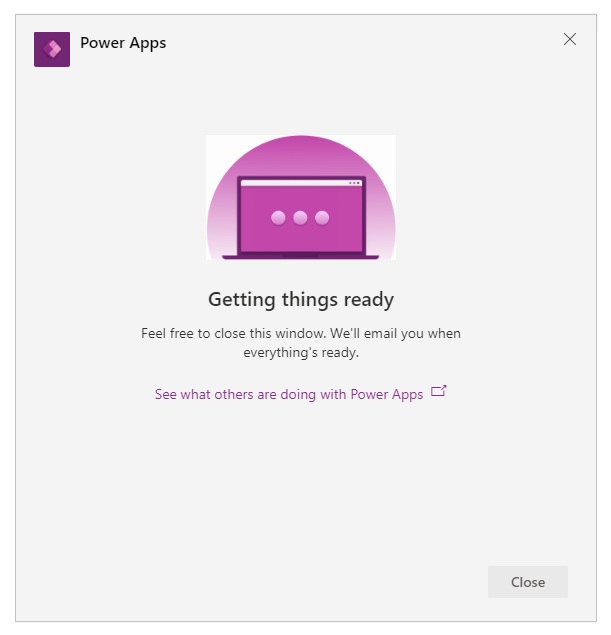

# Create your first app in Teams

You can create, edit and delete [canvas apps](/powerapps/maker/canvas-apps/getting-started) within Teams. 

If you’re creating an app using Power Apps in a Teams team for the *first time*, a new Microsoft ***REMOVED*** environment (also called Teams environment) will be created for you. More information: [About the Teams environment](/power-platform/admin/about-teams-environment) 

## Get started building your first app

After installing the **Power Apps** app from the Teams store:

1. Start Teams and sign in.

1. In the left pane, select **Power Apps**, and then select **Create an app**.

    

1. You'll be prompted to select a team where you want to create the app. Select a team to create the app.

    

    If this is the first app being created in the selected team, a new ***REMOVED***
environment will be created for the selected team and you'll see a message about this on selecting the team. For more information about the ***REMOVED*** environment, see [About the Teams environment](/power-platform/admin/about-teams-environment).

    

1. Select **Create**. You’ll see a confirmation about
the ***REMOVED*** environment being created, which might take time and you’ll be notified when the environment is available for you to create your first app.

    

## Creating an app inside a team with a Microsoft 365 Group

When you select **Create** to create an app in the selected team, Power Apps automatically enables the selected team’s Microsoft 365 Group for security. However, if the group can’t be enabled for security, you’ll see the following error:

`The request failed with error: 'Insufficient privileges to complete the operation.' The tracking Id is '[xxxxxxx-xxxx-xxxx-xxxx-xxxxxxxxxxxx]'`.

To fix this issue, manually update the Microsoft 365 Group setting *SecurityEnabled* from
*False* to *True* using PowerShell. For detailed steps, see [Share an
app with Microsoft 365
Groups](https://docs.microsoft.com/powerapps/maker/canvas-apps/share-app#share-an-app-with-office-365-groups).

For more information about how Microsoft 365 Groups work with Microsoft Teams,
see [Microsoft 365 Groups and Microsoft
Teams](https://docs.microsoft.com/microsoftteams/office-365-groups).

### Enabling security for teams with same names

Team names are not unique. It’s possible for more than one
team in Teams to share the same display name. For example, there may be
more than one team with the name “Inspection” in a tenant. However, the
Microsoft 365 Group associated with each team has a different *ObjectId* in
Azure Active Directory (Azure AD) even when the team names are the same. The *ObjectId* in
Azure AD for a Microsoft 365 Group is the same as the *GroupId* in Microsoft
Teams for the associated team.

To find the **GroupId** (ObjectID in Azure AD) of a team:

1.  Go to the Microsoft Teams team.

2.  Select any channel inside the team.

3.  Select **More options** (...) from the top-right corner, and select **Get link to channel**.

    

4.  Copy the *GroupID* from the link.

    

    You can also copy the channel link by selecting **Copy**, and then paste it to a text editor
to get the *GroupID* value instead.

    ```
    https://teams.microsoft.com/l/channel/19%3a06f038959c9f4387a35f5d776484cff2%40thread.tacv2/General?groupId=40b7e373-a788-4e29-a590-5a86db7550e3&tenantId=00000000-0000-0000-0000-0000000000000000
    ```

5. Now that you have the correct team’s **GroupID** (ObjectID in Azure AD), use the instructions at
[Share an app with Microsoft 365
Groups](/powerapps/maker/canvas-apps/share-app#share-an-app-with-office-365-groups)
to enable security for the team’s Microsoft 365 Group.

## Continue creating your first app

After your ***REMOVED*** environment has been created:

1. Select the **Build** tab to
view the environment created for your team.

    

1. Select **Create** to get started building your first app. This action opens
Power Apps Studio and you’re prompted to name your app. 

1. Enter an app name, and select **Save**.

    

    > [!TIP]
    > To learn more about the Power Apps Studio, see [Understanding Power
Apps Studio](understand-power-apps-studio.md).

### Create your first table

Data for apps built in Teams lives inside ***REMOVED*** environments as tables. Like
other data experiences, you can add additional columns to track different
attributes of each record before filling up the table with multiple rows of
data. 

> [!TIP]
> To learn about ***REMOVED*** tables in detail, see [***REMOVED***
tables](overview-tables).

To get started creating your first table: 

1. Select **Create new table**.

    

1. In the **Create a table** dialog box, type a meaningful name for your
new table that describes this dataset, and select
**Create**.

1.  After the table is created, you can add columns of different types, add rows, and
work with data inside the table designer.

    


### Add columns in the table

To add a new column to track new data:

1.  Select **Add column.**  

2.  Enter a name that best describes your new column.

3.  Select the type for your column.

    **TIP:** For more information about column types supported by the table
    designer, see [Supported column types](understand-power-apps-studio.md#supported-column-types). To add columns not supported by
    the table designer, create a table using the **Build** tab. More information: [Create tables](create-table.md)

4.  If required, change **Advanced options** for the selected column type.

5.  Select **Create**.

6.  Repeat previous steps to add the rest of the data columns.

### Add rows in the table

To add rows, select the empty row and start typing additional data. You can also
select the **Add row** button instead.


### Add app controls to work with your table

After you’ve finished creating the table and adding data, you can start using
the table in your app using different controls. To get back to the Studio,
select X at the top-right corner of the table designer.

1.  Select **Insert** (+) in the left pane to add a control.

    

2.  Select the **Vertical gallery** control to add to the canvas.

    

3.  In the flyout, select the table you created earlier.  
    

    

4.  To change the layout of your gallery, select **Layout** from the property
    pane on the right, and then select the layout of your choice.  
    

    

5.  To change the fields in your gallery, select **Fields** from the property
    pane on the right to open the data pane.  
    

    

6.  Select the fields from the drop-down list of fields to display on the
    control.

    

7.  Select **Insert** from the left pane.

8.  Select **Edit form**.

    Edit form control allows you to display the selected record and edit its
    values.

    

9.  To bind the **Edit form** to your table, select the form and then, select
    the table you created earlier.

    

10. Select **Edit fields** to change the fields displayed by the form.


1.  To add new fields select **Add fields**, select the fields you want to add,
    and then select **Add**.  
    

    

2.  You can drag and drop the fields on the form to rearrange them.

3.  Now that you’ve created the form with all required fields, you’ll need to
    bind your form to your gallery. To do this, go to the formula bar while the
    form is selected and set the **Item** property to Gallery1.Selected.

    **NOTE**: *Gallery1.Selected* uses the gallery name as *Gallery1* for the
    first gallery added to the app. You may need to change it as per the gallery
    name in your app. For example, if your gallery name is different, such as
    gallery2, use *Gallery2.Selected* instead.

    

4.  Select the **Preview** button in the top right to test your app.

5.  Select **Save** to save the app.

    

6.  Select **Publish to Teams** to publish your app to Teams.

### Add your app to Teams channel as a tab

**NOTE:** During the Private Preview period, you’ll have to add the published
app to the Teams manually.

To use the app as a tab in your Teams channel, you’ll need to save the app,
publish it and then add it to your team’s channel.

1.  Go to your team in Microsoft Teams.

2.  Select the channel that you want to pin the app to.

3.  Select

    

    .

    

4.  Select **Power Apps** app.

    

5.  Select **Add.**

6.  Select your app from the list, such as the **Recipes** app in this example.

7.  Select **Save** to add the app as a tab.

Now that you’ve created your first app from a blank table, let’s go through the
Power Apps interface, Studio, controls and how to create additional apps in
detail.
