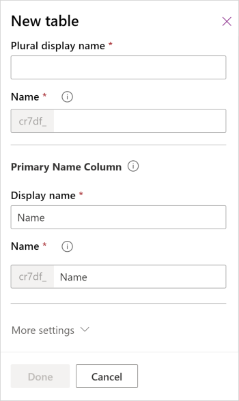

# Create tables in Microsoft Teams

In Teams, data is defined by *tables*. To create a table, you must be a member of a team.

## Types of tables

Whereas Dataverse has two types of tables (a standard table with ownership defined and an activity table), you can only create standard tables in Dataverse for Teams.

You define the type of table by selecting **More settings** when you create a table.

There are four different types of table ownership. When you create a table, the only options are **user**, **team owned**, or **organization-owned**, but you should be aware that other tables have different ownership types. More information: [Types of tables in Dataverse](../maker/data-platform/types-of-entities.md)

## Create a table
Watch this video for a quick overview about how to create a table in Dataverse for Teams:
> [!VIDEO https://www.microsoft.com/en-us/videoplayer/embed/RE4NNw1]

1. Sign in to Teams, and then select the link for **Power Apps**.
   > [!div class="mx-imgBorder"] 
   > 

2. Select the **Build** tab, and then select **See all**.
   > [!div class="mx-imgBorder"] 
   > 

3. Select **New**, and then select **Table**.
    > [!div class="mx-imgBorder"] 
    > 

4. In the **New table** pane, enter the following information. Required columns are designated with an asterisk (*) next to the column label.
    - **Display name**: The name of the table to be displayed. For example, **Product**.
    - **Plural display name**: The name used to reflect multiples of what the table contains. For example, **Products**.
    - **Name**: A unique internal name for the table. Unlike the display name, after it's saved this value can't be changed.
       > [!NOTE]
       > Each Dataverse for Teams environment is assigned a prefix when it's created, such as **cr628**. The name for every table and column you create will be prefixed with this value. This value can't be changed.
    - **Display name** (Primary name column): Every table contains a primary name column, which is used by lookup fields when establishing relationships with other tables. Typically the primary name column stores the name or primary description of the data stored in the entity.
    - **Name** (Primary name column): This column is pre-populated based on the primary name column name you enter. It includes the prefix. You cannot change this after the table is saved.
    - **More settings**: This area provides additional settings that are available. More information: [Create a custom table](../maker/data-platform/data-platform-create-entity.md).
     
      

5. Select **Done**.

### See also

[Edit or delete a table](edit-delete-table.md)

[!INCLUDE[footer-include](../includes/footer-banner.md)]