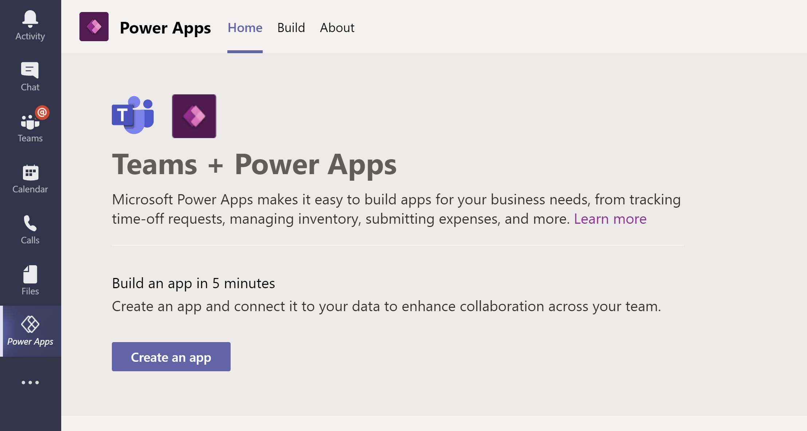
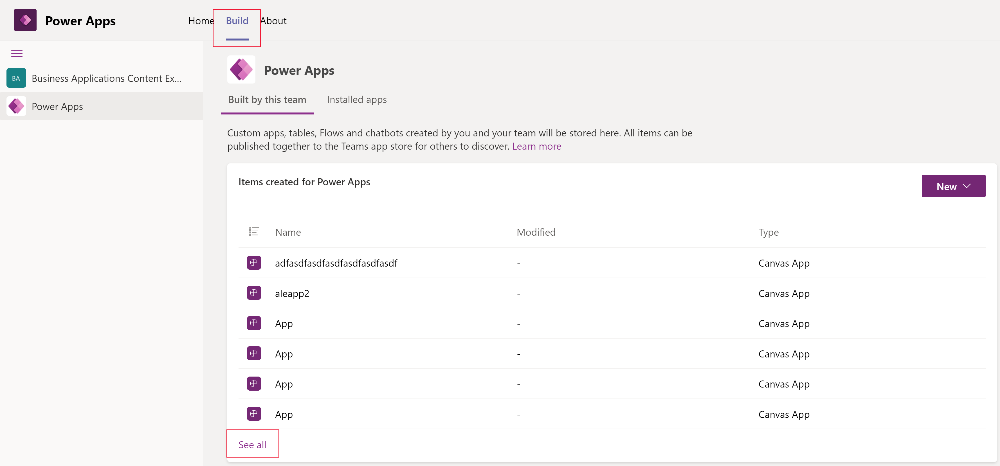
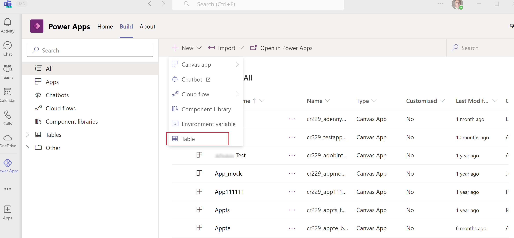

# Create tables in Teams 

In Teams, data is defined by *tables*, which are the same as *entities* in Microsoft Dataflex Pro. To create a table, you must be a member of a team. 

## Types of tables
While Microsoft Dataflex Pro has two types of entities that can be created (standard entity with ownership defined and activity entity), you can only create standard tables in Dataflex.

You define the type of table under the **More settings** option when you create a table.

There are four different types of table ownership. When you create a table, the only options are *user* or *team owned* or *organization-owned*, but you should be aware that other tables have different ownership types. More information: [Types of entities](../maker/common-data-service/types-of-entities.md)

## Create a table
1. Sign into Teams, and then select the link for **Power Apps**.
   > [!div class="mx-imgBorder"] 
   > 

2. Select the **Build** tab, and then select **See all**.
   > [!div class="mx-imgBorder"] 
   > 

3. Select **Tables** from the left pane, and then select **New table** on the command bar.
    > [!div class="mx-imgBorder"] 
    > 

4. In the **New table** pane, enter the following information. Required columns are designated with an asterisk (*) next to the column label.
    - **Display name**: The name of the table to be displayed. For example, *Product*.
    - **Plural display name**: The name used to reflect multiple of what the table contains. For example, *Products*.
    - **Name**: A unique internal name for the table. Unlike the display name, once saved this value can't be changed.
       > [!NOTE]
       > Each Dataflex environment is assigned a prefix upon creation, such as *cr628*. Every table and column name created will be prefixed with this value. This value can’t be changed.
    - **More settings**: This area provides additional settings that are available. More information: [Create a custom entity](../maker/common-data-service/data-platform-create-entity.md).
    > [!div class="mx-imgBorder"] 
    > 

5. Select **Done**.

### See also
[Edit or delete a table](edit-delete-table.md)
