# Customize the Bulletins app

The Bulletins sample app for Microsoft Teams is designed to be a complete app experience and allowing makers to easily extend it for their own purposes. In this article, we'll go over how to customize the Bulletins app for Power Apps in Teams.

Before you can customize the app, you must install it from the Teams store. You can get the app at <https://aka.ms/TeamsBulletins>.

Once the app is installed, you can then customize the app using the following steps:

## Open Power Apps app in Teams

1. Select **...** (ellipsis), and search for **Power Apps**.

   

1. The Power Apps app icon will now appear on the left pane.

1. Right-click on the **Power Apps** icon, and select **Pin** to pin the app to your Teams menu. Pinning will make it appear every time you open Microsoft Teams.

   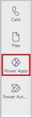

1. We recommend that you right-click on the Power Apps logo, and select **Pop out app** to open the app in a new window. This way, you won't lose your work when working at other places in Teams. The app now opens in Microsoft Teams.

1. Now that you've loaded the Power Apps app, select **Build**. This screen will show all the teams that have Power Apps installed in them.

1. Select the team in which you installed the Bulletins app.

1. Select **Installed apps** to show all apps installed in the Team. Bulletins solution includes two apps: **Bulletins** for users to view and bookmark communication, and **Manage bulletins** for managers to use to create Bulletins, FAQ’s, and links or contacts, and view metrics for bulletin read and bookmark statistics.

1. Select **See all** in the **Bulletins** tile.

    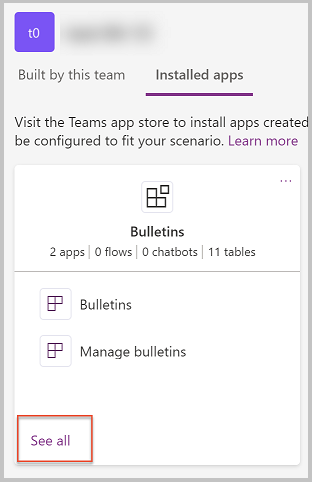

1. You'll now see all of the apps, tables, flows, and chatbots in the Bulletin solution.
    
    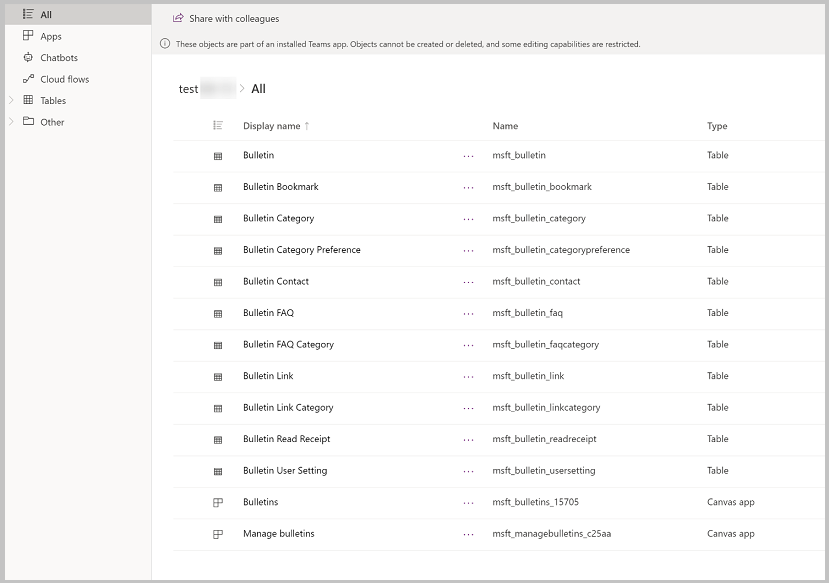

## Extend the Bulletins data model

If you're modifying or adding any fields to your app, you'll want to first update or add these columns in their Dataverse tables. In this section, we'll explore the data model for Bulletins and how to modify it in Power Apps in Teams. Below is the data model for Bulletins.

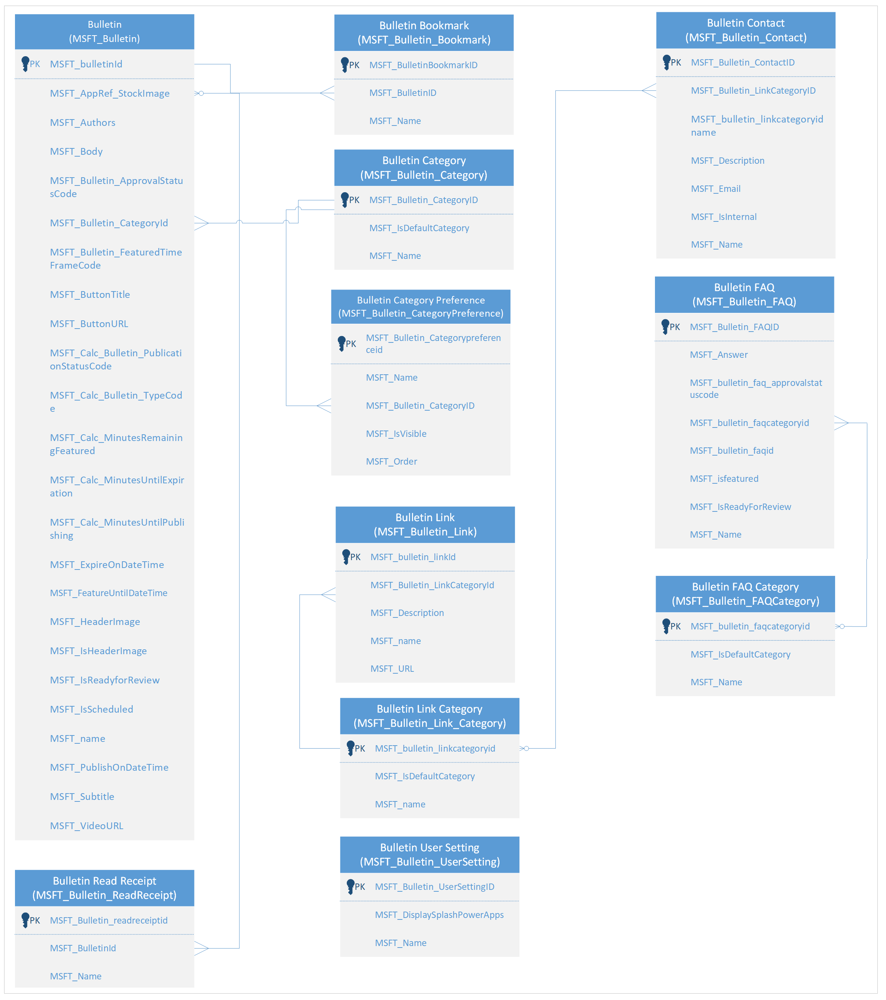

Before modifying the fields, you need to first decide where the fields you want to add should go. What are the users doing when they should see or interact with these fields?

-   Bulletin table (msft_bulletin) is where bulletin data is stored.

-   Bulletin Bookmark (msft_bulletin_bookmark) records are created when a user bookmarks a bulletin.
    
-   Bulletin Category (msft_bulletin_category) is a lookup table for bulletin categories.
    
-   Bulletin Category Preference (msft_bulletin_categorypreference) stores the category sort and display preferences.
    
-   Bulletin Read Receipt (msft_bulletin_readreceipt) records are created when a user reads a bulletin record.
    
-   Bulletin FAQ (msft_bulletin_faq) stores FAQ records.

-   Bulletin FAQ Category (msft_bulletin_faqcategory) stores the categories for FAQs.
    
-   Bulletin Link (msft_bulletin_link) stores link data for links/contacts.

-   Bulletin Contact (msft_bulletin_contact) stores contact data for links/contacts.
    
-   Bulletin Link Category (msft_bulletin_linkcategory) stores categories for links and contacts.
    
-   Bulletin User Setting (msft_bulletin_usersetting) record stores user settings for Bulletins.

## Bulletins Screens

From the list of apps, chatbots, flows, and tables, select the **Bulletins** app.

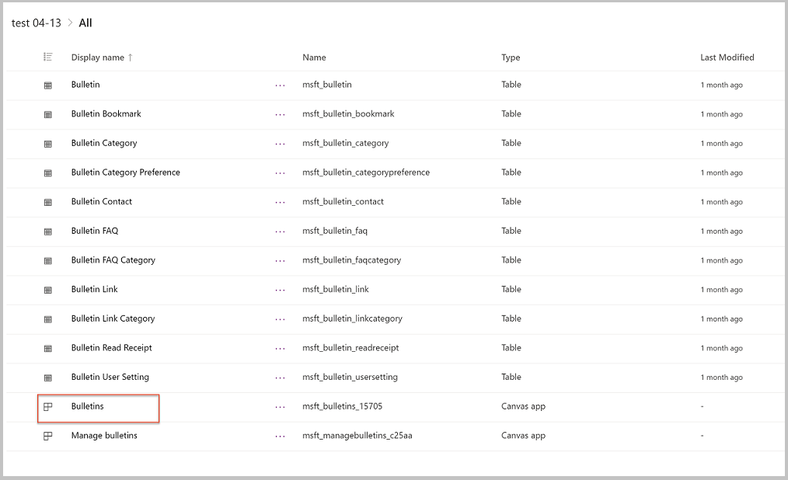

Now that Bulletins is open in Power Apps in Teams, select the **Tree View**.

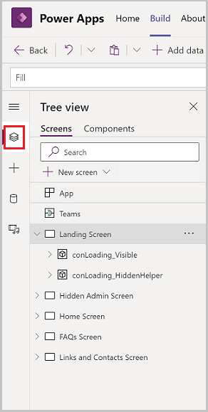

From the Tree View, you can see the screens included in the app. Selecting the arrow to the left of a screen will expand the contents of the screen, giving you access to the components of the screen, including galleries, buttons, text labels, and text input controls.

The following are the screens in Bulletins:

| **Screen**                | **Description**                                                                                                                                                                      |
|---------------------------|--------------------------------------------------------------------------------------------------------------------------------------------------------------------------------------|
| Landing Screen            | This screen displays an image with the app title as the app is loading.                                                                                                              |
| Hidden Admin Screen       | This screen is a helper screen for admins to try to understand the way that theming works in the app and support for dark mode and high contrast. This screen isn't visible to app users. |
| Home Screen               | This screen is the first screen that users see after the landing screen, which provides visibility for Bulletins.                                                                           |
| FAQ’s Screen              | This screen is visible when a user navigates to the FAQ tab.                                                                                                                         |
| Links and Contacts Screen | This screen displays links and contact records.                                                                                                                                      |

## Manage bulletins Screens

Now let’s look at the screens in the **Manage bulletins** app:

1.  In the Power Apps app, select the **Build** tab

2.  Select the team in which you installed the Bulletins app.

3.  Select **Installed apps** to show all apps installed in the Team.

4.  Select **Manage bulletins** in the **Bulletins** tile.

    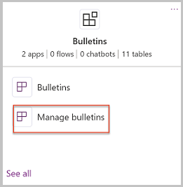

5.  Manage bulletins will open in the designer.

6.  Select the **Tree view** and review the screens in the Manage bulletins app.

    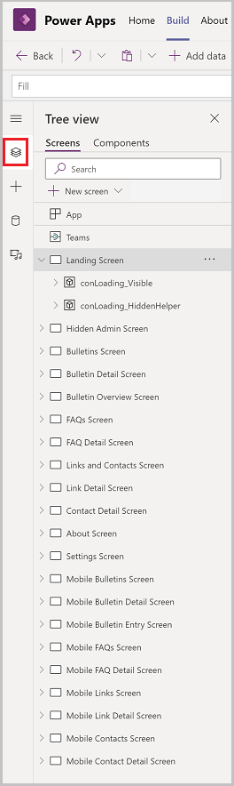

The following are the screens in the Manage bulletins app:

| Screen                        | Description                                                                                                                                                                          |
|-------------------------------|--------------------------------------------------------------------------------------------------------------------------------------------------------------------------------------|
| Landing Screen                | This screen displays an image with the app title as the app is loading.                                                                                                              |
| Hidden Admin Screen           | This is a helper screen for admins to try to understand the way that theming works in the app and support for dark mode and high contrast. This screen isn't visible to app users. |
| Bulletins Screen              | This is the first screen that users see after the landing screen, which displays bulletin records.                                                                                   |
| Bulletins Detail Screen       | This screen is used toe create or update bulletin records.                                                                                                                           |
| Bulletin Overview Screen      | This screen displays metrics about a bulletin, including number of views and bookmarks.                                                                                              |
| FAQ’s Screen                  | This screen displays FAQ records.                                                                                                                                                    |
| FAQ Detail Screen             | This screen is used to edit and create FAQ records.                                                                                                                                  |
| Links and Contacts Screen     | This screen displays links and contacts.                                                                                                                                             |
| Link Detail Screen            | This screen is used to edit or create links.                                                                                                                                         |
| Contact Detail Screen         | This screen is used to edit or create contacts.                                                                                                                                      |
| About Screen                  | This screen provides more details about the app and links to learning resources and app configuration.                                                                               |
| Settings Screen               | Settings screen gives access to create or modify categories for bulletins, FAQ’s, and links.                                                                                             |
| Mobile Bulletins Screen       | This is the first screen that users see after the landing screen, which displays bulletin records on mobile.                                                                         |
| Mobile Bulletin Detail Screen | This screen is used to specify properties of bulletin records while using the app on mobile.                                                                                         |
| Mobile Bulletin Entry Screen  | This screen is used to enter bulletin data while using the app on mobile.                                                                                                            |
| Mobile FAQs Screen            | This screen displays FAQ records while using the app on mobile.                                                                                                                      |
| Mobile FAQ Detail Screen      | This screen is used to edit and create FAQ records while using the app on mobile.                                                                                                    |
| Mobile Links Screen           | This screen displays links while using the app on mobile.                                                                                                                            |
| Mobile Link Detail Screen     | This screen is used to edit or create links while using the app on mobile.                                                                                                           |
| Mobile Contacts Screen        | This screen is displays contacts while using the app on mobile.                                                                                                                      |
| Mobile Contact Detail Screen  | This screen is used to edit or create contacts while using the app on mobile.                                                                                                        |

## Common customization scenarios

In this section, we discuss common customization/extension scenarios for Bulletins, and where you would make these changes.

### Send an alert when a new FAQ is posted

For notifications when a new FAQ is published, use Power Automate flow running when a row is added to the Bulletin FAQ table.

## Publish changes

When you're done making modifications to the apps, select **Save** to save your changes**.**

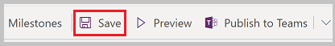

-   To preview your changes, select **Preview**.
    -   The app will launch in preview mode, where you can test the user experience when running the app

    -   To exit preview mode, press **Escape** on your keyboard or select the **X** in the upper right corner

        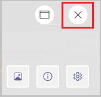

-   To publish your app changes, select the **Publish to Teams**.
    
-   Publishing the app makes your changes visible to users of the app.

-   A dialog will open confirming that you want to publish.

    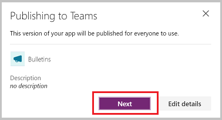

-   To change app settings, such as icon and background color, select **Edit details**.

-   To publish the app, select **Next**.

-   On the next screen, confirm the channel you want the app to appear. You can add to other channels in the Team by selecting **+**.

    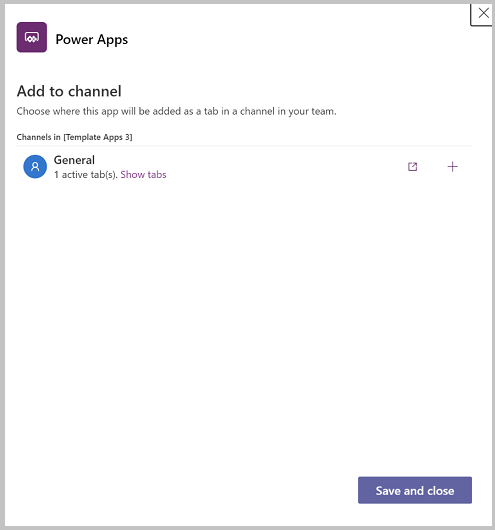

-   To complete publishing your changes, select **Save and close**.

## Customization considerations

Before modifying the Bulletins app, consider the following items:

-   Where are my table customizations? Columns and tables added by you'll go to **built by this team** section of the Power Apps app. You can also add new tables in the **See all** area.

    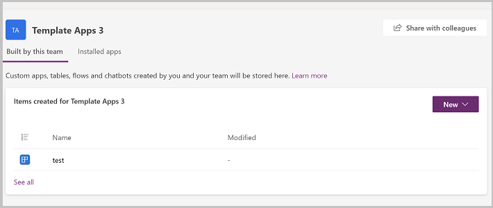

-   Changes made to an app will be added as a new version of the app. If you get a new version from store, your customizations won't be overridden. You'll get a new version that has the latest features, but the new version won't be published.

    For example, if you make changes to the Bulletins app, then you install the latest version from the Teams store, your urgent field will still be visible in the app after the upgrade.

    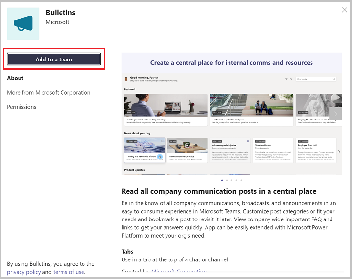

    The updated version of the app is available from the version history of the app. 

    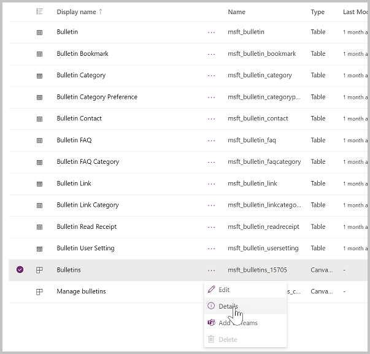

    Selecting **Details** from the app list will display the versions of the app and allow you to publish the new version.

    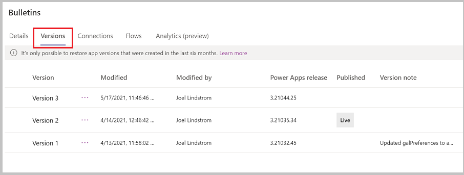

-   When customizing the app, pop out the Power Apps app in Teams so you don’t lose your changes when you navigate to other parts of Teams.
    
-   The app theming has been developed to support dark and high contrast mode in Teams. Changing the fill color of screens may break dark and high contrast modes.

### See also

- [Understand Bulletins sample app architecture](bulletins-architecture.md)
- [Sample apps FAQs](sample-apps-faqs.md)
- [Use sample apps from the Teams store](use-sample-apps-from-teams-store.md)

[!INCLUDE[footer-include](../includes/footer-banner.md)]