# Customize the Employee Ideas app

The Employee Ideas sample app for Microsoft Teams is designed to be a complete app experience but allow makers to easily extend it for their own purposes. In this article, covers how to customize the Employee Ideas app in Power Apps in Teams.

Before you can customize the app, you must install it from the Teams store. You can get the app at <https://aka.ms/TeamsEmployeeIdeas> .

Once the app is installed, follow the steps in this article to customize the app.

## Opening Power Apps app in Teams

1. In Teams, select the **…** button from the left menu.

2. Type **Power Apps** in the search field.

   > [!div class="mx-imgBorder"] 
   > 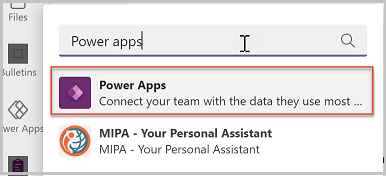

3. Select the Power Apps app from the list to open the app. Power Apps will open in Teams.
    
4. Right-click on the **Power Apps** logo and select **Pin** to lock the app to the side menu so it's easy to get to in the future.

   > [!div class="mx-imgBorder"] 
   > 

5. We recommended that you “pop out” Power Apps so that if you need to navigate somewhere else in Teams you won’t lose your app configuration. To pop out the Power Apps app, right-click on the Power Apps logo and select **Pop out app**.

   > [!div class="mx-imgBorder"] 
   > 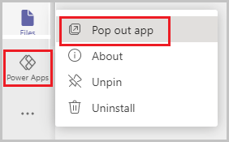

6. Now that you've loaded the Power Apps app, select **Build**.

   > [!div class="mx-imgBorder"] 
   > 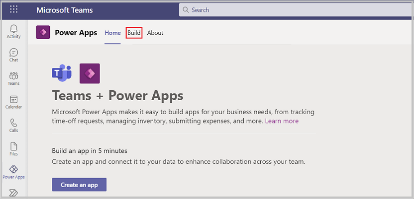

7. This screen will show all the Teams that have Power Apps installed in them.

8. Select the team in which you installed the Employee ideas app.

9. Select **Installed apps** to show all apps installed in Teams.

10. Employee Ideas solution includes two apps: **Ideas** for users to create and vote on ideas, and **Manage ideas** for managers to use to create campaigns and analyze idea vote history and create or modify idea justification questions.

11. Select **See all** in the **Employee Ideas** tile.

    > [!div class="mx-imgBorder"] 
    > 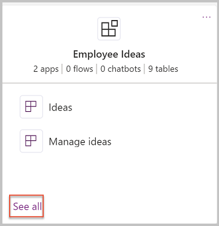

12. You'll now see all of the apps, tables, flows, and chatbots in the Team.

    > [!div class="mx-imgBorder"] 
    > 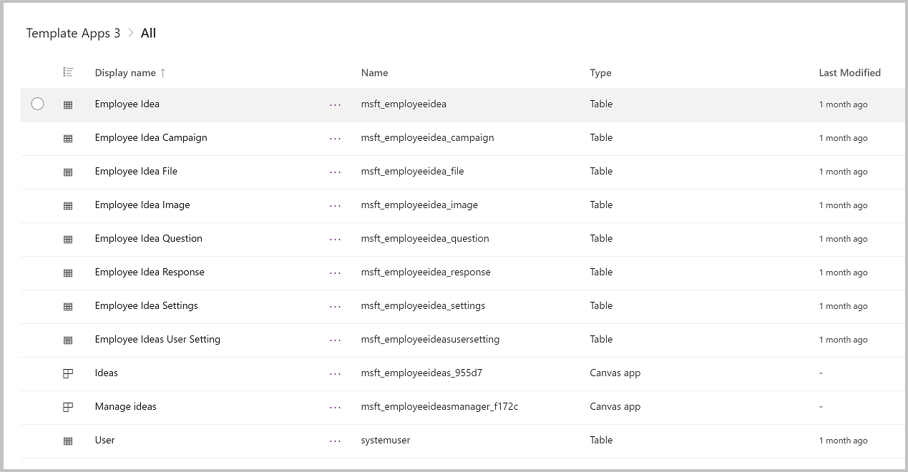

## Extend the Ideas data model

If you're modifying or adding any fields to your app, you'll want to first update or add these columns in their Dataverse tables. In this section, we'll explore the data model for Ideas and how to modify it in Power Apps in Teams. Below is the data model for Employee ideas.

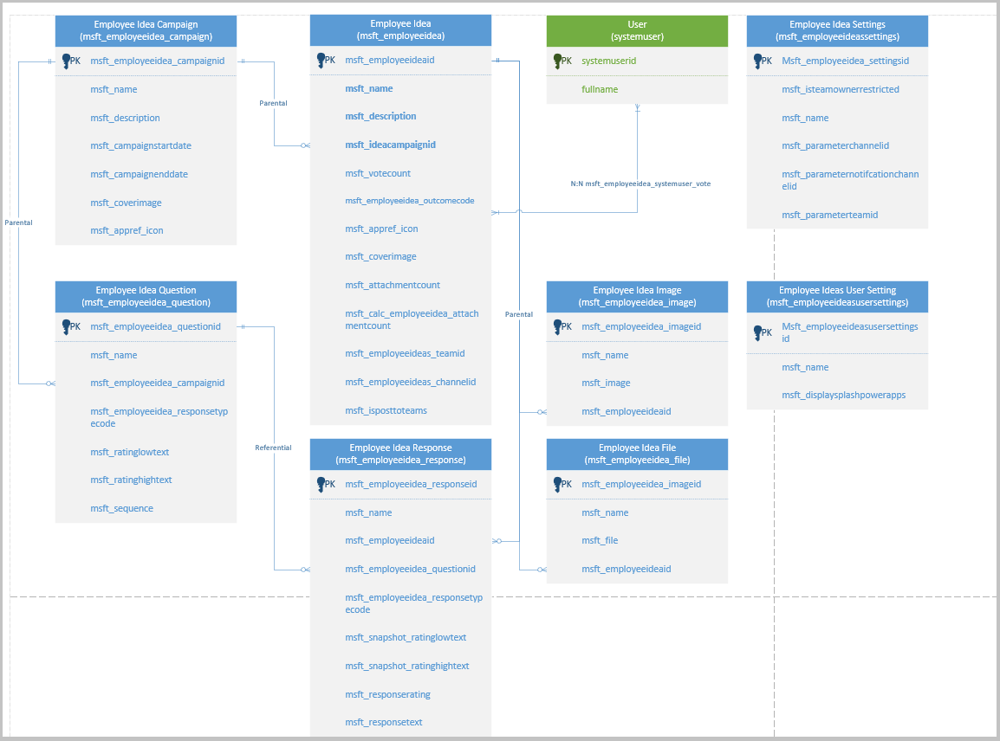

Before modifying the fields, you need to first decide where the fields you want to add should go. What are the users doing when they should see or interact with these fields?

- **Employee Idea**: Employee ideas refer to ideas and suggestions submitted by employees and colleagues for improvements to the organization. Details such as the name, description, and dates for the idea are stored in this table. Ideas are related to Users using a many to many relationship to relate the votes to the ideas and limit users to only being able to vote for an idea one time. Ideas can only be related to a single campaign.

- **Employee Idea Campaign**: Campaigns are the theme for ideas and used to group related activities. Details such as name and description are stored in the Campaign table. Campaigns can have multiple Ideas related to them.

- **Employee Idea Question**: Employee Idea Questions provide the questions asked when an idea is submitted. Multiple questions can be related to a campaign, and all ideas submitted for the campaign will display the questions related to the Campaign.

- **Employee Idea Response**: Employee Idea Responses store the responses to the questions asked on the idea submission form.

- **Employee Idea Settings**: Settings are used to store configurations for the app, including the Team and Channel Ids where notifications are posted when a Campaign or Idea is submitted.

- **Employee Idea User Setting**: User settings are used to store user preferences relating to seeing the Power Apps splash screen every time they log in to the app. There's one record for each user.

- **Employee Idea File**: When users submit ideas, they can add one or more files to the idea with extra details. These files are stored in the Employee Idea File table.

- **Employee Idea Image**: Each idea has an image file, and these images are stored in the Employee Idea Image table.

## Ideas Screens

From the list of apps, chatbots, flows, and tables, select the **Ideas** app.

> [!div class="mx-imgBorder"] 
> 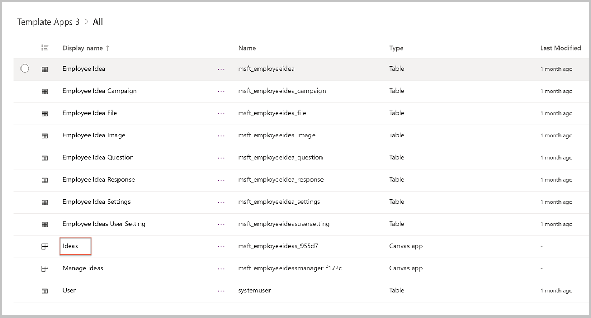

Now that Ideas app is open in Power Apps in Teams, select the **Tree View**  

> [!div class="mx-imgBorder"] 
> 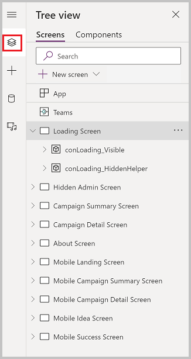

From the Tree View, you can see the screens included in the app. Selecting the arrow to the left of a screen will expand the contents of the screen, giving you access to the components of the screen, including galleries, buttons, text labels, and text input controls.

You can think of an application as a collection of screens. The user navigates from one screen to another as they use the app.

Each screen in turn is a collection of controls that the user interacts with. Controls can be linked to others in the screen. For example, selecting a Button
can take a content of a text field and add it to a table.

You construct the app by adding controls to screens, building these interactions, and layering multiple screens.

The following are the screens in Ideas:

| **Screen**                     | **Description**                                                                                                                                                                      |
|--------------------------------|--------------------------------------------------------------------------------------------------------------------------------------------------------------------------------------|
| Landing Screen                 | This screen displays an image with the app title as the app is loading.                                                                                                              |
| Hidden Admin Screen            | This screen is a helper screen for admins to try to understand the way that theming works in the app and support for dark mode and high contrast. This screen isn't visible to app users. |
| Campaign Summary Screen        | This screen is the first screen that users see after the landing screen, which provides visibility to campaigns and recently added ideas.                                                   |
| Campaign Detail Screen         | This screen displays the details of a campaign and the related ideas.                                                                                                                |
| About Screen                   | This screen shows more details about the app, including links to customize and learn move about the app.                                                                             |
| Mobile Landing Screen          | This screen displays an image with the app title as the app is loading on mobile.                                                                                                    |
| Mobile Campaign Summary Screen | This screen is the first screen that users see after the landing screen, which provides visibility to campaigns and recently added ideas on mobile.                                         |
| Mobile Campaign Detail Screen  | This screen displays the details of a campaign and the related ideas on mobile.                                                                                                      |
| Mobile Idea Screen             | This screen is used on mobile to enter an idea.                                                                                                                                      |
| Mobile Success Screen          | This screen is displayed when an idea is submitted.                                                                                                                                  |

## Manage Ideas Screens

Now let’s look at the screens in the **Manage Ideas** app:

1. In the Power Apps app, select the **Build** tab.
2. Select the team in which you installed the Employee ideas app.
3. Select **Installed apps** to show all apps installed in the Team.
4. Select **Manage ideas** in the **Employee Ideas** tile.

   > [!div class="mx-imgBorder"] 
   > 

5. Manage ideas will open in the designer.

6. Select the **Tree view** and review the screens in the Manage Ideas app.

   > [!div class="mx-imgBorder"] 
   > 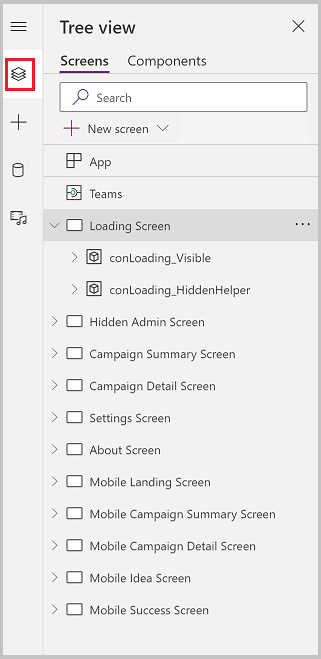

The following are the screens in the Manage Ideas app:

| **Screen**                     | **Description**                                                                                                                                                                      |
|--------------------------------|--------------------------------------------------------------------------------------------------------------------------------------------------------------------------------------|
| Landing Screen                 | This screen displays an image with the app title as the app is loading.                                                                                                              |
| Hidden Admin Screen            | This screen is a helper screen for admins to try to understand the way that theming works in the app and support for dark mode and high contrast. This screen isn't visible to app users. |
| Campaign Summary Screen        | This screen is the first screen that users see after the landing screen, which provides visibility to campaigns and recently added ideas.                                                   |
| Campaign Detail Screen         | This screen displays the details of a campaign and the related ideas.                                                                                                                |
| About Screen                   | This screen shows more details about the app, including links to customize and learn move about the app.                                                                             |
| Mobile Landing Screen          | This screen displays an image with the app title as the app is loading on mobile.                                                                                                    |
| Mobile Campaign Summary Screen | This screen is the first screen that users see after the landing screen, which provides visibility to campaigns and recently added ideas on mobile.                                         |
| Mobile Campaign Detail Screen  | This screen displays the details of a campaign and the related ideas on mobile.                                                                                                      |
| Mobile Idea Screen             | This screen is used on mobile to enter an idea.                                                                                                                                      |
| Mobile Success Screen          | This screen is displayed when an idea is submitted.                                                                                                                                  |

## Related ideas

Sometimes users may submit the same idea more than once. In this case, you might want to add a relationship between ideas, allowing managers to link related ideas.

## Publish changes

1. When you're done making modifications to the apps, select **Save**.

   > [!div class="mx-imgBorder"] 
   > 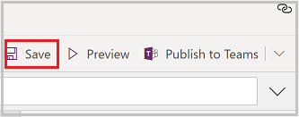

2. To preview your changes, select **Preview**.

    - The app will launch in preview mode, where you can test the user experience when running the app.
    - To exit preview mode, press **Escape** on your keyboard or select the **X** in the upper right corner.

      > [!div class="mx-imgBorder"] 
      > 

3. To publish your app changes, select the **Publish to Teams**. Publishing the app makes your changes visible to users of the app.

4. A dialog will open confirming that you want to publish.

    - To publish the app, select **Next**.
    - To change app settings, such as icon and background color, select **Edit details**.
  
    > [!div class="mx-imgBorder"] 
    > 

5. On the next screen, confirm the channel you want the app to appear. You can add to other channels in the Team by selecting the **+** button.
    
    > [!div class="mx-imgBorder"] 
   > 
    
6. To publish your changes, select **Save and close**.

## Customization considerations

Before modifying the Employee ideas app, consider the following items:

Where are my table customizations? Columns and tables added by you'll go to **built by this team** section of the Power Apps app. You can also add new tables in the **See all** area.

> [!div class="mx-imgBorder"] 
> 

Changes made to an app will be added as a new version of the app. If you get a new version from store, your customizations won't be overridden. You'll get a new version that has the latest features, but the new version won't be published.
    
For example, if you make changes to the Ideas app, then you install the latest version from the Teams store, your urgent field will still be visible in the app after the upgrade.
    
> [!div class="mx-imgBorder"] 
> 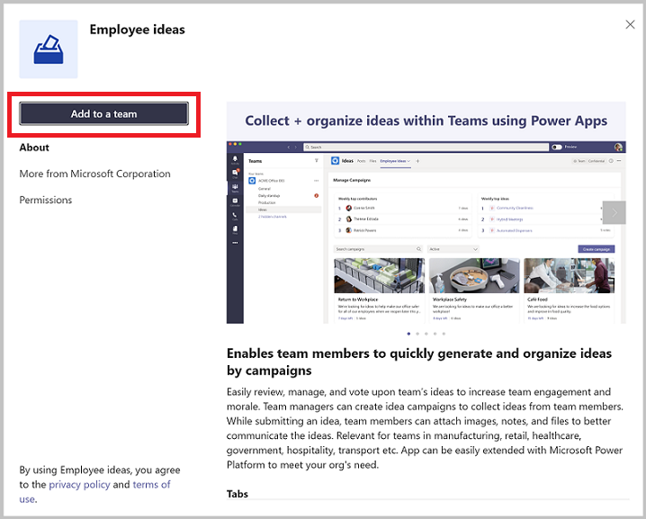

After upgrading the solution, your current app version will still be **live**.

The updated version of the app is available from the version history of the app. Selecting **Details** from the app list will display the versions of the app and allow you to publish the new version.

> [!div class="mx-imgBorder"] 
> 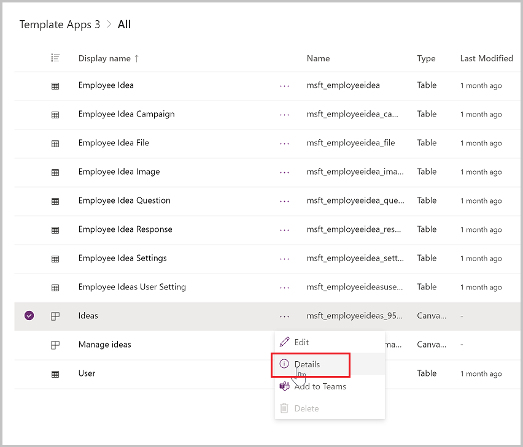

The new version is installed, but isn't live. You can publish the new version if you want to overwrite your changes.

> [!div class="mx-imgBorder"] 
> 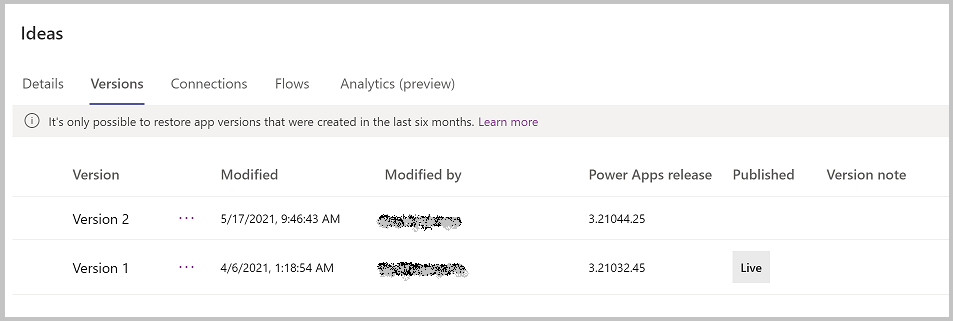

When customizing the app, pop out the Power Apps app in Teams so you don’t lose your changes when you navigate to other parts of Teams.
    
The app theming has been developed to support dark and high contrast mode in Teams. Changing the fill color of screens may break dark and high contrast modes.

### See also

- [Export Employee ideas for reporting](export-employee-ideas-for-reporting.md)
- [Understand Employee ideas app architecture](employee-ideas-architecture.md)
- [Customize sample apps](customize-sample-apps.md)
- [Sample apps FAQs](sample-apps-faqs.md)
- [Use sample apps from the Teams store](use-sample-apps-from-Teams-store.md)

[!INCLUDE[footer-include](../includes/footer-banner.md)]