# Inspections App – Customize inspection steps

The Inspections sample app allows users to create and perform inspections in the app. There are three apps, one per persona to perform, manage, and review Inspections. The three apps are&mdash;Inspections, Manage Inspections and Review Inspections.

In this article, we'll learn how to customize inspection steps in the user app. For example, removing the ability to add pictures to checklist steps. This customization is important because just deleting the particular control can cause issues with responsiveness, and the look and feel of the app can get affected.

## Prerequisites

To complete this lesson, we'd need the ability to sign-in to Microsoft Teams that will be available as part of select Microsoft 365 subscriptions, and will also need to have the Inspections sample app for Teams installed. This app can be installed from <https://aka.ms/TeamsInspection>.

## Open the Inspections app

1. Login into Teams, and right-click Power Apps from the left-pane, and select **Pop out app**.
1. Select **Build** from the top ribbon.
1. Select the team where the Inspections app is installed.
1. Select Inspections to open the app in the editor.

    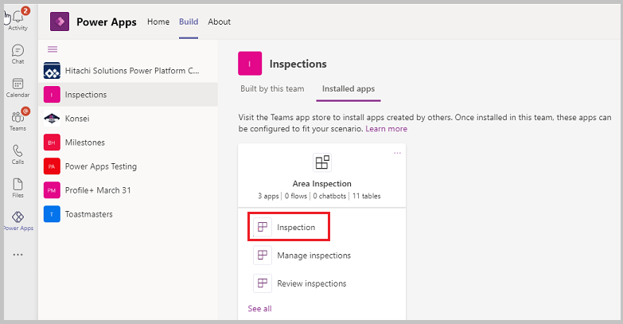

1. Select the tree view from the left-pane.

1. Select to open the Items screen.

    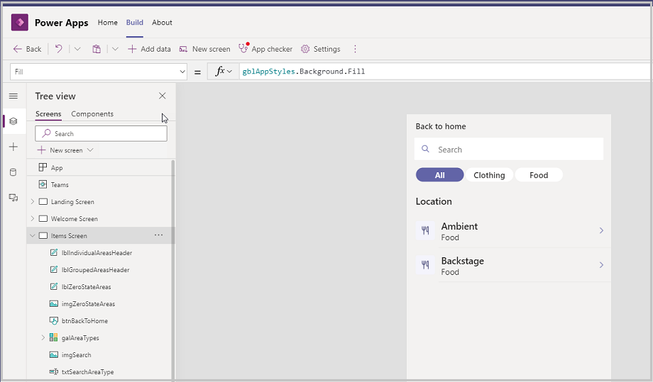

1. Press **Alt** key on the keyboard, and select Ambient or Backstage to open the record. The Food Inspection checklists page opens.

1. Press **Alt** key on the keyboard, and select any one of the options (Detailed Walk/Morning Store Walk). The Inspection Overview screen appears.

1. Press **Alt** key on the keyboard, and select **Begin Inspection**. The Inspection list screen opens.

    

1. This article explains the following scenarios:

   - [Hide the Add details section](#hide-the-add-details-section)

      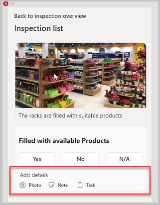

   - [Hide just the Photo option](#hide-the-photo-option)

      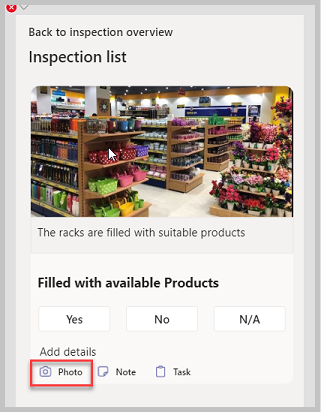

   - [Hide the Task option](#hide-the-task-option)

      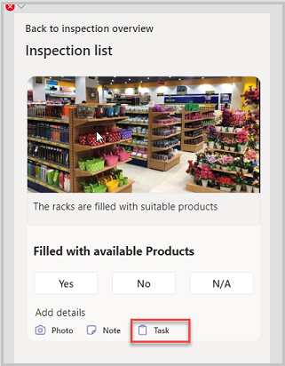

## Hide the Add Details section

Hiding the Add Details section includes more than just setting the Visible property of all those controls to False.

1. Set the **Visible** property for the **Add details** label, and the other labels (Photo, Note, and Task) and their icons to "False".

    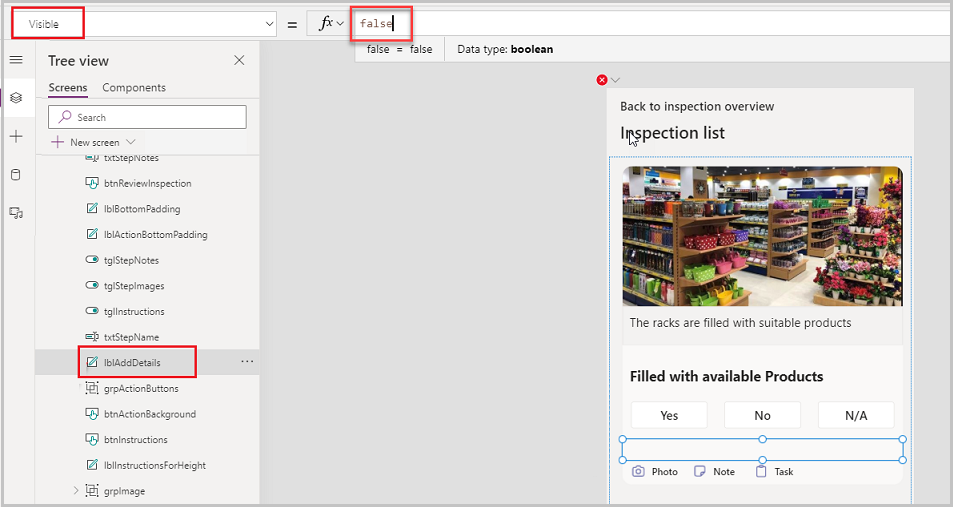

    

1. Set the **Visible** property for **grpNote**, **grpTask**, and **grpPhoto** to "False".

    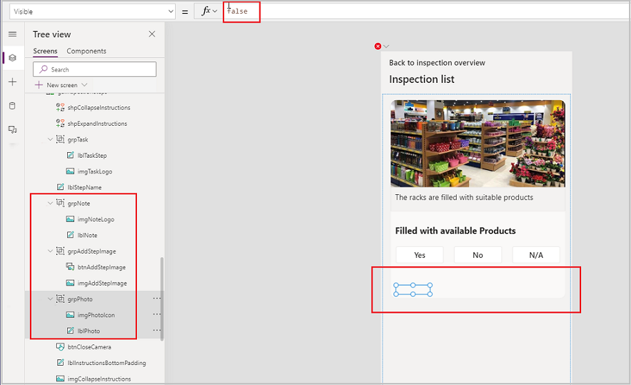

1. We'll also need to shrink the white space containing the Photo, Note, and Task buttons to avoid wasting any extra space. Select **btnActionBackground** control from the tree view, select somewhere on the white space to highlight the box space.

    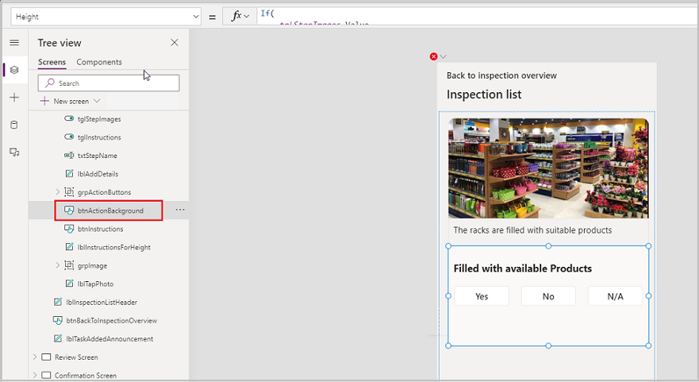

1. Open the **Height** property of the control, and comment the existing formula with `//` at the beginning of each line.

1. Add the following formula.

    ```powerapps-dot
    btnOK.Y + btnOK.Height - Self.Y + 20
    ```

    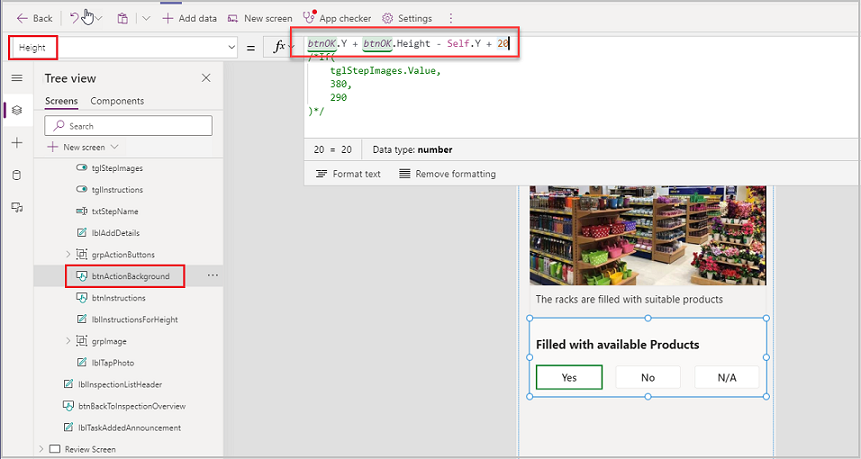

The white space shrinks, and leaves no extra space hiding the entire **Add Details** section.

## Hide the Photo Option

This scenario requires to revert all the changes made above. And then, we'll have to set the **Visible** property of the Photo option label, and icon to "False", and then move the Note option and the Task Options to the left.

1. To hide the Photo option, select **grpPhoto** from the tree view, and set **Visible** property to "False".

    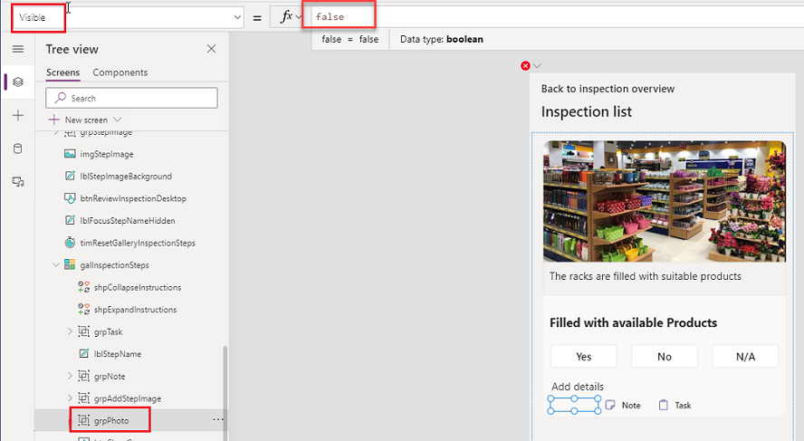

1. The Note option needs to move to the left in place of the Photo option. Copy the X property of the Photo Icon and paste it in the X property of the Note icon (notice that the label also moves along with the icon&mdash;this is because the Note label’s X property is dependent on the Note icon’s X property, and changes accordingly thus leaving no empty spaces – the Task option also reacts similarly).

    ```powerapps-dot
    btnImageBackground.X+18
    ```

    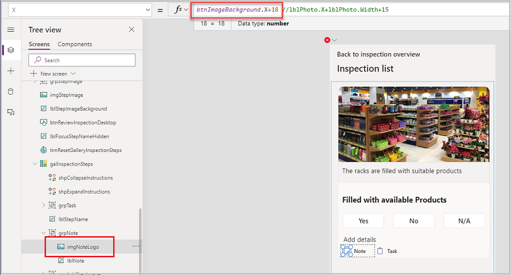

## Hide the Task Option

This scenario requires to revert all the changes made above. With this scenario, we only want to hide the Task section.

Change the **Visible** property for **grpTask** to "False".

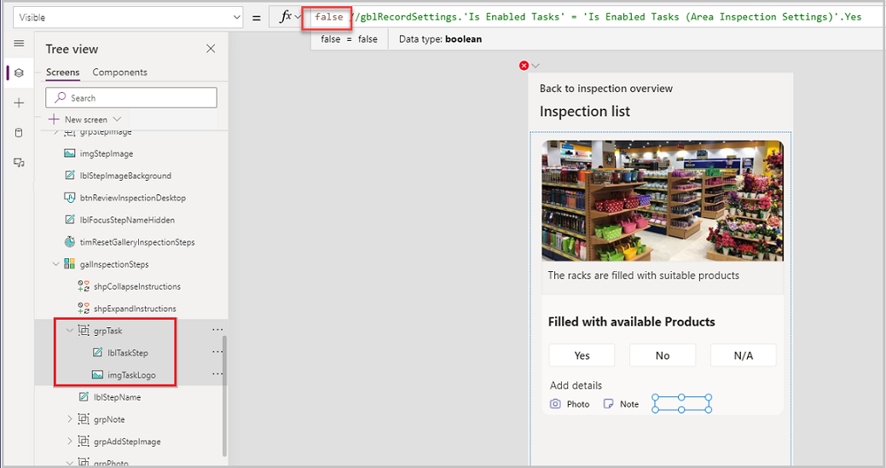

## Publish the Inspection app

All the changes to the Inspection app are completed. 

1. Select **Publish to Teams** on the top-right.

    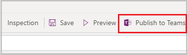

1. Select **Next**.

    

1. Select **Save and close**.

    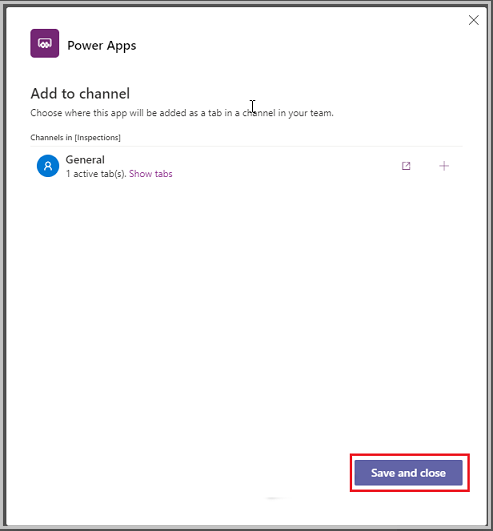

## Test the app

On the Inspection list screen, once you make the change for any of the above listed scenarios, select **Preview** to run the app.

Make sure to check for responsiveness by shrinking the size of the screen when testing in the Window mode.

### See also

- [Understand Inspection sample apps architecture](inspection-architecture.md)
- [Customize Inspection sample app](customize-inspections.md)
- [Customize sample apps](customize-sample-apps.md)
- [Sample apps FAQs](sample-apps-faqs.md)
- [Use sample apps from the Teams store](use-sample-apps-from-teams-store.md)

[!INCLUDE[footer-include](../includes/footer-banner.md)]