# How to customize the Inspection app

The Inspection Power App template for Microsoft Teams is designed to be a complete app experience but allow makers to easily extend it for their own purposes. In this guide we will go over how to customize the Inspection app in Power Apps in Microsoft Teams.

Before you can customize the app, you must install it from the Teams store. You can get the app at <https://aka.ms/TeamsInspection>

Once the app is installed you can then customize the app using the following steps

## Opening Power Apps app in Microsoft Teams

1.  In Microsoft Teams, select the **…** button from the left menu.

2.  Type **Power Apps** in the search field.

    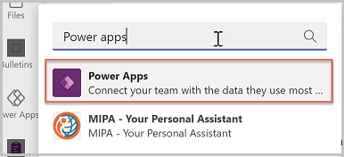

3.  Select the Power Apps app from the list to open the app. Power Apps will open inside of teams

4.  Right click on the **Power Apps** logo and select **Pin** to lock the app to the side menu so it is easy to get to in the future.

5. It is recommended that you “pop out” Power Apps so that if you need to navigate somewhere else in Microsoft Teams you won’t lose your app configuration. To pop out the Power Apps app, right mouse click on the Power Apps logo and select **Pop out app**.

6. Now that you have loaded the Power Apps app, select **Build**.

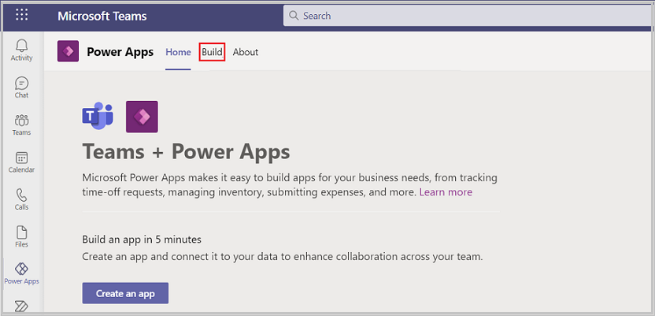

7. This screen will show all the teams that have Power Apps installed in them.

8. Select the team in which you installed the Inspection app.

9. Select **Installed apps.** This will show all apps installed in the Team.

10. Inspection solution includes three apps: **Inspection** for users to use to complete inspections, **Review inspections** for supervisors to use to review and approve inspections, and **Manage inspections** for managers to use to analyze Inspection history and create or modify inspection checklists.

11. Select **See more** in the **Inspection** tile.

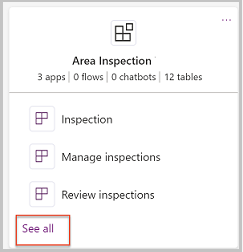

12. You will now see all of the apps, tables, flows, and chatbots in the Team.

## Extend the Inspection data model

If you are modifying or adding any fields to your app, you will want to first update or add these columns in their Dataverse tables. In this section we will explore the data model for Inspection and how to modify it in Power Apps in Microsoft Teams. Below is the data model for Inspection.

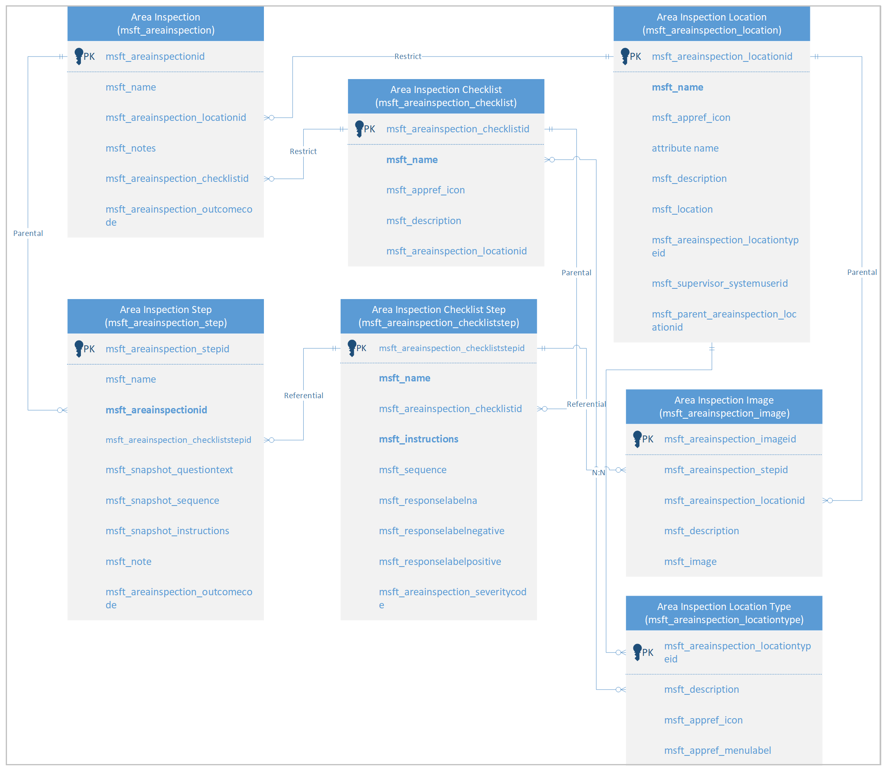

Before modifying the fields, you need to first decide where the fields you want to add should go. What are the users doing when they should see or interact with these fields?

To understand the Inspection data model, there are two primary table groups in Inspection: checklist tables and inspection tables. Checklist tables create a template for inspection form and related steps, and when a user completes an inspection, a copy of the checklist and checklist steps are copied to Area Inspection and Area Inspection Step.

**Checklist tables:**

-   **Area Inspection Checklist**

-   **Area Inspection Checklist Step**

**Inspection tables:**

-   **Area Inspection**

-   **Area Inspection Step**

**Other tables:**

-   **Area Inspection Location:** What we are inspecting—can be a location, area, store, asset, or anything. Inspections are related to Area Inspection Location records.

-   **Are Inspection Location Type**: Used to group and filter locations.

-   **Area Inspection Image:** Stores images captured during the inspection.

## Inspection Screens

From the list of apps, chatbots, flows, and tables, select the **Inspection** app.

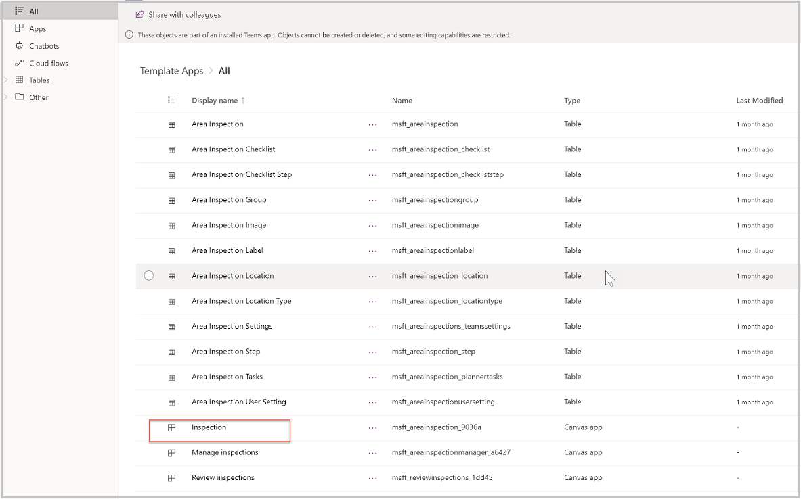

Now that Inspection is open in Power Apps in Microsoft Teams, select the **Tree View**.

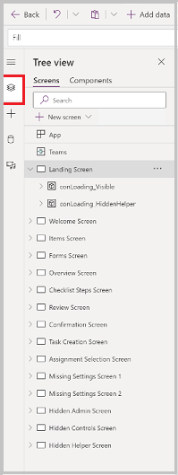

From the Tree View you can see the screens included in the app. Selecting the arrow to the left of a screen will expand the contents of the screen, giving you access to the components of the screen, including galleries, buttons, text labels, and text input controls.

The following are the screens in Inspection:

| Screen                      | Description                                                                                                                                                                          |
|-----------------------------|--------------------------------------------------------------------------------------------------------------------------------------------------------------------------------------|
| Landing Screen              | This screen displays an image the the app title as the app is loading.                                                                                                               |
| Hidden Admin Screen         | This is a helper screen for admins to try and understand the way that theming works in the app and support for dark mode and high contrast. This screen is not visible to app users. |
| Welcome Screen              | This is the first screen that users see after the landing screen, giving them access to perform an inspection and view tasks and recent inspection history.                          |
| Items Screen                | From this screen the user selects the desired location type and location for the inspection.                                                                                         |
| Forms Screen                | From this screen the user selects the desired inspection form.                                                                                                                       |
| Overview Screen             | This screen provides detail about the checklist questions before starting the inspection.                                                                                            |
| Checklist Steps Screen      | This screen displays a gallery of inspection steps for the selected inspection form.                                                                                                 |
| Review Screen               | This screen provides a final review of the inspection prior to submitting the inspection.                                                                                            |
| Confirmation Screen         | This screen confirms that the inspection form has been submitted.                                                                                                                    |
| Task Creation Screen        | When an issue is reported, the user can create a task for follow up on the reported issue. This screen is used to create the task.                                                   |
| Assignment Selection Screen | This screen provides the ability to select the user to whom the task should be assigned.                                                                                             |
| Missing Settings Screen     | This screen is displayed when the app has not been configured to use Planner and a user attempts to submit a task.                                                                   |
| Hidden Controls Screen      | Hidden admin screen used for testing of different languages, dark mode, and high contrast mode.                                                                                      |
| Hidden Helper Screen        | Screen used for gallery of icons.                                                                                                                                                    |

## Manage Inspection Screens

Now let’s look at the screens in the **Manage inspections** app. This is where you would make changes that should be seen by the inspection manager:

1.  In the Power Apps app, select the **Build** tab

2.  Select the team in which you installed the Inspection app.

3.  Select **Installed apps.** This will show all apps installed in the Team.

4.  Select **Manage inspections** in the **Area Inspection** tile.

    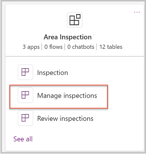

5.  Manage inspections will open in the designer.

6. Select the **Tree view** and review the screens in the Manage inspections app.

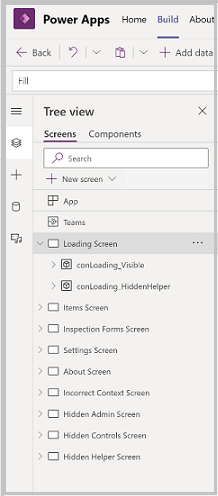

The following are the screens in the Manage Inspections app:

| Screen                   | Description                                                                                                                                                                                                          |
|--------------------------|----------------------------------------------------------------------------------------------------------------------------------------------------------------------------------------------------------------------|
| Landing Screen           | Displays an image and the app name as the app loads                                                                                                                                                                  |
| Hidden Admin Screen      | This screen is not visible to users of the app--it is designed to make it easy for makers to simulate scenarios within the designer. For example you can toggle dark mode on and see how the app looks in dark mode. |
| Items Screen             | The primary screen of the app, displays list of locations and allows user to create new locations.                                                                                                                   |
| Inspection Forms Screen  | From this screen managers can create new inspection forms and associate them with location types.                                                                                                                    |
| Settings Screen          | Screen from which an administrator can manage application settings like restricting the manage app to owners or selecting the Team and Planner where tasks will be created.                                          |
| About Screen             | Screen that displays more details about the app.                                                                                                                                                                     |
| Incorrect Context Screen | This screen displays when a user tries to launch the app outside of Microsoft Teams or in mobile.                                                                                                                    |
| Hidden Admin Screen      | Screen to use when testing dark mode, high contrast mode, and different languages.                                                                                                                                   |
| Hidden Controls Screen   | Screen for makers to use to test controls and theming formulas.                                                                                                                                                      |
| Hidden Helper Screen     | Hidden screen that contains galleries for icons and other galleries used in the background.                                                                                                                          |

## Review Inspection Screens

Now let’s look at the screens in the **Review inspections** app. This is where you would make changes that should be seen by the inspection manager:

1.  In the Power Apps app, select the **Build** tab

2.  Select the team in which you installed the Inspection app.

3.  Select **Installed apps.** This will show all apps installed in the Team.

4.  Select **Review inspections** in the **Area Inspection** tile.

    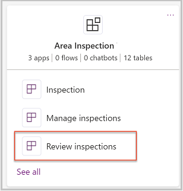

5.  Review inspections will open in the designer.

6. Select the **Tree view** and review the screens in the Review inspections app.

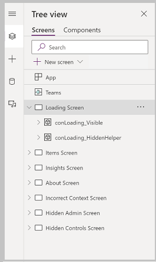

The following are the screens in the Review inspections app:

| Screen                   | Description                                                                                                                                                                                                          |
|--------------------------|----------------------------------------------------------------------------------------------------------------------------------------------------------------------------------------------------------------------|
| Landing Screen           | Displays an image and the app name as the app loads                                                                                                                                                                  |
| Hidden Admin Screen      | This screen is not visible to users of the app--it is designed to make it easy for makers to simulate scenarios within the designer. For example you can toggle dark mode on and see how the app looks in dark mode. |
| Items Screen             | The primary screen of the app, displays list of locations and the pending inspections for each location.                                                                                                             |
| Insights Screen          | This screen displays a dashboard of metrics about inspection history.                                                                                                                                                |
| About Screen             | Screen that displays more details about the app.                                                                                                                                                                     |
| Incorrect Context Screen | This screen displays when a user tries to launch the app outside of Microsoft Teams or in mobile.                                                                                                                    |
| Hidden Admin Screen      | Screen to use when testing dark mode, high contrast mode, and different languages.                                                                                                                                   |
| Hidden Controls Screen   | Screen for makers to use to test controls and theming formulas.                                                                                                                                                      |

## Common customization scenarios:

In this section we discuss common customization/extension scenarios for Inspection, and where you would make these changes

### Add hierarchy to locations

The inspection app is designed for a single organization; however, if you have multiple sites and need to have your areas, equipment, or other inspection items filtered based on location, add a site or store table and link the inspections to the store.

### Add info about person being inspected

Some organizations use the Inspection app as a verification check on an employee—perhaps validation that a job was completed correctly, and if not,
notify the manager of the user so they can provide coaching to the employee.

### Customize inspection steps

If you want to change inspection steps, such as removing tasks, images, or other capabilities, you can do so by updating the Inspection app **Inspection
Checklist Screen** screen. For example, the add image button is in the checklist item gallery, and you can disable taking photos on inspections by  disabling the photo button.

## Publish changes

When you are done making modifications to the apps, select **Save** to save your changes**.**

>   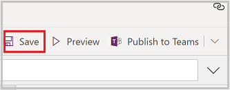

-   To preview your changes, select the  button
    -   The app will launch in preview mode, where you can test the user experience when running the app
        
    -   To exit preview mode, press **Escape** on your keyboard or select the **X** in the upper right corner

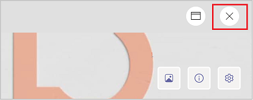

-   To publish your app changes, select the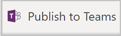 button
    
-   Publishing the app makes your changes visible to users of the app

-   A dialog will open confirming that you want to publish

    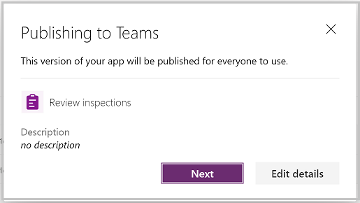

-   To change app settings, such as icon and background color, select **Edit details**
    
-   To publish the app, select **Next**

-   On the next screen, confirm the channel you want the app to appear. You can add to other channels in the Team by pressing the **+** button
    
    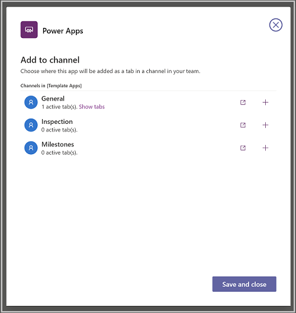
    
-   To complete publishing your changes, select **Save and close**

## Customization considerations

Before modifying the Inspection app, consider the following items:

-   Where are my table customizations? Columns and tables added by you will go to **built by this team** section of the Power Apps app. You can also add
    new tables in the **See all** area.

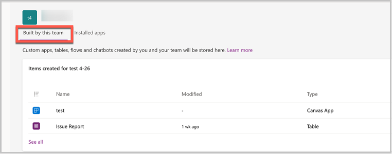

-   Changes made to an app will be added as a new version of the app. If you get a new version from store, your customizations will not be overridden. You will get a new version that has the latest features, but the new version will not be published.

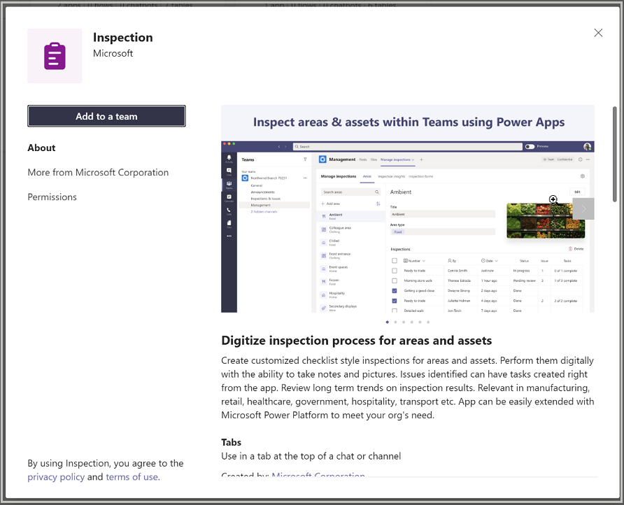

Figure 1 After upgrading the solution your current app version will still be "live."

The updated version of the app is available from the version history of the app. Selecting **Details** from the app list will display the versions of the app and allow you to publish the new version.

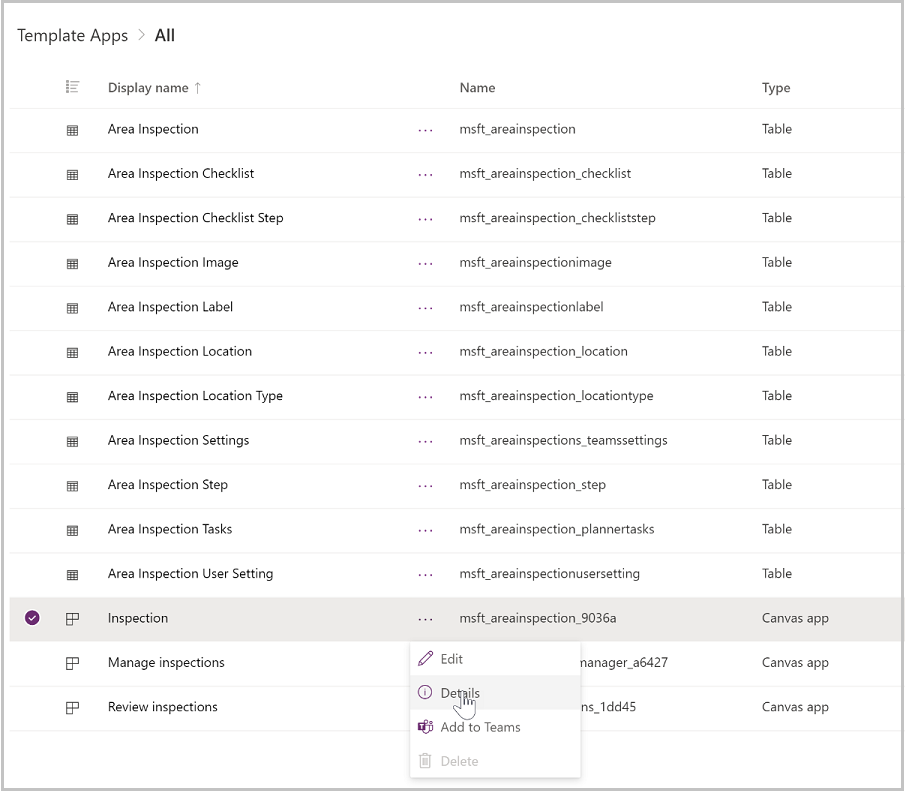

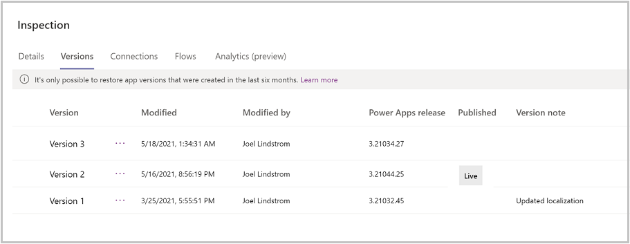

Figure 2 After installing the new version, the older version is still "live." You can choose to publish the new version or keep using the older one.

-   When customizing the app, pop out the Power Apps app in Teams so you don’t lose your changes when you navigate to other parts of Microsoft Teams.
    
-   The app theming has been developed to support dark and high contrast mode in Microsoft Teams. Changing the fill color of screens may break dark and high contrast modes
