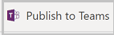

# How to customize the Issue Reporting sample app

The Issue Reporting Power App template for Microsoft Teams is designed to be a complete app experience but allow makers to easily extend it for their own purposes. In this guide we will go over how to customize the Issue Reporting app in Power Apps in Microsoft Teams.

Before you can customize the app, you must install it from the Teams store. You can get the app at <https://aka.ms/TeamsIssueReporting> .

Once the app is installed you can then customize the app using the following steps:

## Opening Power Apps app in Microsoft Teams

1.  In Microsoft Teams, select the **…** button from the left menu.

2.  Type **Power Apps** in the search field.

    

3.  Select the Power Apps app from the list to open the app. Power Apps will open inside of teams

4. Right click on the **Power Apps** logo and select **Pin** to lock the app to  the left pane so it is easy to get to in the future.

   

It is recommended that you “pop out” Power Apps so that if you need to navigate somewhere else in Microsoft Teams you won’t lose your app configuration. To pop out the Power Apps app, right mouse click on the Power Apps logo and select **Pop out app**.

5.  Now that you have loaded the Power Apps app, select **Build**.

6.  This screen will show all the teams that have Power Apps installed in them.

7.  Select the team in which you installed the Issue Reporting app.

8.  Select **Installed apps.** This will show all apps installed in the Team.

9.  Issue Reporting solution includes two apps: **Issue Reporting** for users to report issues, and **Manage issues** for managers to use to analyze issue reporting history and create or modify Issue templates.

10.  Select **See more** in the **Issue Reporting** tile.

    
11.  You will now see all of the apps, tables, flows, and chatbots in the Team.

## Extend the Issue Reporting data model

If you are modifying or adding any fields to your app, you will want to first update or add these columns in their Dataverse tables. In this section we will explore the data model for Issue Reporting and how to modify it in Power Apps in Microsoft Teams. Below is the data model for Issue Reporting.

Before modifying the fields, you need to first decide where the fields you want to add should go. What are the users doing when they should see or interact with these fields?

**Issue Report**

Issues refer to a problem or trouble being faced by the Users. Information  such as the Name, Issue category, issue template, Planner Task ID, due date, assigned user and description are stored in the Issue reports table.

An issue can be related only to a single Category and Template.

**Issue Report Category**

Categories are used to group similar kind of issues. Details such as the name, category icon, Planner Bucket ID are stored in the Issue Report  Categories table. A Category can have multiple Issues and Issue Templates associated to it.

**Issue Report Templates**

Issue templates have predefined questions that must be answered by the users while creating an issue which helps us in understanding it better. Details such as the Due Date, Category the user to whom the tasks should be assigned, the primary contact information are stored in the Issue Report Templates table. There can be multiple questions and issues related to an Issue template. When an Issue Category is selected, the questions asked on the issue report form are based on the template.

**Issue Report Questions**

Questions are part of the Issue Templates which help in explaining the issue in a better way. Details such as the Issue template and the sequence are stored in the Issue Report Questions table. There can be multiple questions in an Issue template

**Issue Report Settings**

Settings are used to store configurations for the app, including the Team and Planner Ids for where to log issues as Planner Tasks.

**Issue Report User Setting**

User settings are used to store user preferences pertaining to seeing the Power Apps splash screen every time they login to the app. There is one record for each user.

**Issue Report Photo**

This table has been included to hold photos for issues. This is currently not used in the app but is provided for easy extension.

## Issue Reporting Screens

From the list of apps, chatbots, flows, and tables, select the **Issue Reporting** app.

Now that Issue Reporting is open in Power Apps in Microsoft Teams, select the **Tree View**.

From the Tree View you can see the screens included in the app. Selecting the arrow to the left of a screen will expand the contents of the screen, giving you access to the components of the screen, including galleries, buttons, text labels, and text input controls.

The following are the screens in Issue reporting:

| **Screen**                  | **Description**                                                                                                                                                                      |
|-----------------------------|--------------------------------------------------------------------------------------------------------------------------------------------------------------------------------------|
| Landing Screen              | This screen displays an image the the app title as the app is loading.                                                                                                               |
| Hidden Admin Screen         | This is a helper screen for admins to try and understand the way that theming works in the app and support for dark mode and high contrast. This screen is not visible to app users. |
| Insights Screen             | This is the first screen that users see, which provides insight to the number of issues created and providing access for users to navigate to the issue report screen.               |
| Issue Report Screen         | This screen is the form that users complete to create an issue.                                                                                                                      |
| Issue Stats Screen          | This screen displays the quantity of issues by status.                                                                                                                               |
| Template Selection Screen   | This screen is the list of category templates from which a user selects when creating an issue.                                                                                      |
| Assignment Selection Screen | This screen is where the user searches for and selects the user to whom the issue should be assigned.                                                                                |
| Issue Submission Screen     | This screen is the confirmation message when an issue has been submitted.                                                                                                            |
| Settings Missing Screen     | This screen is displayed if a user attempts to open the app without first configuring the Microsoft Planner location.                                                                |
| Tasks Access Denied Screen  | This screen is displayed if a user attempts to submit an issue when they do not have access to the Planner instance that the app is configured to use.                               |

## Manage Issue Screens

Now let’s look at the screens in the **Manage Issues** app:

1.  In the Power Apps app, select the **Build** tab

2.  Select the team in which you installed the Issue Reporting app.

3.  Select **Installed apps.** This will show all apps installed in the Team.

4.  Select **Manage issues** in the **Issue Reporting** tile.

    

5.  Manage issues will open in the designer.

6.  Select the **Tree view** and review the screens in the Manage Issues app.

The following are the screens in the Manage Issues app:

| **Screen**               | **Description**                                                                                                                                                                                                      |
|--------------------------|----------------------------------------------------------------------------------------------------------------------------------------------------------------------------------------------------------------------|
| Landing Screen           | Displays an image and the app name as the app loads                                                                                                                                                                  |
| Hidden Admin Screen      | This screen is not visible to users of the app--it is designed to make it easy for makers to simulate scenarios within the designer. For example you can toggle dark mode on and see how the app looks in dark mode. |
| Insights Screen          | The primary screen of the app, shows a summary of issues created by status and navigate to the task view in Planner.                                                                                                 |
| Issue Templates Screen   | From this screen, managers can add or modify issue categories and create issue templates.                                                                                                                            |
| Settings Screen          | Screen from which an administrator can manage user settings like restricting the manage app to Owner or selecting the Team and Planner where tasks will be created.                                                  |
| About Screen             | Scree that displays more details about the app.                                                                                                                                                                      |
| Incorrect Context Screen | This screen displays when a user tries to launch the app outside of Microsoft Teams or in mobile.                                                                                                                    |

## Common customization scenarios:

In this section we discuss common customization/extension scenarios for Issue Reporting, and where you would make these changes

### Add logo to launch screen

If you want to modify the loading screen of the Issue reporting loading screen, such as adding your logo to it, you would make this change in the **Landing
Screen** of the **Issue Reporting**  app.

### Automate task assignment

To automate task assignment, you would update the formula for create issue on the **Issue Report** screen of the **Issue reporting** app, or use a Power
Automate flow.

### Modify app purpose

Issue Reporting can be used as a starting point for any kind of scenario where a requestor submits an item for someone else to work on or resolve. It could be modified into a ticket management system like a helpdesk request system or a work order tracking system.

### Integrate with other task management system

The Power Platform includes connectors to multiple task scheduling applications, such as Microsoft To-do, Jira, and Trello. Using Power Automate, you can integrate tasks created in Issue Reporting with other task management systems than Planner. This app can also be combined with other apps, such as [**Inspection.**](https://aka.ms/teamsinspection)

### Add additional fields to populate when a task is created

Manage issues populates the most common fields used in Planner when creting a task, such as Description, Title, and Assigned to; however, you may want to populate additional fields or change the way the fields are mapped. To modify this logic you would update the formula for creating issues on the **Issue Report** screen of the **Issue reporting** app. 

## Publish changes

When you are done making modifications to the apps, select **Save** to save your changes**.**

-   To preview your changes, select the  button
    
    -   The app will launch in preview mode, where you can test the user experience when running the app
        
    -   To exit preview mode, press **Escape** on your keyboard or select the **X** in the upper right corner.

-   To publish your app changes, select the button
    
-   Publishing the app makes your changes visible to users of the app.

-   A dialog will open confirming that you want to publish.

    

-   To change app settings, such as icon and background color, select **Edit details**.
    
-   To publish the app, select **Next**.

-   On the next screen, confirm the channel you want the app to appear. You can add to other channels in the Team by selecting the **+** button.
    
    
    
-   To complete publishing your changes, select **Save and close**.

## Customization considerations

Before modifying the Issue reporting app, consider the following items:

-   Where are my table customizations? Columns and tables added by you will go to **built by this team** section of the Power Apps app. You can also add
    new tables in the **See all** area.

- Changes made to an app will be added as a new version of the app. If you get a new version from store, your customizations will not be overridden. You will get a new version that has the latest features, but the new version will not be published.

  For example, if you add a field called **urgent** to the issue report screen, then you install the latest version from the Teams store, your
  urgent field will still be visible in the app after the upgrade.

  

  After upgrading the solution your current app version will still be "live."

  The updated version of the app is available from the version history of the app. Selecting **Details** from the app list will display the versions of
  the app and allow you to publish the new version.

>   

-   When customizing the app, pop out the Power Apps app in Teams so you don’t lose your changes when you navigate to other parts of Microsoft Teams.
    
-   The app theming has been developed to support dark and high contrast mode in Microsoft Teams. Changing the fill color of screens may break dark and high contrast modes
