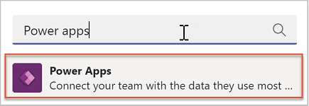
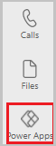
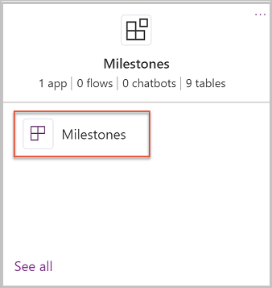
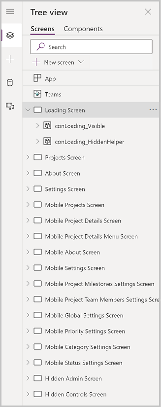
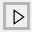
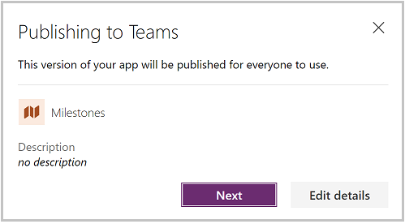

# Customize Milestones sample app

The Milestones sample app for Microsoft Teams is designed to be a complete app experience. At the same time, allow makers to easily extend it for their own purposes.

We'll go over how to customize the Milestones app using Power Apps Studio in Microsoft Teams.

Before you can customize the app, you must install it from the Teams store. You can get the app at <https://aka.ms/teamsmilestones>.

Once the app is installed, you can then customize it using the following steps.

Watch this video to learn how to customize Milestones sample app:
> [!VIDEO https://www.microsoft.com/videoplayer/embed/RWLiBR]

## Open Power Apps app in Teams

1. Select ellipsis (…), and search for **Power Apps**.

   

2. The Power Apps app icon will now appear on the left pane.

3. Right-click on the **Power Apps** icon, and select **Pin** to pin the app to your Teams menu. Pinning will make it appear every time you open Microsoft Teams.

   

4. We recommend that you right-click on the Power Apps logo, and select **Pop out app** to open the app in a new window. This way, you won't lose your work when working at other places in Teams.

The app now opens in Microsoft Teams.

## Extend the Milestones data model

To modify or add any fields to Milestones app, update or add columns in Microsoft Dataverse tables first.

In this section, we'll explore the data model for Milestones, and understand how to modify it using Power Apps in Teams. 

Here's the data model for Milestones app.

Before modifying fields, decide where the fields you want to add should go. What are the users doing when they should see or interact with these fields?

- If it's information about the project that appears in the project list on the left or the header, add it to the **Project** table.
- If it's information about work items that a user should add, or view when looking at their work items/tasks, add it to the **Project Work Item** table.
- The other tables, such as **Project Milestones**, **Project Category**, **Project Status**, and **Priority** are primarily lookup tables referenced by work item.

## Open the Milestones app in Power Apps Studio

To edit the Milestones app, open it using Power Apps Studio in Teams.

- Select **Power Apps** on the Microsoft Teams pane.
- In Power Apps Studio, select **Build** tab.
- From the list of all teams having apps, select the team that you installed Milestones app in.
- Select **Installed apps**.
- In the **Milestones** tile, select the Milestones app.

    

The Milestones app will open in Power Apps Studio. This process may take one to two minutes.

## Customize Milestones app in the Power Apps Studio

Now that the Milestones App is open in the Studio, let’s explore the app.

1. On left side, select the Tree View.

    

1. From the Tree View, you can see the screens included in the app. Selecting the arrow to the left of a screen will expand the contents of the screen, giving you access to the components of the screen, including galleries, buttons, text labels, and text input controls.

1. In Tree View, select **Projects Screen**.

1. You'll now see the main Milestones app screen, and have access to modifying any of the screen controls.

1. Make your changes to the app.

1. When finished, select **Save**.

1. To preview your changes, select the  button. 

    The app will launch in preview mode, where you can test the user experience when running the app. To exit preview mode, press **Escape** on your keyboard, or select the **X** in the upper right corner.

1. To publish your app changes, select the **Publish to Teams** button.

    Publishing the app makes your changes visible to users of the app. A dialog will open confirming that you want to publish.

    

1. To change app settings, such as icon and background color, select **Edit details**. Or, to publish the app, select **Next**.

1. Confirm the channel you want the app to appear. You can add to other channels in the Team by selecting the **+** button.
    
1. To complete publishing your changes, select **Save and close**.

## Ideas for extension

The possibilities for extending the Milestones app are only limited to your imagination. Here are some of the common ways makers extend the Milestones app:

- Add company logo.
- Change Milestones colors to match your company colors.
- Use Power Automate to create tasks in Microsoft Planner/Tasks for work items.
- Use Power Automate to notify project team members when they're assigned to a Project.
- Add new columns to work items.
- Use Power Automate to send a weekly summary email of work item and project status.

## Customization considerations

Before modifying the Milestones app, consider the following items:

- Milestones, project category, status, and priority are set in the settings area of the Milestones app. Changing these values in the table may cause issues with the app. For example, the New status is expected by the Project screen Milestone Status indicator.
- When customizing the app, always right-click on the Power Apps icon, and select **Pop out app** to open Power Apps in a new window. That way, you won't lose your place when you work somewhere else in Teams.
- The app theming has been developed to support dark and high contrast mode in Teams. Changing the fill color of screens may break dark and high contrast modes.
- Changes made to an app will be added as a new version of the app. If you get a new version from store, your customizations won't be overridden. The new version will be installed, but the new version won't be published.
- The updated version of the app is available from the version history of the app. Selecting **Details** from the app list will display the versions of the app and allow you to publish the new version.
- Columns and tables added by you'll go to **built by this team** section of the Power Apps app. You can also add new tables in the **See all** area.

### See also

- [Use Milestones apps from teams store](milestones.md)
- [Understand Milestones sample app architecture](milestones-architecture.md)
- [Customize sample apps](customize-sample-apps.md)
- [Sample apps FAQs](sample-apps-faqs.md)
- [Use sample apps from the Microsoft Teams store](use-sample-apps-from-teams-store.md)

[!INCLUDE[footer-include](../includes/footer-banner.md)]