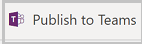

# How to customize Milestones sample app
The Milestones Power App template for Microsoft Teams is designed to be a complete app experience but allow makers to easily extend it for their own purposes. In this guide we will go over how to customize the Milestones app in Power Apps Studio in Microsoft Teams.

Before you can customize the app, you must install it from the Teams store. You can get the app at <https://aka.ms/teamsmilestones>.

Once the app is installed you can then customize the app using the following steps

## Opening Power Apps in Microsoft Teams
1. Click the ellipsis (…) and search for **Power Apps** .

   

2. The Power Apps app icon will now appear on the Microsoft Teams left side menu.

3. Right click on the **Power Apps** icon and select **Pin** to pin the Power Apps app to your Teams menu—this will make it appear every time you open Microsoft Teams.

   

4. We recommend that you right click on the Power Apps logo and select **Pop out app** to open the app in a new window, so you won't lose your work when navigating other places in Microsoft Teams.   

The app opens in Microsoft Teams.

## Extend the Milestones data model

If you are modifying or adding any fields to your app, you will want to first update or add these columns in their Dataverse tables. In this section we will
explore the data model for Milestones and how to modify it in Power Apps in Microsoft Teams. Below is the data model for Milestones.

Before modifying the fields, you need to first decide where the fields you want to add should go. What are the users doing when they should see or interact with these fields?

-   If it is information about the project that appears in the project list on the left or the header, add it to the **Project** table
    
    -   If it is information about work items that a user should add or view when looking at their work items/tasks, add it to the **Project Work
        Item** table.
        
    -   The other tables, such as Project Milestones, Project Category, Project Status, and Priority are primarily lookup tables that are referenced by
        work item.

## Open the Milestones app in Power Apps Studio

To edit the Milestones app, open it in the Power Apps in Microsoft Teams.

-   Select **Power Apps** on the Microsoft Teams left side menu In Power Apps Studio, select **Build** tab

- This screen will show all the teams that have Power Apps. Select the team in which you installed Milestones.
- Select **Installed apps**.

- In the **Milestones** tile, select the Milestones app.

  

The Milestones app will open in the Power Apps Designer. This may take a minute or two.

## Customizing Milestones in the Power Apps Designer

Now that the Milestones App is open in the Designer, let’s explore the app

1. On left side, select Tree View (if not already selected).

   

2. From the Tree View you can see the screens included in the app. Selecting the arrow to the left of a screen will expand the contents of the screen, giving you access to the components of the screen, including galleries, buttons, text labels, and text input controls.

3. In Tree View, select **Projects Screen**.

4. You will now see the main Milestones app screen and have access to modifying any of the screen controls.

5. Make your desired changes to the app.

6. When finished, select **Save**.

7. To preview your changes, select the  button.
   1.  The app will launch in preview mode, where you can test the user experience when running the app.
       
   2.  To exit preview mode, press **Escape** on your keyboard or select the **X** in the upper right corner.

8. To publish your app changes, select the  button.

-   Publishing the app makes your changes visible to users of the app.

-   A dialog will open confirming that you want to publish.

    

-   To change app settings, such as icon and background color, select **Edit details**.
    
-   To publish the app, select **Next**.
    
-   On the next screen, confirm the channel you want the app to appear. You can add to other channels in the Team by pressing the **+** button.
    
-   To complete publishing your changes, select **Save and close**.

## Ideas for extension

The possibilities for extending the Milestones app are only limited to your imagination. Here are some of the common ways makers extend the Milestones app:

-   Add company logo.

-   Change Milestones colors to match your company colors.

-   Use Power Automate to create tasks in Microsoft Planner/Tasks for work items.

-   Use Power Automate to notify project team members when they are assigned to a Project.
    
-   Add new columns to work items.

-   Use Power Automate to send a weekly summary email of work item and project status.

## Customization considerations

Before modifying the Milestones app, consider the following items:

-   Milestones, project category, status, and priority are set in the settings area of the Milestones app. Changing these values in the table may cause
    issues with the app. For example, the New status is expected by the Project screen Milestone Status indicator.
    
-   When customizing the app, always right mouse click on the Power Apps icon and select **Pop out app** to open Power apps in a new window. That way you will not lose your place when you navigate somewhere else in Microsoft Teams.
    
-   The app theming has been developed to support dark and high contrast mode in Microsoft Teams. Changing the fill color of screens may break dark and high contrast modes
    
-   Changes made to an app will be added as a new version of the app. If you get a new version from store, your customizations will not be overridden. The new version will be installed, but the new version will not be published.
    
    The updated version of the app is available from the version history of the app. Selecting **Details** from the app list will display the versions of
    the app and allow you to publish the new version.
    
- Columns and tables added by you will go to **built by this team** section of the Power Apps app. You can also add new tables in the **See all** area.
