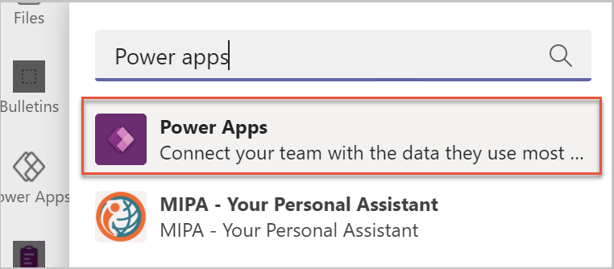
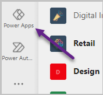
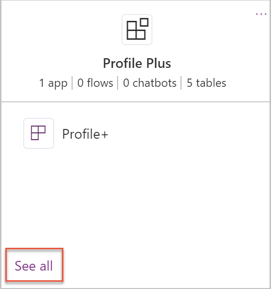
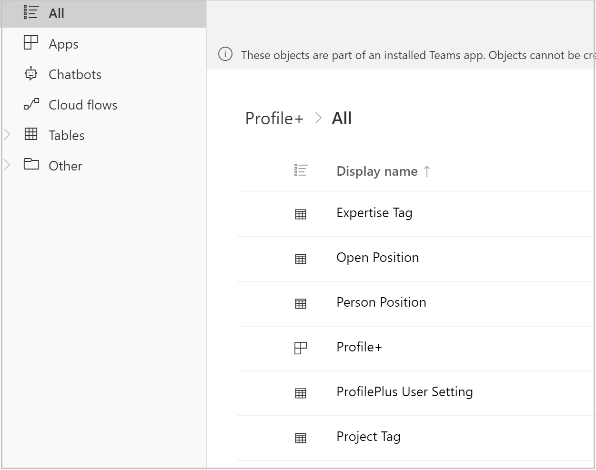
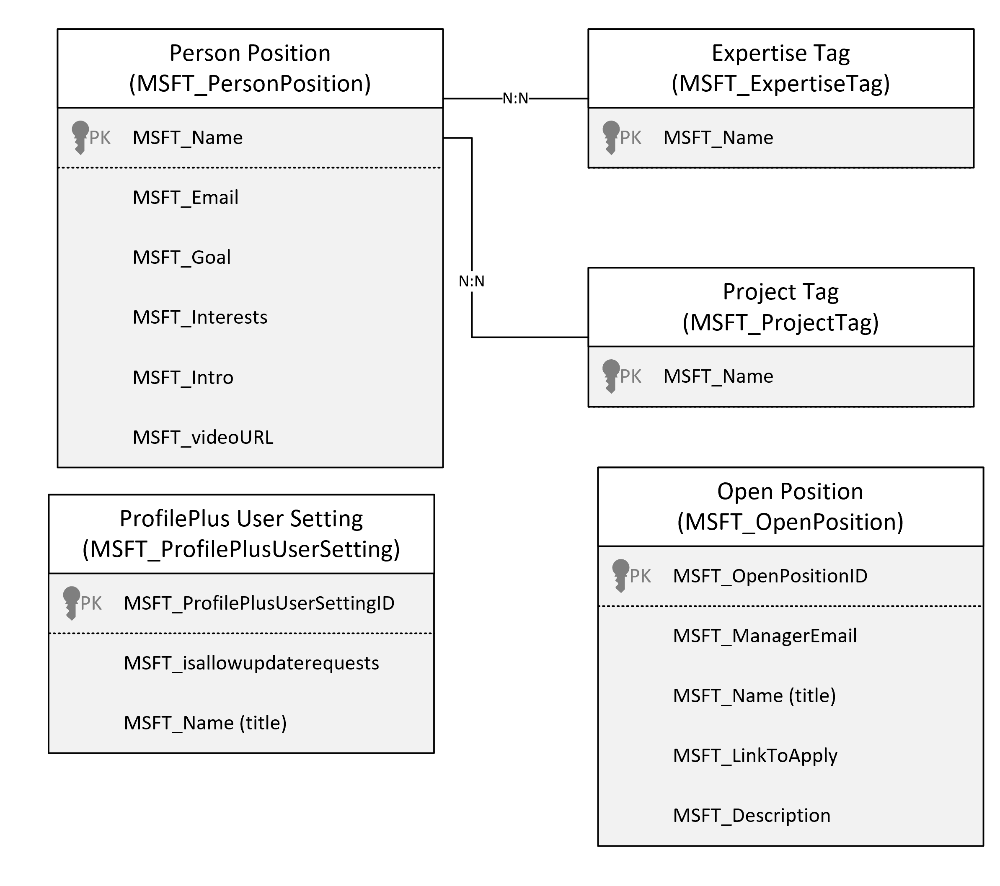
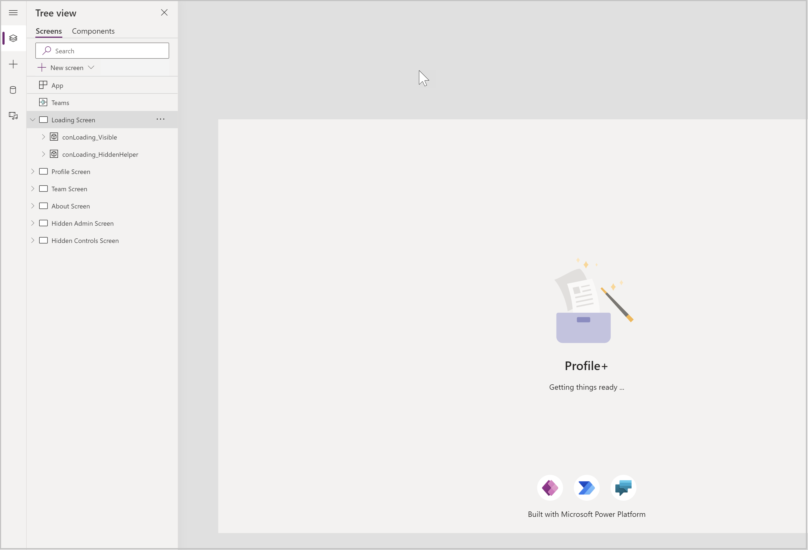
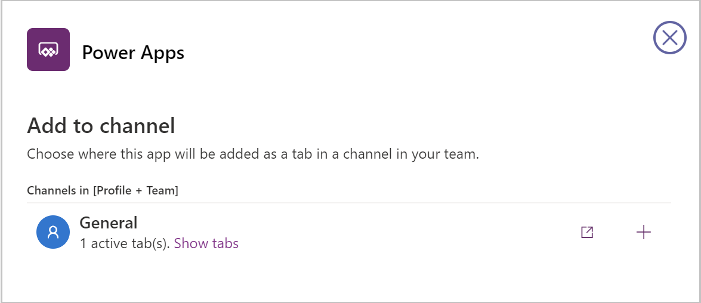
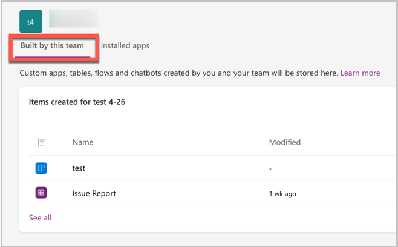
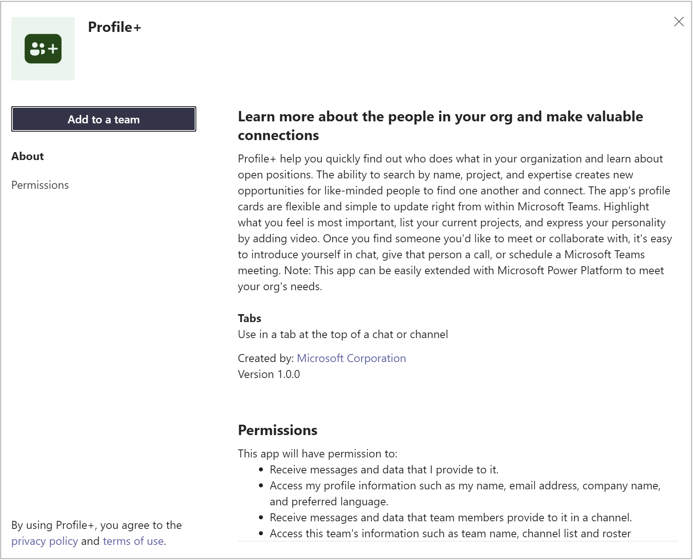
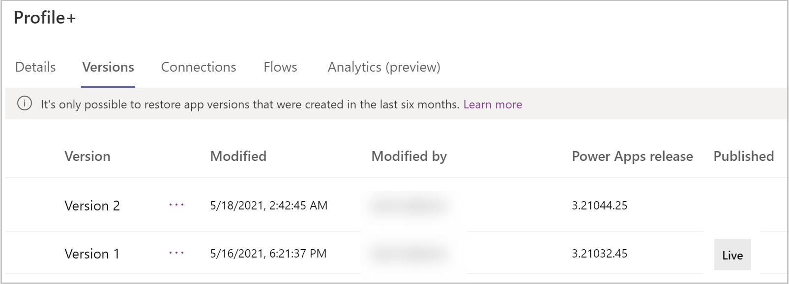

# Customize the Profile+ sample app (Preview)

[This article is pre-release documentation and is subject to change.]

The Profile+ Power App template for Microsoft Teams is designed to be a complete app experience but allow makers to easily extend it for their own purposes. In this article, we'll go over how to customize the Profile+ app in Power Apps in Microsoft Teams.

Before you can customize the app, you must install it. You can get the app at <https://aka.ms/TeamsProfilePlus>.

Once the app is installed, you can then customize the app using the following steps:

> [!IMPORTANT]
> - This is a preview feature.
> - [!INCLUDE[cc_preview_features_definition](../includes/cc-preview-features-definition.md)]

## Open the app in Microsoft Teams

1. In Microsoft Teams, select the **…** button from the left menu.

1. Enter **Power Apps** in the search field.

    

1. Select the Power Apps app from the list to open the app. Power Apps will open in Microsoft Teams.

   

1. Right-click on the **Power Apps** logo and select **Pin** to lock the app to the side menu so it's easy to get to in the future.

1. We recommended that you “pop out” Power Apps. Popping out ensures that when you need to navigate somewhere else in Microsoft Teams, you won’t lose your app configuration. To pop out the Power Apps app, right-click on the Power Apps logo, and select **Pop out app**.

1. Now that you've loaded the Power Apps app, select **Build**. This screen will show all the teams that have Power Apps installed in them.

1. Select the team in which you installed the Profile+ app.

1. Select **Installed apps**. This will show all apps installed in the Team.

1. Select **See all** in the **Profile Plus** tile.

    

1. You'll now see all of the apps and tables.

    

## Extend the Profile+ data model

If you're modifying or adding any fields to your app, you'll want to first update or add these columns in their Dataverse tables.

In this section, we'll explore the data model for Profile+, and how to modify it using Power Apps in Microsoft Teams. Below is the data model for Profile+.

Before modifying the fields, you need to first decide where the fields you want to add should go. What are the users doing when they should see or interact with these fields?

- **Person Position**
    Person Position is the core table for Profile+. This table stores the metadata about the person’s goals, interests, and other details. Most of the details about a person such as contact information and job title come from Microsoft 365. Person Position is only populated when a user updates their profile.

- **Open Position**
   When a manager defines an open position to promote to their organization, this data is stored in the Open Position table.

- **Expertise and Project Tags**
    Expertise Tag and Project Tag tables used to associate multiple **tags** for expertise and project to Person Positions. Tag records have a Many-to-Many (N:N) relationship with Person Position, enabling multiple tags per person

- **Profile Plus User Setting**
    User settings are used to store user preferences related to seeing the Power Apps splash screen every time they log in to the app. There's one record for each user.

## Profile+ Screens

From the list of apps, chatbots, flows, and tables, select the Profile+ app.

Now that Profile+ is open in Power Apps in Microsoft Teams, select the **Tree View**.

From the Tree View, you can see the screens included in the app. Selecting the arrow to the left of a screen will expand the contents of the screen, giving you access to the components of the screen&mdash;including galleries, buttons, text labels, and text input controls.

The Profile+ app consists of the following screens.

| **Screen**             | **Description**                                                                                                                                                                      |
|------------------------|--------------------------------------------------------------------------------------------------------------------------------------------------------------------------------------|
| Landing Screen         | This screen displays an image the app title as the app is loading.                                                                                                               |
| Hidden Admin Screen    | This screen is a helper screen for admins to try to understand the way that theming works in the app and support for dark mode and high contrast. This screen isn't visible to app users. |
| Profile Screen         | Screen displays the profile of the user and their hierarchy.                                                                                                                         |
| Team Screen            | Screen displays the people in the Team. This screen is displayed when the app is opened in a team.                                                                            |
| About Screen           | Screen displays video, more apps, and learning links.                                                                                                                          |
| Hidden Controls Screen | Hidden screen that makers can use to experiment with sizing and theming formula.                                                                                                     |

## Common customization scenarios

In this section we'll discuss common customization/extension scenarios for Profile+ sample app, and where would you make these changes.

### Connect to other systems

If you've data about your employees in another system, you can extend Profile+ to incorporate that data source into the Profile+ app.

### Notify about new positions

If you're looking for a new role, you may want to be notified when a new open position is created. This notification can be achieved using the following steps:

1. Create a Power Automate flow triggered when a row is added to the Open Position table.
1. Add an action to send an email to your inbox with the details of the Open Position.

### Ask people in your organization to complete their profile information

Profile+ is most useful when users complete their profile information. To encourage your colleagues to complete their profile, you could send those colleagues emails who haven't completed their profile an email, using the following steps:

1. Create a list of people in your department in SharePoint.
1. In Power Automate flow, get the list of people from SharePoint.
1. For each person on the list, list records in the Person Profile table, filtering on the email field.
1. If the number of results returned in 0 (using the **length** formula), send an email to the employee asking them to complete their profile.

## Publish changes

When you're done making modifications to the apps, select **Save** to save your changes.

- To preview your changes, select the **Preview** button, or press F5 on the keyboard.
    - The app will launch in preview mode, where you can test the user experience when running the app.
    - To exit preview mode, press **Escape** on your keyboard, or select the **X** in the upper right corner.
- To publish your app changes, select the **Publish to Teams** button.
- Publishing the app makes your changes visible to users of the app.
- A dialog will open confirming that you want to publish.
- To change app settings, such as icon and background color, select **Edit details**.
- To publish the app, select **Next**.
- On the next screen, confirm the channel you want the app to appear. You can add to other channels in the Team by selecting the **+** button.  

    

- To complete publishing your changes, select **Save and close**.

## Customization considerations

Before modifying the Profile+ app, consider the following items:

- Where are my table customizations?  
    Added columns and tables go to **Built by this team** section in Power Apps. You can also add new tables in the **See all** area.  

    

- Changes made to an app will be added as a new version of the app. If you get a new version from store, your customizations won't be overridden. You'll get a new version that has the latest features, but the new version won't be published.  

    

- After upgrading the solution, your current app version will still be **live**.   The updated version of the app is available from the version history of the app. Selecting **Details** from the app list will display the versions of
the app and allow you to publish the new version.  

    

- When customizing the app, pop out the Power Apps app in Teams so you don’t lose your changes when you navigate to other parts of Microsoft Teams.
- The app theming has been developed to support dark and high contrast mode in Microsoft Teams. Changing the fill color of screens may break dark and high contrast modes.

### See also

- [Profile+ (Preview) sample app](profile-app.md)
- [Customize sample apps](customize-sample-apps.md)
- [Sample apps FAQs](sample-apps-faqs.md)
- [Use sample apps from the Microsoft Teams store](use-sample-apps-from-teams-store.md)
