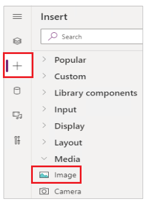
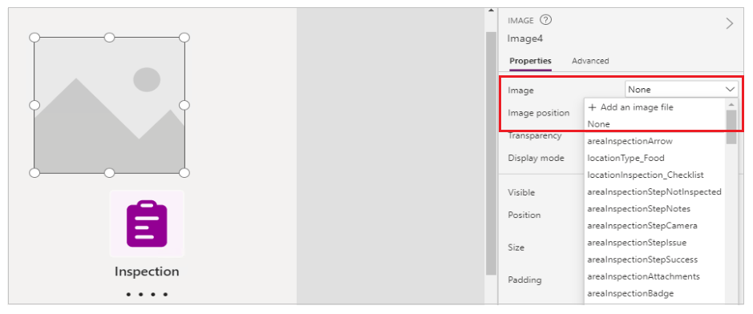
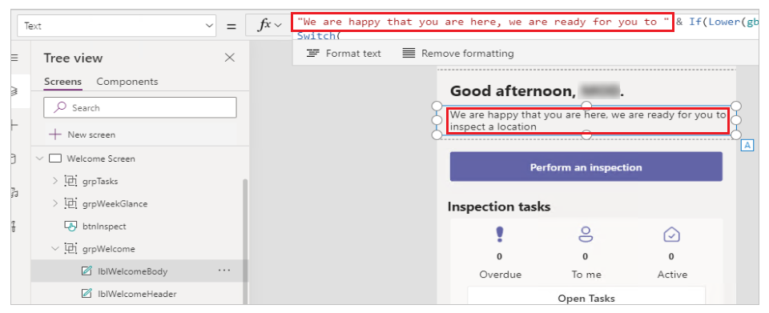
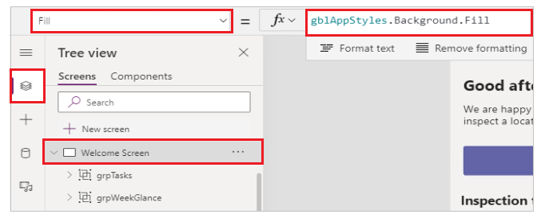
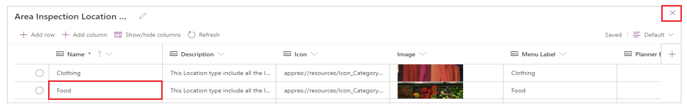
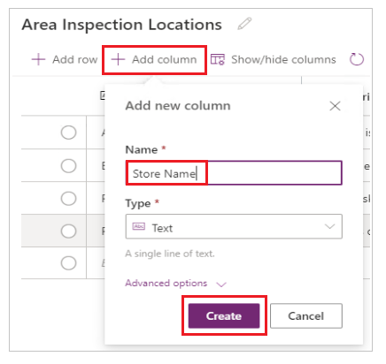
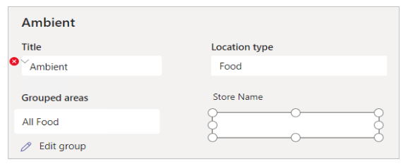
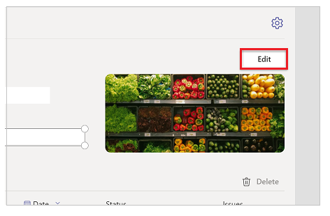

# Customize sample apps installed from Teams store

In this article, you'll learn about customizing sample apps installed from the Teams store. For example, you may need to change the company logo, update the data inside the sample apps to fit your business requirement, add or remove controls on the screens to extend the app.

## Prerequisites

Before using this app:

1. Find the app in the Microsoft Teams store.
1. Install the app.
1. Set up the app for the first use.

For details about the above steps, go to [Use sample apps from the Teams store](use-sample-apps-from-teams-store.md).

> [!NOTE]
> - Sections of this article uses one of the available sample apps from the Teams store as an example. The tables, controls, screens and other components of the apps may vary depending on the app you installed. Use discretion when customizing the app that you select.
> - Read [Sample app updates](use-sample-apps-from-teams-store.md#sample-app-updates) before you customize sample apps to understand the impact of new releases to the sample app versions.

## Open the sample app in Power Apps Studio

To start with customizing the sample apps, the first step is to open the app inside Power Apps Studio.

1. Sign in to Teams.

1. Select  (*More added apps*).

1. Select Power Apps.

    

1. Select [Build](overview-of-the-power-apps-app.md#build-hub) tab.

1. Select the team environment where you installed the sample app.

1. Select **Installed apps**.

1. Select the sample app that you installed.

1. If prompted, select the location.

More information: [Edit an app in Power Apps Studio](manage-your-apps.md#edit-an-app)

## Remove sample data

When you install sample apps, the tables are pre-populated with sample data. The following table lists the sample apps and the list of tables with the sample data to be removed:

| Sample app | Tables |
| - | - |
| [Bulletins](bulletins.md) | Bulletins <br> Bulletin Bookmarks <br> Bulletin Categories <br> Bulletin Contacts <br> Bulletin FAQs <br> Bulletin FAQ Categories <br> Bulletin Links <br> Bulletin Link Categories <br> Bulletin Read Receipts
| [Employee ideas](employee-ideas.md) | Employee Ideas <br> Employee Idea Campaigns <br> Employee Idea Files <br> Employee Idea Questions <br> Employee Idea Responses |
| [Inspection](inspection.md) |     Area Inspection Steps <br> Area Inspections <br> Area Inspection Checklist Steps <br> Area Inspection Checklists <br> Area Inspection Locations <br> Area Inspection Location Types <br> Area Inspection Groups <br> Area Inspection Task|
| [Issue reporting](issue-reporting.md) | Issue Reports <br> Issue Report Questions <br> Issue Report Templates <br> Issue Report Categories |
| [Milestones](milestones.md) | Projects <br> Project Activities <br> Project Milestones <br> Project Team Members <br> Project User Settings <br> Project Work items <br> Project Work Item Categories <br> Project Work Item Priorities <br> Project Work Item Statuses

To remove data from the sample apps:

1. Open the sample app (for example, **Manage inspections**) in [Power Apps Studio](#open-the-sample-app-in-power-apps-studio).

1. Select **Data** from the left pane.

1. Select  next to the table name (for example, *Area Inspection Task* for **Manage inspections** app).

1. Select **Edit data**.

1. Delete all rows containing sample data.

    

1. Close the visual editor.

1. Repeat the previous steps for the remaining tables.

## Add your logo to the loading screen

1. Open the sample app (for example, **Inspection**) in [Power Apps Studio](#open-the-sample-app-in-power-apps-studio).

1. Select [Tree view](understand-power-apps-studio.md#tree-view) from the left pane.

1. If not already selected, select **Landing Screen**.

1. Select **Insert**.

1. Select **Image** control in *Media*.

    

1. From the properties pane on the right side, select the **Image** drop-down, and then select **+ Add an image file**.

    

1. Select image for your company logo, and then select **Open**.

1. Position and size image control to the position you want on loading screen.

    

## Change the welcome screen text

> [!NOTE]
> The Inspection app welcome screen greeting text uses a formula containing global
variables to correctly display the desired terminology for inspections and items being inspected. Use caution when changing this formula.

1. Open the sample app (for example, **Inspection**) in [Power Apps Studio](#open-the-sample-app-in-power-apps-studio).

1. Select the text label control with the greeting text **Glad to have you here**.

    The formula for the greeting text is in this format:

    ```powerapps-dot
    "Glad to have you here, we are ready for you to " & If(Lower(gblWorkType)="inspection", "inspect", Lower(gblWorkType)) & Switch(
    Left(
        Lower(areaLabel),
        1
    ),
    "a",
    " an ",
    "e",
    " an ",
    "i",
    " an ",
    "o",
    " an ",
    "u",
    " an ",
    " a "
    ) & Lower(areaLabel)
    ```

1. Select the formula bar.

1. Select the phrase **Glad to have you here**.

1. Update the greeting text, such as **We are happy that you are here**.

    ```powerapps-dot
    "We are happy that you are here, we are ready for you to " & If(Lower(gblWorkType)="inspection", "inspect", Lower(gblWorkType)) & Switch(
    Left(
        Lower(areaLabel),
        1
    ),
    "a",
    " an ",
    "e",
    " an ",
    "i",
    " an ",
    "o",
    " an ",
    "u",
    " an ",
    " a "
    ) & Lower(areaLabel)
    ```

    

## Change the screen background color

> [!NOTE]
> The Inspection app leverages global theme variables to ensure consistent
user experience. If you modify a screen fill, the modified screen will no longer use the standard app theme.

1. Open the sample app (for example, **Inspection**) in [Power Apps Studio](#open-the-sample-app-in-power-apps-studio).

1. Select [Tree view](understand-power-apps-studio.md#tree-view) from the left pane.

1. Select **Welcome Screen** from Tree view.

1. Select [Fill](../maker/canvas-apps/controls/properties-color-border.md#normal) from the property list on the top-left.

1. In formula bar, replace the formula with the color that you want.

    Screen background fill color will be set to the selected background color.

    

## Bulk edit data

If you want to quickly edit the data in the app, you can open the table and modify or delete data.

> [!CAUTION]
> Sample apps uses several related tables, such as Area Inspection Locations and Area Inspection Location Types for Inspection app. Use caution when deleting records from the tables without checking data relationship and dependencies.

1. Open the sample app (for example, **Inspection**) in [Power Apps Studio](#open-the-sample-app-in-power-apps-studio).

1. Select **Data** from the left pane.

1. Select  next to the table name (for example, *Area Inspection Location Types* for Inspection app).

1. Select the cell inside the Visual Editor, for example **Food** in the **Name** column.

1. Replace the text with the value you want.

1. Close the visual editor.

    Data in the app should reflect the updated value, such as the location name in this example.

    

## Add a column to the app

> [!IMPORTANT]
> The Inspection app customization steps in this section covers some of the advanced configuration options. This example requires that you have familiarity with the [Power Apps Studio](understand-power-apps-studio.md), are comfortable with modifying [formulas](../maker/canvas-apps/formula-reference.md), and work with controls such as [containers](../maker/canvas-apps/controls/control-container.md).

Consider a scenario where you have multiple stores, and you want to associate locations and inspections with specific stores.

### Add Store Name text column to the Location table

1. Open the **Manage inspections** app in [Power Apps Studio](#open-the-sample-app-in-power-apps-studio).

1. Select **Data** from the left pane.

1. Select  next to the table name (for example, *Area Inspection Locations* for **Manage inspections** app).

1. Select **Add column**.

1. Enter **Name** as "Store Name".

1. Select **Create**.

1. Close the visual editor.

    

### Add Store Name column to the location form

1. Select the **Locations Screen**.

    > [!TIP]
    > You can ignore the error about the use of the preview connectors in this app.

1. In [Tree view](understand-power-apps-studio.md#tree-view), search for `btnArea_GroupedAreas`.

1. In the **Grouped Areas** on the form, drag the left edge to be parallel with the edge of the **Title** field.

    > [!NOTE]
    > The Grouped Areas field control is in a container. Hence, the
    selected area may appear in a different part of the screen than where you
    see the column. Dragging the selected area resizes the column.

1. Select **Insert** from the left pane.

1. Select **Label** control.

1. Position the **Label** so that it's aligned horizontally with **Grouped areas**, and vertically with the **Area type**.

    

1. Select **Text** from the property list on the top-left.

1. Select the formula bar.

1. Change the formula to **Store Name**.

1. Select **Insert** from the left pane.

1. Select **Text box** control.

1. Drag the text box control to be aligned horizontally with **Grouped area** and vertically with **Area type**.

1. Select **Value** from the property list on the top-left.

1. In the formula bar, replace the current value with `gblLocation.'Store Name'`

1. Select **ColorBackground** from the property list on the top-left.

1. In the formula bar, enter "White".

    

1. Select **Display mode** from the property list on the top-left.

1. In the formula bar, enter "Edit" if not already present.

1. Hold the **ALT key** on your keyboard, and select the **Edit**.

    

1. Select **Tree view** from the left pane.

1. Search for `btnAreaDetails_Save` and select the returned control.

1. Expand the formula bar.

1. At the end of the 17th line, add a comma and this formula:

    ```powerapps-dot
    'Store Name':Microsoft_CoreControls_TextBox1.Value
    ```

    This section of the formula should now look like the following:

    ```powerapps-dot
    {
    	msft_name: txtArea_EditTitle.Text,
    	'Location Type': cmbAreaDetails_AreaType.Selected,
    	'Primary Image': picArea_UploadedImage.Image, 'Store Name':Microsoft_CoreControls_TextBox1.Value
    }
    ```

    > [!NOTE]
    > If the updated formula shows error, verify the text box name for the store name. For example, it may be `Microsoft_CoreControls_TextBox2` instead of `Microsoft_CoreControls_TextBox1`, depending on your changes.

1. Select the label control added in step 5.

1. Select the **Y** property from the property list on the top-left.

1. Select the formula bar.

1. Change the formula to: 

    ```powerapps-dot
    If(gblEditLocation,250,200)
    ```    

1. Select text box added in step 11.

1. Select the **Y** property from the property list on the top-left.

1. Select the formula bar.

1. Change the formula to: 

    ```powerapps-dot
    If(gblEditLocation,282,232)
    ```    

1. Hold the **CTRL key** on your keyboard, and select both the store name label and the text box.

1. Select Visible property from the property list on the top-left.

1. Select the formula bar.

1. Change the formula to: 

    ```powerapps-dot
    If(gblViewInspection, false, true)
    ```

    

## Publish app updates to Teams

To save and publish the changes to the sample app:

1. Select **Save** from the top-right.

1. Select **Publish to Teams**

1. Select **Next**.

1. To publish updated version of an app to an existing active tab, select **Save + close**. <br> 
To add published version of an app to a new tab in a different channel, Select  (Add a tab) for the channel you want, and then select **Save + close**.

More information: [Publish and add an app to Teams](publish-and-share-apps.md)

### See also

- [Sample apps FAQs](sample-apps-faqs.md)
- [Boards (preview) sample app](boards.md)
- [Bulletins sample app](bulletins.md)
- [Employee ideas sample app](employee-ideas.md)  
- [Inspection sample apps](inspection.md)  
- [Issue reporting sample apps](issue-reporting.md)
- [Milestones sample app](milestones.md)
- [Perspectives (preview) sample app](perspectives.md)
- [Profile+ (preview) sample app](profile-app.md)
- [Use sample apps from the Microsoft Teams store](use-sample-apps-from-teams-store.md)


[!INCLUDE[footer-include](../includes/footer-banner.md)]