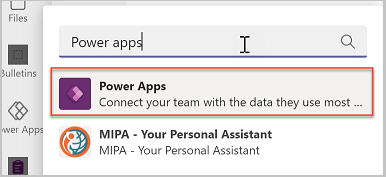
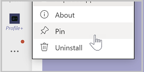
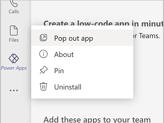
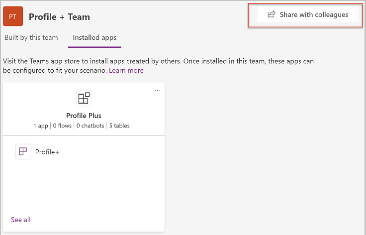
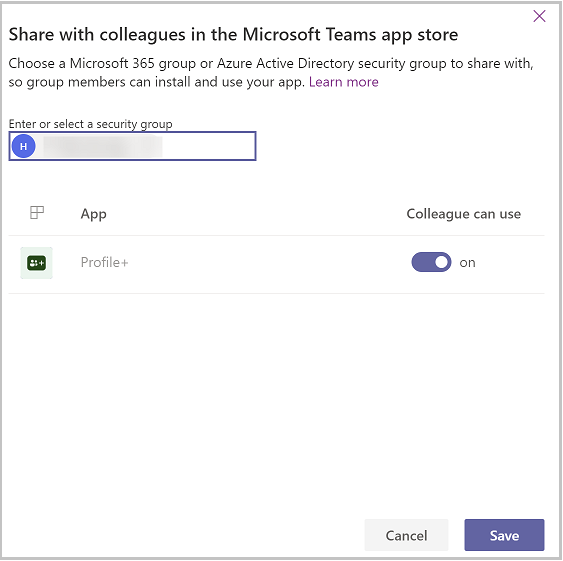
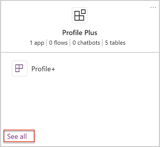
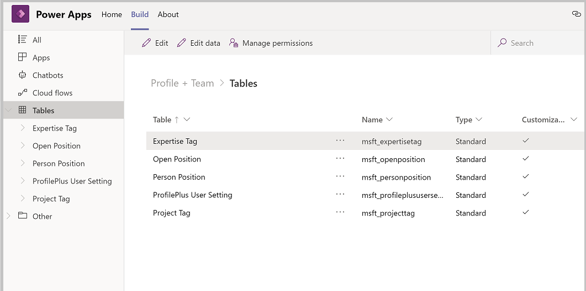
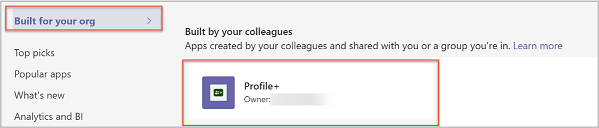
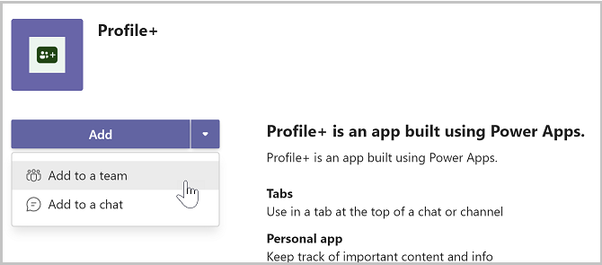

# How to deploy Profile+ app as broad distribution app (Preview)

[This article is pre-release documentation and is subject to change.]

The Profile+ sample app is designed to give you a single place to see complete information about the people in your organization, your organization hierarchy, and open positions for which you may want to apply.

The app addresses the following personas:

- **Manager**: Provide details about their department, including open positions that need to be filled.
    
- **User**: View organization hierarchy, and biographical information about the people in their organization. Also, find open positions that they may want to apply for.

Profile+ app is installed in a Microsoft Teams team, but it’s designed to be used primarily by the people outside of the team. Since there's no app administration required, only those users who develop or customize the app need to be members of the team. Everybody else can use the app outside of the team.

In this article, you'll learn how to allow everyone in your organization to view profiles in Profile+ app. Also, update their biographical information, and publish open positions for people outside of the Teams team. And then, share the Profile+ app with them.

> [!IMPORTANT]
> - This is a preview feature.
> - [!INCLUDE[cc_preview_features_definition](../includes/cc-preview-features-definition.md)]

## Prerequisites

You must be an owner of the Teams team in which the app is installed to share the app.

## Share an app with colleagues for broad distribution

1. Share the app with colleagues.

1. Grant security permissions to the tables used in the app.

> [!NOTE]
> Apps are installed in a team in Microsoft Teams. People who develop and extend the app or managers who manage the app settings should use the app in a team. For people who use the app or users who are not managers, sharing the app with colleagues outside of the team will enable them to use the app without having to be a member of the team.

## Sharing app with colleagues

This process begins by opening the app in the **Power Apps**. You may have Power Apps pinned to your Teams pane.

1. In Microsoft Teams, select the **…** button from the left menu.

1. Type **Power Apps** in the search field.

    

1. Select the app from the list to open the app. Power Apps will open in teams.

1. Right-click on the **Power Apps** logo, and select **Pin** to lock the app to the side menu so it's easy to get to frequently.

    

1. We recommended that you “pop out” Power Apps so that if you need to go somewhere else in Microsoft Teams, you won’t lose your app configuration. To pop out the Power Apps app, right-click on the Power Apps logo, and then select **Pop out app**.

    

1. Now that you've loaded the Power Apps app, select **Build**.

1. This screen will show all the teams that have Power Apps installed in them. Select the team that contain the app you want to share. And then, select **Share with colleagues**.

    

1. Enter the Azure AD security group, or a different team with which you would like to share access to the app.

1. Set the **On/Off** toggle to **On** for Profile+ app.

    

1. Select **Save**.

## Grant permissions to the tables

Understanding and assigning permissions to the tables is vital to ensure a proper security of your shared data. Here are the four permissions available for use.

- **Full Access** – Allows end users to see and edit all records in the table.
- **Collaborate** – Allows end users to see all records, but they can only edit their own records.
- **Reference** – Provides a read-only view of data for end users.
- **Private** – Allows end users to only view and edit their own data.

### Configure table permissions

By default, all of the table permissions for colleagues not in the Team are set to **None.** If you leave it that way, colleagues that you share the app with can't use the app, as they won’t have permission to the tables in the app. Follow these steps to set permissions for the tables in the app for colleagues outside of the team:

1. In Microsoft Teams, open the **Power Apps**.

1. Select the **Build** tab.

1. Select the team that contain the app you want to share.

1. Select **Installed apps.** This option will show all apps installed in the team.

1. Select **See all** in the **Profile Plus** tile.

    

1. Select **Tables** from the solution components bar.

    

1. Select the tables listed individually, and then select **Manage Permissions**.

1. Select the security group with which the app was shared. The initial permission will show none. Select the permission you want, and then select **Save**.

1. Repeat the previous steps for each other table in the app.

The following table lists recommended table permissions:

| Table                    | Permission                                                   |
| ------------------------ | ------------------------------------------------------------ |
| Expertise Tag            | Since colleagues outside of the team should be able to create new expertise tags, give them **Collaborate** permissions on the **Expertise Tag** table. |
| Open Position            | Since colleagues outside of the team should be able to read all open positions, create and edit open positions that they own, give them **Collaborate** permission on the **Open Position** table. |
| Person Position          | **Person Position** is the primary table for Profile+ app. Since colleagues outside of the team will need to read other people’s profiles, and editing their own, give them **Collaborate** permission on the **Person Position** table. |
| ProfilePlus User Setting | Colleagues outside of the team should be able to create, read, and edit their own user setting record, but not see or edit other users’ setting record. Give the **Private** permission on the **Profile+ User Setting** table. |
| Project Tag              | Since colleagues outside of the team should be able to create new project tags and read all project tags, give them **Collaborate** permission on the **Project Tab** table. |

### Rename the app

In a large organization, you might have multiple people sharing the same template app with colleagues. If multiple departments are using Profile+ app, you can make it easier for your colleagues to find the app by renaming it.

1. Open **Profile+** app in Microsoft Teams.

1. In the upper right corner, select the app name.

1. Enter a new name for the app. For example, "Contoso Org Chart".

1. Save and publish the app.

## Accessing shared apps

The colleagues that the Profile+ app is shared with, can acquire the app using the following steps.

1. In Microsoft Teams, select the ellipses (**…**) button on left pane.

1. Select **More apps**.

1. Select **Built for your org**.

    

1. When the app information screen appears, select **Add** to add the app to the main teams app menu.

1. After adding the app to the Teams app menu, select the icon for the app to open it full screen in Teams.

1. If you want to make the app always appear in the app menu so you can easily find it, right-click on the Profile+ app button on the app menu, and then select **Pin**.

    

1. If you prefer to add the app to another team, select the drop-down next to the **Add** button, and then select **Add to a team**.

    

## Limitations

Currently, Teams apps can only be shared with a single Azure Active Directory group.

### See also

- [Profile+ (Preview) sample app](profile-app.md)
- [Customize sample apps](customize-sample-apps.md)
- [Sample apps FAQs](sample-apps-faqs.md)
- [Use sample apps from the Microsoft Teams store](use-sample-apps-from-teams-store.md)
