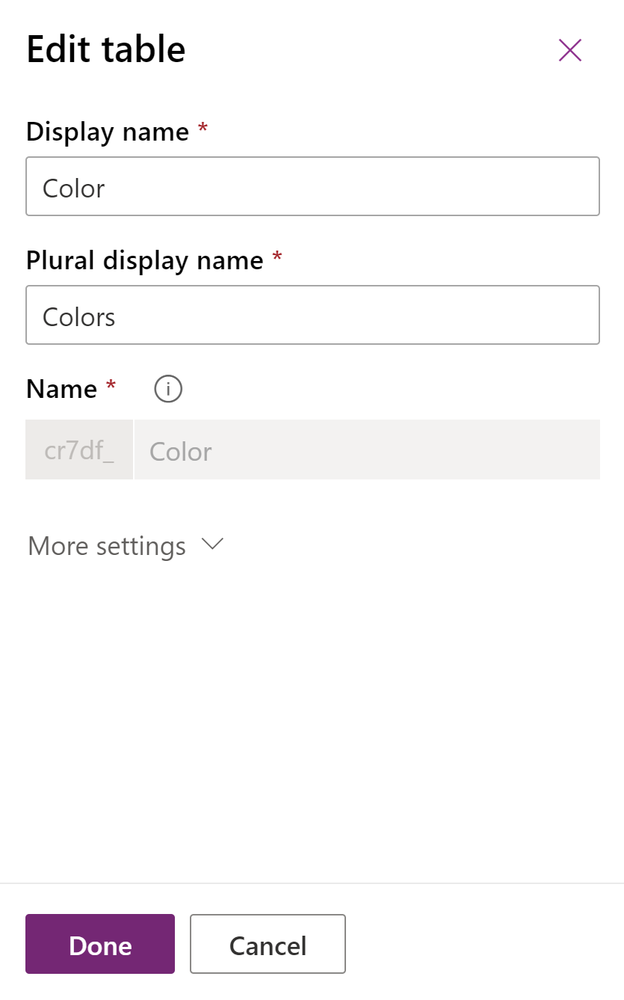
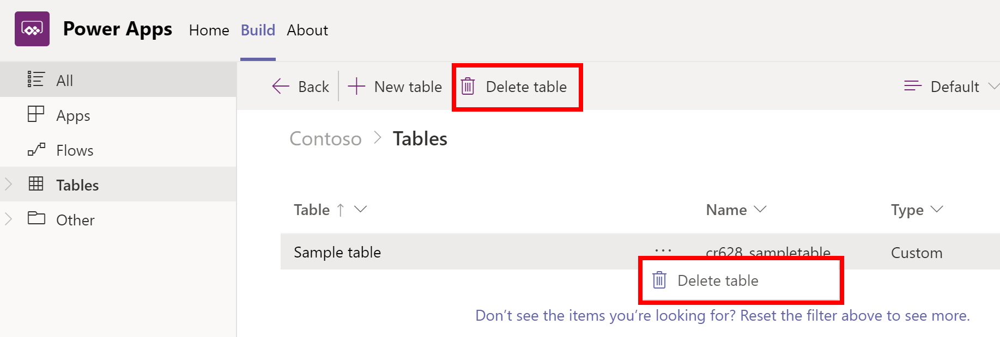

# Edit or delete a table

With Dataverse for Teams, you can perform the following types of operations on a table:

- Create table columns.
- Delete a table.
- Create, edit, and delete table relationships. More information: [Work with table relationships](relationships-table.md)

## Edit table properties

In Microsoft Teams, you can edit four table properties:

- **Display name**: The name you want to display for the table.
- **Plural display name**: The plural of the table name, when needed for display.
- **Description**: A brief description of the purpose of the table.
- **Quick create settings**: This enables quick creation of records for client apps that support this feature.

> [!NOTE]
> - You can also edit a table using the visual editor. More information: [Create your first table](create-first-app.md#create-your-first-table)
> - Each Dataverse for Teams environment is assigned a prefix when it's created, such as **cr1a3**. The name for every table and column you create will be prefixed with this value. This value can't be changed.

1. On the left pane, select **Tables**.
2. Select the table you want and then select **Settings** on the command bar to display the **Edit table** dialog box.  
   
    
    For more information about these settings, see [Create a table](../maker/data-platform/data-platform-create-entity.md#create-a-table).
4. Make the changes you want, and then select **Done**.

## Edit table columns

You can edit table columns using the visual editor. 

1. On the left pane, select **Tables**.
2. Select the table you want, select **Edit data** on the command bar to display the visual editor.

   :::image type="content" source="media/edit-table2.png" alt-text="Quick edit visual editor.":::

More information: [Create your first table](create-first-app.md#create-your-first-table)

## Delete a table

Anyone who's a member of the team can delete tables that aren't part of a managed solution.

In the **Tables** list, select **…** next to the table you want to delete, and then select **Delete table**. Alternatively, while viewing a table, select **Delete table** on the command bar.
<!-- >> [!div class="mx-imgBorder"] 
>   -->

### See also

[Work with table relationships](relationships-table.md)

[!INCLUDE[footer-include](../includes/footer-banner.md)]