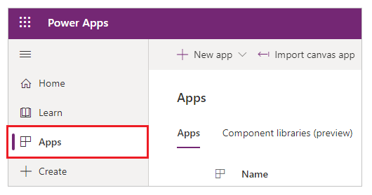
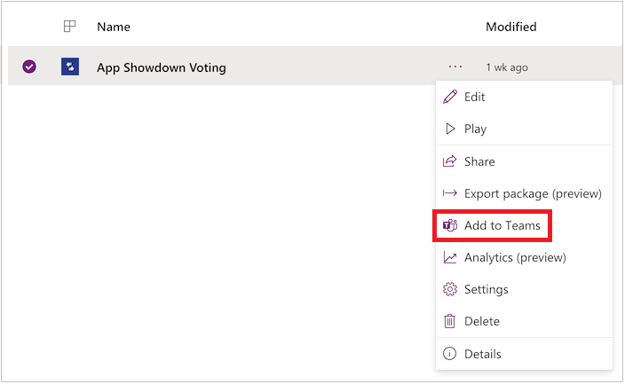
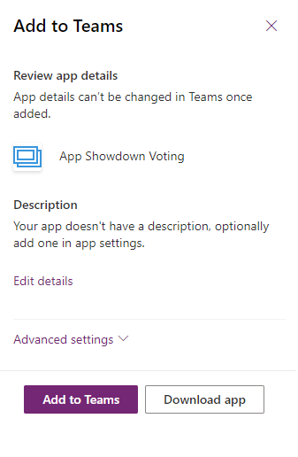
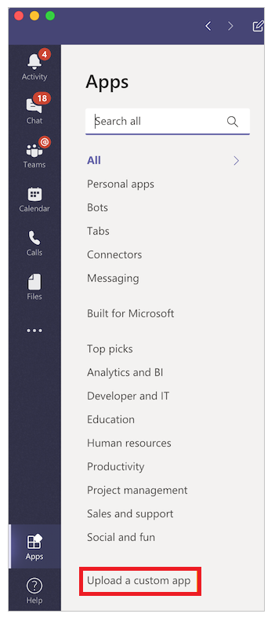

# Embed a model driven app as personal app in Teams

You can share an app you've created by embedding it directly into Microsoft Teams. When completed, users can select **+** to add your app to any of **your** team channels or conversations in the team you are in. The app appears as a tile under **Tabs for your team**.

> [!NOTE]
> Team custom app policies must be set to allow uploading custom apps. If you are unable to embed your app in Teams, check with your administrator to see if they've setup [custom app settings](/MicrosoftTeams/teams-custom-app-policies-and-settings#custom-app-policy-and-settings).

## Prerequisites

- You need a valid [Power Apps license](/power-platform/admin/pricing-billing-skus).
- To embed an app into Teams, you need an existing app [created using Power Apps](../maker/model-driven-apps/build-first-model-driven-app.md).

## Add the app as a personal app

1. Sign in to [Power Apps](https://make.powerapps.com), and then select **Apps** in the menu.

    

1. Select **More actions** (...) for the app you want to share in Teams, and then select **Add to Teams**.

    

    **Add to Teams** panel opens on the right-side of the screen.

    

1. (Optional) If the app doesn't have any description, select **Edit details** to open the app in Power Apps Studio to add.

1. (Optional) Select **Advanced settings** to add additional details such as *Name*, *Website*, *Terms of Use*, *Privacy Policy*, *MPN ID* (Microsoft Partner Network ID).

    

1. Select **Add to Teams** to add the app as a personal app or select **Add to a team** or **Add to a chat** to add the app as a tab within an existing channel or conversation.

## Download app

1. You can also **Download app** in Power Apps. Power Apps will then generate your Teams manifest file using the app description and logo you've already set in your app. To add the app as a personal app or as a tab to any channel or conversation, select **Apps** in the left navigation and then select **Upload a custom app**.

    > [!NOTE]
    > The **Upload a custom app** only appears if your Teams administrator has created a [custom app policy](/microsoftteams/teams-app-setup-policies) and turned on **Allow uploading of custom apps**.

    

2. Select **Add** to add the app as a personal app or select **Add to team** to add the app as a tab within an existing channel or conversation.

## Publish the app to the Teams catalog

If you're an admin, you can use the **Download app** option to also [publish the app](/microsoftteams/tenant-apps-catalog-teams) to the Microsoft Teams catalog.

# Known Issues
1. Running **Model-driven apps** on the Microsoft Teams mobile app is currently not supported. 
2. Embedded Canvas apps are not supported.
3. Custom pages are not supported. 

### See also

[Welcome to Microsoft Teams](/MicrosoftTeams/teams-overview)

[!INCLUDE[footer-include](../includes/footer-banner.md)]
