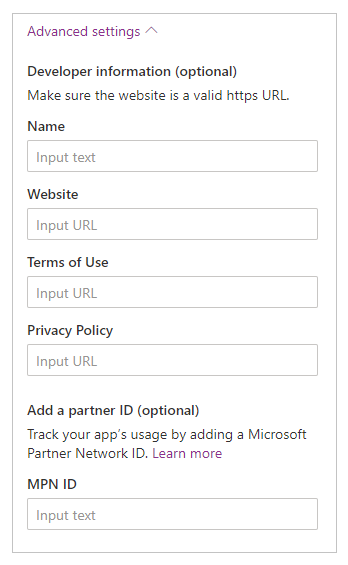

# Embed a canvas app as personal app in Teams

You can share an app you've created by embedding it directly into Microsoft Teams. When completed, users can select **+** to add your app to any of **your** team channels or conversations in the team you are in. The app appears as a tile under **Tabs for your team**.

> [!NOTE]
> Team custom app policies must be set to allow uploading custom apps. If you are unable to embed your app in Teams, check with your administrator to see if they've setup [custom app settings](/MicrosoftTeams/teams-custom-app-policies-and-settings#custom-app-policy-and-settings).

## Prerequisites

- You need a valid [Power Apps license](/power-platform/admin/pricing-billing-skus).
- To embed an app into Teams, you need an existing app [created using Power Apps](../maker/canvas-apps/data-platform-create-app.md).

## Add to Teams

1. Sign in to [Power Apps](https://make.powerapps.com), and then select **Apps**.

1. Select **More actions** (...) for the app you want to share in Teams, and then select **Add to Teams**.

    :::image type="content" source="media/embed-teams-app/add-to-teams-option.png" alt-text="Add to Teams.":::

    **Add to Teams** panel opens on the right-side of the screen.

    :::image type="content" source="media/embed-teams-app/add-to-teams-review.png" alt-text="Add to Teams - review options.":::

1. (Optional) If the app doesn't have any description, select **Edit details** to open the app in Power Apps Studio to add.

1. (Optional) Select **Advanced settings** to add additional details such as *Name*, *Website*, *Terms of Use*, *Privacy Policy*, *MPN ID* (Microsoft Partner Network ID).

    

1. Select **Add to Teams** and you'll be asked to open Teams.

    :::image type="content" source="media/embed-teams-app/add-to-teams-button.png" alt-text="Add to Teams button.":::

    > [!TIP]
    > If you want, you can also choose **Download app** to download the app, and then use the steps described in [Upload your app in Microsoft Teams](/microsoftteams/platform/concepts/deploy-and-publish/apps-upload) article to upload the app to Teams.

1. Select **Open Microsoft Teams** to open Teams app, or select **Cancel** followed by **Use the web app instead** to open Teams web.

1. Select **Add**. You can also choose to add the app to a specific team using **Add to team**, or a specific chat using **Add to chat**.

    :::image type="content" source="media/embed-teams-app/add-to-teams-in-teams.png" alt-text="Add app to Teams, a team, or a chat.":::

    The app is now added to Teams.

    > [!TIP]
    > You can also [pin the app](install-personal-app.md#pin-power-apps-to-teams) for easy access.

## Add to Teams using the web player

You can also add canvas apps to Teams using the web player.

1. Go to [Power Apps](https://make.powerapps.com) > **Apps** > select the app to launch in a new browser tab.

1. [Edit the app](../maker/canvas-apps/edit-app.md) > select  or press **F5** to play the app.

1. After the app is open using the web player, choose the **Add to Teams** button from the top-right side of the screen.

    :::image type="content" source="media/embed-teams-app/add-to-teams-web-player.png" alt-text="Add app to Teams using web player.":::

1. When prompted, select **Cancel**.

1. Select **Launch it now** to open the Teams app. Alternatively, you can also choose **Use the web app instead** to open the app in Teams web.

> [!NOTE]
> - To add canvas apps to Teams using the web player:
>     - Your organization must have **Allow interaction with custom apps** turned on. More information: [Manage custom app policies and settings in Microsoft Teams](/microsoftteams/teams-custom-app-policies-and-settings)
>     - Your organization must allow **Shared Power Apps**. More information: [Manage Microsoft Power Platform apps in the Microsoft Teams admin center](/microsoftteams/manage-power-platform-apps)
> - You can only add apps to Teams that belong to the same tenant as your Teams account. Otherwise, you'll see an error "App was not found in tenant".

## Publish the app to the Teams catalog

If you're an admin, you can also [publish the app](/microsoftteams/tenant-apps-catalog-teams) to the Microsoft Teams catalog.

## Use context from Teams

To build deeply integrated apps with Teams, you can use Team's context variables with the `Param()` function. For example, use the following formula in screen's **Fill** property to change the background of app based on user's theme within Teams:

```
Switch(
        Param("theme"),
        "dark",
        RGBA(
            32,
            31,
            31,
            1
        ),
        "contrast",
        RGBA(
            0,
            0,
            0,
            1
        ),
        RGBA(
            243,
            242,
            241,
            1
        )
    )
```

To test the app, publish it and then play it within Teams.

The following context variables from Teams are supported:

- locale
- channelId
- channelType
- chatId
- groupId
- hostClientType
- subEntityId
- teamId
- teamType
- theme
- userTeamRole

> [!NOTE]
> This feature was added in March, 2020. If you embedded your app within Teams before this, you may need to re-add your app to Teams to use this functionality.

## Improve the performance of your app

You can optionally preload your app within Teams to increase performance. For mor information: [Enable Preload app for enhanced performance](../maker/canvas-apps/performance-tips.md#enable-preload-app-for-enhanced-performance). 

### See also

[Welcome to Microsoft Teams](/MicrosoftTeams/teams-overview)


[!INCLUDE[footer-include](../includes/footer-banner.md)]
