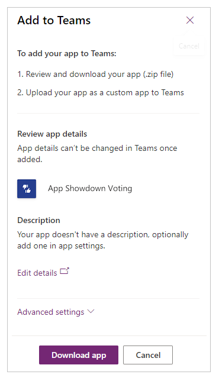
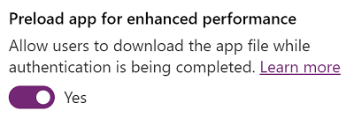

# Embed a canvas app as personal app in Teams

You can share an app you've created by embedding it directly into Microsoft Teams. When completed, users can select **+** to add your app to any of **your** team channels or conversations in the team you are in. The app appears as a tile under **Tabs for your team**.

> [!NOTE]
> Team custom app policies must be set to allow uploading custom apps. If you are unable to embed your app in Teams, check with your administrator to see if they've setup [custom app settings](/MicrosoftTeams/teams-custom-app-policies-and-settings#custom-app-policy-and-settings).

## Prerequisites

- You need a valid [Power Apps license](/power-platform/admin/pricing-billing-skus).
- To embed an app into Teams, you need an existing app [created using Power Apps](../maker/canvas-apps/data-platform-create-app.md).

## Download the app

1. Sign in to [Power Apps](https://make.powerapps.com), and then select **Apps** in the menu.

    

1. Select **More actions** (...) for the app you want to share in Teams, and then select **Add to Teams**.

    

    **Add to Teams** panel opens on the right-side of the screen.

    

1. (Optional) If the app doesn't have any description, select **Edit details** to open the app in Power Apps Studio to add.

1. (Optional) Select **Advanced settings** to add additional details such as *Name*, *Website*, *Terms of Use*, *Privacy Policy*, *MPN ID* (Microsoft Partner Network ID).

    

1. Select **Download app**. Power Apps will then generate your Teams manifest file using the app description and logo you've already set in your app.

1. Save the downloaded file.

## Add the app as a personal app

1. To add the app as a personal app or as a tab to any channel or conversation, select **Apps** in the left navigation and then select **Upload a custom app**.

    > [!NOTE]
    > The **Upload a custom app** only appears if your Teams administrator has created a [custom app policy](/microsoftteams/teams-app-setup-policies) and turned on **Allow uploading of custom apps**.

    

2. Select **Add** to add the app as a personal app or select **Add to team** to add the app as a tab within an existing channel or conversation.

## Publish the app to the Teams catalog

If you're an admin, you can also [publish the app](/microsoftteams/tenant-apps-catalog-teams) to the Microsoft Teams catalog.

## Use context from Teams

To build deeply integrated apps with Teams, you can use Team's context variables with the `Param()` function. For example, use the following formula in screen's **Fill** property to change the background of app based on user's theme within Teams:

```
Switch(
        Param("theme"),
        "dark",
        RGBA(
            32,
            31,
            31,
            1
        ),
        "contrast",
        RGBA(
            0,
            0,
            0,
            1
        ),
        RGBA(
            243,
            242,
            241,
            1
        )
    )
```

To test the app, publish it and then play it within Teams.

The following context variables from Teams are supported:

- locale
- channelId
- channelType
- chatId
- groupId
- hostClientType
- subEntityId
- teamId
- teamType
- theme
- userTeamRole

> [!NOTE]
> This feature was added in March, 2020. If you embedded your app within Teams before this, you may need to re-add your app to Teams to use this functionality.

## Improve the performance of your app

You can optionally preload your app within Teams to increase performance.

1. Sign in to [make.powerapps.com](https://make.powerapps.com), and then select **Apps** in the menu.

2. Select **More actions** (...) for the app you want to share in Teams, and then select **Settings**.

3. In the Settings panel, toggle **Preload app for enhanced performance** to **Yes**. App will then pre-load whenever embedded in Teams.

    

4. For the changes to take effect, remove and add your app into Teams again.

> [!NOTE]
> This allows users to download the compiled app while authentication is in progress for embedded scenarios. However, the users can run your app only after successful authentication. This ensures that your app data will not be available to unauthenticated users. Information in the compiled app includes: a collection of JavaScript files containing text authored in app controls, media assets (e.g. images), the app name, the environment URL the app resides in.  

### See also

[Welcome to Microsoft Teams](/MicrosoftTeams/teams-overview)


[!INCLUDE[footer-include](../includes/footer-banner.md)]
