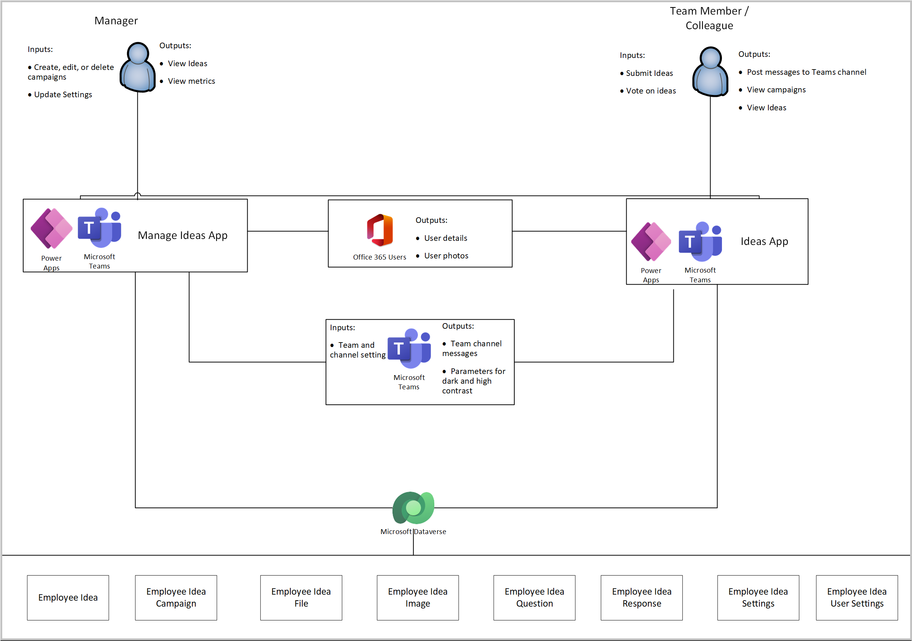
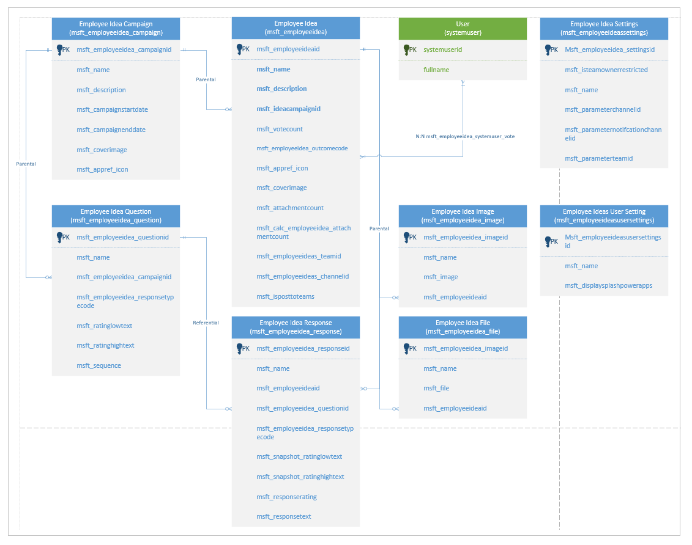

# Understand Employee ideas sample app architecture

In this article, you'll learn about the collections and global variables used by the [Employee ideas](employee-ideas.md) app, and understand how to use them effectively. If you want to learn more about how to install, and use the Employee ideas sample app instead, go to [Employee ideas](employee-ideas.md).

## Prerequisites

To understand and use information in this article, you'll need to know about different controls, features, and capabilities of canvas apps.

- [Create and update a collection in a canvas app](../maker/canvas-apps/create-update-collection.md)
- [Collect, Clear, and ClearCollect functions in Power Apps](../maker/canvas-apps/functions/function-clear-collect-clearcollect.md)
- [Understand canvas-app variables in Power Apps](../maker/canvas-apps/working-with-variables.md)
- [Add and configure a canvas-app control in Power Apps](../maker/canvas-apps/add-configure-controls.md)
- [Add a screen to a canvas app and navigate between screens](../maker/canvas-apps/add-screen-context-variables.md)

You'll also need to know about how to [install](use-sample-apps-from-teams-store.md), and [use](employee-ideas.md) Employee ideas sample app.

## Architecture model

The following diagram illustrates the way that users and systems interact with data in the Employee Ideas solution.

### Connectors

The following connectors are used in the Employee Ideas app:

- **Microsoft Dataverse** - used to read and write data in Dataverse.
- **Office 365 Users** - used to read Microsoft 365 user profile data.

## Data model

The following diagram explains the data model used by the Employee ideas sample app.

| Table name | Description |
| - | - |
| Employee Idea Campaign | A campaign is any series of actions or events that are meant to achieve a particular goal. Details such as title, description, start, and end dates of the campaign, team, and channel IDs are stored in the Employee Idea Campaign table. An idea campaign can have multiple ideas and idea questions.|
| Employee Idea | Ideas are thoughts or suggestions provided by employees to achieve a particular goal that is mentioned as part of a campaign. Details such as title, description, related campaign, outcome, and the vote count are stored in the Employee Idea table. There can be multiple files and idea questions associated to an idea. |
| Employee Idea Questions | Idea questions help us to get more inputs from employees regarding an idea. Details such as instructions, associated campaign, the response type, and values for the question are stored in the Employee Idea Questions table. Each idea question may have multiple responses. |
| Employee Idea Responses | Idea responses are used to get answers from the employees to the idea questions. Details such as instructions, associated idea, idea question, sequence, the response type, and values for the question are stored in the Employee Ideas Responses table. A Response can only be associated to one idea question. |
| Employee Idea Image | Images are used to better understand an idea. Users can add a cover image for their Idea. Details such as the name, associated idea, and the selected image are stored in the Employee Idea Images table. An idea can have only one cover image selected at a given point of time. |
| Employee Idea File | Employees can attach multiple supporting files that explains their Idea in a better way. Details such as the file name, the attachment, and the associated idea are stored in the Employee Idea file table. |
| Employee Idea User Setting | User settings are used to store user preferences pertaining to seeing the Power Apps splash screen every time they log in to the app. There is one record for each user. |
| Employee Idea Settings | Settings are used to store user preferences pertaining the Team ID, and Channel ID used for notifications. |

### Collections

The following table lists the collections used by the Employee Ideas app.

| Collection Name           | Description                                                                 | Where used                                                                        |
|---------------------------|-----------------------------------------------------------------------------|------------------------------------------------------------------------------------|
| colFileIcons              | Collection to store the app file type, and the icon.                              | App OnStart                                                        |
| colStockImages            | Collection to store the stock images used in the app.                        | App OnStart                                                        |
| colUserSettings           | Collection to collect user settings (if exists).                 | App OnStart                                                        |
| colocalization            | collection of localized text based on user’s language.                      | App OnStart                                                        |
| colIdeaStats_Raw          | Collections to collect raw ideas, for stats with owner details.              | App OnStart                                                        |
| colVotes                  | Collection to store the number of votes given to an Idea                    | App OnStart                                                        |
| colIdeas                  | Collection used to store employee ideas.                                     | Campaign Detail Screen                                                             |
| colResponses              | Collection used to store idea responses                                     | Campaign Detail Screen                                                             |
| colFiles                  | Collection used to collect files associated to an idea.                      | Items property of a gallery on the idea creation screen                            |
| colQuestions              | Collection to collect the idea questions.                                    | Items property of a gallery on the campaign details screen                         |
| colQuestionsToDelete      | Used to collect the questions to be deleted.                                 | OnClick property of the delete button on the campaign details screen               |
| colVoteCounter            | Used to count the number of votes received by an idea.                       | App OnStart                                                        |
| colCdsSampleDataIdeaUsers | Build collection with random owner for ideas, 20% current user, else random. | OnSelect property of a Randomize Sample data button (hidden) on the loading screen |
| colSampleDataIdeas        | Collection used to collect active sample employee ideas                     | OnSelect property of a Randomize Sample data button (hidden) on the loading screen |
| colSampleDataUsers        | Collection used to collect sample users.                                     | OnSelect property of a Randomize Sample data button (hidden) on the loading screen |

### Global variables

The following table lists the variables used by the Employee Ideas app.

| Variable Name                        | Type    | Description                                                                        |
|--------------------------------------|---------|------------------------------------------------------------------------------------|
| gblAppLoaded                         | Boolean | To check whether the app is loaded.                                      |
| gblAppContext                        | Boolean | To check the context of where the app is running.                                   |
| gblUserLanguage                      | Text    | To check the logged in User’s Language                                             |
| gblParamTeamId                       | Text    | To set the Group ID from Planner.                                                   |
| gblParamChannelId                    | Text    | To set the Channel ID from Planner.                                                 |
| gblThemeDark                         | Boolean | To check whether the Teams theme is set to Dark.                                    |
| gblThemeHiCo                         | Boolean | To check whether the Teams theme is set to High Contrast.                           |
| gblMobileMode                        | Boolean | To check whether the host client type is Android or iOS.                            |
| gblRecordSettings                    | Record  | To check Teams settings for current team and channel ID.                            |
| gblRandomizeData                     | Boolean | Variable to check whether the data must be randomized (implies first run in Team). |
| gblRecordUserSettings                | Record  | Variable to use the oldest record in case multiple records exist.                   |
| gblUserFirstName                     | Text    | Variable to set the full name of the user.                                          |
| gblDropdownChannel                   | Table   | To get the channels for a particular group in Microsoft Teams.                      |
| gblPadding                           | Record  | Used to set padding values in the app.                                              |
| gblMobileWidth                       | Number  | Used to set the global Mobile Width.                                                |
| gblToday                             | Date    | Variable to set the current date as a date/time value.                              |
| gblUserRecord                        | Record  | Variable to get the user record of the logged in user.                              |
| gblSettingNotificationChannelId      | Text    | Variable to set the Notification channel ID.                                        |
| gblSettingTeamId                     | Text    | Variable to set the Notification Team ID.                                           |
| gblSelectedRecordCampaign            | Record  | Variable to get the Selected campaign record.                                       |
| gblRecordCampaignIdea                | Record  | Variable to get the Selected campaign Idea.                                         |
| gblSelectedRecordCampaign_FormValues | Record  | Variable to store the field values of the campaign being added or edited. |
| gblAppSetting_inputMobileOnWeb       | Boolean | Variables to scale fonts for mobile-oriented apps, running in desktop.              |
| gblAppSetting_inputMobile            | Boolean | Variables to scale fonts for mobile-oriented apps.                                  |
| gblAppSetting_inputScaleFontsby      | Number  | Use this variable for scaling all fonts by a fixed amount.                          |
| gblAppColors                         | Record  | Variable to set the color value in the app.                                         |
| gblAppSizes                          | Record  | Variable to set the color value in the app.                                         |
| gblAppStyles                         | Record  | Variable to set the styling values in the app.                                      |
| gblAppManager                        | Boolean | To check the user team role.                                                        |

## App OnStart

This section explains app OnStart collections, variables, and execution details.

### OnStart collections

Collections used during app OnStart:

| Collection name | Description |
| - | - |
| colLocalization | Collection of localized text based on user’s language. |
| colStockImages | Collection of stock cover images. |
| colUserSettings | Collection of the user settings from the Employee Ideas User Settings table. |
| colFileIcons | Used to collect the icons of different file types. |
| colVoteCounter | Collection to count the number of votes received for an idea. |
| colIdeaStats_Raw | To collect raw ideas, for stats with owner details. |
| colVotes | Used to collect votes for an idea. |

### OnStart variables

Variables used during app OnStart:

| Variable name | Description |
| - | - |
| gblAppLoaded | Global variable to check if the app has loaded completely. |
| gblAppContext | Global variable to check the context of where the app is running. |
| gblUserLanguage | Global variable to store the user’s language. |
| gblParamTeamId | Global variable to set the Group ID from Planner. |
| gblParamChannelId | Global variable to set the Channel ID from Planner. |
| gblThemeDark | Global variable to define whether Teams is running with a dark theme. |
| blThemeHiCo | Global variable to define whether Teams is running with a high contrast theme. |
| gblMobileMode | Global variable to store if the app is being accessed from a mobile device. |
| gblRecordSettings | Global variable used to set the Team and Channel ID to the Employee Ideas Settings table. |
| gblRandomizeData | Global variable to check whether we have to randomize data (whether this run is the first run of the app). |
| gblRecordUserSettings | Global variable to store the latest Employee Ideas User Settings records for the current user. |
| gblUserFirstName | Global variable to store the user’s first name. |
| gblDropdownChannel | Global variable to store the list of channels for a group. |
| gblSettingNotificationChannelId | Global variable to store the channel ID where notifications will be posted. |
| gblSettingTeamId | Global variable to store the Team ID. |
| gblPadding | Global variable to set the padding values. |
| gblMobileWidth | Global variable to define the width of the app for mobile. |
| gblToday | Global variable to store the present day’s date. |
| gblUserRecord | Global variable to store the current user record. |

### OnStart execution details

1. When a user loads the app, **gblAppLoaded** variable is set to false. The user’s language code is stored in the **gblUserLanguage** variable, with "English - US" as the default.

1. The user’s language is then used to collect localized text used throughout the app (for example, label and button text) in **colLocalization**.

1. The user’s Teams theme is checked to see if the theme is default, dark or high contrast. The **gblThemeDark** and **gblThemeHiCo** variables are set accordingly.

1. Variables **gblParamTeamId** and **gblParamChannelId** are used to get the group ID and channel ID from the parameters.

1. The Team ID and the Channel ID are fetched from the Employee Idea settings table and stored in the **gblRecordSettings** variable.

1. The **gblRandomizeData** variable checks whether the app is being run for the first time to randomize data.

1. User details from the Employee Ideas Settings table are collected using **colUserSettings** collection. If no records exist, a new user settings record is created under the Employee Ideas User Settings table.

1. If in case multiple user settings record exists, the oldest settings record is selected and stored in the **gblRecordUserSettings** variable.

1. The global padding values for the app and the mobile width are set using the **gblPadding** and **gblMobileWidth** variables respectively.

1. The stock images and cover colors are collected in **colStockImages** and **colProjectCoverColors** collections respectively. The **colProjectCoverColors** collection has two sets of 14 colors. For each base, there are two colors. One for the default theme, and the other for the dark theme. For example, \#F4B9B9 is the default mode equivalent of \#791818.

1. Once all the required information is set and collected, The value of **gblAppLoaded** variable changes to true.

## First run experience

This section explains the app's [first time run](employee-ideas.md#configure-the-app) experience, relevant collections, variables, and execution details.

### First run experience collections

App first run experience doesn't use any collections.

### First run experience variables

Variables used when the app runs the first time:

| Variable name | Description |
| - | - |
| locShowModal | Local variable used to control the visibility of the dialog setup container. |
| locShowSetup | Local variable used to control the visibility of the setup dialog. |
| locShowPowerAppsPrompt | Local variable to indicate either to show or hide the splash screen. |

### First run experience execution details

1. When project screen shows up, a dialog pop-up appears if **locShowModal** variable value is true. If false, the app proceeds with loading the Campaign Summary screen.

1. The **locShowModal** variable is set (true/false) depending upon project settings records that gets created when the app runs for the first time. When the app runs for the first time, it creates a Employee Ideas User Setting record when the user completes the first run experience.

1. During the first run, the app shows the splash screen based upon the boolean variable **locShowPowerAppsPrompt**.

1. The **locShowPowerAppsPrompt** variable is set (true/false) based on the project setting that gets created during the first run.

1. If the user checks "Do not show again" checkbox, "Display Splash (Power Apps)’ is set to "No" at the project settings record. This action sets the **locShowPowerAppsPrompt** variable to false in the next run, and hides the splash screen.

## Summary screen

This section explains app [summary screen](employee-ideas.md#review-existing-idea-campaigns) collections, variables, and execution details.

### Summary screen collections

Collections used by summary screen:

| Collection name | Description |
| - | - |
| **colIdeaStats_Raw** | Collection to collect raw ideas, for stats with owner details.

### Summary screen variables

Variables used by summary screen:

| Variable name | Description |
| - | - |
| gblAppManager | Global variable check whether the user has the privilege to manage the app. |

#### Summary screen execution details

1. The campaign summary leader board is displayed on the campaign summary screen. The screen also shows the list of weekly top contributors, and weekly top ideas.

1. The weekly top contributors are listed in the   **galCampaignStatsTopContributors** gallery, the total number of ideas, and the ideas by owner columns are taken from the **colIdeaStats_Raw** collection. The top three contributors with the number of ideas are also displayed in the descending order.

1. The weekly top ideas are listed in the **galCampaignStatsTopIdeas** gallery. The ideas for which the vote count is not blank are taken from the **colIdeaStats_Raw** collection, and the top three ideas with the number of votes received are displayed in the descending order.

1. If the logged in User has the team role, the **galCampaignSummary** gallery displays the list of Active, Expired, Not Started and all the Campaigns in the descending order (campaign start date) that can be controlled using a drop-down field.

1. Campaigns can be searched using the search bar by name, and description of the campaign.

1. The visibility of **Add Campaign** button is controlled by the **gblAppManager** global variable. A new campaign can be created using the **Add Campaign** button.

## Campaign details screen

This section explains [campaign details screen](employee-ideas.md#edit-an-idea-campaign) collections, variables, and execution details.

### Campaign details screen collections

Collections used by campaign details screen:

| Collection name | Description |
| - | - |
| colIdeas | Collection to collect ideas for the selected campaign. |
| colVoteCounter | Collection to count the number of votes received for an idea. |
| colVotes | Collection to collect the votes for an idea.

### Campaign details screen variables

Variables used by campaign details screen:

| Variable name | Description |
| - | - |
| gblAppManager | Global variable check whether the user has the app manager privilege. |
| gblRecordCampaignIdea | Global variable to get the ideas for a selected campaign. |
| locVisibleCampaignEdit | Local variable to control the visible property of the **conCampaignUpsert** container (indicates that an existing campaign can be edited if the value is true). |
| locVisibleCampaignView | Local variable to control the visible property of the **conCampaignDetailCard** data card (indicates the campaign can only be viewed in case the value is true). |
| locVisibleCampaignCreate | Local variable to control the visible property of the **conCampaignUpsert** container (indicates that a new campaign can be created if the value is true). |
| locVisibleCampaignIdea | Local variable to control the visible property of the **conCampaignDetailsIdeas** container (indicates that an idea can be viewed but not edited)
| locVisibleIdeaCommands | Local variable used to control the visibility of the **Idea Delete** button (galIdeaCommands). |
| locSortGalCampaignDetailNav | Local variable used to sort the **galCampaignDetailNav** gallery.

#### Campaign details screen execution details

1. The **galCampaignDetailNav** gallery displays the list of campaigns sorted in the alphabetical order, and can also be searched based on the campaign name.

1. The campaigns can also be sorted based on the campaign name. Selecting the sort image updates the **locSortGalCampaignDetailNav** variable that sorts the campaigns in ascending/descending order.

1. Add campaign button enables the user to add a new campaign.

1. Selecting any of the campaigns sets the **gblSelectedRecordCampaign** variable to the selected campaign.

1. The ideas for the selected campaign(**gblSelectedRecordCampaign** variable) are filtered from the Employee Ideas table, and collected in the **colIdeas** collection.

1. Temporary vote offset is removed from the **colVoteCounter** collection for the actual value.

1. The **conCampaignDetailCard** container displays the name, description, the campaign duration dates, the cover image, and the number of days for campaign start, end, or expiry.

1. The **galCampaignDetailsIdeas** gallery lists the ideas available (**colIdeas** collection) for the selected campaign. The ideas can be sorted based on a dropdown selection. The available options are "Newest", "Oldest", and "Top voted".

1. Users can vote for an idea for by selecting the **Like** button.

1. Selecting the **Like** button for the first time adds the idea to the **colVotes** collection, and increments the value in the **colVoteCounter** collection by 1.

1. Disliking the idea removes the idea to the **colVotes** collection, and decrements the value in the **colVoteCounter** collection by 1.

1. Selecting the **Submit an Idea** button allows the user to create a new idea for the selected campaign.

1. Selecting the **Edit** button allows the user to edit the selected campaign.

1. Selecting **Back** button takes the user back to the Campaign summary screen.

## Add an idea campaign

This section explains collections, and variables used, and execution details while [adding an idea campaign](employee-ideas.md#add-an-idea-campaign).

### Collections used when adding an idea campaign

The following collections are used when you add an idea campaign:

| Collection name | Description |
| - | - |
| colQuestions | Used to collect the idea questions. |
| colStockImages | Used for the collection of stock cover images. |
| colQuestionsToDelete | Used to collect the deleted questions while adding/editing a campaign. |
| colIdeas | Used to collect ideas for a particular campaign. |

### Variables used when adding an idea campaign

The following variables are used when you add an idea campaign:

| Variable name | Description |
| - | - |
| locBlockUserInput | Local variable used to block the user input by displaying a dialog during save attempt. |
| locVisibleCampaignCreate | Local variable to control the visible property of the **conCampaignUpsert** container (indicates whether a new campaign can be created if the value is true). |
| locVisibleCampaignEdit | Local variable to control the visible property of the **conCampaignUpsert** container (indicates whether an existing campaign can be edited if the value is true). |
| locVisibleCampaignView | Local variable to control the visible property of the **conCampaignDetailCard** data card (indicates whether the campaign can only be viewed in case the value is true). |
| locVisibleCampaignIdea | Local variable to control the visible property of the **conCampaignDetailsIdeas** container (indicates that an idea can be viewed but not edited). |
| locCreateNewCampaign | Used to control the visibility of the **conCampaignUpsert** container. |
| gblSelectedRecordCampaign | Global variable to store the campaign record currently in context. |
| gblSelectedRecordCampaign_FormValues | Global variable to store the field values of the campaign added or edited. |
| locSelectedStockImage | Local variable to check whether a stock image has been selected or not. |
| locFormRecordCampaignPatch | Local variable to store the campaign record being updated. |
| locShowCampaignFormErrors | Local variable that controls the visibility of the error message to be shown in case there are any missing fields. |
| gblParamTeamId | Global variable to set the Group ID from Planner. |
| gblParamChannelId | Global variable to set the Channel ID from Planner. |

### Execution details while adding an idea campaign

1. A new campaign can be added by selecting the **Add Campaign** button on the Campaign Summary screen.

1. Selecting the **Add Campaign** button sets the **locVisibleCampaignCreate**, **locVisibleCampaignEdit**, and **locVisibleCampaignIdea** variables to false. **locVisibleCampaignView**, **locCreateNewCampaign**, and **locBlockUserInput** variables to true. And moves to the Campaign Details screen.

1. The **galCampaignDetailNav** gallery is disabled based on the values of the **locVisibleCampaignView**, **locVisibleCampaignIdea, and **locCreateNewIdea** variables.

1. Campaign name, description, and start/end dates of the campaign are part of the **conCampaignForm** container where the details can be filled in.

1. The **galCampaignEditQuestions** gallery displays the list of idea questions stored in the **colQuestions** collection.

1. The **galQuestionResponseRating** gallery displays the rating values for available for a question.

1. The **galCampaignQuestionResponseType** gallery displays the response types available for questions.

1. The **Add** button is only enabled if all the fields are filled in; including the start/end dates of the campaign. The **colQuestionsToDelete**, and **colQuestions** collections are checked if any new questions are added, or deleted.

1. Selecting the **Add** button creates a new campaign record, and updates all the entered fields to the Employee Idea Campaigns table.

1. If new questions are added, they're updated in the **colQuestions** collection, and the Employee Idea Questions table.

1. If questions are deleted, they're removed from the **colQuestionsToDelete** collection, and the Employee Idea Questions table.

1. If **Post to Channel** option is selected, a message is posted on the channel based on the information stored in **gblParamChannelId**, and **gblParamTeamId** variables.

1. The ideas for the created campaign are collected in the **colIdeas** collection.

1. The values of the variables **locVisibleCampaignEdit**, **locVisibleCampaignView**, **locVisibleCampaignCreate**, **locCreateNewCampaign**, **locShowCampaignFormErrors**, and **locVisibleCampaignIdeaSubmitted** are set to false.

1. The campaign submission screen is visible, and a confirmation message is displayed to the user.

## Edit an idea campaign

This section explains collections, and variables used, and execution details while [editing an idea campaign](employee-ideas.md#edit-an-idea-campaign).

### Collections used when editing an idea campaign

The following collections are used when you edit an idea campaign:

| Collection name | Description |
| - | - |
| colQuestions | Used to collect the idea questions. |
| colStockImages | Collection of stock cover images. |
| colQuestionsToDelete | Used to collect the questions deleted while adding, or editing a campaign. |
| colIdeas | Used to collect ideas for a particular campaign. |

### Variables used when editing an idea campaign

The following variables are used when you edit an idea campaign:

| Variables name | Description |
| - | - |
| locBlockUserInput | Local variable used to block the user input by displaying a dialog while something is being saved. |
| gblSelectedRecordCampaign | Global variable to store the campaign record in current context. |
| gblSelectedRecordCampaign_FormValues | Global variable to store the field values of the campaign being added, or edited. |
| locVisibleCampaignEdit | Local variable to control the visible property of the **conCampaignUpsert** container (indicates that an existing campaign can be edited if the value is true). |
| locFormRecordCampaign | Local variable to store the campaign record being edited. |

### Execution details while editing an idea campaign

1. The list of existing campaigns is shown in the **galCampaignSummary** gallery. Selecting any of the campaigns sets the **gblSelectedRecordCampaign** variable to the selected campaign, and the user is taken to the campaign details page.

1. Selecting the **Edit** button gets the campaign details (such as title, and description) using the **gblSelectedRecordCampaign** variable, and the idea questions from the **colQuestions** collection.

1. The value of the **locVisibleCampaignEdit** variable is set to true making the **conCampaignUpsert** container visible.

1. Required details can be updated and saved. The **Save** button is enabled only if all the fields are filled in including the start/end dates of the campaign. The **colQuestionsToDelete** and **colQuestions** collections are checked if any new questions are added or deleted.

1. On selecting the **Save** button, all the updated fields are saved to the Employee Idea Campaigns table (**gblSelectedRecordCampaign** variable holds the edited campaign record).

1. **colQuestions** collection, and the Employee Idea Questions table are updated for added/edited questions.

1. Deleted questions are removed from the **colQuestionsToDelete** collection and the Employee Idea Questions table.

1. The value of the **locVisibleCampaignView** variable is set to true displaying the **conCampaignUpsert** container.

## Duplicating an idea campaign

This section explains collections, and variables used, and execution details while [duplicating an idea campaign](employee-ideas.md#duplicate-an-idea-campaign)

### Collections used when duplicating an idea campaign

The following collections are used when duplicating an idea campaign:

| Collections name | Description |
| - | - |
| colQuestions | Used to collect the idea questions. |
| colQuestionsToDelete | Used to collect the deleted questions during the editing process. |
| colIdeas | Used to collect ideas for a particular campaign. |
| colStockImages | Collection of stock cover images. |

### Variables used when duplicating an idea campaign

The following variables are used when duplicating an idea campaign:

| Variable name | Description |
| - | - |
| gblSelectedRecordCampaign | Global variable to store the campaign record is in current context. |
| gblSelectedRecordCampaign_FormValues | Global variable to store the field values of the campaign being added, or edited. |
| locVisibleCampaignEdit | Local variable to control the visible property of the **conCampaignUpsert** container (indicates that an existing campaign can be edited if the value is true). |
| locVisibleCampaignView | Local variable to control the visible property of the **conCampaignDetailCard** data card (indicates the campaign can only be viewed in case the value is true). |
| locVisibleCampaignCreate | Local variable to control the visible property of the **conCampaignUpsert** container (indicates that a new campaign can be created if the value is true). |
| locBlockUserInput | Local variable used to block the user input by displaying a dialog while something is being saved. |

### Execution details while duplicating an idea campaign

1. A campaign can be duplicated using the **Duplicate** button on the campaign details screen.

1. Selecting the **Duplicate** button sets the **gblSelectedRecordCampaign_FormValues** variable with the details of the campaign being duplicated (such as title, description, stat/end dates). The cover image is set to blank. The title of the newly created campaign is appended by (1).

1. The value of the **locVisibleCampaignCreate** variable is updated to true, which displays the **conCampaignUpsert** container.

1. User can make more changes to the newly created campaign, and select the **Add Campaign** button.

1. When selecting **Add Campaign** button, the updated fields are saved to the Employee Idea Campaigns table (**gblSelectedRecordCampaign** variable holds the edited campaign record).

1. Newly added/edited questions are updated in the **colQuestions** collection, and the Employee Idea Questions table.

1. Deleted questions are removed from the **colQuestionsToDelete** collection, and the Employee Idea Questions table.

1. The campaign submission screen is visible, and a confirmation message is displayed.

1. Selecting **Cancel** button takes the user back to the Campaign Summary screen.

## Deleting an idea campaign

This section explains collections, and variables used, and execution details while [deleting an idea campaign](employee-ideas.md#delete-an-idea-campaign).

### Collections used when deleting an idea campaign

The following collections are used when deleting an idea campaign:

| Collections name | Description |
| - | - |
| colIdeas | Used to collect ideas for a particular campaign. |

### Variables used when deleting an idea campaign

The following variables are used when deleting an idea campaign:

| Collections name | Description |
| - | - |
| gblSelectedRecordCampaign | Global variable to store the campaign record in the current context. |
| locVisibleDialog | Local variable to control the visibility of the dialog background. |
| locVisibleDialogDelete | Local variable to control the visibility of the delete dialog. |

### Execution details while deleting an idea campaign

1. A Campaign can be deleted by using the **Delete** button on the campaign details screen.

1. Selecting the **Delete** button updates the values of the **locVisibleDialog**, and **locVisibleDialogDelete** variables to true displaying the **conConfirmDelete** container (deletion confirmation dialog box).

1. The user must check the **I Understand** checkbox to proceed with deleting the campaign.

1. When selecting the **Delete** button, the selected campaign is removed from the Employee Ideas Campaigns table, and the related ideas are removed from the Employee Ideas table.

1. The **gblSelectedRecordCampaign** variable is set to the first campaign in the **galCampaignDetailNav** gallery, and the ideas for the relevant campaign are fetched from the **colIdeas** collection displaying the details of the first campaign.

## Add an idea question

This section explains collections, and variables used, and execution details while [add an idea question](employee-ideas.md#add-an-idea-campaign).

### Collections used when adding an idea question

The following collections are used when adding an idea question:

| Collections name | Description |
| - | - |
| colQuestions | Used to collect idea questions. |

## Variables used when adding an idea question

The following variables are used when adding an idea question:

| Variable name | Description |
| - | - |
| locVisibleCampaignEdit | Local variable to control the visible property of the **conCampaignUpsert** container (indicates that an existing campaign can be edited if the value is true). |
| gblSelectedRecordCampaign | Global variable to store the campaign record in the current context. |

### Execution details while adding an idea question

1. New idea questions can be added while a campaign is being edited.

1. Selecting the **+ Add question** button adds a new entry in the **colQuestions** collection. The Instructions field value is set to "\*NEW QUESTION\*". The default response type is set to Rating (Employee Ideas Response type) with the values of “High”, and “Low”.

1. The newly added question is displayed at the end of the list.

1. Selecting **Save** button updates the newly added question to the Employee Idea Questions table.

## Delete an idea question

This section explains collections, and variables used, and execution details while [delete an idea question](employee-ideas.md#add-an-idea-campaign).

### Collections used when deleting an idea question

The following collections are used when deleting an idea question:

| Collections name | Description |
| - | - |
| colQuestions | Used to collect the idea questions. |
| colQuestionsToDelete | Used to collect the deleted questions while adding/deleting a campaign. |

## Variables used when deleting an idea question

Deleting an idea question doesn't use any variables.

### Execution details while deleting an idea question

1. Existing idea questions can be deleted while a campaign is being edited.

1. Selecting **Delete** removes question from the **colQuestions** collection, and adds the deleted question the **colQuestionsToDelete** collection.

1. The deleted question is also removed from the **galCampaignEditQuestions** gallery.

1. Selecting **Save** removes the deleted question from the Employee Idea Questions table.

## Change idea questions order

This section explains collections, and variables used, and execution details while changing the order of idea questions when you [add/edit an idea campaign](employee-ideas.md#add-an-idea-campaign).

### Collections used when changing the order of idea questions

The following collections are used when changing the order of idea questions:

| Collections name | Description |
| - | - |
| colQuestions | Used to collect the idea questions. |

## Variables used when changing the order of idea questions

The following variables are used when adding an idea question:

| Variable name | Description |
| - | - |
| locSequenceCurrent | Local variable to set the current sequence number of the question. |
| locSequenceNew | Local variable to set the new sequence number of the question. |

### Execution details when changing the order of idea questions

1. The sequence of the idea questions can be updated by using the up and down arrows available next to the questions.

1. The up arrow is disabled for the first question, and the down arrow is disabled for the last question in the gallery (the display mode is controlled by the value of msft_sequence field).

1. The questions in the **colQuestions** collection are rearranged by comparing the values of **locSequenceCurrent** and **locSequenceNew** variables.

## Change the question response type

This section explains collections, and variables used, and execution details while changing the response type of idea questions when you [add/edit an idea campaign](employee-ideas.md#add-an-idea-campaign).

### Collections used when changing the response type of idea questions

The following collections are used when changing the response type of idea questions:

| Collections name | Description |
| - | - |
| colQuestions | Used to collect the idea questions. |

### Variables used when changing the response type of idea questions

Changing the response type of idea questions doesn't use any variables.

### Execution details when changing the response type of idea questions

1. The question response types are displayed as part of the **galCampaignQuestionResponseType** gallery.

1. The visible property of the **galQuestionResponseRating** gallery is controlled by the response type selected in the **galCampaignQuestionResponseType** gallery by comparing the values of **locSequenceCurrent** and **locSequenceNew** variables.

1. For Rating response type, a list of numbers is shown&mdash;lowest being 1, and highest being 5.

1. For Text response type, a toggle with the options Long and Short is displayed.

## Submit a new idea

This section explains collections, and variables used, and execution details when you [submit a new idea](employee-ideas.md#submit-a-new-idea).

### Collections used when submitting a new idea

The following collections are used when submitting a new idea:

| Collections name | Description |
| - | - |
| colQuestions | Used to collect the idea questions. |
| colResponses | Used to collect responses for the idea questions. |
| colFiles | Used to collect the files associated with an idea. |

### Variables used when submitting a new idea

The following variables are used when submitting a new idea:

| Variable name | Description |
| - | - |
| gblSelectedRecordCampaign | Global variable to store the campaign record in the current context. |
| locVisibleCampaignIdea | Local variable used to control the visibility of the idea details screen. |
| locCreateNewIdea | Local variable used to control the visibility of the idea details screen. |
| locFormRecordIdea | Local variable used to store the idea record being created. |
| gblParamTeamId | Variable to store the Planner group ID. |
| gblParamChannelId | Variable to store the Planner Channel ID. |

### Execution details when submitting a new idea

1. A new idea can be submitted from the campaign details screen.

1. Using the **Submit an Idea** button, the idea questions for the selected campaign (**gblSelectedRecordCampaign**) are collected in the **colQuestions** collection.

1. The **colResponses** collection is used to collect the idea responses, and for all the idea questions present in the **colQuestions** collection responses are collected in the **colResponses** collection.

1. The **colFiles** collection is cleared, and the **locCreateNewIdea** and **locVisibleCampaignIdea** variables are set to true.

1. The values of the locVisibleCampaignIdea and locCreateNewIdea variables are set to true, displaying the **conCampaignIdeaPane** and **conIdeaImage** containers.

1. The **galIdeaResponses** gallery displays the fields that must be filled to save the idea.

1. Using the **New File** image allows the users to add related files.

1. The files added for an idea are displayed as part of the **galIdeaFiles** gallery whose items property is set to the **colFiles** collection. The corresponding file icon is displayed (stored in the **colFileIcons** collection).

1. **Delete** removes the attached file from the **colFiles** collection.

1. Setting the **Share in channel** toggle to "On" posts a message on the channel regarding the idea creation.

1. **Back** takes the user back to the campaign summary screen. **Cancel** displays the campaign details.

1. **Save** is enabled when **colResponses** is not blank. Selecting **Submit Idea** results in the data in **colResponses** and **colFiles** collection to update to the Employee Idea Responses table, and if the **Share in Channel** option is set to "Yes", based on the values of the **gblParamTeamId** and **gblParamChannelId** variables collected on start of the app, a post is made on the channel.

1. The data from **colFiles**, **colIdeas**, and **colResponses** are updated to the Employee Idea Files, Employee Ideas and Employee Idea Responses tables respectively.

1. The value of the **locVisibleCampaignIdeaSubmitted** variable is set to true displaying the **conIdeaSubmtted** container (Idea Submitted message).

1. **Return to Idea List** sets the **locVisibleCampaignView** variable to true displaying the campaign details.

## Delete an idea

This section explains collections, and variables used, and execution details when you [delete an idea](employee-ideas.md#delete-an-idea).

### Collections used when deleting an idea

The following collections are used when deleting an idea:

| Collections name | Description |
| - | - |
| colResponses | Used to collect idea responses. |
| colFiles | Used to collect files associated to an idea. |

### Variables used when deleting an idea

The following variables are used when deleting an idea:

| Variable name | Description |
| - | - |
| locVisibleIdeaCommands | Local variable used to control the visibility of the idea delete button (galIdeaCommands). |
| gblRecordCampaignIdea | Global variable to store the campaign idea record in the current context. |
| locVisibleCampaignIdea | Local variable used to control the visibility of the idea details. |
| locVisibleDialog | Local variable to control the visibility of the dialog background. |
| locVisibleDialogDelete | Local variable to control the visibility of the delete dialog. |
| locVisibleCampaignEdit | Local variable to control the visible property of the **conCampaignUpsert** container (indicates that an existing campaign can be edited if the value is true). |

### Execution details when deleting an idea

1. Selecting any of the ideas from the **galCampaignDetailsIdeas** gallery sets the **gblRecordCampaignIdea** variable to the selected idea, and the corresponding details stored in the **colResponses** and **colFiles** are displayed.

1. The value of the **locVisibleCampaignIdea** variable set to true displays the idea details.

1. User can delete the selected idea record by using the **More** icon next to the vote button. This action shows delete button based on the value of  **locVisibleIdeaCommands** variable.

1. **Delete** sets the values of **locVisibleDialog**, and **locVisibleDialogDelete** to true displaying the **conConfirmDelete** container (Deletion confirmation dialog).

1. User must check the **I Understand** checkbox to continue with deleting the campaign.

1. When **Delete** is selected, the selected campaign is removed from the Employee Ideas Campaigns table, the related ideas are removed from the Employee Ideas table and the **colIdeas** collection is updated.

1. The value of the **locVisibleCampaignView** variable is set to true displaying the campaign details.

## Settings screen

This section explains collections, and variables used, and execution details of the [settings screen](employee-ideas.md#edit-the-app-configuration) when you edit the app configuration.

### Settings screen collections

Settings screen uses the following collections:

| Collections name | Description |
| - | - |
| colIdeaStats_Raw | Used to collect raw ideas for stats with owner details. |

### Settings screen variables

Settings screen uses the following variables:

| Variable name | Description |
| - | - |
| locBlockUserInput | Local variable used to block the user input by displaying a dialog while something is being saved. |
| gblRecordSettings | Global variable used to set the Team and Channel ID to the Employee Ideas settings table. |
| gblSettingNotificationChannelId | Global variable to store the Channel ID where notifications will be posted.
| gblDropdownChannel | Global variable to store the list of channels for a group.  

### Settings screen execution details

1. Users have the feasibility to update whether only team owners will be able to add campaigns, and select the channel where messages will be posted.

1. The list of channels in the drop-down are from the **gblDropdownChannel** variable.

1. **Save** button is enabled when the drop-down value selected or the team owner restricted value is different from the value stored in the variable **gblRecordSettings** (which is set on start of the app).

1. **Save** updates the details in the Employee Idea Settings table, and takes the user to the Campaign Summary screen. The value of the **locBlockUserInput** variable is set to true making sure that the user doesn't make any further updates while saving is in progress.

1. **Cancel** takes the user back to the previous screen.

## About screen

This section explains collections, and variables used, and execution details of the settings screen.

### About screen collections

The about screen doesn't use any collections.

### About screen variables

The about screen doesn't use any variables.

### About screen execution details

1. **Customize using Power Apps** button on the **conHeader_About** container opens Power Apps in Microsoft Teams.

1. **galAbout_HelpLinks** gallery stores the help links.

1. **Learn how to customize this app** button takes you to an external link that explains on how to make customizations on the app.

1. **Send us your ideas** button takes you to an external link where ideas can be posted for the app.

1. **Engage with community** button takes you to the Power Apps Community page.

1. **conAbout_AppVideo** container contains the video link that provides an overview of the app.

1. **galAbout_OtherApps** gallery contains the links to other Power Apps in Teams store.

1. **View app** button takes you to the app page in the Microsoft Teams app store.

1. **App Overview** button takes you to the app overview video.

1. **conAbout_Version** gives information about the app versioning.

### See also

[Customize employee ideas app](customize-employee-ideas.md)  
[Employee ideas sample app](employee-ideas.md)  
[Use sample apps from the Microsoft Teams store](use-sample-apps-from-teams-store.md)  
[Customize sample apps installed from Teams store](customize-sample-apps.md)  
[Frequently Asked Questions (FAQs) for sample apps](sample-apps-faqs.md)
