Document Objective

>   In this Document, we learn about the Collections and Global variables used
>   in the **Employee Ideas** app, and how to use them effectively.

Introduction

Employee ideas app is used by the Teams users to perform the following
activities:

1.  Set up and configure an idea campaign (a category for grouping ideas around
    common themes).

2.  Configure a standard submission form that employees need to submit for each
    idea.

3.  Review idea campaigns and manage the list of campaigns and ideas.

4.  Edit and delete campaigns.

5.  Review leaderboards of ideas.

6.  Vote for and share prioritized ideas.

7.  Submit ideas for a campaign.

8.  View other team members' ideas.

9.  Vote on the most-liked ideas.

10. Review how their own idea is performing compared to others within a campaign

Data Model  
  

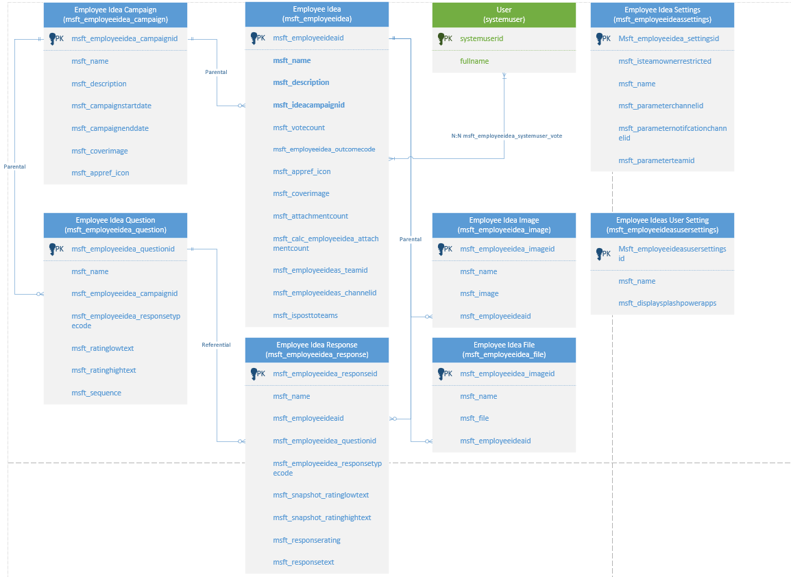

Entities

1.  **Employee Idea Campaign**

A campaign is any series of actions or events that are meant to achieve a
particular goal. Details such as Title, Description, Start and End dates of the
campaign, Team and Channel ID’s are stored in the Employee Idea Campaign table.

An Idea Campaign can have multiple Ideas and Idea Questions.

1.  **Employee Idea**

Ideas are thoughts or suggestions provided by Employees to achieve a particular
goal which is mentioned as part of a campaign. Details such as Title,
Description, Related campaign, Outcome and the Vote count are stored in the
Employee Idea table.

There can be multiple files and Idea Questions associated to an Idea.

1.  **Employee Idea Questions**

Idea Questions help us to get more inputs from Employees regarding an Idea.
Details such as Instructions, associated campaign, the Response Type and values
for the Question are stored in the Employee Idea Questions table.

Each Idea Question may have multiple responses.

1.  **Employee Idea Responses**

Idea Responses are used to get answers from the Employees to the idea questions.
Details such as Instructions, associated Idea, Idea Question, sequence, the
Response Type and values for the Question are stored in the Employee Ideas
Responses table.

A Response can only be associated to one Idea Question.

1.  **Employee Idea Image**

Images are used to better understand an Idea, Users can add a cover image for
their Idea. Details such as the Name, associated Idea and the selected image are
stored in the Employee Idea Images table.

An Idea can have only one cover image selected at a given point of time.

1.  **Employee Idea File**

Employees can attach multiple supporting files which explains their Idea in a
better way. Details such as the file name, the attachment and the associated
idea are stored in the Employee Idea file table.

1.  **Employee Idea User Setting**

User settings are used to store user preferences pertaining to seeing the Power
Apps splash screen every time they login to the app. There is one record for
each user.

1.  **Employee Idea Settings**

Settings are used to store user preferences pertaining the Team Id, and Channel
Id used for notifications.

Story

OnStart

Collections involved

1.  **colLocalization –** collection of localized text based on user’s
    language**.**

2.  **colStockImages –** collection of stock cover images.

3.  **colUserSettings** – collection of the User Settings from the Employee
    Ideas User Settings table.

4.  **colFileIcons –** Used to collect the icons of different file types.

5.  **colVoteCounter** – collection to count the number of votes received for an
    idea.

6.  **colIdeaStats_Raw** - to collect Raw Ideas, for Stats with Owner Details

7.  **colVotes –** Used to collect votes for an Idea

Variables involved

1.  **gblAppLoaded–** global variable to check if the app has loaded
    completely**.**

2.  **gblAppContext –** global variable to check the context of where the app is
    running.

3.  **gblUserLanguage–** global variable to store the user’s language.

4.  **gblParamTeamId-** global variable to set the Group ID from Planner

5.  **gblParamChannelId -** global variable to set the Channel ID from Planner

6.  **gblThemeDark–** global variable to define whether Teams is running with a
    dark theme.

7.  **gblThemeHiCo–** global variable to define whether Teams is running with a
    Hi-Contrast theme.

8.  **gblMobileMode –** global variable to store if the app is being accessed
    from a mobile device.

9.  **gblRecordSettings –** global variable used to set the Team and Channel Id
    to the Employee Ideas settings table.

10. **gblRandomizeData –** global variable to check whether we have to randomize
    data (whether this is the first run of the app).

11. **gblRecordUserSettings –** global variable to store the latest Employee
    Ideas User Settings records for the current user.

12. **gblUserFirstName –** global variable to store the User’s first name.

13. **gblDropdownChannel –** global variable to store the list of channels for a
    group.

14. **gblSettingNotificationChannelId –** global variable to store the channel
    ID where notifications will be posted.

15. **gblSettingTeamId –** global variable to store the team id

16. **gblPadding –** global variable to set the padding values

17. **gblMobileWidth** – global variable to define the width of the app for
    mobile.

18. **gblToday –** global variable to store the present day’s date.

19. **gblUserRecord –** global variable to store the current user record.

Detailed Steps

1.  When a User loads the app, **gblAppLoaded** is set to false. The user’s
    language code is stored in **gblUserLanguage**, with English - US being the
    default one.

2.  The user’s language is then used to collect localized text used throughout
    the app (e.g. label and button text) in **colLocalization**.

3.  The user’s Teams theme/mode is checked to see if the theme is default, dark
    or high contrast. The **gblThemeDark** and **gblThemeHiCo** variables are
    set accordingly.

4.  Variables **gblParamTeamId** and **gblParamChannelId** are used to get the
    group ID and channel ID from the parameters.

5.  The Team ID and the Channel ID are fetched from the Employee Idea settings
    table and stored in the **gblRecordSettings** variable.

6.  The **gblRandomizeData** checks whether the app is being run for the first
    time to randomize data.

7.  User details from the Employee Ideas Settings table is collected using
    colUserSettings, if incase no records exist, A new User setting record is
    created under the Employee Ideas User settings table.

8.  If in case multiple User settings record exists, the oldest settings record
    is selected and stored in the **gblRecordUserSettings** variable.

9.  The global padding values for the app and the mobile width are set using the
    **gblPadding** and **gblMobileWidth** variables respectively.

10. The stock images and cover colors are collected in **colStockImages** and
    **colProjectCoverColors** respectively. colProjectCoverColors has two sets
    of 14 colors. For each base, there are two colors. One is for default theme
    and the other is for dark theme. For example, \#F4B9B9 is the default mode
    equivalent of \#791818.

11. Once all the required information is set and collected, The value of
    **gblAppLoaded** variable changes to true.

Screens

Campaign Summary screen

Displaying the first run experience

Collections involved

1.  **Collection** – None

Variables involved

1.  **locShowModal**– local variable used to control the visibility of the
    Dialog setup container.

2.  **locShowSetup** – local variable used to control the visibility of the
    Setup dialog

3.  **locShowPowerAppsPrompt -** local variable to indicate either to show or
    hide the splash screen.

Detailed steps

1.  On visible of project screen a dialog pop-up appears if **locShowModal**
    value is true, if not the app proceeds with loading the Campaign Summary
    screen

2.  **locShowModal** is set to true / false depending upon project settings
    records that gets created when the app runs for the first time. So if the
    app runs for the first time it creates a Employee Ideas User setting record
    when the user completes the first run experience.

3.  Also if it’s a first run, the app also shows the splash screen based upon
    the Boolean variable **locShowPowerAppsPrompt**

4.  **locShowPowerAppsPrompt** is set to true or false based upon the project
    setting that gets created during the first run.

5.  If the user checks ‘Do not show again’ the ‘Display Splash (PowerApps)’ is
    set to ‘No’ at project settings record which there by sets
    **locShowPowerAppsPrompt** to false in the next run and hides the splash
    screen.

Screens

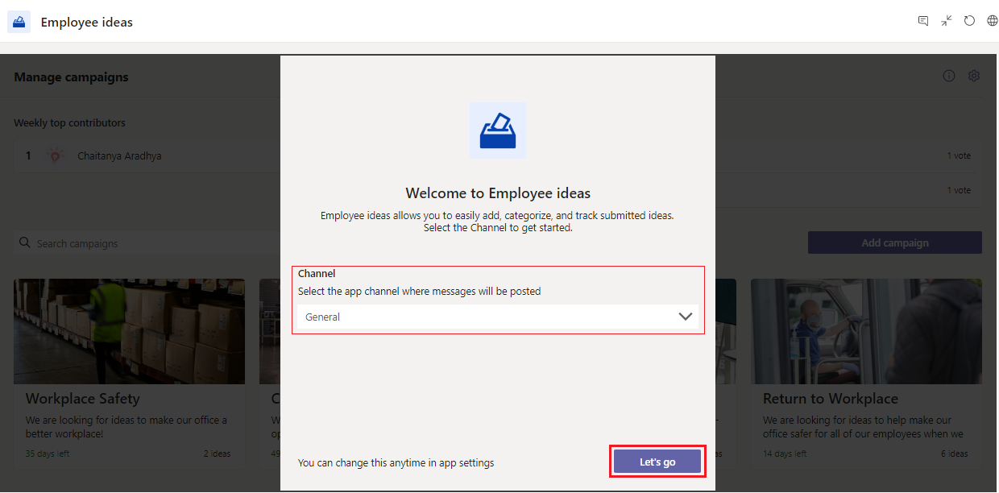

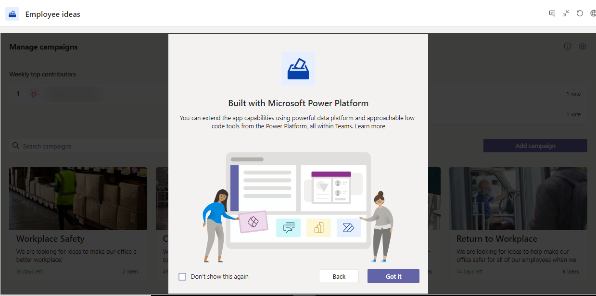

Displaying the summary screen

Collections involved

1.  **colIdeaStats_Raw** – collection to collect Raw Ideas, for Stats with Owner
    Details

Variables involved

1.  **gblAppManager–** global variable check whether the user has App manager
    privilege.

Detailed Steps

1.  The campaign summary leader board is visible on the Campaign summary screen.
    We can see the list of Weekly top contributors and Weekly top ideas.

2.  The Weekly top contributors are listed in the
    **galCampaignStatsTopContributors** gallery, the total number of Ideas and
    the ideas by owner columns are taken from the **colIdeaStats_Raw**
    collection and the top 3 contributors along with the number of Ideas are
    displayed in descending order.

3.  The Weekly top ideas are listed in the **galCampaignStatsTopIdeas** gallery,
    the ideas for which the vote count is not blank are taken from the
    colIdeaStats_Raw collection and the top 3 ideas with the number of votes
    received are displayed in descending order.

4.  If the logged in User has the team role, the **galCampaignSummary** gallery
    displays the list of Active, Expired, Not Started and all the Campaigns in
    descending order (campaign start date) which can be controlled using a
    dropdown field.

5.  The Campaigns can be searched using the Search bar using the name and
    description of the campaign.

6.  The visibility of Add Campaign button is controlled by the **gblAppManager**
    global variable. A new campaign can be created using the Add Campaign
    button.

Screens

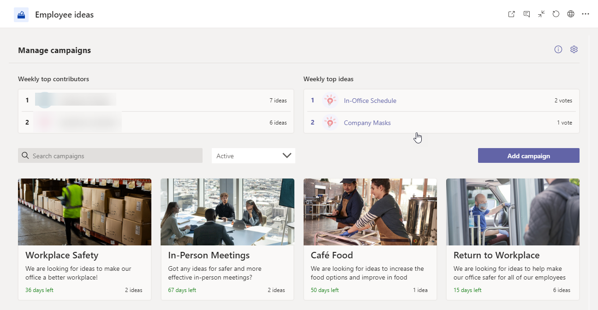

  

Campaign Details screen

Collections involved

1.  **colIdeas** – collection to Collect Ideas for a Selected Campaign.

2.  **colVoteCounter** - collection to count the number of votes received for an
    idea.

3.  **colVotes** – collection to collect the votes for an Idea.

Variables involved

1.  **gblAppManager–** global variable check whether the user has App manager
    privilege.

2.  **gblRecordCampaignIdea** – global variable to get the ideas for a selected
    campaign

3.  **locVisibleCampaignEdit –** local variable to control the visible property
    of the conCampaignUpsert container (indicates that an existing campaign can
    be edited if the value is true)

4.  **locVisibleCampaignView –** local variable to control the visible property
    of the conCampaignDetailCard data card (indicates the campaign can only be
    viewed in case the value is true)

5.  **locVisibleCampaignCreate –** local variable to control the visible
    property of the conCampaignUpsert container (indicates that a new campaign
    can be created if the value is true)

6.  **locVisibleCampaignIdea –** local variable to control the visible property
    of the conCampaignDetailsIdeas container (indicates that an idea can be only
    be viewed but not edited)

7.  **locVisibleIdeaCommands –**

8.  **locSortGalCampaignDetailNav –** local variable used to sort the
    galCampaignDetailNav gallery.

Detailed Steps

1.  The **galCampaignDetailNav** gallery displays the list of campaigns sorted
    in the Alphabetical order and can also be searched based on the campaign
    name.

2.  The campaigns can also be sorted based on the campaign name, clicking on the
    sort image updates the **locSortGalCampaignDetailNav** variable which sorts
    the campaigns in ascending / descending order.

3.  Add campaign button would enable the user to add a new campaign.

4.  Clicking on any of the campaign would set the gblSelectedRecordCampaign
    variable to the selected campaign.

5.  The ideas for the selected campaign (**gblSelectedRecordCampaign**) are
    filtered from the Employee Ideas table and collected in the **colIdeas**
    collection.

6.  The temporary vote offset is removed from the **colVoteCounter** collection
    as we have the actual value.

7.  The **conCampaignDetailCard** container displays the Name, Description, the
    campaign duration dates, cover image and the number of days left for the
    campaign to end / number of days left for the campaign to start / whether
    the campaign is expired.

8.  The **galCampaignDetailsIdeas** gallery lists the ideas available
    (**colIdeas**) for the selected campaign. They can be sorted based on a
    dropdown selection. The available options are Newest, Oldest and Top voted.

9.  Users can also vote for an idea for by clicking on the Like button.

10. Hitting the like button for the first time will add the idea to the
    **colVotes** collection and increment the value in the **colVoteCounter**
    collection by 1.

11. Disliking the idea will remove the idea to the **colVotes** collection and
    decrement the value in the **colVoteCounter** collection by 1.

12. Clicking the Submit an Idea button will allow the user to create a new idea
    for the selected campaign.

13. Clicking the edit button will allow the user to edit the selected campaign.

14. Clicking on the back button takes the user back to the Campaign summary
    screen.

Screens  

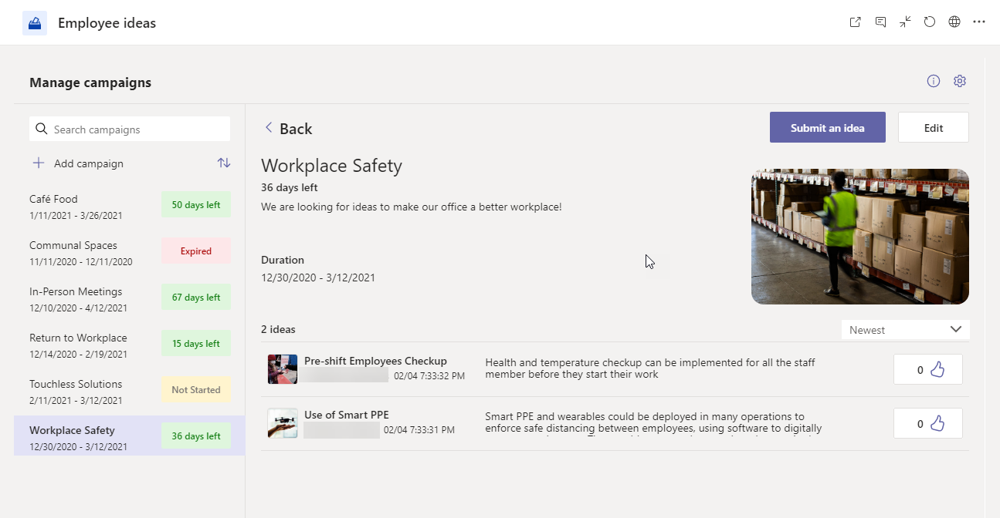

Adding a new Campaign

Collections involved

1.  **colQuestions –** Used to collect the Idea Questions

2.  **colStockImages –** Used collection of stock cover images.

3.  **colQuestionsToDelete -** Used to collect the questions which are deleted
    while adding / editing a campaign

4.  **colIdeas –** Used to collect Ideas for a particular campaign.  
    

*Variables involved*

1.  **locBlockUserInput –** local variable used to block User Input by
    displaying a dialog while something is being saved.

2.  **locVisibleCampaignCreate –** local variable to control the visible
    property of the conCampaignUpsert container (indicates that a new campaign
    can be created if the value is true)

3.  **locVisibleCampaignEdit –** local variable to control the visible property
    of the conCampaignUpsert container (indicates that an existing campaign can
    be edited if the value is true)

4.  **locVisibleCampaignView –** local variable to control the visible property
    of the conCampaignDetailCard data card (indicates the campaign can only be
    viewed in case the value is true)

5.  **locVisibleCampaignIdea –** local variable to control the visible property
    of the conCampaignDetailsIdeas container (indicates that an idea can be only
    be viewed but not edited)

6.  **locCreateNewCampaign –** Used to control the visibility of the
    conCampaignUpsert container

7.  **gblSelectedRecordCampaign –** global variable to store the campaign record
    which is in context.

8.  **gblSelectedRecordCampaign_FormValues –** global variable to store the
    field values of the campaign which is being added or edited.

9.  **locSelectedStockImage –** local variable to check whether a stock image
    has been selected or not.

10. **locFormRecordCampaignPatch –** local variable to store the campaign record
    which is being updated.

11. **locShowCampaignFormErrors –** local variable which controls the visibility
    of the error message to be shown in case there are any missing fields.

12. **gblParamTeamId-** global variable to set the Group ID from Planner.

13. **gblParamChannelId –** global variable to set the Channel ID from Planner.

*Detailed Steps*

1.  A new campaign can be added by clicking on the “Add Campaign” button on the
    Campaign Summary screen.

2.  Clicking on the Add Campaign button will set the
    **locVisibleCampaignCreate**, **locVisibleCampaignEdit,
    locVisibleCampaignIdea** variables to false, **locVisibleCampaignView,
    locCreateNewCampaign** and **locBlockUserInput** variables to true and
    navigates to the Campaign Details screen.

3.  The **galCampaignDetailNav** gallery is disabled based on the values of the
    variables **locVisibleCampaignView**, **locVisibleCampaignIdea** and
    **locCreateNewIdea**.

4.  Campaign name, Description, Start and End dates of the campaign are part of
    the **conCampaignForm** container where the details can be filled in.

5.  The **galCampaignEditQuestions** gallery displays the list of idea questions
    stored in the **colQuestions** collection.

6.  The **galQuestionResponseRating** gallery displays the rating values for
    available for a question.

7.  The **galCampaignQuestionResponseType** gallery displays the response types
    available for questions.

8.  The Add button would be enabled only if all the fields are filled in
    including the start and end dates of the campaign and the
    **colQuestionsToDelete** and **colQuestions** collections are checked if any
    new questions are added or deleted.

9.  Clicking on the Add button will create a new campaign record and updates all
    the entered fields to the Employee Idea Campaigns table.

10. In case there are newly added questions, they would be updated in the
    **colQuestions** collection and the Employee Idea Questions table.

11. In case any questions are deleted, they would be removed from the
    **colQuestionsToDelete** collection and the Employee Idea Questions table.

12. If in case Post to Channel option is selected, A message is posted on the
    channel based on the information stored in **gblParamChannelId** and
    **gblParamTeamId** variables.

13. The ideas for the created campaign will be collected in **colIdeas**
    collection.

14. The values of the variables **locVisibleCampaignEdit**,
    **locVisibleCampaignView**, **locVisibleCampaignCreate**,
    **locCreateNewCampaign**, **locShowCampaignFormErrors**,
    **locVisibleCampaignIdeaSubmitted** are set to false.

15. The campaign submission screen is visible, and a confirmation message is
    displayed to the User.

Screens

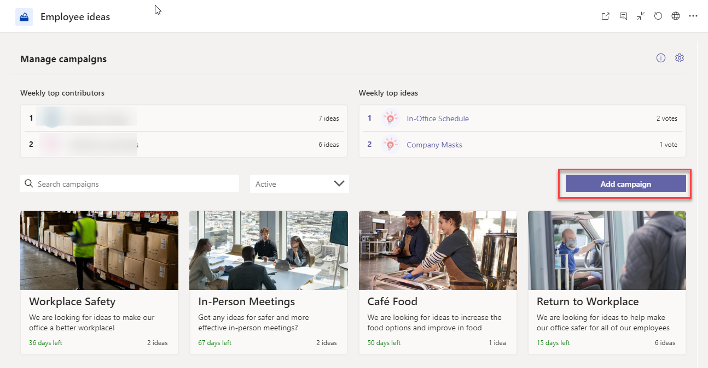

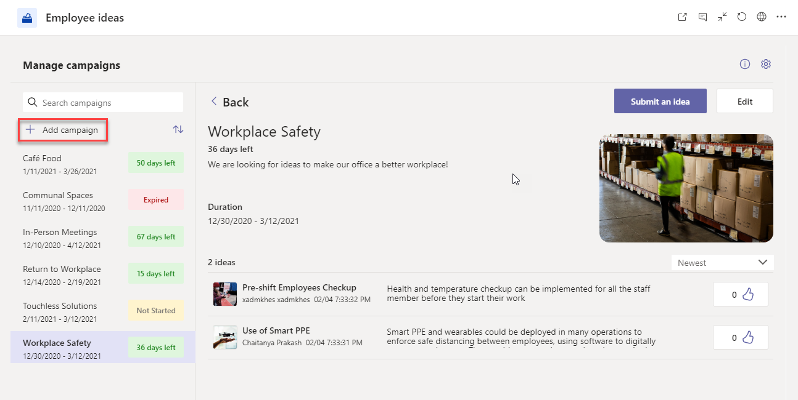

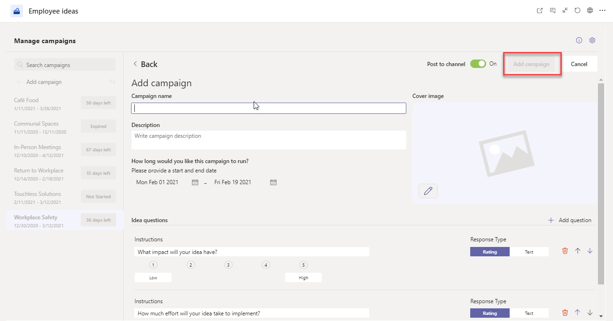

Editing a Campaign

Collections involved

1.  **colQuestions –** Used to collect the Idea Questions

2.  **colStockImages -** collection of stock cover images.

3.  **colQuestionsToDelete -** Used to collect the questions which are deleted
    while adding / editing a campaign

4.  **colIdeas** - Used to collect Ideas for a particular campaign.

Variables involved

1.  **locBlockUserInput –** local variable used to block the User Input by
    displaying a dialog while something is being saved.

2.  **gblSelectedRecordCampaign –** global variable to store the campaign record
    which is in context.

3.  **gblSelectedRecordCampaign_FormValues –** global variable to store the
    field values of the campaign which is being added or edited.

4.  **locVisibleCampaignEdit –** local variable to control the visible property
    of the conCampaignUpsert container (indicates that an existing campaign can
    be edited if the value is true).

5.  **locFormRecordCampaign –** local variable to store the campaign record
    which is being edited.

Detailed steps

1.  The list of existing campaigns are shown in the **galCampaignSummary**
    gallery, Clicking on any of the campaign would set the
    **gblSelectedRecordCampaign** variable to the selected campaign and the user
    is navigated to the Campaign details page.

2.  Clicking the Edit button will get the campaign details (title, description
    etc.) using the **gblSelectedRecordCampaign** variable and the idea
    questions from the **colQuestions** collection.

3.  The value of the **locVisibleCampaignEdit** variable is set to true thus
    making the **conCampaignUpsert** container visible.

4.  Required details can be updated and saved. The Save button is enabled only
    if all the fields are filled in including the start and end dates of the
    campaign and the **colQuestionsToDelete** and **colQuestions** collections
    are checked if any new questions are added or deleted.

5.  On clicking of the save button, all the updated fields are saved to the
    Employee Idea Campaigns table (**gblSelectedRecordCampaign** variable holds
    the edited campaign record).

6.  In case there are newly added / edited questions, they would be updated in
    the **colQuestions** collection and the Employee Idea Questions table.

7.  In case any questions are deleted, they would be removed from the
    **colQuestionsToDelete** collection and the Employee Idea Questions table.

    1.  The value of the **locVisibleCampaignView** variable is set to true thus
        displaying the **conCampaignUpsert** container.

Screens

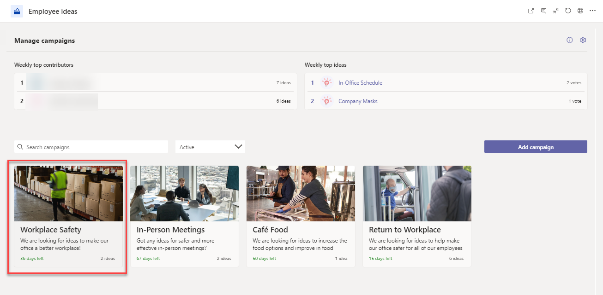

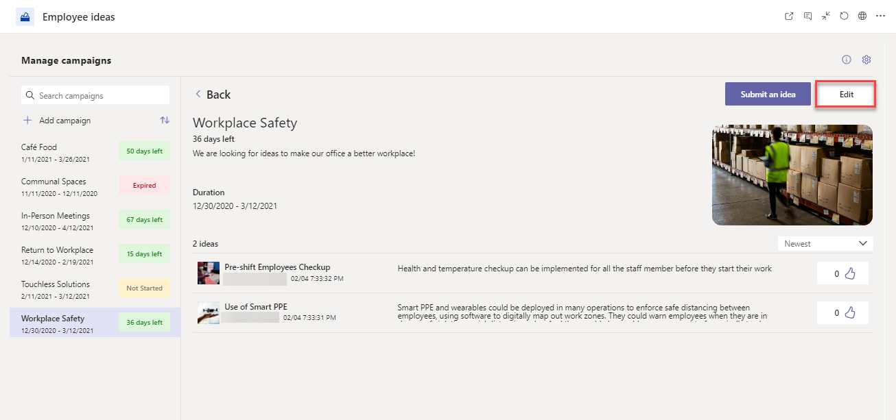

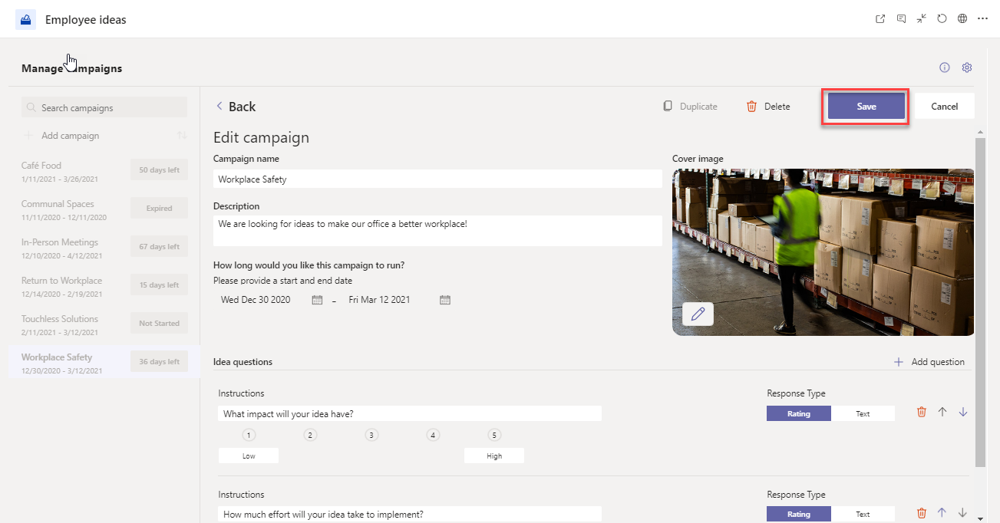

Duplicating a Campaign

Collections involved

1.  **colQuestions –** Used to collect the Idea Questions

2.  **colQuestionsToDelete -** Used to collect the questions which are deleted
    while adding / editing a campaign.

3.  **colIdeas –** Used to collect Ideas for a particular campaign.

4.  **colStockImages –** collection of stock cover images.

Variables involved

1.  **gblSelectedRecordCampaign –** global variable to store the campaign record
    which is in context.

2.  **gblSelectedRecordCampaign_FormValues –** global variable to store the
    field values of the campaign which is being added or edited.

3.  **locVisibleCampaignEdit –** local variable to control the visible property
    of the conCampaignUpsert container (indicates that an existing campaign can
    be edited if the value is true)

4.  **locVisibleCampaignView –** local variable to control the visible property
    of the conCampaignDetailCard data card (indicates the campaign can only be
    viewed in case the value is true).

5.  **locVisibleCampaignCreate –** local variable to control the visible
    property of the conCampaignUpsert container (indicates that a new campaign
    can be created if the value is true)

6.  **locBlockUserInput –** local variable used to block the User Input by
    displaying a dialog while something is being saved.

*Detailed steps*

1.  A Campaign can be duplicated by clicking on the “Duplicate” button on the
    campaign details screen.

2.  Clicking on the duplicate button would set the
    **gblSelectedRecordCampaign_FormValues** variable with the details of the
    campaign which is being duplicated (Title, Description, Start and End
    dates). The cover image would be set to blank. The title of the newly
    created campaign would be appended by (1).

3.  The value of the **locVisibleCampaignCreate** is updated to true which
    displays the **conCampaignUpsert** container.

4.  The User can make additional changes to the newly created campaign and click
    on the Add Campaign button

5.  On clicking of the Add Campaign button, the updated fields are saved to the
    Employee Idea Campaigns table (**gblSelectedRecordCampaign** variable holds
    the edited campaign record).

6.  In case there are newly added / edited questions, they would be updated in
    the **colQuestions** collection and the Employee Idea Questions table.

7.  In case any questions are deleted, they would be removed from the
    **colQuestionsToDelete** collection and the Employee Idea Questions table.

8.  The campaign submission screen is visible, and a confirmation message is
    displayed to the User.

9.  Clicking on the cancel button would navigate the user back to the Campaign
    Summary screen.

Screens

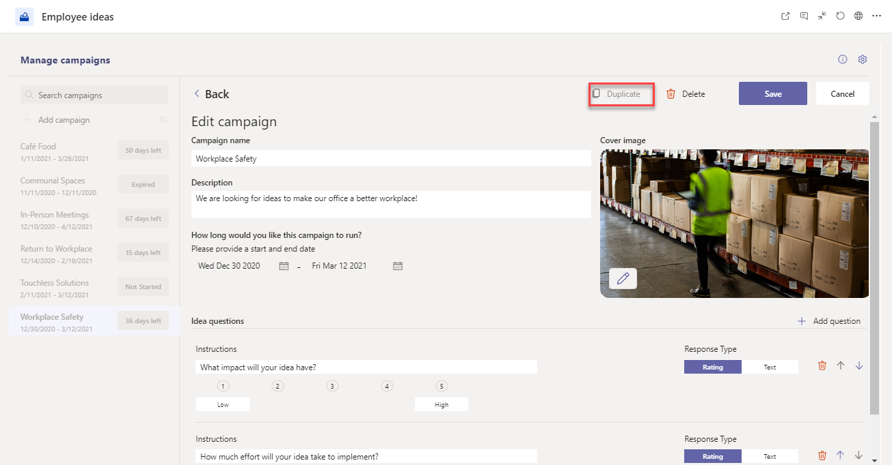

Deleting a Campaign

>   Collections involved

1.  **colIdeas –** Used to collect Ideas for a particular campaign.

*Variables involved*

1.  **gblSelectedRecordCampaign –** global variable to store the campaign record
    which is in context.

2.  **locVisibleDialog** – local variable to control the visibility of the
    dialog background.

3.  **locVisibleDialogDelete** - local variable to control the visibility of the
    delete dialog.

4.  **Detailed steps**

    1.  A Campaign can be deleted by clicking on the “Delete” button on the
        campaign details screen.

    2.  Clicking on the Delete button updates the values of the
        **locVisibleDialog** and **locVisibleDialogDelete** variables to true
        thus displaying the conConfirmDelete container (Deletion confirmation
        dialog)

    3.  The User must check the “I Understand” checkbox to proceed with deleting
        the campaign.

    4.  On click of the Delete button, the selected campaign is removed from the
        Employee Ideas Campaigns table and the related ideas are removed from
        the Employee Ideas table.

    5.  The **gblSelectedRecordCampaign** variable is set to the first campaign
        in the galCampaignDetailNav gallery and the Ideas for the same is
        campaign is fetched from the **colIdeas** collection thus displaying the
        details of the first campaign.

Screens

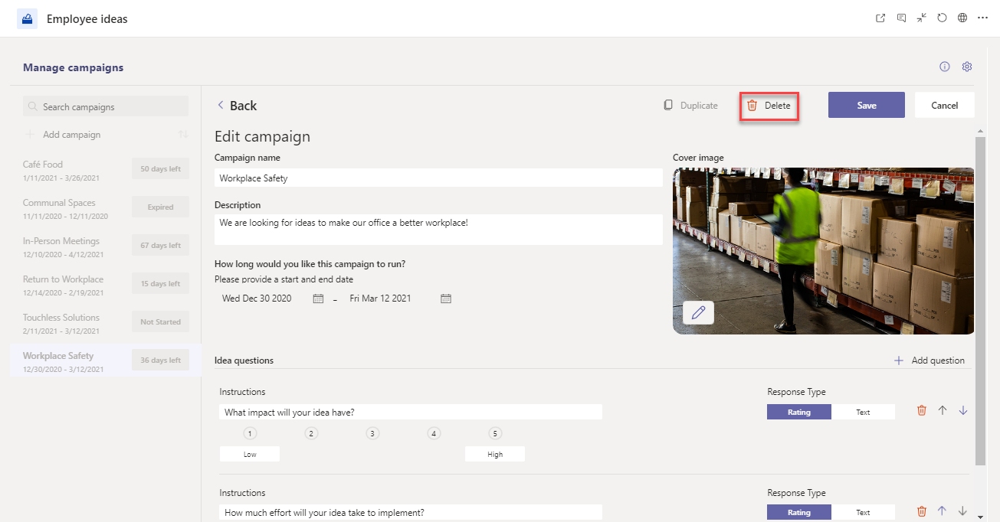

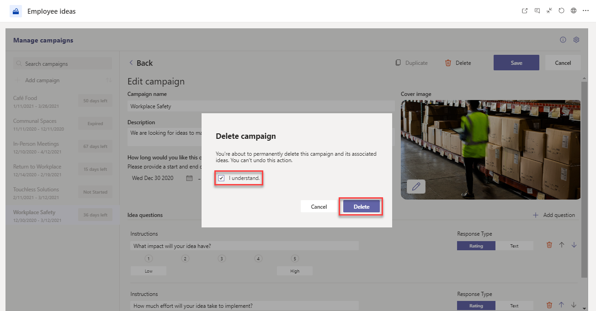

Adding an Idea Question

Collections involved

1.  **colQuestions –** Used to collect Idea Questions

Variables involved  

1.  **locVisibleCampaignEdit –** local variable to control the visible property
    of the conCampaignUpsert container (indicates that an existing campaign can
    be edited if the value is true) .

2.  **gblSelectedRecordCampaign -** global variable to store the campaign record
    which is in context.

*Detailed steps*

1.  New Idea questions can be added while a Campaign is being edited.

2.  Clicking on the “+ Add question” button will add a new entry in the
    **colQuestions** collection, The Instructions field value is set to “\*NEW
    QUESTION\*”. The default response type is set to Rating (Employee Ideas
    Response type) with the values being “High” and “Low”.

3.  The newly added question is displayed at the end of the list.

4.  Clicking on Save button would update the newly added Question to the
    Employee Idea Questions table.

Screens  
  

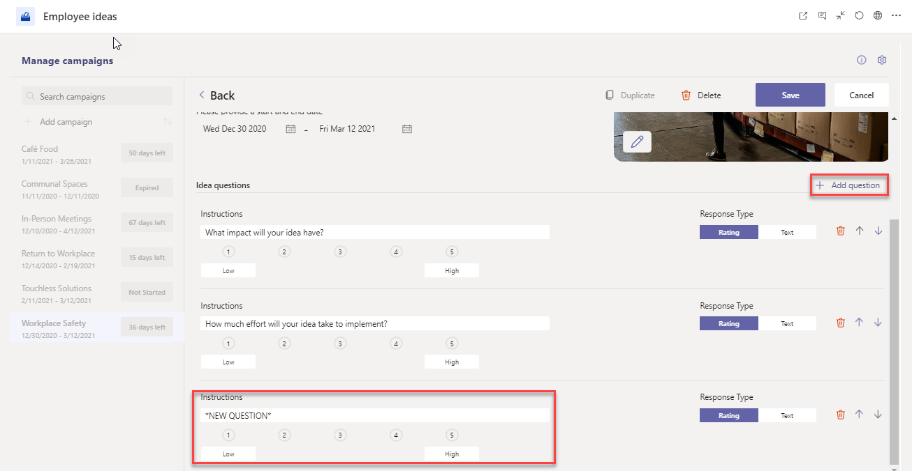

Deleting an Idea Question

Collections involved

1.  **colQuestions –** Used to collect the Idea Questions

2.  **colQuestionsToDelete -** Used to collect the questions which are deleted
    while adding / editing a campaign.

Variables involved

*Detailed steps*

1.  Existing Idea questions can be deleted while a Campaign is being edited.

2.  Clicking on the “Delete” button present next to the question would remove it
    from the **colQuestions** collection and add the deleted question the
    **colQuestionsToDelete** collection.

3.  The deleted question is also removed from the **galCampaignEditQuestions**
    gallery.

4.  Clicking on Save button would remove the deleted Question to the Employee
    Idea Questions table.

Screens

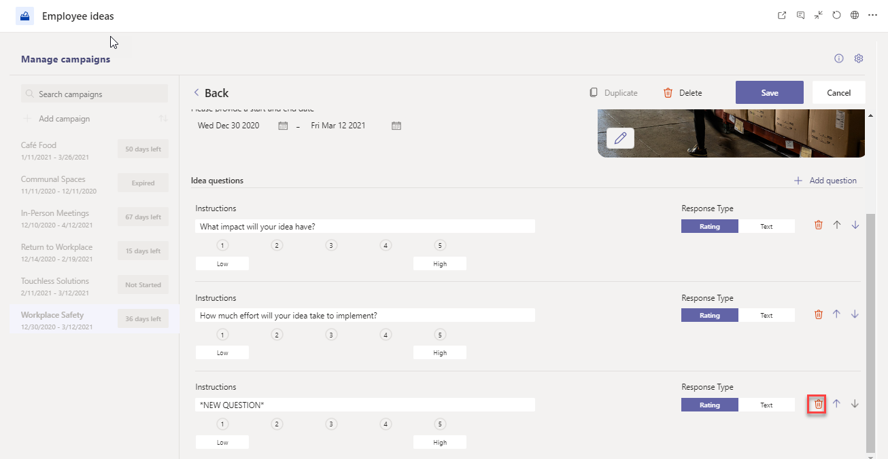

Rearranging Idea Questions

Collections involved

1.  **colQuestions –** Used to collect the Idea Questions

Variables involved

1.  **locSequenceCurrent –** Local variable to set the current sequence number
    of the question.

2.  **locSequenceNew -** Local variable to set the new sequence number of the
    question.

Detailed steps

1.  The Sequence of the Idea questions can be updated by clicking on the Up and
    Down arrows present next to the Question.

2.  The Up-arrow button is disabled for the first question and the down arrow
    button is disabled for the last question in the gallery (The display mode is
    controlled by the value of msft_sequence field).

3.  The questions in the **colQuestions** collection are rearranged by comparing
    the values of **locSequenceCurrent** and **locSequenceNew** variables.

Screens

Updating the Question Response Types

Collections involved

1.  **colQuestions –** Used to collect the Idea Questions

Variables involved

>   **None**

Detailed steps

1.  The Question response types are displayed as part of the
    **galCampaignQuestionResponseType** gallery.

2.  The visible property of the **galQuestionResponseRating** gallery is
    controlled by the Response Type selected in the
    **galCampaignQuestionResponseType** gallery by comparing the values of
    **locSequenceCurrent** and **locSequenceNew** variables.

3.  In case the Response type is selected as Rating, A list of numbers is shown,
    Lowest being 1 and highest being 5.

4.  In case the response type is selected as Text, A toggle with the options
    Long and Short is displayed.

  
Screens

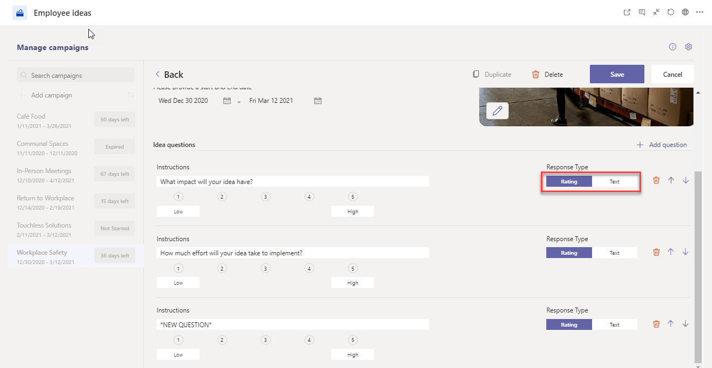

Submit a new Idea

Collections involved

1.  **colQuestions –** Used to collect the Idea Questions.

2.  **colResponses –** Used to collect Responses for the Idea Questions.

3.  **colFiles –** Used to collect the files associated with an idea.

Variables involved

1.  **gblSelectedRecordCampaign -** global variable to store the campaign record
    which is in context.

2.  **locVisibleCampaignIdea –** local variable used to control the visibility
    of the Idea details screen.

3.  **locCreateNewIdea –**

4.  **locFormRecordIdea –** local variable to store the idea record which is
    being created.

5.  **gblParamTeamId –** variable to store the Planner group ID.

6.  **gblParamChannelId –** variable to store the Planner Channel ID.

Detailed steps

1.  A new idea can be submitted from the Campaign Details screen.

2.  On click of “Submit an Idea” button, The Idea Questions for the selected
    campaign (**gblSelectedRecordCampaign**) are collected in the colQuestions
    collection.

3.  The **colResponses** collection is used to collect the Idea Responses and
    for all the idea questions present in the colQuestions collection responses
    would be collected in the **colResponses** collection.

4.  The **colFiles** collection is cleared and the locCreateNewIdea and
    locVisibleCampaignIdea variables are set to true.

5.  The value of the **locVisibleCampaignIdea** and **locCreateNewIdea**
    variables are set to true thus displaying the **conCampaignIdeaPane** and
    **conIdeaImage** containers.

6.  The **galIdeaResponses** displays the fields which the Users must fill in
    order to save the Idea.

7.  Clicking on the “New File” image allows the users to add related files.

8.  The files added for an idea are displayed as part of the **galIdeaFiles**
    gallery whose items property is set to the colFiles collection. The
    corresponding file icon is displayed (stored in the colFileIcons
    collection).

9.  Clicking on the Delete button would remove the attached file from the
    **colFiles** collection.

10. Setting the “Share in channel” toggle to on will post a message on the
    channel regarding the Idea creation.

11. Clicking on the Back button will take the User back to the Campaign summary
    screen. Clicking on the Cancel button would display the campaign details.

12. The Save button will be enabled when **colResponses** is not blank. On
    clicking of the Submit Idea button the data in **colResponses** and
    **colFiles** collection is updated to the Employee Idea Responses table and
    if the “Share in Channel” option is set to Yes, Based on the values of the
    **gblParamTeamId** and **gblParamChannelId** variables collected on Start of
    the app a post is made on the channel.

13. The data from colFiles, colIdeas, colResponses are updated to the Employee
    Idea Files, Employee Ideas and Employee Idea Responses tables respectively.

14. The value of the locVisibleCampaignIdeaSubmitted variable is set to true
    thus displaying the conIdeaSubmtted container (Idea Submitted message).

15. Clicking on the “Return to Idea List” button will set the
    locVisibleCampaignView variable to true thus displaying the Campaign
    details.

Screens

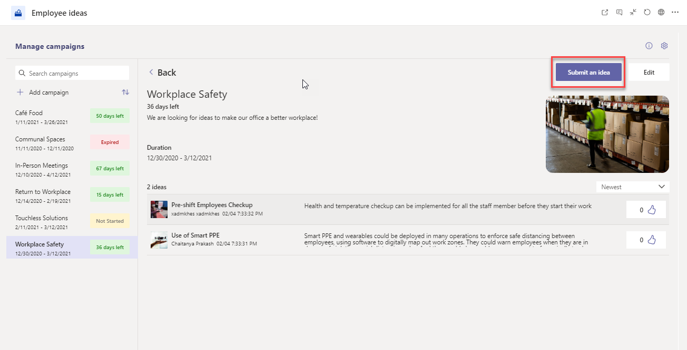

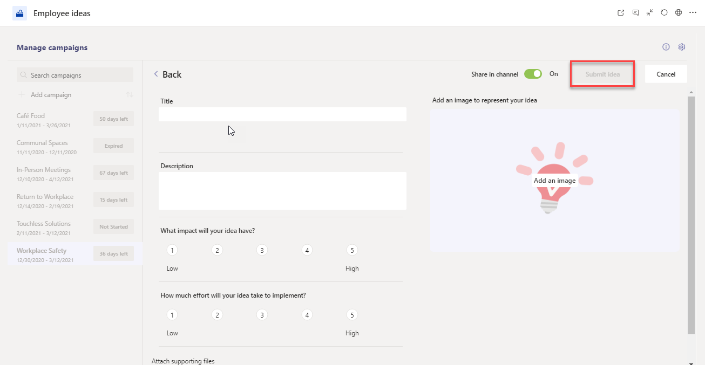

Deleting an Idea

Collections Involved

1.  **colResponses** – Used to collect Idea Responses.

2.  **colFiles** – Used to collect files associated to an Employee Idea.

Variables involved

1.  **locVisibleIdeaCommands** – local variable used to control the visibility
    of the Idea Delete button (galIdeaCommands).

2.  **gblRecordCampaignIdea** - global variable to store the campaign idea
    record which is in context.

3.  **locVisibleCampaignIdea** - local variable used to control the visibility
    of the Idea details.

4.  **locVisibleDialog** – local variable to control the visibility of the
    dialog background.

5.  **locVisibleDialogDelete** - local variable to control the visibility of the
    delete dialog.

6.  **locVisibleCampaignEdit** - local variable to control the visible property
    of the conCampaignUpsert container (indicates that an existing campaign can
    be edited if the value is true).

Detailed Steps

1.  Clicking on any of the Idea from the **galCampaignDetailsIdeas** gallery
    would set the **gblRecordCampaignIdea** variable to the selected idea and
    the corresponding details stored in the colResponses and colFiles are
    displayed.

2.  The value of the **locVisibleCampaignIdea** to true thus displaying the idea
    details.

3.  The User can delete the selected Idea record by clicking on the More icon
    next to the vote button. Clicking on the more button would display the
    delete button based on the value of **locVisibleIdeaCommands** variable.

4.  Clicking on the delete button would set the values of **locVisibleDialog**
    and **locVisibleDialogDelete** to true thus displaying the conConfirmDelete
    container (Deletion confirmation dialog).

5.  The User must check the “I Understand” checkbox to proceed with deleting the
    campaign.

6.  On click of the Delete button, the selected campaign is removed from the
    Employee Ideas Campaigns table and the related ideas are removed from the
    Employee Ideas table and the colIdeas collection is updated.

7.  The value of the locVisibleCampaignView variable is set to true thus
    displaying the campaign details.

Screens

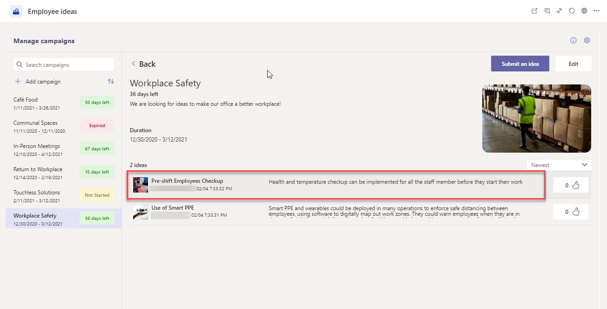

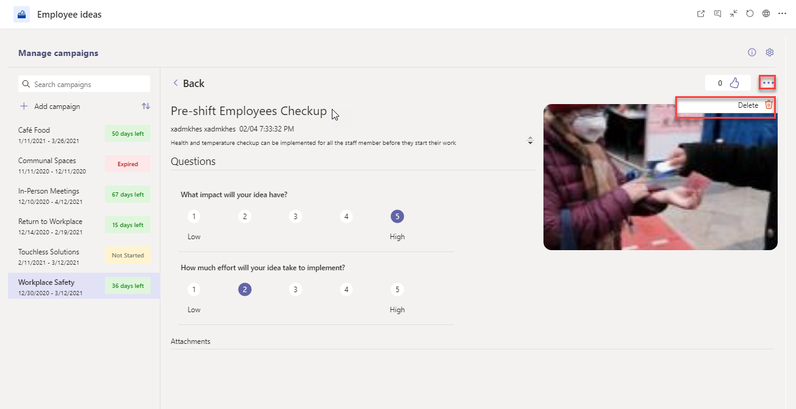

Settings Screen

Collections involved

1.  **colIdeaStats_Raw –** to collect Raw Ideas, for Stats with Owner Details

Variables involved

1.  **locBlockUserInput –** local variable used to block the User Input by
    displaying a dialog while something is being saved.

2.  **gblRecordSettings –** global variable used to set the Team and Channel Id
    to the Employee Ideas settings table.

3.  **gblSettingNotificationChannelId –** global variable to store the channel
    ID where notifications will be posted.

4.  **gblDropdownChannel –** global variable to store the list of channels for a
    group.  
    

Detailed Steps

1.  The Users have the feasibility to update whether only Team owners will be
    able to Add Campaigns and select the channel where messages will be posted.

2.  The list of channels in the dropdown are from the **gblDropdownChannel**
    variable.

3.  The Save button is enabled when the dropdown value selected or the Team
    Owner restricted value is different is different from the value stored in
    the variable **gblRecordSettings** (which is set on start of the app).

4.  On click of the Save button, the details are updated in the Employee Idea
    Settings table and will navigate to the Campaign Summary Screen and the
    value of the **locBlockUserInput** is set to true which makes sure that the
    User does not make any further updates while Saving is in progress.

5.  Clicking on the cancel button takes the user back to the previous screen.

Screens

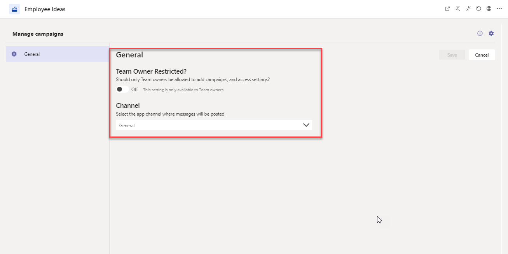

About screen

Collections involved

>   **None**

Variables involved

>   **None**

Detailed steps

1.  Clicking the “Customize using Power Apps button” on the **conHeader_About**
    container opens Power Apps tool link in Microsoft teams.

2.  There are help links available in the galAbout_HelpLinks gallery.

3.  Clicking on the “Learn how to customize this app” button navigates to an
    external link which explains on how to make customizations on the app.

4.  Clicking on the “Send us your ideas” button navigates to an external link
    where ideas can be posted for the Milestones app.

5.  Clicking on the “Engage with community” button navigates to the Power Apps
    Community.

6.  The **conAbout_AppVideo** container contains the video link which provides
    an overview of the Milestones app.

7.  The gallery **galAbout_OtherApps** contains the links to other Microsoft
    apps.

8.  Clicking on the “View app” button navigates to the app page in the Microsoft
    Teams app store.

9.  Clicking on the “App Overview” button navigates to the App overview video on
    YouTube.

10. The **conAbout_Version** gives information about the app versioning.

11. The **conAbout_Version** gives information about the app versioning.

Screens

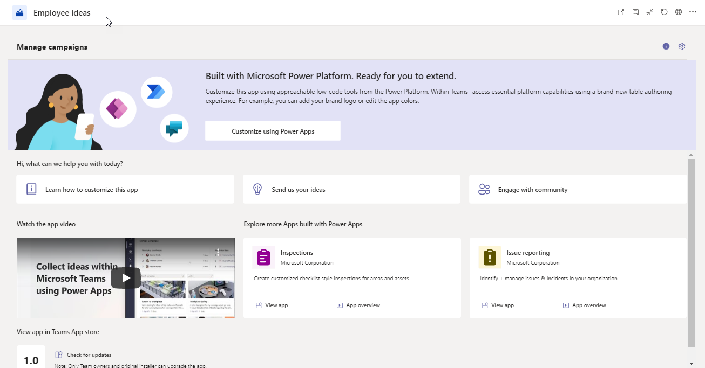

Collections

Use a collection to store data that users can manage in your app. A collection
is a group of items that are similar, such as products in a product list.

Important Functions

1.  **Collect**: The Collect function adds records to a data source.

2.  **Clear**: The Clear function deletes all the records of a collection. The
    columns of the collection will remain.

3.  **ClearCollect**: The ClearCollect function deletes all the records from a
    collection. And then adds a different set of records to the same collection.
    With a single function, ClearCollect offers the combination of Clear and
    then Collect.

| Collection Name           | Description                                                                 | Screen Used                                                                        |
|---------------------------|-----------------------------------------------------------------------------|------------------------------------------------------------------------------------|
| colFileIcons              | Collection to store the App File type and Icon                              | OnStart property of the App                                                        |
| colStockImages            | Collection to store the stock images used in the app                        | OnStart property of the App                                                        |
| colUserSettings           | Collection to collect User Settings CDS Record if it exists                 | OnStart property of the App                                                        |
| colocalization            | collection of localized text based on user’s language.                      | OnStart property of the App                                                        |
| colIdeaStats_Raw          | Collections to collect Raw Ideas, for Stats with Owner Details              | OnStart property of the App                                                        |
| colVotes                  | Collection to store the number of votes given to an Idea                    | OnStart property of the App                                                        |
| colIdeas                  | Collection used to store Employee Ideas                                     | Campaign Detail Screen                                                             |
| colResponses              | Collection used to store Idea responses                                     | Campaign Detail Screen                                                             |
| colFiles                  | Collection used to collect files associated to an idea                      | Items property of a gallery on the idea creation screen                            |
| colQuestions              | Collection to collect the Idea questions                                    | Items property of a gallery on the campaign details screen                         |
| colQuestionsToDelete      | Used to collect the questions to be deleted                                 | OnClick property of the delete button on the campaign details screen               |
| colVoteCounter            | Used to count the number of votes received by an idea                       | OnStart property of the App                                                        |
| colCdsSampleDataIdeaUsers | Build Collection with random owner for Ideas, 20% current user, else random | OnSelect property of a Randomize Sample data button (hidden) on the Loading screen |
| colSampleDataIdeas        | Collection used to collect Active sample Employee ideas                     | OnSelect property of a Randomize Sample data button (hidden) on the Loading screen |
| colSampleDataUsers        | Collection used to collect Sample Users                                     | OnSelect property of a Randomize Sample data button (hidden) on the Loading screen |

Global Variables

| Variable Name                        | Type    | Description                                                                        |
|--------------------------------------|---------|------------------------------------------------------------------------------------|
| gblAppLoaded                         | Boolean | To check whether the App is completely loaded                                      |
| gblAppContext                        | Boolean | To check the context of where the app is running                                   |
| gblUserLanguage                      | Text    | To check the logged in User’s Language                                             |
| gblParamTeamId                       | Text    | To set the Group ID from Planner                                                   |
| gblParamChannelId                    | Text    | To set the Channel ID from Planner                                                 |
| gblThemeDark                         | Boolean | To check whether the Teams theme is set to Dark                                    |
| gblThemeHiCo                         | Boolean | To check whether the Teams theme is set to High Contrast                           |
| gblMobileMode                        | Boolean | To check whether the host client type is Android or iOS                            |
| gblRecordSettings                    | Record  | To check Teams settings for current team and channel ID                            |
| gblRandomizeData                     | Boolean | Variable to check whether the data must be randomized (implies first run in Team). |
| gblRecordUserSettings                | Record  | Variable to use the Oldest Record in case multiple records exist                   |
| gblUserFirstName                     | Text    | Variable to set the full name of the User                                          |
| gblDropdownChannel                   | Table   | To get the channels for a particular group in Microsoft Teams                      |
| gblPadding                           | Record  | Used to set padding values in the app                                              |
| gblMobileWidth                       | Number  | Used to set the global Mobile Width                                                |
| gblToday                             | Date    | Variable to set the current date as a date/time value                              |
| gblUserRecord                        | Record  | Variable to get the User record of the logged in User                              |
| gblSettingNotificationChannelId      | Text    | Variable to set the Notification channel ID                                        |
| gblSettingTeamId                     | Text    | Variable to set the Notification Team ID                                           |
| gblSelectedRecordCampaign            | Record  | Variable to get the Selected campaign record                                       |
| gblRecordCampaignIdea                | Record  | Variable to get the Selected campaign Idea                                         |
| gblSelectedRecordCampaign_FormValues | Record  | variable to store the field values of the campaign which is being added or edited. |
| gblAppSetting_inputMobileOnWeb       | Boolean | Variables to Scale fonts for mobile-oriented apps, running in desktop              |
| gblAppSetting_inputMobile            | Boolean | Variables to Scale fonts for mobile-oriented apps                                  |
| gblAppSetting_inputScaleFontsby      | Number  | Use this variable for scaling all fonts by a fixed amount                          |
| gblAppColors                         | Record  | Variable to set the Color value in the app                                         |
| gblAppSizes                          | Record  | Variable to set the Color value in the app                                         |
| gblAppStyles                         | Record  | Variable to set the Styling values in the app                                      |
| gblAppManager                        | Boolean | To check the User team role                                                        |
