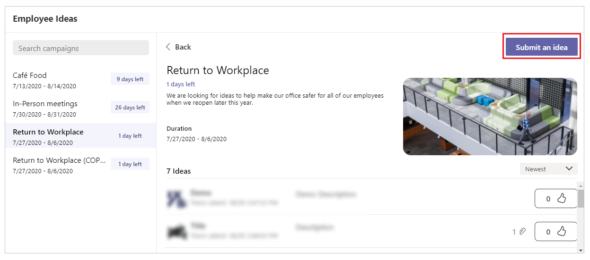
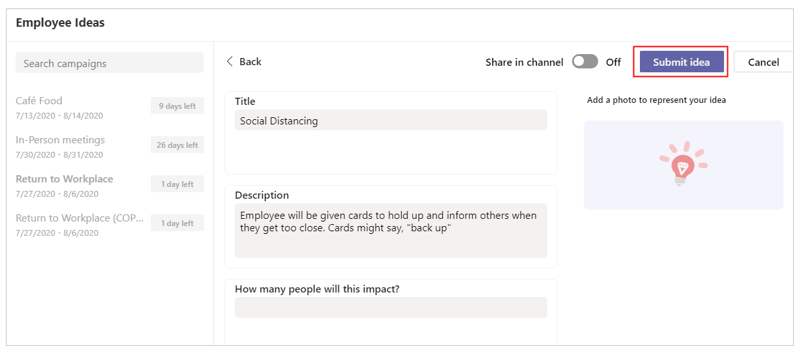
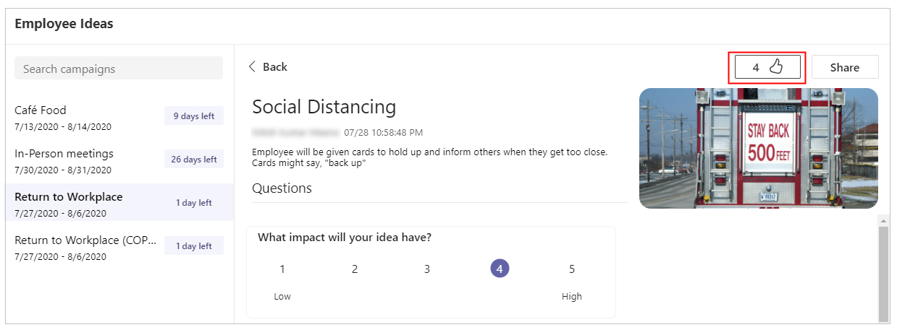
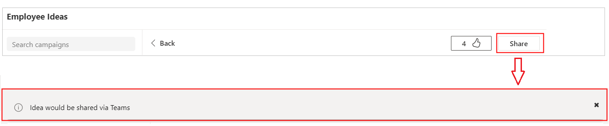

# Employee Ideas and Manage Campaigns sample apps

[!INCLUDE [cc-beta-prerelease-disclaimer.md](../includes/cc-beta-prerelease-disclaimer.md)]

In this tutorial, learn about the Employee Ideas and Manage Campaigns apps, and how to use them effectively.

## Overview

Employee Ideas and Manage Campaigns consists of two different apps:

- [Manage Campaigns app](#manage-campaigns-app)

    This app is used by team managers to perform the following activities:

    - Set up and configure an idea campaign (a category for grouping ideas around common themes).
    - Configure a standard submission form that employees need to submit for each idea.
    - Review idea campaigns, and manage the list of campaigns and ideas.
    - Edit and delete campaigns.
    - Review leaderboards of ideas.
    - Vote for and share prioritized ideas.

- [Employee Ideas app](#employee-idea-app)

    This app is used by employees for the following activities:

    - Submit ideas for a campaign.
    - View other team members' ideas.
    - Vote on the most-liked ideas.
    - Review how their own idea is performing compared to others within a campaign.

## Prerequisites

Before using this app:

1. Find the app in the Microsoft Teams store.
1. Install the app.
1. Set up the app for the first use.

For details about the above steps, go to [Use sample apps from the Teams store](use-sample-apps-from-teams-store.md).

## Manage Campaigns app

The Manage Campaign app gives the manager the following capabilities.

- [Configure the app](#configure-the-app)
- [Edit the app configuration](#edit-the-app-configuration)
- [Add an idea campaign](#add-an-idea-campaign)
- [Edit an idea campaign](#edit-an-idea-campaign)
- [Delete an idea campaign](#delete-an-idea-campaign)
- [Submit a new idea](#submit-a-new-idea)
- [Review and vote for an idea](#review-and-vote-for-an-idea)
- [Share an idea](#share-an-idea)

### Configure the app

Manage Campaigns app configuration is only required for the first time.

To configure the app:

1. Sign in to Teams.

1. Select the team.

1. Select the **Manage Campaigns** tab in Teams.

1. Select the channel.

1. Select **Let's go**.

    

### Edit the app configuration

To edit the app configuration:

1. Select the **Manage Campaigns** tab in Teams.

1. Select app settings.

    

1. Change the channel.

    

1. Select **Save**.

### Add an idea campaign

To start with the Employee Ideas app, you'll need to add campaigns.

To add campaigns:

1. Select the **Manage Campaigns** tab in Teams.

1. Select **Create Campaign**.

1. Enter the campaign details such as campaign name, description, campaign
    start and end date, and a cover image.

1. Add idea questions.

1. Select **Save**.

    

### Edit an idea campaign

To edit an existing idea campaign:

1. Select the **Manage Campaigns** tab in Teams.

1. Select the idea campaign you want to edit.

1. Select **Edit**.

1. Change the campaign as required.

1. Select **Save**.

    

### Delete an idea campaign

To delete an idea campaign:

1. Select the *Manage Campaigns** tab in Teams.

1. Select the idea campaign you want to edit.

1. Select **Edit**.

1. Select **Delete**.

1. Confirm by selecting the **I understand** confirmation check box.

1. Select **Delete** to delete the record permanently.

    

### Submit a new idea

To submit a new idea:

1. Select the **Manage Campaigns** tab in Teams.

1. Select the active idea campaign you want to submit idea for.

1. Select **Submit an idea**.

    

1. Enter the idea campaign details such as title and description.

1. Enter the answers to the remaining questions on the form.

1. (Optional) Upload supporting files.

1. Select **Submit idea**.

    

### Review and vote for an idea

To review and vote for an idea:

1. Select the **Manage Campaigns** tab in Teams.

1. Select an active campaign.

1. Select an associated idea to see the details.

1. Select **Like** to vote for the idea.

    

### Share an idea

To share an idea:

1. Select the **Manage Campaigns** tab in Teams.

1. Select an active campaign.

1. Select an associated idea to see the details.

1. Select **Share** to share the idea.

    

### Review existing idea campaigns

To review existing idea campaigns:

1. Select the **Manage Campaigns** tab in Teams.

1. Review the idea campaign.

    

## Employee Ideas app

The Employee Ideas app gives employees the following capabilities.

- [Submit a new idea](#submit-a-new-idea-1)
- [Submit a new idea and post it in a channel](#submit-a-new-idea-and-post-it-in-a-channel)
- [Review and upvote an idea](#review-and-upvote-an-idea)
- [Share an idea](#share-an-idea-1)

### Submit a new idea

To submit a new idea:

1. Select the **Employee Ideas** tab in Teams.

1. Select any idea campaign you want to submit an idea for.

1. Select **Submit an idea**.

    

1. Enter the idea campaign details such as title and description.

1. Enter the answers to the remaining questions on the form.

1. (Optional) Upload supporting files.

1. Select **Submit idea**.

    

### Submit a new idea and post it in a channel

To submit a new idea and post it in a channel:

1. Select the **Employee Ideas** tab in Teams.

1. Select any idea campaign you want to submit an idea for.

1. Select **Submit an idea**.

1. Enter the idea campaign details such as title and description.

1. Set **Share in channel** to **On**.

1. Enter the answers to the remaining questions on the form.

1. (Optional) Upload supporting files.

1. Select **Submit idea**.

    

Below is a sample message that gets posted in a channel when an idea is submitted.

### Review and upvote an idea

To review and upvote an idea:

1. Select the **Employee Ideas** tab in Teams.

1. Select a campaign.

1. Select an associated idea to see details.

1. Select **Like** to vote for the idea.

    

### Share an idea

To share an idea:

1. Select the **Employee Ideas** tab in Teams.

1. Select a campaign.

1. Select an associated idea to see details.

1. Select **Share** to share the idea.

    

### See also

[Inspection sample app](inspection.md)  
[Issue Reporting sample app](issue-reporting.md)
