# Employee ideas sample app

In this tutorial, learn about the Employee ideas app, and how to use them effectively.

## Overview

Employee ideas app is used by the Teams users to perform the following activities:

- Set up and configure an idea campaign (a category for grouping ideas around common themes).
- Configure a standard submission form that employees need to submit for each idea.
- Review idea campaigns, and manage the list of campaigns and ideas.
- Edit and delete campaigns.
- Review leaderboards of ideas.
- Vote for and share prioritized ideas.
- Submit ideas for a campaign.
- View other team members' ideas.
- Vote on the most-liked ideas.
- Review how their own idea is performing compared to others within a campaign.

Watch this video for a demonstration of this app.
> [!VIDEO https://www.microsoft.com/videoplayer/embed/RE4LK0d]

> [!NOTE]
> - Before you can use this app, you may be asked for your permissions to use the connection. More information: [Allow connections in sample apps](use-sample-apps-from-teams-store.md#step-1---allow-connections)
> - This app is available in three different Teams themes: Default, Dark and High contrast. When you [change the theme in Teams](https://support.microsoft.com/en-us/office/change-settings-in-teams-b506e8f1-1a96-4cf1-8c6b-b6ed4f424bc7), the app automatically updates to match the selected theme. More information: [Get the Teams theme using the Teams integration object](use-teams-integration-object.md#get-the-teams-theme)

## Prerequisites

Before using this app:

1. Find the app in the Microsoft Teams store.
1. Install the app.
1. Set up the app for the first use.

For details about the above steps, go to [Use sample apps from the Teams store](use-sample-apps-from-teams-store.md).

## Configure the app

The Employee ideas app configuration is only required for the first time.

To configure the app:

1. Sign in to Teams.

1. Select the team.

1. Select the **Employee ideas** tab in Teams.

1. Select the channel.

1. Select **Let's go**.

    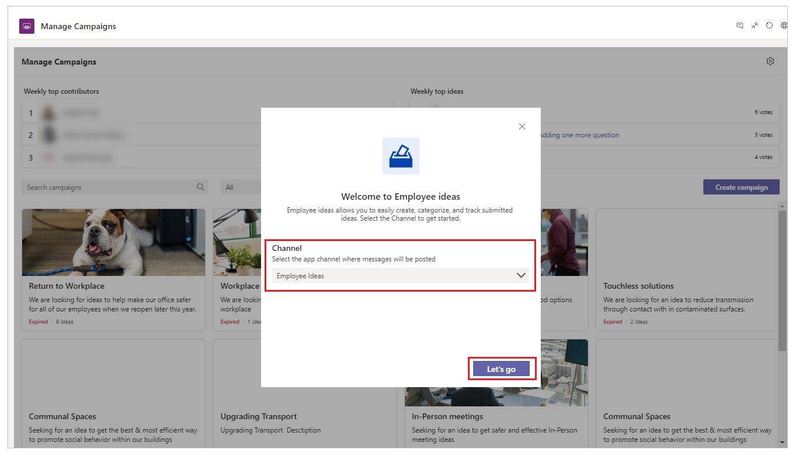

## Edit the app configuration

To edit the app configuration:

1. Select the **Employee ideas** tab in Teams.

1. Select app settings.

    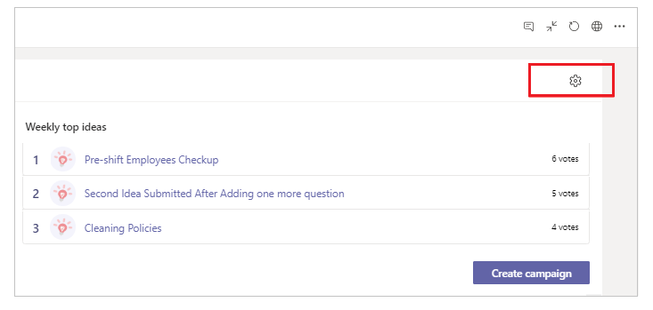

1. Change the channel.

    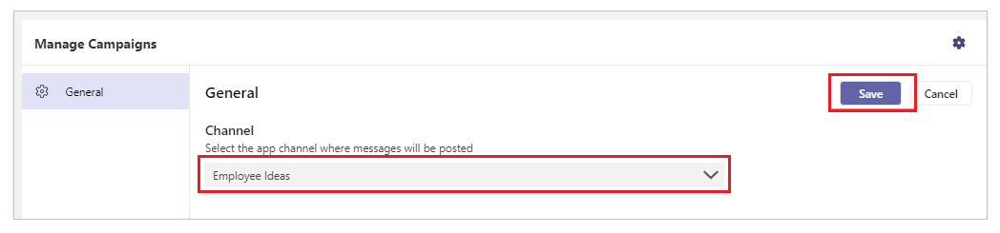

1. Select **Save**.

## Add an idea campaign

To start with the Employee Ideas app, you'll need to add campaigns.

To add campaigns:

1. Select the **Employee ideas** tab in Teams.

1. Select **Create Campaign**.

1. Enter the campaign details such as campaign name, description, campaign
    start and end date, and a cover image.

    > [!TIP]
    > Cover image can be chosen from a set of available image templates.

1. Add idea questions.

    > [!NOTE]
    > - By default, there are 2 questions.
    > - The response type for each question can be of text format, or a rating (1 being the lowest, 5 being the highest).
    > - Users can also:
    >    - Add any number of idea questions, and choose relevant response type.
    >    - Change order of the questions.
    >    - Delete idea questions.

1. (Optional) Select **Post to channel**.

1. (Optional) Select  to add **Cover image**, and select a cover image of your choice. You can also upload a custom image.

1. Select **Save**.

    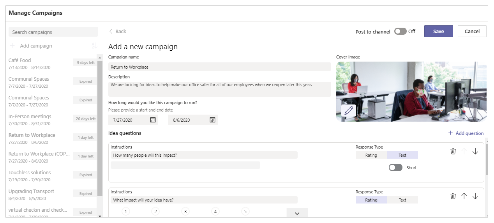

If **Post to channel** is selected, the message is posted to the channel when the campaign is created.

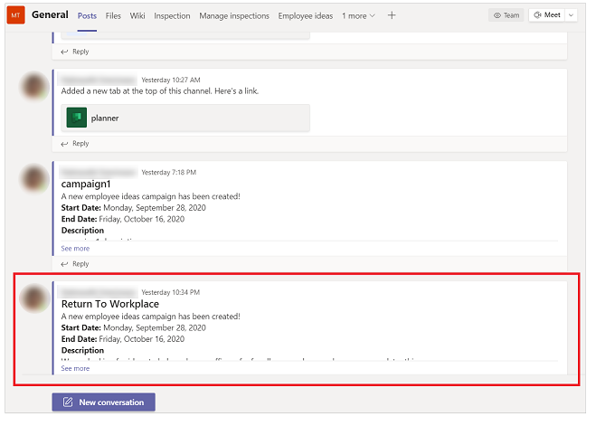

## Edit an idea campaign

To edit an existing idea campaign:

1. Select the **Employee ideas** tab in Teams.

1. Select the idea campaign you want to edit.

1. Select **Edit**.

1. Change the campaign as required.

1. Select **Save**.

    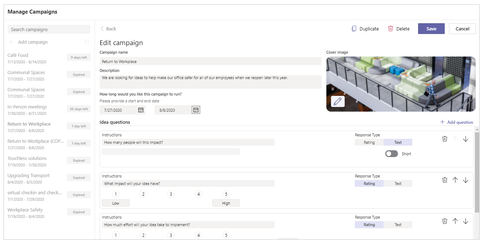

## Delete an idea campaign

To delete an idea campaign:

1. Select the **Employee ideas** tab in Teams.

1. Select the idea campaign you want to edit.

1. Select **Edit**.

1. Select **Delete**.

1. Confirm by selecting the **I understand** confirmation check box.

1. Select **Delete** to delete the record permanently.

    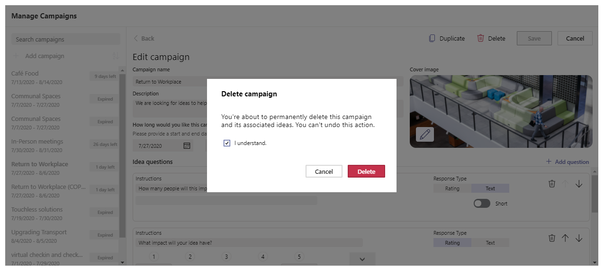

## Duplicate an idea campaign

To duplicate an idea campaign:

1. Select the **Employee ideas** tab in Teams.

1. Select the idea campaign that you want to duplicate.

1. Select **Duplicate**.

    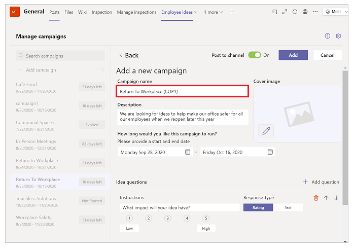

    A copy of the selected campaign is created, with the name suffix "(1)".

1. Select **Add** to save the campaign, or **Cancel** to discard the changes.

## Review existing idea campaigns

To review existing idea campaigns:

1. Select the **Employee ideas** tab in Teams.

1. Review the idea campaign.

    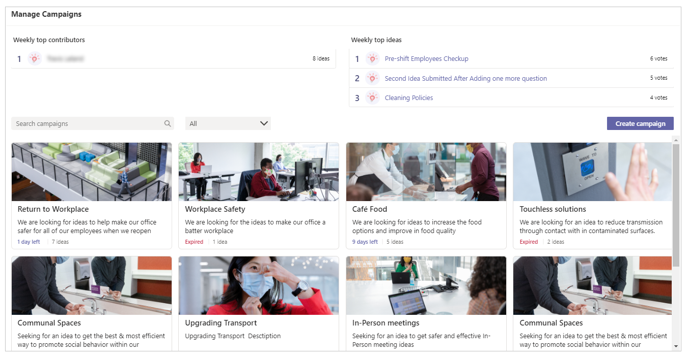

## Submit a new idea

To submit a new idea:

1. Select the **Employee ideas** tab in Teams.

1. Select the active idea campaign you want to submit idea for.

1. Select **Submit an idea**.

    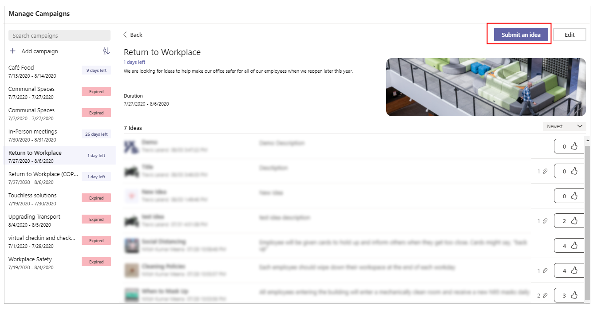

1. Enter the idea campaign details such as title and description.

1. Enter the answers to the remaining questions on the form.

1. (Optional) Upload supporting files.

1. Select **Submit idea**.

    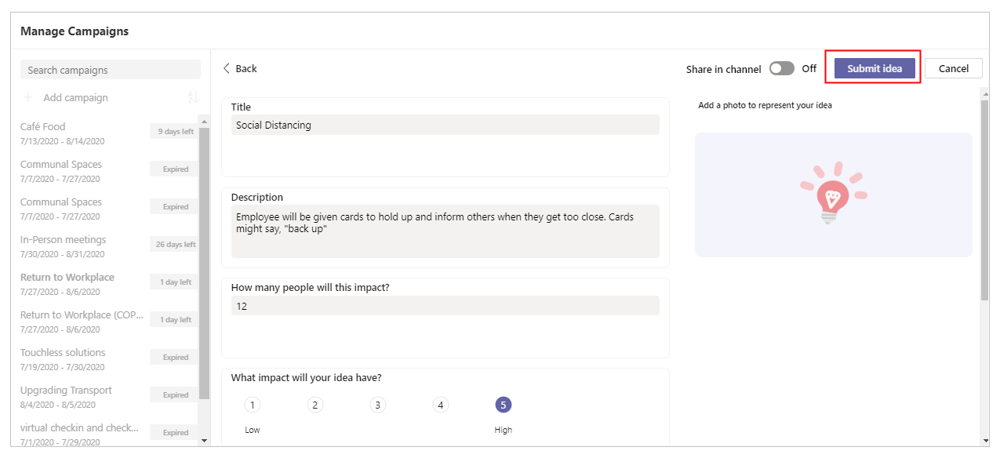

## Review and vote for an idea

To review and vote for an idea:

1. Select the **Employee ideas** tab in Teams.

1. Select an active campaign.

1. Select an associated idea to see the details.

1. Select **Like** to vote for the idea.

    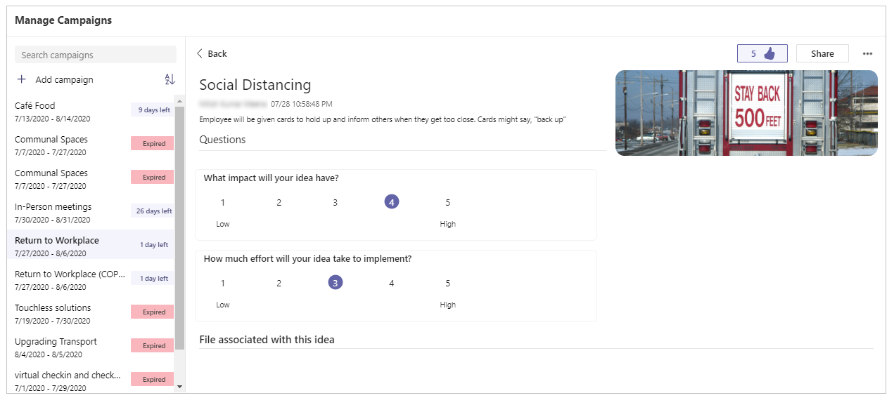

## Submit a new idea and post it in a channel

To submit a new idea and post it in a channel:

1. Select the **Employee Ideas** tab in Teams.

1. Select any idea campaign you want to submit an idea for.

1. Select **Submit an idea**.

1. Enter the idea campaign details such as title and description.

1. Set **Share in channel** to **On**.

1. Enter the answers to the remaining questions on the form.

1. (Optional) Upload supporting files.

1. Select **Submit idea**.

    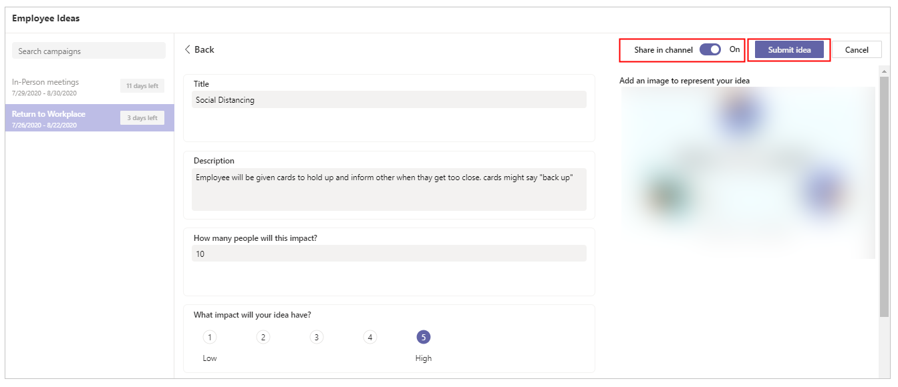

Below is a sample message that gets posted in a channel when an idea is submitted.

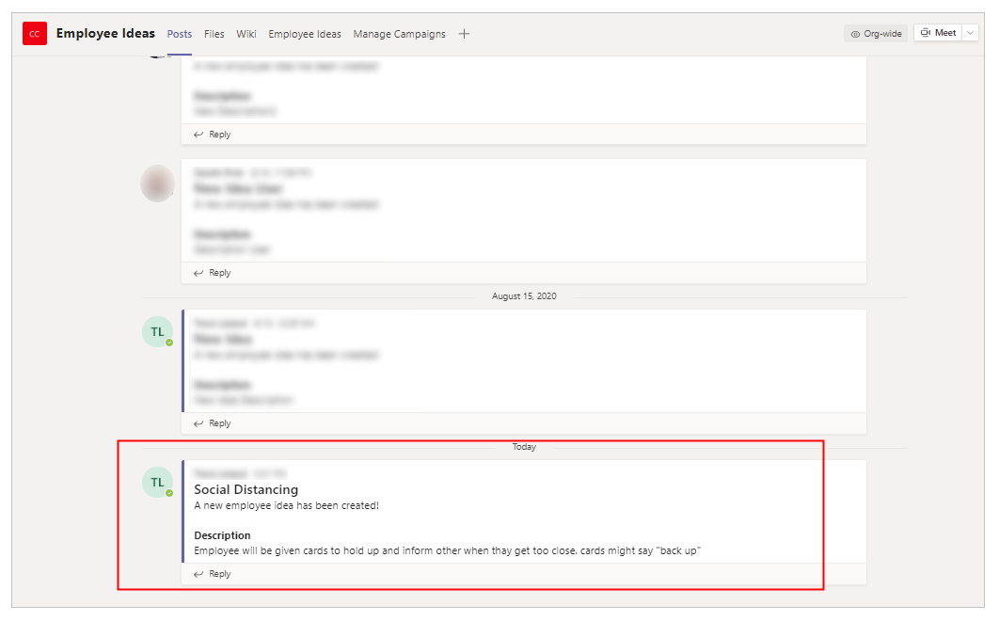

## Delete an idea

To delete an idea:

1. Select the **Employee Ideas** tab in Teams.

1. Select the campaign.

1. Select the idea to see the details.

1. Select .

1. Select **Delete**.

    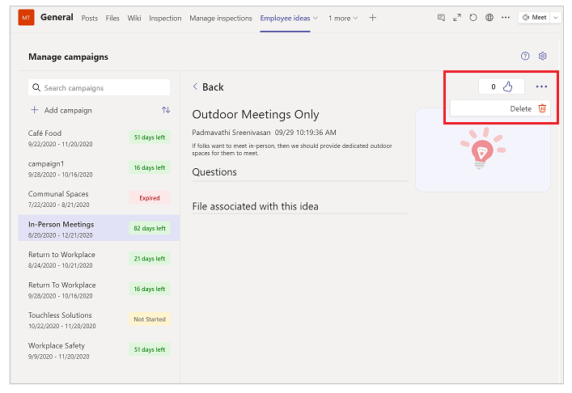

1. Select the checkbox **I understand** to confirm.

1. Select **Delete**.

    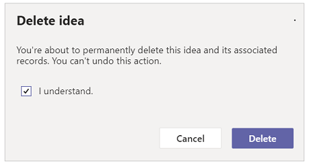

### See also

- [Deploy Employee Ideas app as broad distribution app](deploy-employee-ideas-broad-distribution.md)
- [Understand Employee ideas app architecture](employee-ideas-architecture.md)
- [Customize employee ideas app](customize-employee-ideas.md)
- [Sample apps FAQs](sample-apps-faqs.md)
- [Use sample apps from the Microsoft Teams store](use-sample-apps-from-teams-store.md)

[!INCLUDE[footer-include](../includes/footer-banner.md)]