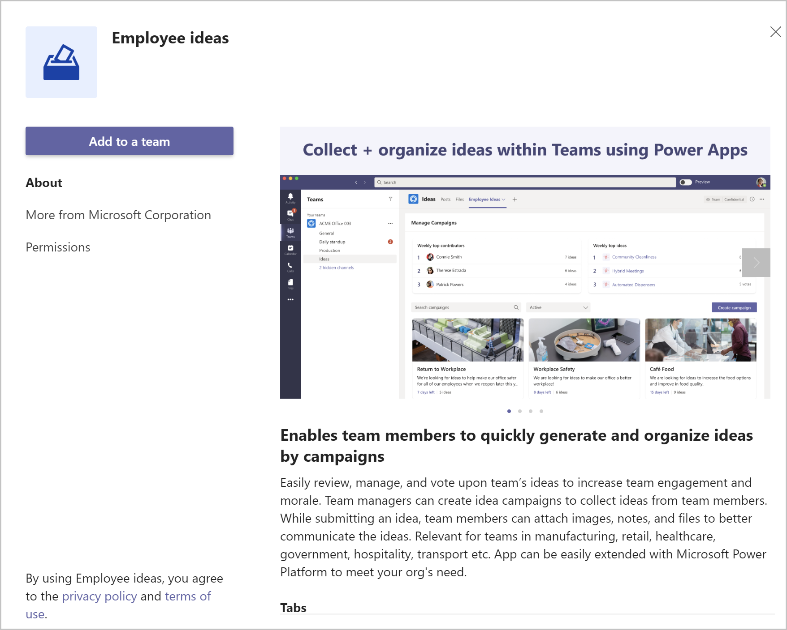
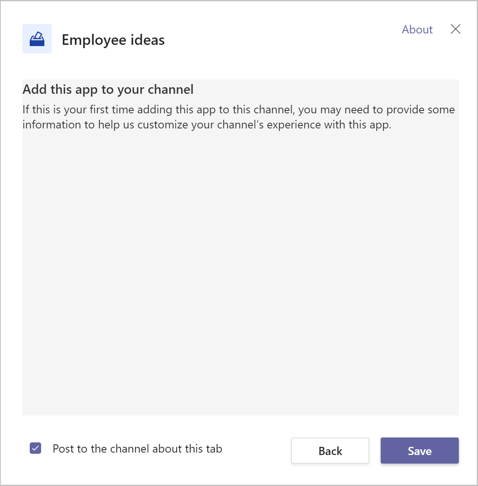
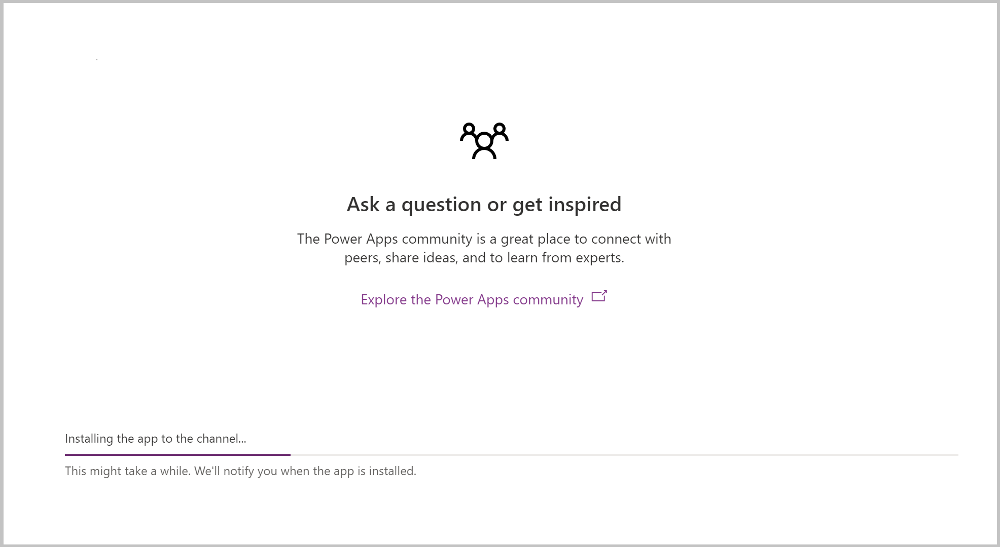
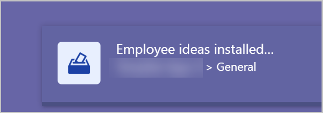

# Enable Power Apps and Dataverse for Teams in your environment

Introduced in September 2020, *Microsoft Dataverse for Teams* is a built-in, low-code data platform for Microsoft Teams that empowers users to build custom apps, bots, and flows in Microsoft Teams by using Power Apps, Power Virtual Agents, and Power Automate. Dataverse for Teams—built on Microsoft Dataverse—provides relational data storage, rich data types, enterprise-grade governance, and one-Select solution deployment to the Microsoft Teams app store. More information: [Dataverse for Teams overview](https://docs.microsoft.com/powerapps/teams/overview-data-platform).

In this topic we will cover how to provision Dataverse for Teams and Power Apps in your Teams environment.

## Provisioning Dataverse for Teams

Dataverse for Teams is provisioned in your Teams environment automatically when you create an app or you install one of the pre-made template apps for Teams.

### Build an app

The first way to provision Dataverse for Teams in your Teams environment is to create a new app. You can create an app using the following steps:

1.  Create the Team in which you want to provision Dataverse for Teams

2.  From the left-side app menu. Select the ellipses (…).

3.  Search for **Power Apps** and open the Power Apps tile.

4.  Right-click on Power Apps icon and select **Pop out app** to open Power Apps in a new window. This will prevent the app from being closed as you navigate Microsoft Teams.

5.  Select **Start now**.

6.  Select the Team in which the app should be created.

7.  Select **create**.

8.  Dataverse for Teams will be provisioned in the Team you selected in step 6. A message notifies you that the environment is being prepared.

1.  Select **Done**.

2.  Give your app a name and select **save**.

3.  Create your data tables. For more information see [Create a table in Teams - Power Apps \| Microsoft Docs](https://docs.microsoft.com/powerapps/teams/create-table).

4.  Create your app by adding screens, connections, and controls. For more information see [Build an app in Teams using Power Apps and Dataverse for Teams to retrieve Power Platform videos for readiness - Power Apps \ Microsoft Docs](https://docs.microsoft.com/powerapps/teams/tutorial-buildapp-retrieve-videos).

5.  Publish your app. For more information, see [Publish your app using Power Apps app in Teams - Power Apps \| Microsoft Docs](https://docs.microsoft.com/powerapps/teams/publish-and-share-apps).

You now have Dataverse for Teams and Power Apps in your Team!

## Install a template app

The second way to provision Dataverse for Teams in your Team is by installing one of the ready-made template apps for Teams. These are fully functional app that provide a complete experience, but are also easy to enhance and configure to meet your specifications.

There are currently 8 template apps from which to choose. To learn more about the sample apps for Teams, see [Use sample apps from teams store - Power Apps \| Microsoft Docs](https://docs.microsoft.com/powerapps/teams/use-sample-apps-from-teams-store).

In this example, we are going to install the Employee Ideas app (aka.ms/TeamsEmployeeIdeas).

## Installing Employee Ideas Template app

The Employee Ideas app template for Microsoft Teams enables team members to quickly generate and organize ideas by campaigns. The app can be installedd from the Microsoft Teams store.

1.  Create a Team in Microsoft Teams

2.  Add users who should have access to the team, either as owners or team members

3.  If you don’t want the app to be installed in the General channel, add a
    channel to the team

4.  Go to aka.ms/teamsemployeeideas

5.  Select **Add to a Team**

    

6.  Search for the channel in which you wish to install the app

    

7.  By default, the app will notify team members that the app has been added to the team. If you don’t want to notify the team, uncheck the **Post to the channel about this tab** checkbox.

8.  Select **Save**

    

The Employee Ideas app will be installed in the selected channel. The installation process will show you the installation progress, as well as helpful tips on how to get the most out of the app. You can navigate to other areas in Teams while the installation completes.

When installation is complete, you will receive a notification in the lower right corner of the Teams window.

Select **Allow** to allow connection to the connectors used by the app

Verify the team and channel in which you want channel notifications to be installed, then Select **Let’s go.**

The splash screen will appear—if you don’t want to see the splash screen the next time you open the Employee ideas app, check the **Don’t show this again** checkbox.

Select **Got it.**

Dataverse for Teams is now provisioned in your Team and you can create or install other apps in the same Team.
