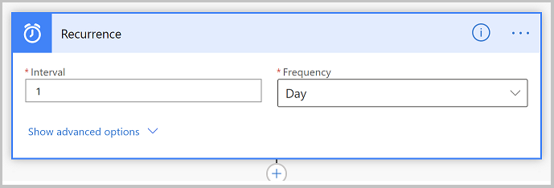
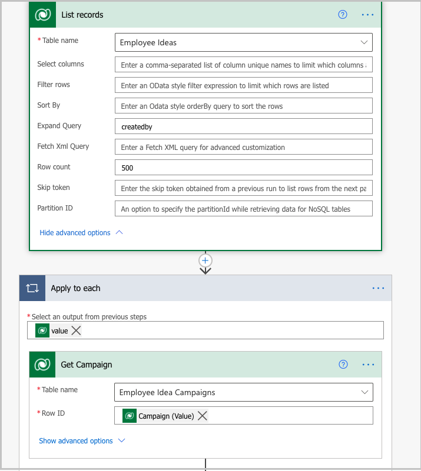
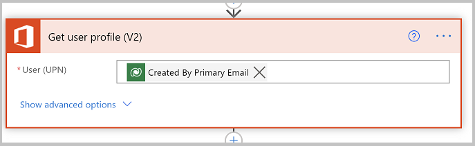
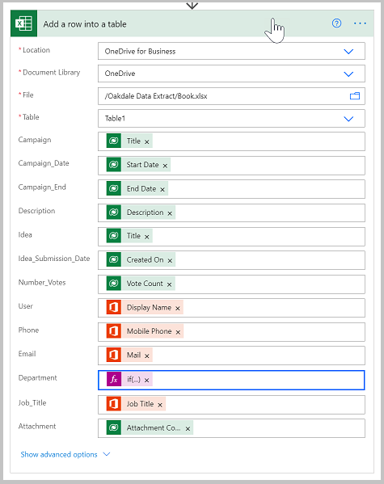
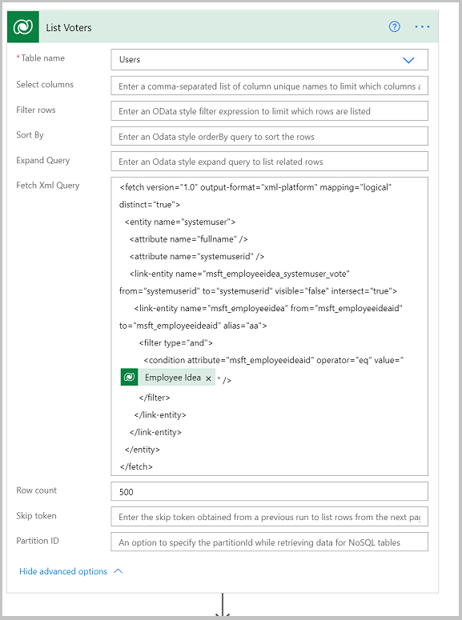
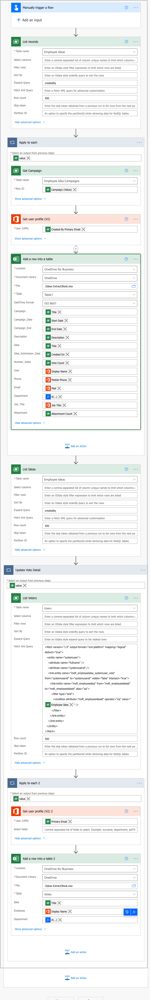
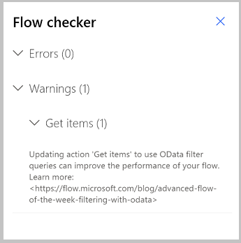
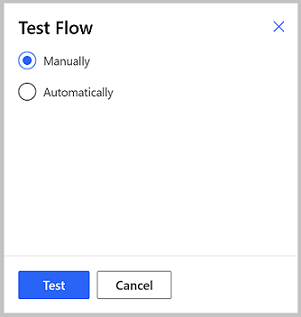

# Export Ideas data for reporting

This topic covers how to export your ideas data from your Teams database to another location so you can archive and report on it.

## Prerequisites

To complete this lesson you must first perform the following prerequisites:

1. Install the Employee Ideas template app from [https://aka.ms/teamsemployeeideas](https://aka.ms/teamsemployeeideas).
    
2. Delete the sample idea data. The reason we need to do this is because our data extract captures the user who created the idea, and sample data is created by a system account, which may cause an error in the flow (since the user won’t exist in your Active Directory). To delete ideas, see [Employee ideas sample app](/teams/employee-ideas.md).
    
3. Create some ideas, and have colleagues vote for them. This will ensure that the data extract returns data.

## Working with Idea data

Employee Idea captures ideas from the people in your organization and allows other users to vote for their favorite ideas. This data is stored in Microsoft
Dataverse for Teams. As you collect this information, you may want to get the data out of Dataverse so you can use it for other purposes.

Some reasons to export data:

- Add the data to a data warehouse or other type of enterprise data repository.
    
- Extract the data so you can report on it.

> [!NOTE]
> You can use Power BI to report directly on Dataverse for Teams; however, if you want to bring the data into a data lake to more easily combine it with other sources, exporting it may have advantages.

- Archive data to free capacity in your Team database.

In this topic we walk through an option to extract the data for Ideas to a SharePoint list. You could use a similar approach to move data to SQL server,
Excel, or a non-Microsoft data connection.

## Delete the sample data

You will want to delete the sample data from the employee ideas solution before completing this step. Sample data is created and owned by a system account, and will not resolve to users in your organization.

### Create an Excel file

First we will create an Excel spreadsheet to which our ideas data will be exported.

1. On the first tab of the spreadsheet, add the following columns: 

   - Campaign

   - Campaign_Date

   - Campaign_End

   - Description

   - Idea

   - Idea_Sumbission_Date

   - Number_Votes

   - User

   - Phone

   - Email

   - Department

   - Job_title

   - Attachment

2. Format these columns as a table and rename the tab **Idea Summary**.

3. Add another tab to your workbook named **Vote Details**.

4. Add the following columns to the worksheet:

   - Idea
   - Employee
   - Department

5. Format these columns as a table.

6. Save the spreadsheet to a folder in Microsoft OneDrive. In our example we will call the folder **Ideas Extract**.

## Create a Power Automate flow to extract data

Now that you have created the spreadsheet to which you will extract the data, create a Power Automate flow.

1. Navigate to Power Automate.

2. Select the environment that matches the name of the Team in which the Employee Ideas app is installed.
    
3. Select **My flows.**

4. Create a new flow.

5. Select **Instant cloud flow.**

6. Enter **Ideas data extract** for name.

7. Select **Manually trigger a flow** for the trigger.

8. Select **Create**.

### Create a flow

Next, create a flow to copy ideas to the newly created Sharepoint list. We will have the flow run as a scheduled job, delete the data from the SharePoint list, then copy the data from Ideas to the list. This will ensure that we always have up-to-date data.

1. In Microsoft Teams, right click on Power Apps and select **Pop out app** to open Power Apps in a new window.
    
2. For the flow trigger, select **Recurrence** and **1** for interval and **Day** for frequency.

   > [!div class="mx-imgBorder"]
   > 
    
3. Add a Dataverse List rows action. Select **Employee ideas** as the table name. Rename step to **List ideas**. Add **createdby** to the **Expand Query** field.
    
4. Add an **Apply to each** action.

5. Inside the apply to each step add a Dataverse **Get row** action. Rename it to **Get campaign.** Set the **Row ID** to the Campaign value from the List ideas step.
    
    > [!div class="mx-imgBorder"]
    > 

6. In the Apply to each action, select **Add an action** and select the O365 Users **Get user profile (V2)** action. Set **User (UPN)** to Created By Primary Email.
    
   > [!div class="mx-imgBorder"]
   > 

7.  Add an Excel **Add a row into a table** step.

8.  Populate the following fields:

    - Set location, document library, file, and table to the spreadsheet and table for ideas.
        
    - Idea (set to Idea Title from List Ideas step)
    
    - Campaign (set to Campaign title from Get Campaign step)
    
    - Campaign\_Date (set to Start Date from Get Campaign step)
    
    - Campaign\_End (set to End Date from Get Campaign step)
    
    - Description (set to Description from List Ideas step)
    
    - Idea\_Submission\_Date (set to Created On from List Ideas step)
    
    - Number\_Votes (set to Vote Count from List Ideas step)
    
    - Set to expression for department to
        *if(not(empty(outputs('Get_user_profile_(V2)')?['body/department'])),outputs('Get_user_profile_(V2)')?['body/department'])*
    
    - Email (set to Mail value from Get user profile (V2) step
    
      > [!div class="mx-imgBorder"]
      > 
    
9.  Add another list rows step outside of the apply to each step.

    - Select Employee Ideas for the table name

    - Add **createdby** to the **Expand Query** field

10. Add an apply to each step and rename it to **Update Vote Detail**.

11. In the **Select an output from previous steps** field add the value of the list rows step added in step 10.
    
12. Now we are going to get the users who have voted for ideas. Add a **List Rows** step inside the **Update Vote detail** scope.
    
    - Select **Users** for table name.
    
    - Add the following filter to the Fetch XML Query field.
 
```xml  
<fetch version="1.0" output-format="xml-platform" mapping="logical" distinct="true"\>
   <entity name="systemuser"\>  
      <attribute name="fullname" /\>
      <attribute name="systemuserid" /\>
      <link-entity name="msft_employeeidea_systemuser_vote" from="systemuserid" to="systemuserid" visible="false" intersect="true"\>
      <link-entity name="msft_employeeidea" from="msft_employeeideaid" to="msft_employeeideaid" alias="aa"\>
      <filter type="and"\>
            <condition attribute="msft_employeeideaid" operator="eq" value="@{items('Update_Vote_Detail')?['msft_employeeideaid']}" /\
          </filter\>    
      </link-entity\>
   </link-entity\>
   </entity\>
</fetch>  
  
```  
  
    
> [!div class="mx-imgBorder"]
>
    
13. We now are going to update the excel workbook vote table with the votes by idea. Add an apply to each step inside the apply to each created in step 10. For the output field select the value from the list rows step created in step 12.
    
14. Inside the nested apply to each step added in step 13, add an Office 365 Users **Get user profile (V2)** step. Select the Created by Primary Email from the list voters step User (UPN) field.
    
15. Follow these steps to, add an Excel add row into table step.

    1. Select Location, document library, file, and table for your vote summary table.
        
    2. For **Idea** field, select Title from the list rows step added in step 9.
        
    3. For **Employee** field, select the Display Name from the Get user profile step created in step 14
        
    4. Set the **Department** field to the following formula: if(not(empty(outputs('Get_user_profile_(V2)\_2')?['body/department'])),outputs('Get_user_profile_(V2)_2')?['body/department'])

16. Save the flow. Your flow should look like this:

    > [!div class="mx-imgBorder"]
    > 


    > [!NOTE]
    > Flow checker may give you a warning recommending that you use an Odata query on the list rows step. Using an Odata query will be advantageous if you have many idea records or want to filter ideas to a subset, such as ideas associated with open campaigns. This warning is not an error, and can be safely ignored. Select the X in the upper right corner to close the flow checker.

    > [!div class="mx-imgBorder"]
    > 

### Test the flow

Test the flow to make sure that it works.

1. In the upper right corner, select **Test**.

2. Select **Manually** and select **Test**.

   > [!div class="mx-imgBorder"]
   > 

3. Select **Run flow**.

4. Once the flow runs, open your OneDrive folder where the Spreadsheet is stored and verify  that your inspection data is there.
