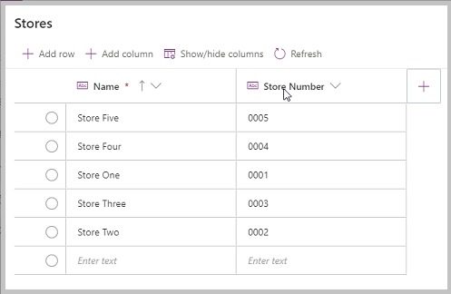
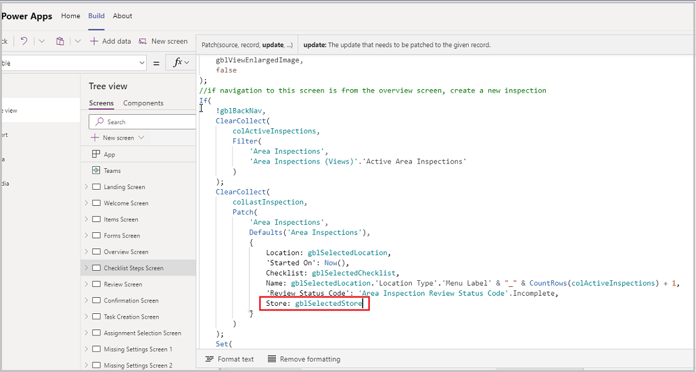
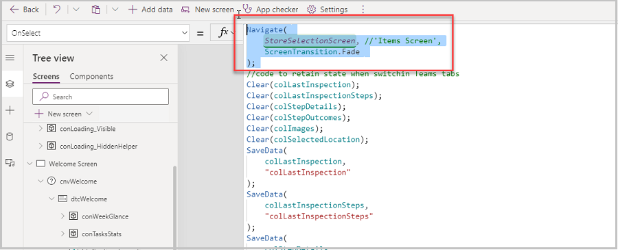
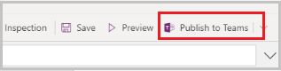
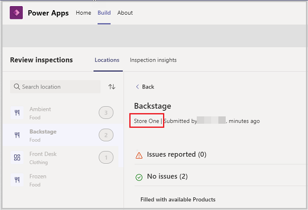

# Inspections App – Add hierarchy to location of inspection

The Inspections Power Apps template allows users to create and perform inspections in the app. There are three apps, one per persona to perform,
manage, and review Inspections. The three apps are – Inspections, Manage Inspections and Review Inspections.

By default the Inspection app is designed for a single store. But what if you perform inspections on multiple stores? You will want to add a table for stores to the app and let the user select the store in which they are performing inspections so that you can track at which store the inspection was performed.

In this topic we will learn how to update the app to add a hierarchy of stores so that inspections can be performed for different stores.

> [!NOTE] Before starting this topic, please review **How to customize Inspections** (insert link).

## Prerequisites

To complete this lesson, we would need the ability to login into Microsoft Teams which will be available as part of select Microsoft 365 subscriptions and will also need to have the Inspections Power Apps template for Microsoft Teams installed. This app can be installed from aka.ms/TeamsInspection.

## Edit the Inspections app

1.  Login into Teams and right click Power Apps from the left menu and select **Pop out app**.
    
2.  Select Build from the top ribbon.

3.  Select the Team in which the Inspections app is installed.

4.  Select Inspections to open the app in the editor.

5.  The Inspections app opens.

### Add a new table called Store

1.  Select **Data** from the left navigation menu.

2.  Select **+Add data**.

3.  Select the **+Create new table**.

4.  Enter table name Store and select **Create**.

5.  Select the **Add Column** button to add a new column.

6.  Enter column name = Store Number and select **Create** – the column gets added.

7.  Add a few records of data in the table and select **Close.**



### Add a column to capture Store in the Area Inspections table

1.  Select **Data** from the left navigation menu.

2.  Locate the Area Inspections table and hit on the three dots.

3.  Select **Edit Data**.

4.  The Area Inspections table opens.

5.  Select **Add Column**, enter the Table name = Store, Type = Lookup, Related Table = Store.
    
6.  Select **Create**.

7.  The column gets added.

8.  Select the **Close** button to close the table.

### Add a new screen with a Gallery of Stores

1. Select the Tree view from the left navigation menu.

2. Select **+New** screen from the tree view.

3. Select Blank layout.

4. The new screen gets added.

5. Rename the screen to **StoreSelectionScreen**.

6. Update the Fill property to **gblAppStyles.Background.Fill**.

7. Select the **+Insert** button to add a Gallery to the new screen.

8. Select Stores as the data source.

9. Gallery gets added to the new screen.

10. Rename the gallery to **StoresGallery**.

11. Update Template Size to **108**.

12. Update FontSize of Label Title4 to **20**.

13. Set Height of Label Title4 to **45**.

14. Update FontSize of Label Subtitle4 to **18**.

15. Set Height of Label Subtitle4 to **45**.

16. Navigate to Items screen and copy the Back button from the top of the screen.

17. Go back to the New screen and paste the Back button copied in the previous step.

18. Now, navigate again to the Items screen and copy the label lblIndividualAreasHeader that reads the text as Location.

19. Go back to the New screen and paste the label copied in the previous step.

20.  Set the following properties of the label
     - Y = **btnBackToHome\_1.Y+btnBackToHome_1.Height**
     
21.  Set the following properties of the gallery StoresGallery

     - Y = **btnBackToHome\_1.Height+lblIndividualAreasHeader_1.Height**

     - Height = **Parent.Height-btnBackToHome\_1.Height- lblIndividualAreasHeader_1.Height**
     
     - OnSelect = **Set(gblSelectedStore,ThisItem);Navigate('Items Screen')**
     
22. Navigate to the Items Screen and select the **Back to home** button on top.

23.  Update the following properties of that button

     - OnSelect = **Navigate(StoreSelectionScreen, ScreenTransition.Fade)**

     - Text = **"Back to Store Selection"**
     
24. Navigate to Checklist Steps Screen.

25. Select the OnSelect property of the screen.

26. Update the Patch function for updating the Area Inspections app to add the Store value in the formula – 

    ```
    , Store: gblSelectedStore
    ```




### Update the Welcome Screen navigation

1.  From the tree view, select the Welcome Screen.

2.  Select the button Perform an Inspection (btnInspect).

3. Update the Navigate function from the OnSelect property of the button so that it navigates to the StoreSelectionScreen instead of the Items screen leaving the rest of the formula as is

   ```
   Navigate(
   
   StoreSelectionScreen,
   
   ScreenTransition.Fade
   
   );
   ```



### Publish the Inspections app

1.  All the changes to the Inspection app are completed.

2.  The app can now be published by selecting the Publish to Teams button on the top right.



## Edit the Review Inspections app

1.  Login into Teams and right click Power Apps from the left menu and select **Pop out app**.
    
2.  Select Build from the top ribbon.

3.  Select the Team in which the Inspections app is installed.

4.  Select Review Inspections to open the app in the editor.

5.  The Review Inspections app opens.

6.  Select **Data** from the left navigation menu.

7.  Select **+Add** data and add the Stores table to this database for this app.

8.  Also, refresh the Area Inspections table so that the Store column shows up in the table.

### Add a label to display the Store on the Inspection

1.  Open the Tree view and select the Items Screen.

2.  Under the Group grpInspectionSteps, there is a label called lblInspection\_SubmissionDetails.
    
3.  Update the Text property of lblInspection_SubmissionDetails to the following

```
If(

DateDiff(

Date(

Year(galInspections.Selected.createdon),

Month(galInspections.Selected.createdon),

Day(galInspections.Selected.createdon)

),

Today(),

Days

) = 0,

If(

DateDiff(

Date(

Year(galInspections.Selected.createdon),

Month(galInspections.Selected.createdon),

Day(galInspections.Selected.createdon)

),

Today(),

Hours

) \> 0,

galInspections.Selected.Store.Name & " \| Submitted by " &
galInspections.Selected.createdby.'Full Name' & ", " & DateDiff(

Date(

Year(galInspections.Selected.createdon),

Month(galInspections.Selected.createdon),

Day(galInspections.Selected.createdon)

),

Today(),

Hours

) & " hrs ago",

If(

DateDiff(

Date(

Year(galInspections.Selected.createdon),

Month(galInspections.Selected.createdon),

Day(galInspections.Selected.createdon)

),

Today(),

Hours

) = 0,

//"minutes ago"

galInspections.Selected.Store.Name & " \| Submitted by " &
galInspections.Selected.createdby.'Full Name' & ", minutes ago"

,

If(

DateDiff(

Date(

Year(galInspections.Selected.createdon),

Month(galInspections.Selected.createdon),

Day(galInspections.Selected.createdon)

),

Today(),

Days

) = 1,

//"yesterday",

galInspections.Selected.Store.Name & " \| Submitted by " &
galInspections.Selected.createdby.'Full Name' & ", yesterday",

galInspections.Selected.Store.Name & " \| Submitted by " &
galInspections.Selected.createdby.'Full Name' & ", " & DateDiff(

Date(

Year(galInspections.Selected.createdon),

Month(galInspections.Selected.createdon),

Day(galInspections.Selected.createdon)

),

Today(),

Days

) & " days ago"

)

)

)

)
```

## Test the app

1.  Open the Inspection App in the team in which it is installed.

2.  The app loads.

3.  Select the Welcome screen from the Tree view if running in the Editor and hit the Preview button to run the app.
    
4.  Select the Perform an Inspection button.

5.  Verify that the Store Selector screen opens.

6.  Select a store.

7.  The next screen should be the Items screen.

8.  Select a location.

9.  Select a food inspection checklist on the next screen.

10. Select the button **Begin Inspection**.

11. Answer the questions that are part of the inspection and hit the Review Inspection button at the bottom.
    
12. Select **Submit Inspection** on the next screen.

13. The Inspection is submitted.

14. Now, login into the Review Inspections app by selecting the Review Inspection tab on the top in the Team in which it is installed.
    
15. The app loads.

16. Select the location that you selected in step 8.

17. The list of inspections performed is displayed.

18. Select the Inspection that was submitted in step 13 above.

19.  The screen displays the Store name before the Submitted by as shown in the screenshot below.


