# Add the ability to be notified when an issue is resolved

In the Issue reporting sample app for Teams, tasks are created in Microsoft Planner. By default, there's no notification when the issue is closed, but you can easily add one with Power Automate.

> [!NOTE]
> This lesson customizes the Issue reporting Power App template for Microsoft Teams. Before you proceed with this article, read [Customize the Issue reporting sample app](customize-issue-reporting.md).

To add the ability for notification when issue is resolved:

1. Open the Power Apps app in Teams. We recommend that you right-click on Power Apps in Teams, and "pop out" the app so you won’t lose your changes when you go somewhere else in Teams.

    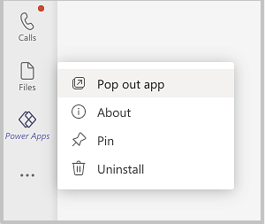

1. Select the **Build** tab.

1. Select a team with Issue reporting app installed.

1. Select the **Installed apps** tab.

1. Select **See all**.

    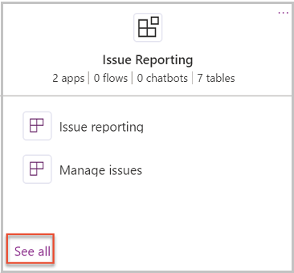

1. Select **Tables**.

1. Select **...** (ellipsis) for **Issue Report** table, and select **Edit data**.

1. On the right side of the data grid, select **+** to add a new column to the Issue Report table.

1. In the **Add new column** dialog, enter **Notify** in the Name field and **Yes/No** in the Type column.

    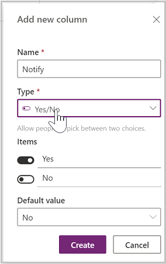

1. Select **Create.**

1. Select **Close** in the lower-right corner.

## Add notify field to the Issue report screen

Now that we've created the field, we'll add the Notify column to the Issue Report screen:

1. Open Issue reporting in Power Apps app in Teams.

1. Select **Tree view**.

1. Select **Issue Report Screen** in Tree view.

1. Select **Submit issue** button.

1. Drag button down to make room for the notify checkbox.

1. Select **Insert +** on left.

1. Expand **Input**.

1. Select **Check box**.

1. Change checkbox label to **Notify**.

1. Change the LabelFontSize value to gblAppStyles.Checkbox.Size.

1. Select the **Submit issue** button.

1. Select the **OnSelect** property.

1. Update the highlighted section of the formula and add setting the **Notify** column value to the value of Checkbox1.

    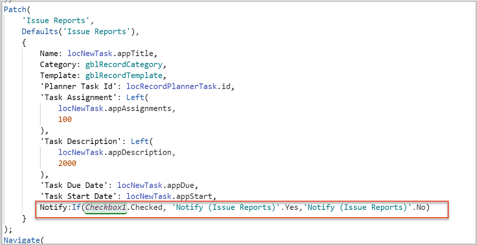

1. Save and publish the app.

## Test population of the notify checkbox

Now we want to verify the Notify field is populated correctly when creating an issue.

1. In Teams, open the team channel in which the Issue reporting app is installed.

1. Select the **Issue reporting** tab.

1. Select **Report an issue** button.

1. Verify that you see the **Notify** checkbox.

1. Create a task, checking the **Notify** checkbox.

1. Select **Submit issue**.

### Verify that Dataverse Issue Report record notification is set to yes

Next, check the recently created record in Dataverse and verify that the **Notify** yes/no field is set to **yes**.

1. Open the Power Apps app in Teams.

1. Select the **Build** tab.

1. Select the team with Issue reporting app installed.

1. Select the **Installed apps** tab.

1. Select **See all**.

    

1. Select **Tables**.

1. Select **...** for the **Issue Report** table, and select **Edit data**.

1. Verify that the row for the newly created Issue report **Notify** column is set to **yes.**

    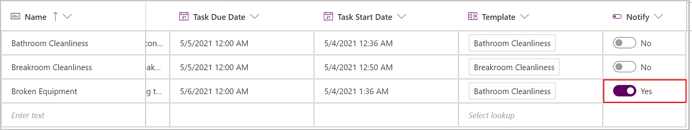

## Add Power Automate flow to notify creating user when task is resolved

Now that the Notify column is being set correctly in Dataverse, we'll create a flow to send a notification email to the user who created the issue when the issue is resolved.

1. Log on to [Power Automate](https://powerautomate.microsoft.com).

1. Select the environment for your Team from the environment drop-down in the upper right corner.

1. Select **My flows**.

1. Select **New flow** and select **Automated cloud flow.**

    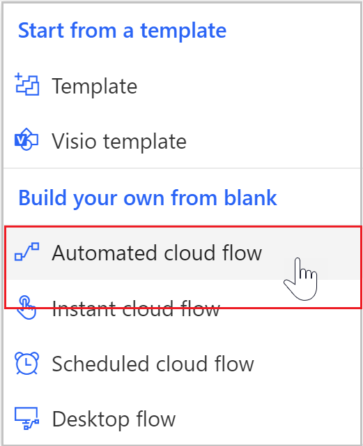

1. Enter **Planner Notification** for Flow name and **When a task is completed** for trigger.

    

1. In the next screen, select your Group and Plan ID. Group should be the name of your team. If you don’t see your group in the drop-down, you can get the Group ID from the URL of your Planner environment.

    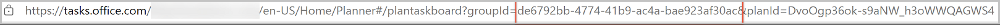

    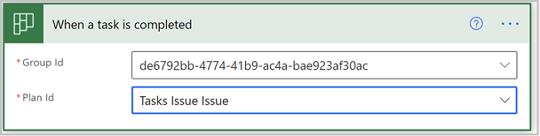

1. Select **New step**.

1. Search for Dataverse and select **List rows.**

1. Select **Issue Reports** for the table name.

1. We want to filter the results to those where the task ID equals the ID of the task closed and where notify equals **Yes**. For this purpose, you'll need the schema name of the notify field you created. You can find this by going back to the table list and viewing the fields in the table. In our example, the Notify field schema name is **cr7c9_notify**.

1. Enter the following in the **Filter rows** field:

    ```powerapps-dot
    msft_planner_taskid eq @{triggerOutputs()?['body/id']}and cr7c9_notify eq true*
    ```

    Replace the **cr7c9_notify** with whatever the name of your notify field is.

1. Add Condition step.

1. On Dynamic content window, select **Expression**.

1. Type **length()**.

1. Select inside the parenthesis.

1. Select the **Dynamic content** tab.

1. Select the List rows **value** option.

1. The expression should look like this.

    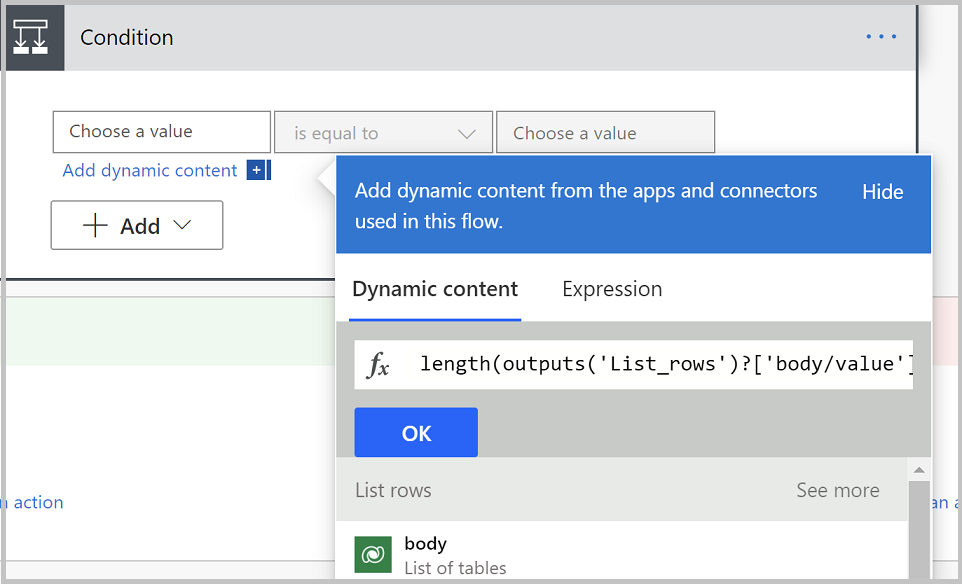

1. Select **OK**.

1. From the middle field in the Condition step, select **is greater than.**

    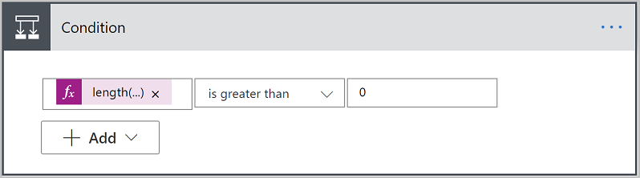

    This means that if there is at least one matching Issue Report record, then do what is in the **Yes** column.

1. In the **Yes** box, select **Add an action**.

1. Select Dataverse **Get a row by ID** action.

1. Select **Issue Reports** for table name.

1. Select **Row ID** field and select the **fx** expression editor button.

1. Enter the following expression:

    ```powerapps-dot
    first(body('List_rows')?['value'])?['msft_issuereportid
    ```

1. Select **Show advanced options**.

1. In **Expand Query** enter **createdby**.

1. Under the **Get a row by ID** step, select **Add an action**.

1. Select the Outlook **Send mail (v2)** action.

1. Set the To field to **Created by Primary Email.**

1. Set the Subject field to **Task [dynamic content reference to Issue Report Name field] has been resolved**.

1. Enter **Your task has been resolved.** in the Body field.

1. Save your flow.

    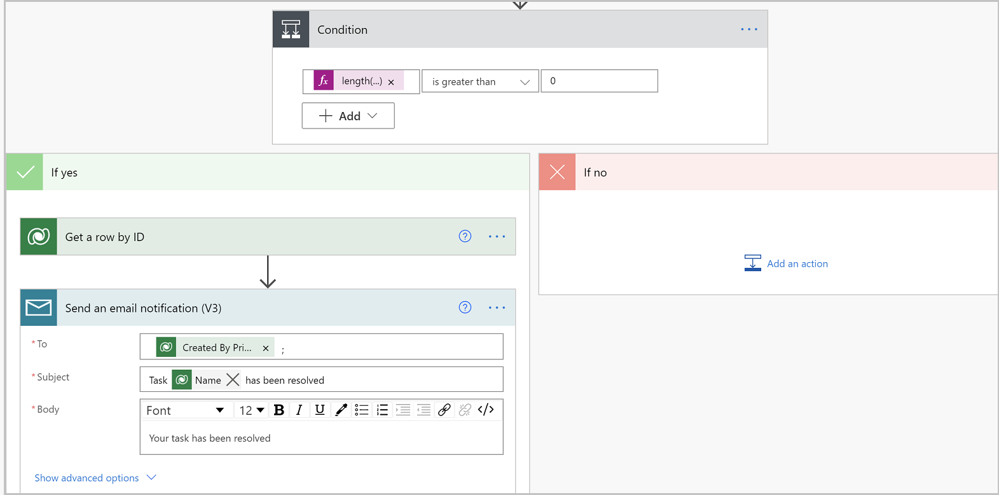

## Test your flow

Now that your flow is published, test the process.

1. Open Issue reporting app.

1. Create an issue.

1. Check the **Notify** checkbox.

1. Submit the issue.

1. In Planner, complete the task.

1. Verify that the flow runs successfully and the email is received.

### See also

- [Understand Issue reporting sample app architecture](issue-reporting-architecture.md)
- [Customize issue reporting app](customize-issue-reporting.md)
- [Sample apps FAQs](sample-apps-faqs.md)
- [Use sample apps from the Teams store](use-sample-apps-from-teams-store.md)


[!INCLUDE[footer-include](../includes/footer-banner.md)]