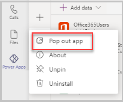
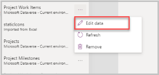
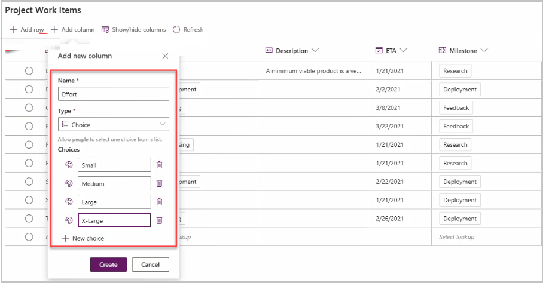
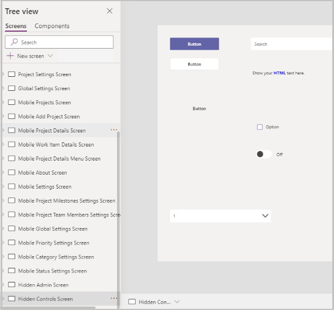
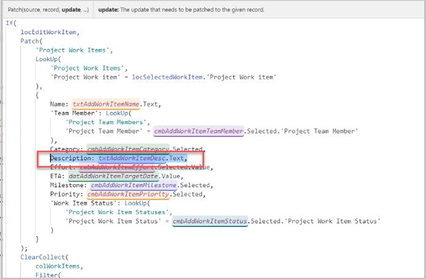
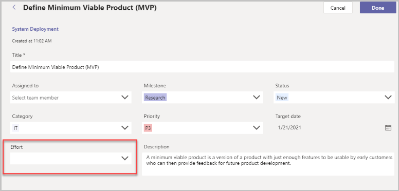
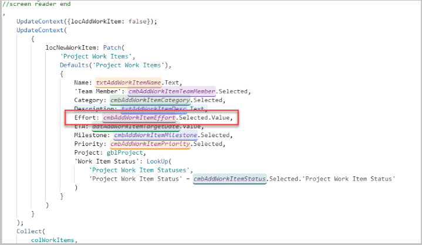
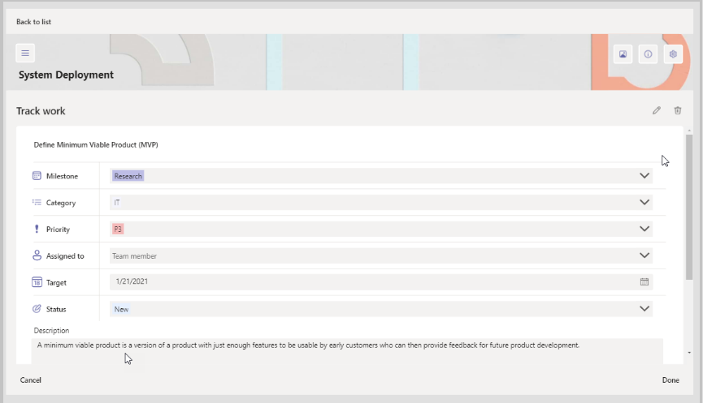
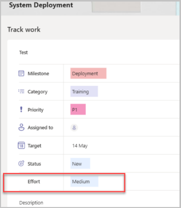
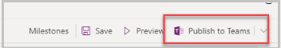

# Add a new column to Milestones sample app to track work items

The Power Apps templates for Microsoft Teams include many pre-defined columns to track the most common data points for their scenario. For example, in the Milestones app (https://aka.ms/TeamsMilestones), users can track the category and priority of work items.

In this article, we'll learn how to add a new column/field to a work item. For our example, we'll add a new field to capture the effort required for a particular work item. we'll add this field to the **New** and **Edit** Work Item screens for both desktop and mobile.

## Prerequisites

To complete this exercise, we'd need the ability to log in into Teams&mdash;which will be available as part of select Microsoft 365 subscriptions, and also have the Milestones app installed in a Teams channel. If you don’t have it installed, you can install it from https://aka.ms/teamsmilestones.

## Open Power Apps

To open Power Apps in Teams:

1.  The Power Apps Studio in the Teams app can be popped out as shown below.

    

2.  To pop out the Power Apps Studio while using the Team web app, right-click on the Build tab on top and select the Open in a new tab option to open the editor in a separate tab.

## Customizing the Milestones App

To add the column to the app, we'll add the field to the underlying table and then add it to the app screens.

### Creating a new field in the Work Items Table

1.  In Power Apps, select the build tab.

2.  From the Team list, select the team in which the Milestones app is installed.
    
3.  Select **Installed apps**

4.  Select the Milestones app from the Milestones tile.

5.  The app will open in Power Apps

6.  Select the **Data** button from the left pane.

7.  Select the table Project Work Items, then select the ellipses and select **Edit data**

    

8.  Select **Add column** to add a new column and enter the following details as shown in the screenshot below:
    
    -  Name – Effort
    
    -  Type – Choice
    
    -  Choices – Small, Medium, Large, X-Large
    
9.  Select Create.

    

The new column gets added to the table.

### Adding the new field to the Add/Edit Work Item page

The following changes are required to add the Effort field/column on the Add/Edit Work Item page

1.  Copy and paste the Category label on the screen. We'll do this step so that the styling of the component is consistent with the other controls in the app.

    > [!NOTE]
    > A new control can also be added by copying and pasting it from the Hidden Controls Screen. This is helpful because all the styling properties of the control are already set, thus preventing the need to update every styling property.

    

1.  Rename the newly added label to `lblAddWorkItemEffort`.

1.  Set Text property to `Effort`.

3.  Set X property to `lblAddWorkItemAssignedTo.X`.

4.  Set Y property to `cmbAddWorkItemCategory.Y+cmbAddWorkItemCategory.Height+20`.
    
5.  Select Description label.

6.  Update X property to `lblAddWorkItemMilestone.X`.

7.  Update Y property to `cmbAddWorkItemCategory.Y+cmbAddWorkItemCategory.Height+20`.
    
8.  Select the Description text box.

9.  Update X property to `lblAddWorkItemMilestone.X`.

10. Update Y property `lblAddWorkItemDesc.Y + lblAddWorkItemDesc.Height`.

11. Update Width property 'Parent.Width - Self.X – 30`.

12. Now, copy and paste the Category combo box (cmbAddWorkItemCategory).

13. Rename the newly added combo box to 'cmbAddWorkItemEffort'.

14. Set Width property 'lblAddWorkItemAssignedTo.X'.

15. Set X property 'lblAddWorkItemAssignedTo.X.

16. Set Y property 'lblAddWorkItemEffort.Y + lblAddWorkItemEffort.Height.

17. Set Items property 'Choices('Effort (Project Work Items)')**

18. Set SelectionFill property 'gblAppStyles.Dropdown.SelectionFill.

19. Set DefaultSelectedItems 'If(locEditWorkItem, [locSelectedWorkItem.Effort]).
    
20.  Select the Done button, and add the following to both the Patch functions 'Effort: cmbAddWorkItemEffort.Selected.Value,' right after the description formula 'Description: txtAddWorkItemDesc.Text,'.

The screen will appear as shown below with the newly added column

### Adding the new field to the Mobile Work Item Details screen

Now that we've added the field, we'll add it to the mobile screen.

1.  Select the Mobile Work Item Details screen from the tree view.

2.  Run the app in Preview mode to open a Work Item.

3.  The Work Item Details container opens.

4.  We'll add a new label with text Effort, and a new combo box to capture the effort value, then do the formatting of the screen and finally add the field value to the Patch function on the OnSelect property of the Done button.
    
5.  Copy and paste the Status Label.

6.  Rename the newly added label to 'lblMobileWorkItemDetailEffortLabel'.

7.  Set Text property to 'Effort'.

> [!NOTE]
> We're not accounting for Localization in this document hence keeping the text property set to Effort. Ideally, if the app is localized, we'll have to update the Localization document to include tags in all the languages for the word **Effort**, and then localize this newly added field.

8.  Set X property '80\*1'.

9.  Set Y property 'shpMobileWorkItemDetailSeparator\_6.Y+shpMobileWorkItemDetailSeparator_6.Height+10`.
    
10.  Copy and paste **shpMobileWorkItemDetailSeparator_6** control.

11.  The newly added shape control is named as `shpMobileWorkItemDetailSeparator_8`.
    
12.  Set X property 'lblMobileWorkItemDetailNameLabel.X + 5`.

13.  Set Y property 'lblMobileWorkItemDetailEffortLabel.Y + lblMobileWorkItemDetailEffortLabel.Height + 10`.
    
14.  Select `shpMobileWorkItemDetailSeparator_7` and update the Height property to `shpMobileWorkItemDetailSeparator\_8.Y + shpMobileWorkItemSeparator.Height - Self.Y.
    
15.  Select Description label.

16.  Update X property 'imgMobileWorkItemDetailStatus.X.

17. Update Y property 'shpMobileWorkItemDetailSeparator\_8.Y + shpMobileWorkItemDetailSeparator_8.Height + 20.
    
18. Select the Description text box.

19. Update X property 'imgMobileWorkItemDetailStatus.X.

20. Update Y property 'lblMobileEditWorkItemDesc.Y + lblMobileEditWorkItemDesc.Height.
    
21. Now, copy and paste the Status value label (lblMobileWorkItemDetailStatus).

22. Rename the newly added combo box to **cmbMobileEditWorkItemEffort.

23. Set Width property 'Parent.Width - Self.X – 80.

24. Set X property 'shpMobileWorkItemDetailSeparator_7.X + shpMobileWorkItemDetailSeparator\_7.Width + 20.
    
25. Set Y property 'shpMobileWorkItemDetailSeparator\_6.Y+shpMobileWorkItemDetailSeparator_6.Height+10.
    
26. Set Text property to locMobileSelectedWorkItem.Effort.

27.  Select the Done button to add the following step in the Patch function `Effort: cmbAddWorkItemEffort.Selected.Value`.

28.  The updated screen is as shown below.

1.  Similar to the above scenario, we need to add the Effort field to the New Work Item details screen.

### Add the new field to the New Work Item details screen

1.  Select the Mobile Work Item Details screen from the tree view.

2.  Run the app in Preview mode and select the + sign to add a new work item.

3.  The New Work Item container screen opens.

4.  The New Work Item container screen is now visible.

5.  Copy and paste the Priority Label.

6.  Rename the newly added label to `lblMobileAddWorkItemEffort`.

7.  Set Text property to `Effort`.

> [!NOTE] 
> We're not accounting for localization in this document hence keeping the text property set to Effort. Ideally, if the app is localized, we'll have to update the localization document to include tags in all the languages for the word **Effort** and then localize this newly added field.

8.  Set X property 'lblMobileAddWorkItemMilestone.X`.

9.  Set Y property 'datMobileAddWorkItemTargetDate.Y + datMobileAddWorkItemTargetDate.Height + 20`.
    
10.  Now, copy and paste the Priority combo box (cmbMobileEditWorkItemStatus).

11.  Rename the newly added combo box to `cmbMobileAddWorkItemEffort`.

12.  Set X property 'lblMobileAddWorkItemMilestone.X`.

13.  Set Y property 'lblMobileAddWorkItemEffort.Y + lblMobileAddWorkItemEffort.Height`.
    
14.  Set Width property 'txtMobileAddWorkItemName.Width`.

15.  Set Items property 'Choices('Effort (Project Work Items)')`.

16.  Set SelectionFill property 'gblAppStyles.Dropdown.SelectionFill`.

17. Select Description label.

18. Update X property 'lblMobileAddWorkItemProjectName.X`.

19. Update Y property 'cmbMobileAddWorkItemEffort.Y + cmbMobileAddWorkItemEffort.Height + 20`.
    
20. Select the Description text box.

21. Update X property 'lblMobileAddWorkItemProjectName.X`.

22. Update Y property 'lblMobileAddWorkItemDesc.Y + lblMobileAddWorkItemDesc.Height`.
    
23.  Select the Create button to add the following step in the Patch function `Effort: cmbMobileAddWorkItemEffort.Selected.Value`.

24.  The updated screen with the Effort field is as shown below.

## Optional: Add the new field to the work item list on the home page

We've added the new field in the data table and also added it to be displayed on the desktop and mobile screens for work items.

Work items are also displayed in a list on the main screen of the app in context of a selected project. If you want to make your new field also visible from the project work item list on the main screen, follow these steps.

> [!NOTE]
> The work items gallery is engineered to be responsive. The header of the gallery uses buttons outside of the gallery. When using buttons outside of a gallery, be aware that the buttons won’t scroll horizontally with the gallery, so you want to limit the number of fields to what will fit in one screen wide without scrolling. We recommended that you replace one of the existing fields rather than adding additional fields to avoid impacting responsiveness or requiring scrolling galleries.

1.  Select **galWorkItems** from the tree view and expand it.

2.  Identify the column that you want to replace with your new field. For example, if you want to replace the target with your new tracker field, you would select the lblWorkItemETA control.
    
3.  Update the formula for the Text property of this field to the new field reference.

## Publish and test the app

1.  Select the Publish in Teams button on the top right of the Editor.

    

2.  Open the app in the Team and do a test on the new work item screen.

3.  Go into the editor to look at the Work Items table to make sure the records were created and updated with the effort field value.

4.  Similarly, run a test from mobile Teams app to verify the changes made to the mobile screen.

### See also

- [Deploy Milestones sample app broad distribution app](milestones-broad-distribution.md)
- [Customize Milestones sample app](customize-milestones.md)
- [Understand Milestones sample app architecture](milestones-architecture.md)
- [Customize sample apps](customize-sample-apps.md)
- [Sample apps FAQs](sample-apps-faqs.md)
- [Use sample apps from the Microsoft Teams store](use-sample-apps-from-teams-store.md)

[!INCLUDE[footer-include](../includes/footer-banner.md)]