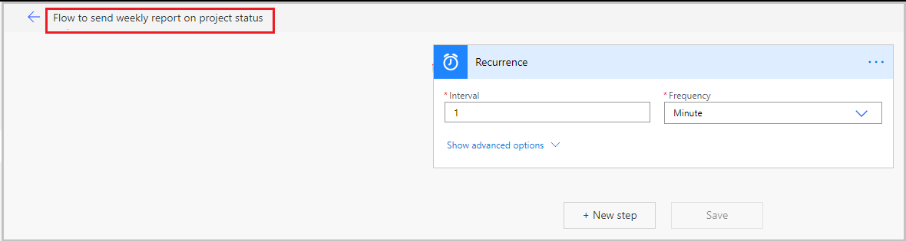
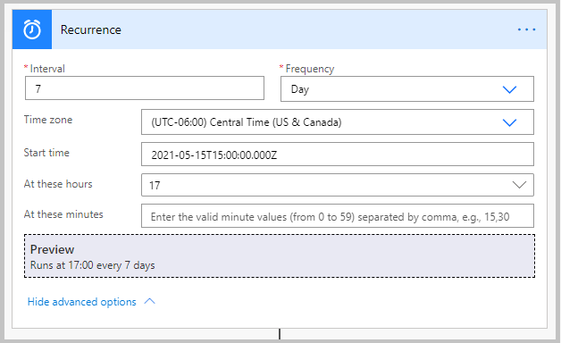
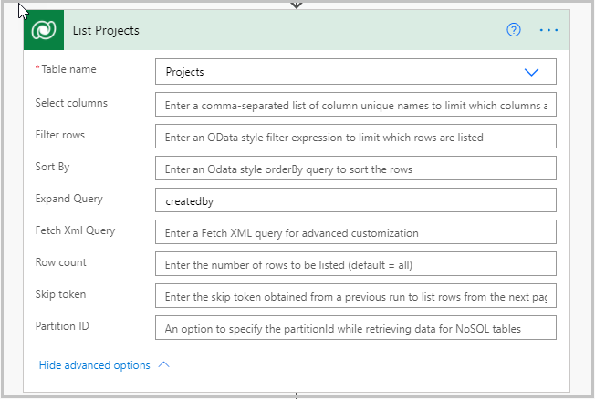
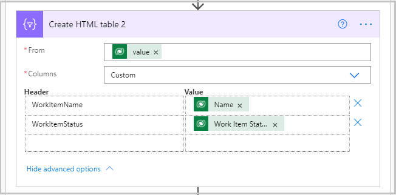
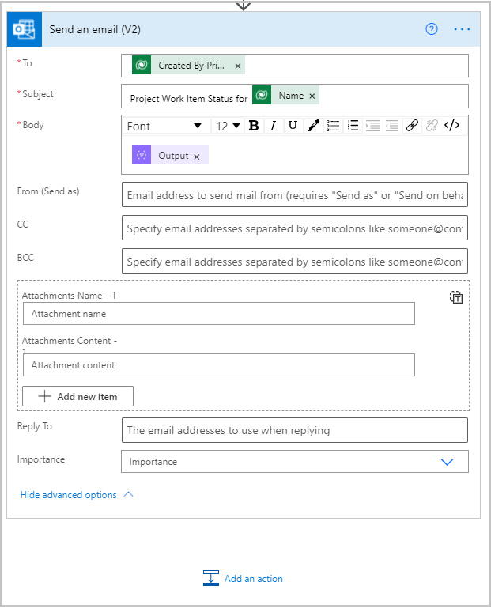
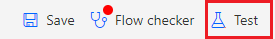
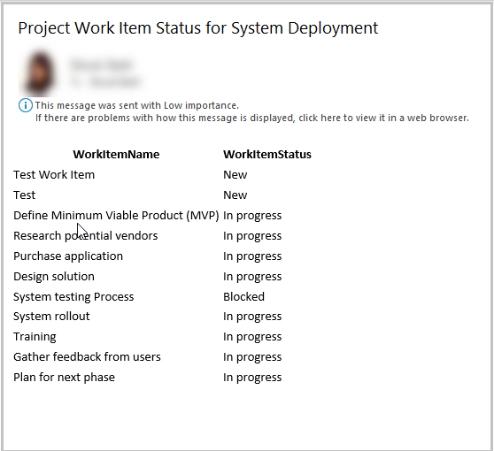

# Send weekly report on project status from the Milestones sample app

The Milestones Template Power App allows users to create milestones for a team and track their progress using work items and work item statuses. The app can be extended further to send weekly emails to project managers or person creating the project with a list of all the work items and their statuses.

In this topic we will learn how to create a Power Automate flow to send a project weekly report to the person who created the project with the work items listed along with their statuses.

## Prerequisites

To complete this lesson, we would need the ability to login into Microsoft Teams which will be available as part of select Microsoft 365 subscriptions and will also need to have the Milestones power apps template for Microsoft Teams installed. This app can be installed from aka.ms/TeamsInspection.

## Create the Power Automate Flow

1.  Login to flow.microsoft.com

2.  Select the Environment that has the same name as the Team in which the app is installed.

3.  Select +Create to create a new flow

4.  Select Start from blank – Automated cloud flow

5.  Select Skip to go to the next screen

6.  Update the flow title and select Recurrence as the flow trigger

7.  Update the Recurring trigger values as shown below

8.  Add the following steps to the Flow

9.  List rows steps – renamed to List Projects

  - Table Name – Projects

  - Expand Query – createdby

10.  List rows – renamed to List Work Items

  - Table Name – Project Work Items

  - Filter Rows – \_msft_project_id_value eq @{items('Apply_to_each_2')?['msft_projectid']}

  - Expand Query – msft_WorkItemStatus_id(\$select=msft_name)

>NOTE
> As soon as we select the Project ID in the Filter Rows field, the flow would put the List Work Items step into an Apply to Each container in which we would add more steps that would be needed

11.  Create HTML table – renamed to Create HTML table – Work Items.

  - From – the value from the previous step –  @{outputs('List_Work_Items')?['body/value']}

  - Columns – Custom

  - Add the columns to the table:

    - Header – WorkItemName \| Value – Name from the List Work Items step.

    - Header – WorkItemStatus \| Value – Work Item Status from the List Work Items step.

12.  Send an email (v2).
- To – Created by Primary Email from the List Projects step.

- Subject – Project Work Item Status for [Name] (Name from the List Projects
    step).

- Body – Output from the Create HTML table step.

13.  Save the flow.

14.  Select the Test button on the top right and select Manually.

## Data setup before testing the Power Automate Flow

1.  Before testing the flow, we need to make sure we have some data with projects and work items within each project in the Milestones app.

2.  Navigate to Teams and run the Milestones app.

3.  Create a new project

4.  Create Work Items under that project.

## Test the Power Automate Flow

1.  Go back to https://powerautomate.microsoft.com and open the flow.

2.  Select Test on the top right.

3.  Run the flow.

4.  Check inbox for emails with weekly status – We should see one or more emails in the inbox for each Project.

