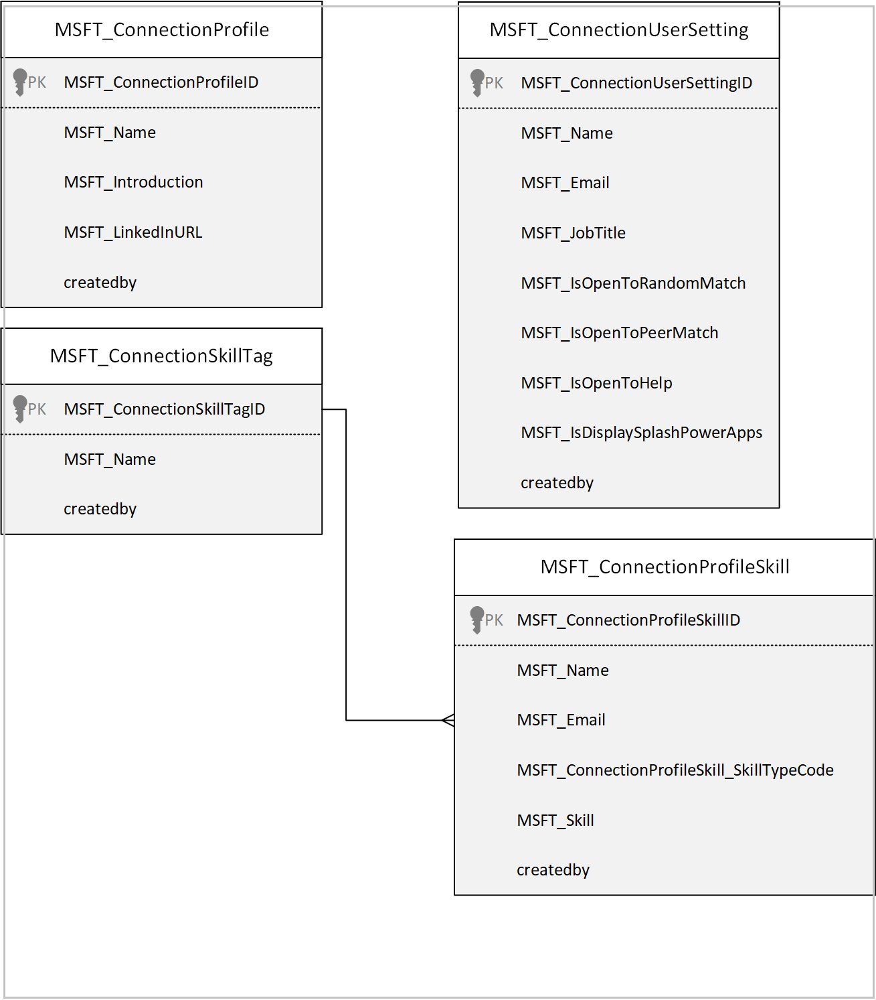

# Understand Get connected sample app architecture (preview)

[This article is pre-release documentation and is subject to change.]

In this article, you'll learn about the collections and global variables used by the Get connected ap, and understand how to use them effectively. This article covers the following details:

- Data model and purpose of the various entities used.
- Architecture model of the Get connected solution.
- List of all collections and variables used.
- Detailed breakdown of each functionality.

## Prerequisites

To understand and use information in this article, you'll need to know about different controls, features, and capabilities of canvas apps.

- [Create and update a collection in a canvas app](../maker/canvas-apps/create-update-collection.md)
- [Collect, Clear, and ClearCollect functions in Power Apps](../maker/canvas-apps/functions/function-clear-collect-clearcollect.md)
- [Understand canvas-app variables in Power Apps](../maker/canvas-apps/working-with-variables.md)
- [Add and configure a canvas-app control in Power Apps](../maker/canvas-apps/add-configure-controls.md)
- [Add a screen to a canvas app and navigate between screens](../maker/canvas-apps/add-screen-context-variables.md)

## Data model

The following diagram explains the data model used by the Get connected sample app.

| Table name | Description |
| - | - |
|**Connection Profile**| A table to store Profile. Details such as Name, Introduction, LinkedIn URL,  created on and who the row was it created or modified by are stored in the Connection Profile table.|
|**Connection Profile Skill**|Connection Profile Skill stores skill records that are available to users to select from when users add their skills.   Details such as Name, Email, Skill, skills type to which it's associated to  and the date when the skill was created on, modified on are stored in the Connection profile skill table.|
|**Connection Skill Tag**|Connection Skill Tag shows skill category records such as Name, date when the row was created, and date when the row was modified.|
|**Connection User Setting**|Connection User Setting Stores Name, Email when users open the app user  can make choice to set the toggles to open to random connections, open to  peer match or open to help.  Details such as Name, Email, and the user settings created on, modified on  are stored in the  Connection User Setting table.|

## Architecture model

The following architecture model diagram illustrates the way that users and systems interact with data:

## Connectors

The following connectors are used in the Get connected app:

- **Microsoft Dataverse**&mdash;used to read and write data in Dataverse.
- **Office 365 Users**&mdash;used to read Microsoft 365 user profile data.

## Collections

| Collection Name       | Description                                                  | Screen Used                                   |
| --------------------- | ------------------------------------------------------------ | --------------------------------------------- |
| colLocalization       | Used to build a Localization Collection based on the user's language. | OnStart property of the App                   |
| colUserSettings       | Collection of User Settings used to store the user who used the app. | OnVisible Property of the Loading Screen      |
| colPeerMatchpool      | Collection of users who selected yes to peer match selection. | OnVisible Property of the Loading Screen      |
| colRandomMatchPool    | Collection of users who selected yes to random match selection. | OnVisible Property of the Loading Screen      |
| colRemainingSkillTags | Collection of remaining skill tags.                           | OnVisible Property of the Profile Screen      |
| colCharWidth          | Collection of width of characters.                            | OnStart property of the app                   |
| colExpertMatchPool    | Collection of users who selected yes to Expert match.         | OnVisible Property of the Expert Match Screen |
| colMySkillsGuid       | Collection of my skills that has unique guid for enhancements in the future. | OnVisible Property of the Profile Screen      |
| colMyExpertSkills     | Collection of skills that can help others with.              | OnVisible Property of the Profile Screen      |
| colMyDeletedSkills    | Collection of skills removed by the user in their profiles.   | OnVisible Property of the HomeScreen          |
| colMySkills           | Collection of the user skills.                                | OnVisible Property of the HomeScreen          |

## Global Variables

| Variable Name                   | Type    | Description                                                  |
| ------------------------------- | ------- | ------------------------------------------------------------ |
| gblAppLoaded                    | Boolean | To check whether the App is loaded.                |
| gblUserLanguage                 | Text    | To check the logged in User’s Language.                      |
| gblThemeDark                    | Boolean | To check whether the Teams theme is set to Dark.              |
| gblThemeHiCo                    | Boolean | To check whether the Teams theme is set to High Contrast.     |
| gblMobileMode                   | Boolean | Variable to check whether the app is running on mobile.       |
| gblAppSetting_inputMobileOnWeb  | Boolean | Variables to Scale fonts for mobile-oriented apps, running in desktop. |
| gblAppSetting_inputScaleFontsby | Number  | Use this variable for scaling all fonts by a fixed amount.    |
| gblFirstRun                     | Boolean | To check whether the app is being run for the first time.     |
| gblAppSetting_inputMobile       | Boolean | Variables to Scale fonts for mobile-oriented apps.            |
| gblAppColors                    | Record  | Variable to set the Color value in the app.                   |
| gblAppSizes                     | Record  | Variable to set the Color value in the app.                   |
| gblAppStyles                    | Record  | Variable to set the Styling values in the app.                |
| gblCurrUserEmail                | Record  | Global variable to store the current user email address.                                           |
| gblCurrUser                     | Record  | Global variable to store the current user record.             |
| gblRecordUserSettings           | Record  | Global variable to store the latest Project User Settings records for the current user. |

## App OnStart

This section explains the OnStart collections, variables, and execution details.

### OnStart collections

Collections used during app OnStart:

| **Collection name** | **Description**                                                     |
|---------------------|---------------------------------------------------------------------|
| colLocalization     | Collection of localized text based on users language.               |
| colCharsWidth       | Collection of widths for each character used for auto width labels. |

### OnStart variables
Variables used during app OnStart:

| **Variable name**               | **Description**                                              |
| ------------------------------- | ------------------------------------------------------------ |
| gblAppLoaded                    | Global variable to check if the app has loaded completely.   |
| gblUserLanguage                 | Global variable to store the user's language.                 |
| gblThemeDark                    | Global variable to store if Teams is running in dark mode.   |
| gblThemeHiCo                    | Global variable to store if Teams is running in contrast mode. |
| gblMobileWidth                  | Global variable to define the width of the app for mobile.   |
| gblMobileMode                   | Global variable to store if the app is being accessed from a mobile device. |
| gblAppSetting_inputMobileOnWeb  | Global variable to scale fonts for mobile-oriented apps, running in desktop. |
| gblAppSetting_inputMobile       | Global variable to scale fonts for mobile-oriented apps.     |
| gblAppSetting_inputScaleFontsBy | Global variable for scaling all fonts by a fixed amount.     |
| gblCurrUserEmail                | Global variable to store the current user email address      |
| gblIsHostClientWeb              | Global variable to store the client web value.               |
| gblCurrUser                     | Global variable to store the current user record             |

### OnStart execution details

1. When a user accesses the app, **gblAppLoaded** is set to false. The user’s language code is stored in **gblUserLanguage**, with English-US as the default.

1 The user’s language is then used to collect localized text used throughout the app (for example, label and button text) in **colLocalization**.

1. The label’s auto width is calculated and stored in **colCharsWidth**.

1. The user’s Teams theme/mode is checked to see if the theme is default, dark or high contrast. The **gblThemeDark** and **gblThemeHiCo** variables are set accordingly.

## Loading Screen

This section explains the collections, variables, and execution details used on the loading screen.

#### Loading screen collections

The following collections are used in the loading screen.

| **Collection name** | **Description**                                                |
|---------------------|----------------------------------------------------------------|
| colLocalization     | Collection of localized text based on user’s language.         |
| colRandomMatchPool  | Collection of users who selected yes to random match selection. |
| colPeerMatchPool    | Collection of users who selected yes to peer match selection.   |

#### Loading screen variables

The following variables are used in the loading screen.

| **Variable name**             | **Description**                                              |
| ----------------------------- | ------------------------------------------------------------ |
| gblFirstRun                   | Global variable to check whether the app is being run for the first time. |
| gblCurrUserEmail              | Global variable to store the current user email address.      |
| varImageRecord                | Local variable to show the image of the user.                 |
| locMyProfile                  | Local variable to check for the profile based on the user name. |
| locRandomMatchSuggestionEmail | Local variable to show the connection by randomly shuffling the emails. |
| locMyUserSetting              | To pass the job title of the user.                            |
| locPeerMatchSuggestion        | To check if the colPeerMatchPool isn't blank.                |
| locSelectedSkill              | To store the skills selected by the user.                     |
| locShowPowerAppsPrompt        | Local variable to indicate if the user has set the preference to see the Power Apps prompt to yes or no. |
| locShowConnectionPreferences  | To set the value of first run experience to true once the user opened the app. |
| LocShowFirstRun               | To show connection preferences screen and close first run experience. |
| gblRecordUserSettings         | Global variable to store the user settings.                   |
| gblThemeDark                  | Global variable to store if Teams is running in dark mode.   |
| gblThemeHiCo                  | Global variable to store if Teams is running in contrast mode. |
| gblAppColors                  | Global variable to store the app design colors.               |
| gblAppSizes                   | Global variable to store the app sizes for app in mobile and mobile on web. |
| gblAppStyles                  | Global variable to store styling properties for all controls (set on the OnVisible of the Loading Screen). |

#### Detailed steps

1. If **gblAppStyles** isn't blank, it means the styling variable has been loaded.
1. If the current run is the first run of the app as indicated by **gblFirstRun**, this is set to true, if not, then false.
1. If the latest Get Connected User Settings record for the current user (stored in **gblRecordUserSettings**) has a value of Yes for ‘Display Splash (Power Apps)’ column, then this is set to true, if not, then false.
1. The loading screen will initialize all the global variables like **gblAppStyles**, **gblAppSizes**, **gblAppColors** to show the screen and color settings as per the user setup like dark mode or high contrast mode in Teams desktop or in browser

## Home Screen

### Displaying the Welcome Dialog

This section explains the collections, variables, and execution details used when the welcome dialog is displayed.

#### Welcome dialog display collections

The following collections are used when the welcome dialog is displayed:

| **Variable name** | **Description**                                        |
| ----------------- | ------------------------------------------------------ |
| colUserSettings   | Collect user settings record.                          |
| colLocalization   | Collection of localized text based on user’s language. |

#### Welcome dialog display variables

The following variables are used when the welcome dialog is displayed:

| **Variable name**               | **Description**                                              |
| ------------------------------- | ------------------------------------------------------------ |
| gblFirstRun                     | Global variable to check whether the app is being run for the first time. |
| gblCurrUserEmail                | Global variable to store the current user email address.     |
| gblRecordUserSettings           | Global variable to store the user settings.                   |
| locNavigationTimer              | If the navigation timer has been set to true after the time interval the app settings and sizes will be updated. |
| gblAppSetting_inputMobileOnWeb  | Global variable to scale fonts for mobile-oriented apps, running in desktop. |
| gblAppSetting_inputScaleFontsBy | Global variable for scaling all fonts by a fixed amount.     |
| gblThemeDark                    | Global variable to store if Teams is running in dark mode.   |
| gblThemeHiCo                    | Global variable to store if Teams is running in contrast mode. |
| gblAppColors                    | Global variable to store the app design colors.               |
| gblAppStyles                    | Global variable to store styling properties for all controls (set on the OnVisible of the Loading Screen). |
| gblAppSetting_inputMobile       | Global variable to scale fonts for mobile-oriented apps.     |
| locShowFirstRun                 | Local variable to indicate if the current run of the app is the first run for the user. |
| locShowPowerAppsPrompt          | Local variable to indicate if the user has set the preference to see the Power Apps prompt to yes or no. |

#### Welcome dialog display execution details

1. The first screen will show only once when any user opens the app for the first time to show the detailed view about the app, and once the user selects **Continue**, the second screen will be shown on how the app has been created and two options are available.

1. **Don’t show this again**&mdash;once you check this option, the user settings will be updated to not show this pop up, and if the user doesn’t select the check box and select **Got it** then this pop up will be shown each time.

### Displaying the Profile screen

This section explains the collections, variables, and execution details used when displaying the profile screen.

#### Profile display collections

The following collections are used when the profile screen is displayed:

| **Variable name**     | **Description**                                              |
| --------------------- | ------------------------------------------------------------ |
| colocalization        | Collection of localized text based on user’s language.       |
| colMyExpertSkills     | Collection of skills that can help others with.             |
| colMySkillsGUID       | Collection of my skills that has unique guid for enhancements in the future. |
| colRemainingSkillTags | Collection of remaining skill tags.                          |
| colMySkills           | Collection of the user skills.                               |
| colMyDeletedSkills    | Collection of skills removed by the user in their profiles.  |

#### Profile display variables

The following variables are used when the profile screen is displayed:

| **Variable name** | **Description**                                              |
| ----------------- | ------------------------------------------------------------ |
| gblAppStyles      | Global variable to check if the app has loaded completely.   |
| gblThemeDark      | Global variable to store if Teams is running in dark mode.   |
| gblCurrUserEmail  | Global variable to store the current user email address.     |
| gblThemeHiCo      | Global variable to store if Teams is running in contrast mode. |
| gblAppStyles      | Global variable to store styling properties for all controls. |
| gblCurrUser       | Global variable to store the current user record.            |
| locMyUserSetting  | Local variable to store the user settings.                   |
| locMyProfile      | Local variable to check for the profile based on the user name. |
| locCreateProfile  | Local variable to check if the profile exists or not.        |
| locNewSkill       | Local variable to add new skill added by the user.           |

#### Profile display execution details

1. Profile screen consists of intro, LinkedIn, skills to be added.

1. The questionnaire that list questions.

### Home Screen

This section explains the collections, variables, and execution details used on the Home Screen.

#### Home screen collections

The following collections are used on the Home screen:

| **Variable name**  | **Description**                                              |
| ------------------ | ------------------------------------------------------------ |
| colLocalization    | Collection of localized text based on user’s language.       |
| colRandomMatchPool | Collection of users who selected yes to random match selection. |
| colPeerMatchPool   | Collection of users who selected yes to peer match selection. |

#### Home screen variables

The following variables are used on the Home screen:

| **Variable name**             | **Description**                                              |
| ----------------------------- | ------------------------------------------------------------ |
| gblFirstRun                   | Global variable to check whether the app is being run for the first time. |
| gblCurrUserEmail          | Global variable to store the current user email address.     |
| varImageRecord                | Local variable to show the image of the user.                |
| locMyProfile                  | Local variable to check for the profile based on the user name. |
| locRandomMatchSuggestionEmail | Local variable to show the connection by randomly shuffling the emails. |
| locMyUserSetting              | Local variable used to pass the job title of the user.       |
| locPeerMatchSuggestion        | Local variable used  to check if the colPeerMatchPool isn't blank. |
| locScreenReaderAnnouncedText  | Local variable to start the announcement of screen reader.   |
| locShowPowerAppsPrompt        | Local variable to indicate if the user has set the preference to see the Power Apps prompt to yes or no. |
| locShowConnectionPreferences  | Local variable used to set the value of first run experience to true once the user opened the app. |
| LocShowFirstRun               | Local variable used to show connection preferences screen and close first run experience. |
| gblRecordUserSettings         | Global variable to store the user settings.                  |
| gblThemeDark                  | Global variable to store if Teams is running in dark mode.   |
| gblThemeHiCo                  | Global variable to store if Teams is running in contrast mode. |
| gblAppColors                  | Global variable to store the app design colors.              |
| gblAppSizes                   | Global variable to store the app sizes for app in mobile and mobile on web |
| gblAppStyles                  | Global variable to store styling properties for all controls. |

#### Home screen execution details

1. The Home Screen shows the connect with someone new, a peer, and an expert. The connections for new random match will be fetched from colRandomMatchPool, connections for peers will be fetched from colPeerMatchPool.

1. Find a connection through skills is fetched from **galskilltags** and Connection Skill Tags table.

1. Update your profile like intro, LinkedIn URL, user settings, and skills.

## Random Match Screen

### Connect with someone new

The is section details the collections, variables, and execution details used when connecting to someone new.

#### New connection collections

The following collections are used when connecting with someone new:

| Collections        | Description                                                  |
| ------------------ | ------------------------------------------------------------ |
| colLocalization    | collection of localized text based on user’s language.       |
| colRandomMatchPool | Collection of users who selected yes to random match selection. |

#### New connection variables

The following variables are used when connecting with someone new:

| Variable name                      | Description                                                  |
| ---------------------------------- | ------------------------------------------------------------ |
| gblAppStyles                      | Global variable to store styling properties for all controls. |
| gblAppColors                       | Global variable to store the app design colors.              |
| gblThemeDark                       | Global variable to store if Teams is running in dark mode.   |
| locRandomMatchSuggestion           | Local variable to show the connection by randomly shuffling the user ID. |
| gblThemeHiCo                       | Global variable to store if Teams is running in contrast mode. |
| gblCurrUserEmail                   | Global variable to store the current user email address.     |
| locShowInvitePeopleDialog          | Local variable to show the invite to the app if the random pool collection fewer than three connections. |
| locAreRandomMatchSuggestionsEnough | Local variable to check if the count of random match pool is greater than three. |
| locRandomMatchSuggestionEmail      | Local variable to show the connection by randomly shuffling the emails. |

#### New connection execution details

All the connections will be stored in random match pool collection and will be shuffled randomly to show the connections to the user. The user can chat with the new connections or schedule a meeting to know more about the connection.

## Peer Match Screen

### Connect with a peer

This section explains the collections, variables, and execution details used when connecting with a peer.

#### Peer connection collections

The following variables are used when connecting with a peer:

| Variable name    | Description                                                  |
| ---------------- | ------------------------------------------------------------ |
| colLocalization  | Collection of localized text based on user’s language.       |
| colPeerMatchPool | Collection of users who selected yes to peer match selection. |

#### Peer connection variables

The following variables are used when connecting with a peer:

| Variable name                | Description                                                  |
| ---------------------------- | ------------------------------------------------------------ |
| gblAppStyles                 | Global variable to store styling properties for all controls (set on the OnVisible of the Loading Screen). |
| locScreenReaderAnnouncedText | Local variable to start the announcement of screen reader    |
| gblThemeDark                 | Global variable to store if Teams is running in dark mode.   |
| gblThemeHiCo                 | Global variable to store if Teams is running in contrast mode. |
| gblAppColors                 | Global variable to store the app design colors.              |
| locPeerMatchSuggestion       | Local variable used to check if the colPeerMatchPool isn't blank. |
| gblCurrUserEmail             | Global variable to store the current user email address.     |
| locPeerMatchSuggestionEmail  | Local variable to show the connection by randomly shuffling the emails. |
| locMyUserSetting             | Local variable to store the user settings.                   |
| locShowInvitePeopleDialog    | Local variable to store the post dialog to the channel for peers. |

#### Detailed steps

1. To Invite the peers to get connected if the peers count are less than three then we can invite more people through posting into the teams.

1. If the peer count is more than what is required the user can chat or schedule a meeting with a peer and connect with them.

## Skills Match Screen

### Connect with someone by skills

This section explains the collections, variables, and execution details used when connecting to someone based on their skills.

#### Skill selection collections

The following collections are used when connecting with someone based on their skills:

| Variable name    | Description                                            |
|------------------|--------------------------------------------------------|
| colLocalization  | collection of localized text based on user’s language. |

#### Skill selection variables

The following variables are used when connecting with someone based on their skills:

| Variable name                    | Description                                                  |
| -------------------------------- | ------------------------------------------------------------ |
| gblAppStyles                     | Global variable to store styling properties for all controls (set on the OnVisible of the Loading Screen). |
| locScreenReaderAnnouncedText     | Local variable to start the announcement of screen reader.   |
| gblThemeDark                     | Global variable to store if Teams is running in dark mode.   |
| gblThemeHiCo                     | Global variable to store if Teams is running in contrast mode. |
| gblAppColors                     | Global variable to store the app design colors.              |
| gblCurrUserEmail                 | Global variable to store the current user email address.     |
| galSkillMatchResults             | Gallery to show the skill match results.                     |
| locSelectedSkill                 | Local variable used to store the skills selected by the user. |
| locSelectedSkillMatchEmail       | Local variable used to store the selected skill match by email. |
| locSelectedSkillMatchProfile     | Local variable used to store the selected skill match by profile. |
| locShowSelectedSkillMatchProfile | Local variable used to show the selected skill match profile. |

#### Skill selection execution details

1. The Skills match screen will show the person who has the skills to connect with from **galskillmatchresults** gallery

## Expert Match Screen

### Connect with an expert

This section details the collections, variables, and execution details used when connecting with an expert.

#### Expert connection collections

The following variables are used when connecting with an expert:

| Variable name      | Description                                            |
| ------------------ | ------------------------------------------------------ |
| colLocalization    | Collection of localized text based on user’s language. |
| colExpertMatchPool | Collection of users who selected yes to Expert match.  |

#### Expert connection variables

| Variable name                     | Description                                                  |
| --------------------------------- | ------------------------------------------------------------ |
| gblAppStyles                      | Global variable to store styling properties for all controls. |
| locScreenReaderAnnouncedText      | Local variable to start the announcement of screen reader.   |
| gblThemeDark                      | Global variable to store if Teams is running in dark mode.   |
| gblThemeHiCo                      | Global variable to store if Teams is running in contrast mode. |
| gblAppColors                      | Global variable to store the app design colors.              |
| gblCurrUserEmail                  | Global variable to store the current user email address.     |
| locShowNoMoreExpertProfilesState  | Local variable to show no of expert profiles.                |
| locSelectedExpertMatchSkill       | Local variable to store the selected experts matched the skill. |
| locShowSelectedExpertMatchProfile | Local variable to show the selected profile detail of the expert. |
| locExpertMatchSuggestion          | Local variable to store the next match suggestion of the expert based on the email. |
| locExpertMatchSuggestionEmail     | Local variable to store the expert match suggestion email.   |
| galSelectedExpertMatchSkills      | Gallery to show the selected expert matches based on skills.   |

#### Expert connection execution details

1. The Expert Match screen will show all the skills that are available and users can find the skills they're looking for and connect with the expert based on skills in gallery selected expert match skills.

## About Screen

This section explains the collections, variables, and execution details used on the About screen.

#### About screen collections

The following collections are used in the about screen:

| Variable name   | Description                                            |
| --------------- | ------------------------------------------------------ |
| colLocalization | Collection of localized text based on user’s language. |

#### About screen variables

The following variables are used in the about screen:

| Variable name | Description                                                  |
| ------------- | ------------------------------------------------------------ |
| gblAppStyles  | Global variable to store styling properties for all controls (set on the OnVisible of the Loading Screen). |

#### About screen execution details

1. Selecting the back button on the **conNavigtion_About** container navigates back to the Team Screen.
1. Selecting the links the websites will open to the Microsoft docs.

### See also

- [Use Get connected sample app (preview)](get-connected.md)
- [Customize sample apps](customize-sample-apps.md)
- [Sample apps FAQs](sample-apps-faqs.md)
- [Use sample apps from the Microsoft Teams store](use-sample-apps-from-teams-store.md)

[!INCLUDE[footer-include](../includes/footer-banner.md)]

