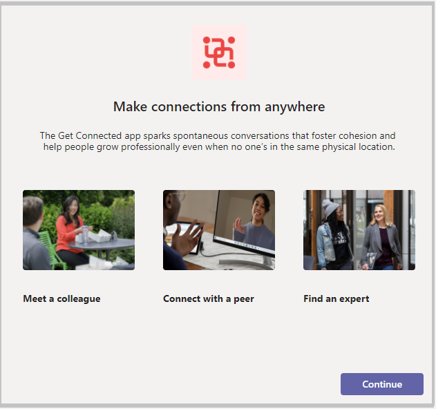
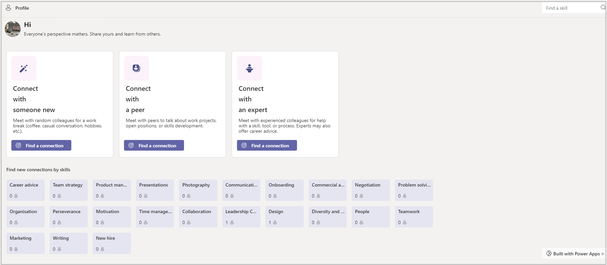
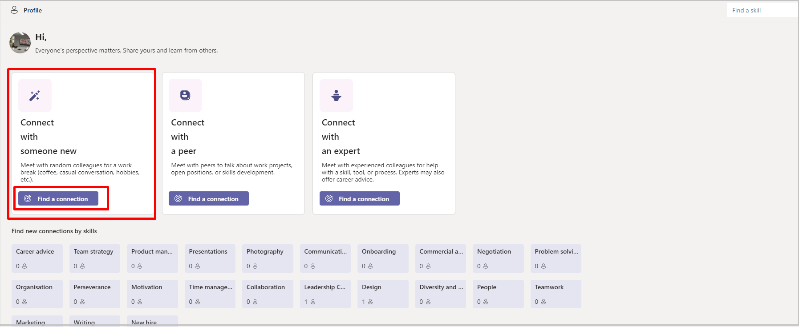
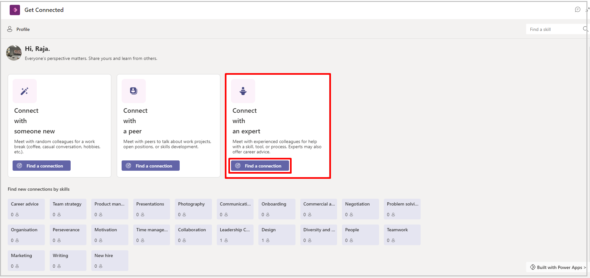
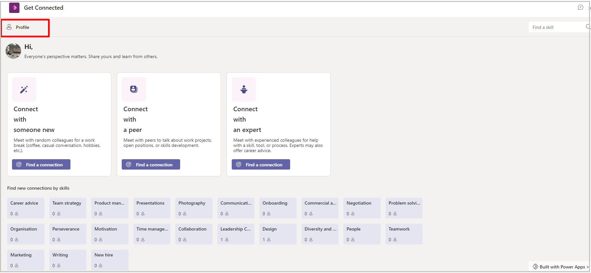
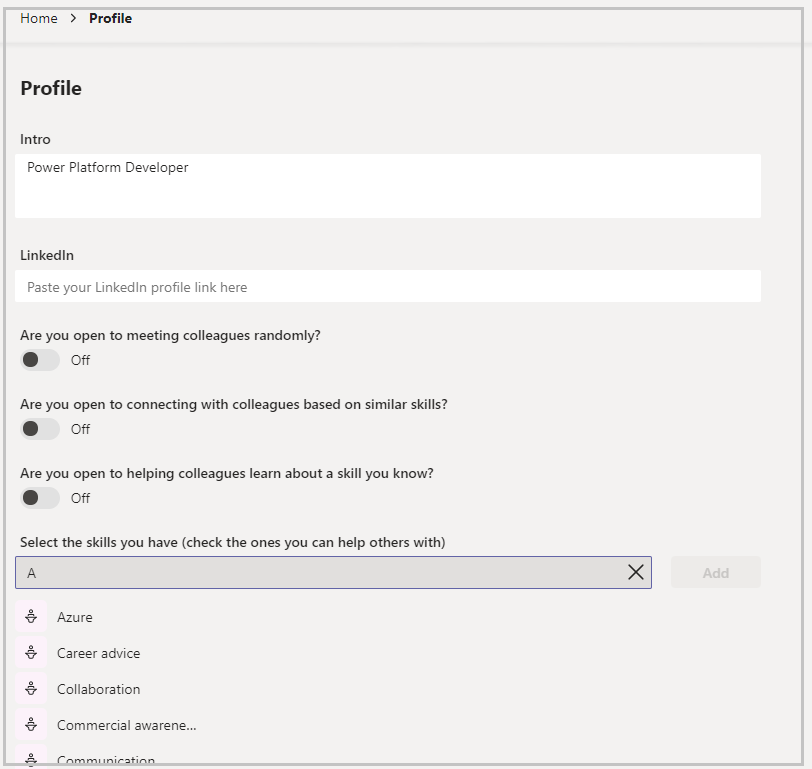

# Get connected sample app (preview)

[This article is pre-release documentation and is subject to change.]

In this tutorial, learn about the Get connected app, and how to use it effectively.

> [!IMPORTANT]
> - This is a preview feature.
> - Preview features aren’t meant for production use and may have restricted functionality. These features are available before an official release so  that customers can get early access and provide feedback.

## Overview

The Get connected sample app for Microsoft Teams provides a simple way to connect and with people in your organization with similar skills.

Benefits of using the Get connected app:

- Connect with someone new
- Connect with a peer
- Connect with an expert
- Find new connections by skills

> [!NOTE]
> - Before you can use this app, you may be asked for your permissions to use the connection. More information: [**Allow connections in sample  apps**](use-sample-apps-from-teams-store.md#step-1---allow-connections).
> - This app is available in three different Teams themes: Default, Dark and High contrast. When you [**change the theme in Teams**](https://support.microsoft.com/office/change-settings-in-teams-b506e8f1-1a96-4cf1-8c6b-b6ed4f424bc7),  the app automatically updates to match the selected theme. More information: [**Get the Teams theme using the Teams integration object**](use-teams-integration-object.md#get-the-teams-theme)

## Prerequisites

Before using this app:

1. Find the app in Teams store.
1. Install the app.
1. Set up the app for the first use.

For details about the above steps, go to [Use sample apps from the Teams store](use-sample-apps-from-teams-store.md).

## Open the Get connected app

To open the Get connected app:

1. Sign in to Teams.
1. Select the Team.
1. Select the channel where you installed the **Get connected** app.
1. Select the **Get connected** tab.
1. Select **Allow** if the app asks for your permissions to use the connectors.
1. You can learn more about extending this app's capabilities on the splash screen. Select **Got it** to close the screen, and go to the app. To hide this message while opening this app again, select **Don't show this again** before you select **Got it**.

## Understanding the Get connected interface (Teams)

Get connected is all about making connections with your colleagues. The Get connected app gives you easy access to details about the skills of your colleagues, and enables discovering and meeting new friends, connections with peers, and connection with an expert based on their skills. You can connect randomly to meet and learn new things from each other, or meet with an expert to learn how to overcome challenges, and connect peers with others who will have similar skills form a group to understand challenges and overcome them together.

1. **Connect with someone new.**&mdash;Find a new connection and meet the new people  randomly.
1. **Connect with a peer.**&mdash;Message to a team channel to connect and meet.
1. **Connect with an Expert.**&mdash;Choose the skills and meet the expert of that skill.
1. **Update profile skills**
1. **Connection by skills**
1. **Find a skill**
1. **Edit the app in Power Apps**&mdash;Get connected is built in Power Apps, and the app template can be edited using the Power Apps app in Teams. Selecting the **Built with Power Apps** button will launch the Power Apps maker studio in Teams, from which you can edit the Get connected app.

## Connect with someone new

When you connect with someone new, the system will connect you with someone random from your organization so you can get to know others in your organization. For example, if you're new and don't know many people, you can use Get connected to expand your network of work connections.

> [!NOTE]
> Get Connected app requires at least three users who have edited their profile in the app, and opted-in to allow meeting colleagues randomly. If an insufficient number of employees have opted-in, you'll have the option to invite colleagues to use the app. For more information, see the [Update profile skills](#update-profile-skills) section.

1. In Teams, go to the team in which Get connected is installed.
1. Select the **Get connected** tab.
1. Find connect with someone new, select **find a connection**.
1. Select **Start Chat** or select **Schedule a Meeting**
1. Find another connection.

    

## Connect with a peer

Connecting with a peer will connect you with someone with the same job title as you in Active Directory so you can collaborate and share ideas.

> [!NOTE]
> Get Connected app requires at least three users who have edited their profile in the app, and opted-in to allow meeting colleagues randomly. If an insufficient number of employees have opted-in, you'll have the option to invite colleagues to use the app. For more information, see the [Update profile skills](#update-profile-skills) section.

1. Open Teams and select the team in which the Get connected app is installed.
1. Select the Get connected tab.
1. Find Connect with a peer, select **Find a connection**.
1. Select **Invite people in a channel.**
1. Select Team.
1. Select Channel.
1. Select a Post.
1. Post a comment to start the conversation.

## Connect with an expert

By connecting to an Expert, you can find and connect with people who have experience in areas that you're learning, and reach out to them. Experts are people who have associated a skill with their profile and also have indicated that you're willing to coach others in that skill area.

> Note
>
> Get Connected requires that there be at least three people who have edited their profile in Get Connected and opted in to the setting to helping colleagues with skills that you know before recommending experts.  For more information, see the [Update profile skills](#update-profile-skills) section.

1. Open Teams and select the team in which the Get connected app is installed.
1. Select the Get connected tab.
1. Find Connect with an expert, Select **Find a connection**.

   

1. Select a skill in which you want to improve.
1. People who have that  skill will be displayed.
1. Select a person and start a chat or schedule a meeting with the respective person

## Update profile skills

You can also make yourself available to help others with skills in which you have experience. By updating your profile skills, colleagues looking for someone with experience with that skill will be able to find you in the **Get connected** app.

1. Open Teams and select the team in which the Get connected app is installed. 

1. Select the **Get connected** tab.

1. In the left corner, select **Profile**.

   

1. Add the skills and intro, and opt-in to meeting with colleagues and helping them learn about skills that you know.

   

1. Select **Save**.

   > [!NOTE]
   > When you add a skill to your profile, others will see you associated with the skill if you opt-in to helping colleagues learn about a skill. When you view the skill tiles on the main screen, you won't see your profile in skill categories (it displays colleagues with the skill), and you also won't see your profile in the list.

## Connection by Skills

The main screen of the application displays tiles for the skills defined in your environment. From here, you can select a skill and find people who have that skill on their profile.

1. Open Teams and select the team in which the Get connected app is installed.
1. Select the Get connected tab
1. Select skills to find connections
1. Select skills
1. Select a connection
1. Start chat or schedule a meeting.

## Find a skill

You can easily search to find available skills using **find a skill.**

1. Open Teams and select the team in which the Get connected app is installed.
1. Select the Get connected tab.
1. Enter skills to find connections.
1. Select desired skills.
1. You'll see  people who have the selected skill on their profile.

## Edit the Get connected app in Power Apps

Since Get connected is built using the Power Platform, you can easily extend it using Power Apps in Teams.

1. Open the Power Apps app in the Microsoft Teams store.
1. In Teams, right-click on the Power Apps icon on the left application menu and select **Pop out app** to open Power Apps in a new window.
1. Select the **Build** tab.
1. Select the team in which Get connected is installed.
1. Select the **Installed apps** tab.
1. From the Get connected tile, select the Get connected app to customize the app in Power Apps.

### See also

- [Understand Get connected sample app architecture](get-connected-architecture.md)
- [Customize sample apps](customize-sample-apps.md)
- [Sample apps FAQs](sample-apps-faqs.md)

[!INCLUDE[footer-include](../includes/footer-banner.md)]