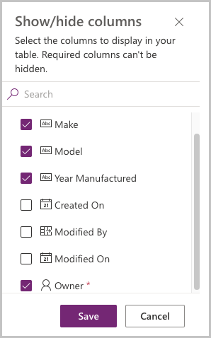
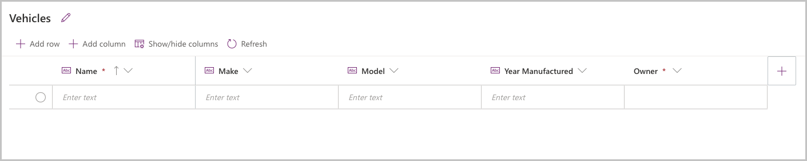
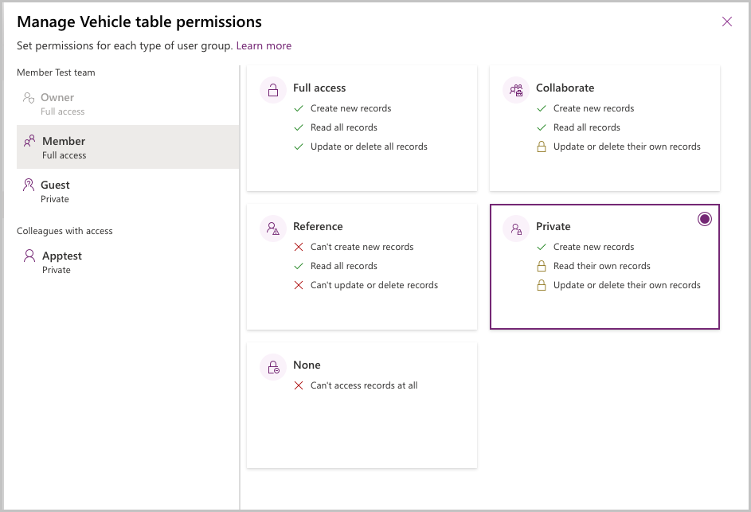
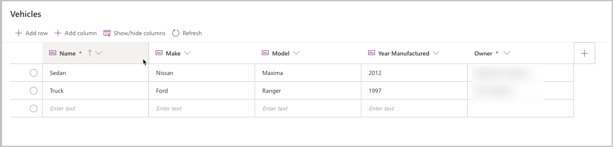

# Granting permission to tables in Dataverse for Teams

When building Power Apps, one important consideration is data security. Your apps drive important business processes, and if users can see sensitive data or delete records for which they should not have access, it can disrupt your business.

For example, if you have an app with sensitive customer data, unauthorized access to the data could put your company at risk of compliance with privacy laws.

You may think "I will just obscure access to sensitive data in my app." However, if the underlying data source is shared with users, they can still get to the data, or build new apps on the data source, giving them access to the restricted records.

One of the advantages of building Power Apps in Teams with Dataverse for Teams is that it provides the ability to set the table permissions to your specific business needs that map the security roles in Teams - such as Owners, Members, Guests and App Users

For example, if you have a table for which users should only be able to modify records that they own, Dataverse for Teams offers a table permission called **Collaborate** that gives users the ability to only edit records for which they are the record owner. In this topic, we will review table permissions in Dataverse for Teams and how you can use them to secure your important business applications.

Note that as of the time of this video, only team owners have the ability to edit table permissions.

## Understanding team roles

Permission to apps and the data that they use in Microsoft Teams are based on the role that the user has in the team. The following are the roles that a user can have in a team:

-   Owner: a team member with the owner role. This includes the creator of the team and anyone who has been given the owner role by another users. Owners get full access to the data used in apps in the team.
    
-   Member: a team member who is not an owner. By default, team members get full access like owners, but you can also change the permission for team members. You might want to restrict members from being able to edit certain tables. For example, in the [Bulletins app for Microsoft Teams](bulletins.md), if you wanted to have members be able to read Bulletins but not edit them, you could give team members **Reference**  permission on the Bulletins table.
    
-   Guest: a guest is someone outside of your organization who is added to the team. By default, guests can create records, but not view records created by others.
    
-   Colleagues with access: With Power Apps for Microsoft Teams, you can share an app with a AAD security group whose members need not be part of the Teams team where the app was built. This enables you to add users to the application without having to add them to the specific Teams team and opens up “Broad Distribution” scenarios. For example, you may want to build an app that is enabled for every accountant in the organization, or even every employee in that organization.

## Understanding table permissions

When assigning security to a table, the following are the permissions that you can assign:

-   Full Access – Allows end users to see and edit all records in the table.

-   Collaborate – Allows end users to see all records and create new records. But they can only edit or delete their own records. An example for when you want to use collaborate is 'up votes' in the Ideas app or the Perspectives app. You want each user of the app to view the upvotes of other users. But they should not be able tor change the votes for any users other than their own.
    
-   Reference – Provides a read-only view of data. Users cannot create, edit, or delete any records. An example is in Bulletins, if you want users to read Bulletin records but not edit Bulletins, you would give them reference privilege on the Bulletin table.
    
-   Private – Users can create new records. Additionally, they can view, edit, or delete their own records only. An example is in issue reporting if you want users to only be able to create and see their own issue records in Dataverse, you would give them private privilege on the issue report table.

## Seeing them in practice 

Let’s take a look at how table permissions work in practice. We will create a table and then show what two different users see.

NOTE: To complete this part of the lesson you will need an environment with two user logins, with one of them having the Team owner role and another with Team member (a member of the Team but not granted owner role)

1.  Log in to Microsoft Teams as the Team owner.

2.  Create an app and table in Team with a Dataverse for Teams database:

    1.  Right click on the Power Apps icon and pop out the app.

    2.  Create a new app

    3.  App name: Vehicle Manager

    4.  Select **Create new table** and name it Vehicle

        a.  Columns: Make, Model, Year Manufactured

        b.  Select **Show/hide columns**

        c.  From Show/hide column dialog, select the **owner** field and select **Save**.

        

Your table should now look like this:

1.  Add a record to the table:

    a.  Select **Add row**.

    b.  Enter record details.

    c.  The owner field of the created record will reflect your logged-in user
        account.

2.  Select the area outside of the table definition screen to return to the app.

3.  Save and Publish the app. You will need to select a channel in which the app will be displayed—select the **+** next to the desired channel name to select the channel.

## Granting Permissions to the tables

We are going to set the permissions for the vehicles table for Team members:

1.  In Microsoft Teams, open the **Power Apps** app. Right mouse click on the Power Apps icon in Microsoft Teams and select **Pop out app**. This will pop out the app in a new window, so if you navigate somewhere else in Teams you won’t lose your changes.
    
2.  Select the **Build** tab.

3.  Select the team that contains the Vehicle Manager app.

4.  In the **Items created for…** area, select **See all**.

5.  Select **Tables** from the solution components bar.

6.  Select the Vehicle table and then select **Manage permissions**.

7.  Select the **Member** node. The initial permission will show Full access. Select the permission **Private** and select **Save.**
    
    

Next, we will log in to Teams as a user who is a non owner Team member to
observe their experience.

1.  Log into Teams using a user who is a member of the team in which the app is installed.
    
2.  Select the channel where the app is installed.

3.  Select the tab for the Vehicle Manager app.

4.  The app should open for the user, but no records will show in the gallery, as the user only has visibility to their own records.
    
5.  Select **New record** to create a new vehicle record, select the check mark to save the record.
    
6.  You should now see one record in the gallery.

Log out of Microsoft Teams and log back in as the Team owner. We will now go to
the table and see the created data.

1.  Log in to Microsoft Teams using using the Team owner personal.

2.  Right click on the Power Apps icon and pop out the app.

3.  Select the **Build** tab.

4.  Select the team in which the Vehicle Manager app is installed

5.  Select the Vehicle table

6.  Select **Edit**.

7.  You will now see two records in the Vehicle table, each with a different
    owner.

    

    So how would this apply to one of the Power Apps templates for Microsoft Teams?
    
    For example, with Bulletins we might set the following permissions for the tables in the app:

| Table                        | Permission  | Reason                                                                                                                      |
|------------------------------|-------------|-----------------------------------------------------------------------------------------------------------------------------|
| Bulletin                     | Reference   | Users should read all bulletins, but not edit or create bulletins.                                                          |
| Bulletin Bookmark            | Private     | Users should create their own bulletins, but not view or edit other users’ bookmarks.                                       |
| Bulletin Category            | Reference   | Users should read all categories but not edit or create categories.                                                         |
| Bulletin Category Preference | Private     | Users should create their own category preferences but should not be able to read or edit other users category preferences. |
| Bulletin Contact             | Reference   | Users should read all contact records but not create or edit contacts.                                                      |
| Bulletin FAQ                 | Reference   | Users should read all FAQ records but not create or edit existing FAQ records.                                              |
| Bulletin FAQ Category        | Reference   | Users should read all FAQ categories but not create or edit existing FAQ records                                            |
| Bulletin Link                | Reference   | Users should read all links but not create or edit existing link records.                                                   |
| Bulletin Link Category       | Reference   | Users should read all link categories but not create or edit existing link categories.                                      |
| Bulletin Read Receipts       | Private     | Users should be able to create new read receipts when they view a bulletin, but not read or edit other users read receipts. |
| Bulletin User Settings       | Private     | Users should be able to create new user setting records but not read or edit other users setting records.                   |

## What permissions should I share?

Before assigning permissions, you should plan your security based on the personas of users of your app. Who will administer the app? Who will use the app? How will they use it?

For example, the Inspection Power apps template for Microsoft Teams is designed to address the following personas:

-   Inspection manager: creates Inspection forms and manages the list of locations or assets.
    
-   Inspection reviewer: reviews inspection data and approves inspections.

-   Inspection User: completes inspections.

Once we have the personas defined, relate these personas to the team role to which they should be assigned:

-   Inspection manager: Since inspection managers will need full access to create inspection forms and other system table records, we will make them owners in the team.
    
-   Inspection reviewer: Since inspection reviewers should be able to edit all inspections, but they will not create inspection forms, we will make them team members. This will enable us to give them reference access to the Area Inspection Checklist table (where inspection form data is stored), but full access to Area Inspection table (where inspection records are stored).
    
-   Inspection user: Inspection users should only be able to submit new inspections, but not create new inspection forms or see other user’s inspections. So we will not make them members of the team in which the app is installed—we will share the app with them as colleagues, and give them Reference  permission to Area Inspection Checklist and Private permission to Area Inspection. This will allow users to view inspection forms and create their own inspection records.

## Learn more:

For more details on recommended table permissions for the Power App templates for Microsoft Teams, see the following topics:

-   [Deploy Profile + as broad distibution app](deploy-profile-plus-broad-distribution.md)