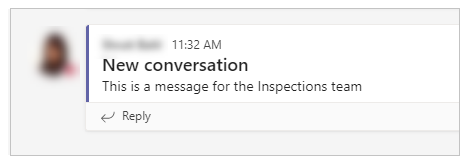

# Have a conversation about your business data in a Power App in Microsoft Teams

Microsoft Teams apps drive collaboration by enabling users to do work where they communicate and collaborate. One way to make your apps collaborative is by adding the ability to have a conversation about your app or the data in your app. Microsoft Teams is your go-to place to have such conversations.

For example, in the Profile + template Power App for Microsoft Teams, when you select one or more profile cards in the app, you can start a chat with the selected people directly in Microsoft Teams.

You might also want to use this capability for your apps—for example, if you are building a sales opportunity tracker for the sales manager to review upcoming deals, you might want to add a button for the user to chat with the salesperson about the opportunity.

In this way, Power Apps in Teams can leverage deep integration with other Teams capabilities to make apps collaborative.

In this topic we will learn how we can integrate Power Apps with Teams to facilitate conversations.

## Prerequisites

To complete this lesson, we would need the ability to create apps within Microsoft Teams which will be available as part of select Microsoft 365 subscriptions.

## Login into Microsoft Teams

Login into Microsoft teams using either the Desktop app or the web app

## Create a new Team

In this section we will create a new Microsoft Teams team and then create an app within that team (If you already have a team you can use, then you can skip this section)

1.  To create a new team, select the Teams tab and then select **Join or create a team** on the left bottom of the screen -\> then select **Create Team** -\> **From Scratch** -\> **Public** and give the team a name – **Calls and Meetings Integration** for our example and select Create
    
2.  The next pop up that shows up is the is the Add members to the Team – if you have any members in your organization you would like to add to the team for testing purposes, select and add them here and select the Add button
    
3.  The member gets added to the team

4.  Select Close

5.  The new team gets created and is listed under the Teams tab

## Create a new App

We will create an app where the user can start conversation for a particular
Team and Channel by selecting a button and typing in a message in a text box.
The user can then select the Submit button to post the message in the particular
Team and Channel in Microsoft Teams, then other user can join the conversation.

1.  Open Teams apps

2.  Select the Power Apps icon in the left navigation menu

3.  Select the +New App button under Recent apps

4.  Select the team we just created and select Create

5.  The app gets created and the app studio opens allowing us to make edits to
    the app

6.  Enter a Name for the app – Conversation App and select Save

7.  The app is created with a default gallery on Screen 1

8.  Ignore the first screen (can be deleted later)

## Add Microsoft Teams as a Connector

1.  We need to add Microsoft Teams as a connector to the app since we want to be
    able to access the Teams and Channels from the logged in user’s account

2.  To do this, select the Data icon from the left navigation menu

3.  Select +Add data and then select Connectors

4.  Scroll down and select See all connectors

5.  Search for Microsoft Teams and select that as a connector

6.  Microsoft Teams gets added as a connector

## Add a new table to capture Conversation details

1.  We need to add a table to capture details like Microsoft Teams conversation id, team, channel etc. related to a conversation started in the app
    
2.  To do this, select the Data icon from the left navigation menu

3.  Select +Add data -\> + Create new table

4.  Table name = Conversation

5.  Plural name = Conversations

6.  The table gets created with one column called Name

7.  Change that column name to ID

8.  Add 4 more columns with Type = Text

    a.  Column 1 name = Team

    b.  Column 2 name = Team Channel

    c.  Column 3 name = Team Name

    d.  Column 4 name = Channel Name

## Add a new screen to the app

1.  In the tree view select +New screen and select Blank layout

2.  A new screen gets added

3.  Update the Fill property of the screen to something other than white

4.  In our example, we set the Fill property of the screen to RGBA(224, 224,
    237, 1)

5.  Select the + (Insert) option from the left navigation menu

6.  Select Input-\> Button to add a button to the screen

7.  Update the following properties of the button

| Property  | Value                                              |
|-----------|----------------------------------------------------|
| Name      | startaconversation_Button                          |
| Text      | "Start a conversation"                             |
| Width     | 200                                                |
| Height    | 32                                                 |
| Font size | 12                                                 |
| X         | Parent.Width/2 - startaconversation_Button.Width/2 |
| Y         | 100                                                |
| OnSelect  | Set(enterMessage,true)                             |

8.  Select the + (Insert) option from the left navigation menu

9.  Select Input-\> Combobox to add it to the screen

10. Update the following properties of the Combobox

| Property | Value                                  |
|----------|----------------------------------------|
| Name     | team_Combobox                          |
| Items    | MicrosoftTeams.GetAllTeams().value     |
| Width    | 320                                    |
| Height   | 32                                     |
| X        | Parent.Width/2 - team_ComboBox.Width/2 |
| Y        | 200                                    |
| Text     | "Team"                                 |
| Tooltip  | "Team"                                 |
| Visible  | enterMessage                           |

11. Select the + (Insert) option from the left navigation menu

12. Select Input-\> Combobox to add it to the screen

13. Update the following properties of the Combobox

| Property | Value                                                                                                               |
|----------|---------------------------------------------------------------------------------------------------------------------|
| Name     | channel_Combobox                                                                                                    |
| Items    |         If(!IsBlank(team_ComboBox.Selected.id),MicrosoftTeams.GetChannelsForGroup(team_ComboBox.Selected.id).value) |
| Width    | 320                                                                                                                 |
| Height   | 32                                                                                                                  |
| X        | Parent.Width/2 - channel_ComboBox.Width/2                                                                           |
| Y        | 200                                                                                                                 |
| Text     | "Channel"                                                                                                           |
| Tooltip  | "Channel"                                                                                                           |
| Visible  | enterMessage                                                                                                        |

14. Select the + (Insert) option from the left navigation menu

15. Select Input-\> Textbox to add it to the screen

16. Update the following properties of the Textbox

| Property    | Value                                    |
|-------------|------------------------------------------|
| Name        | message_TextBox                          |
| Value       | ""                                       |
| Width       | 500                                      |
| Height      | 180                                      |
| X           | Parent.Width/2 - message_TextBox.Width/2 |
| Y           | 300                                      |
| Placeholder | Type message here                        |
| Visible     | enterMessage                             |

17. Select the + (Insert) option from the left navigation menu

18. Select Input-\> Button to add a button to the screen

19. Update the following properties of the button

| Property  | Value                                  |
|-----------|----------------------------------------|
| Name      | submit_Button                          |
| Value     | "Submit"                               |
| Width     | 96                                     |
| Height    | 32                                     |
| Font size | 12                                     |
| X         | Parent.Width/2 - submit_Button.Width/2 |
| Y         | 500                                    |
| Visible   | enterMessage                           |

20.  Use this code in the OnSelect button of the button

```
Patch(
    Conversations,
    Defaults(Conversations),
    {
        ID: MicrosoftTeams.PostMessageToChannelV3(
            team_ComboBox.Selected.id,
            channel_ComboBox.Selected.id,
            {
                content:message_TextBox.Value,
                contentType:"text"
            },
            {subject:"New conversation"}
        ).id,
        Team: team_ComboBox.Selected.id,
        'Team Channel':channel_ComboBox.Selected.id,
        'Team Name':team_ComboBox.Selected.displayName,
        'Channel  Name':channel_ComboBox.Selected.displayName
    }
);

Set(enterMessage,false);
Reset(team_ComboBox);
Reset(channel_ComboBox);
Reset(message_TextBox)
```

*NOTE: In the above formula, we are using the Patch function to create a row in the Conversations table to capture the conversation ID along with the Team, Team Name, Channel and Channel Name while at the same time also posting a message in the appropriate Team and Channel using the PostMessageToChannelV3 function. We then also set the enterMessage variable back to false to hide some of the fields and buttons whose visibility depends on this variable*

*Also, note that the subject here is hardcoded to “New conversation” to keep the app simple and not add another text box control to capture. But a text box can be added for subject to the screen and can be captured by the user. This formula will need to be adjusted accordingly to reference that control.*
    
*Lastly, the Reset function does not work for the Fluent UI Combobox control. This is needed to not have any team or channel selected once a message is posted.*

20. Select the + (Insert) option from the left navigation menu

21. Select Input-\> Button to add a button to the screen

22. Update the following properties of the button

| Property  | Value                                  |
|-----------|----------------------------------------|
| Name      | joinconversation_Button                |
| Text      | "Join conversation"                    |
| Width     | 200                                    |
| Height    | 32                                     |
| Font size | 12                                     |
| X         | Parent.Width/2 - submit_Button.Width/2 |
| Y         | 500                                    |
| Visible   | enterMessage                           |

23.  Use this code in the OnSelect button of the button

```
Launch(
    Concatenate(
        "msteams://teams.microsoft.com/l/message/",
        Last(Sort(Conversations, 'Created On', Ascending)).'Team Channel',
        "/",
        Gallery1.Selected.etag,
        "?tenantId=",
        Param("tenandId"),
        "&groupId=",
        Last(Sort(Conversations, 'Created On', Ascending)).Team,
        "&parentMessageId=",   
        LookUp(MicrosoftTeams.GetMessagesFromChannel(Last(Sort(Conversations, 'Created On', Ascending)).Team,
        Last(Sort(Conversations, 'Created On', Ascending)).'Team Channel').value,
        id = Last(Sort(Conversations, 'Created On', Ascending)).Team).etag,
        "&teamName=",
        Last(Sort(Conversations, 'Created  On', Ascending)).'Team Name',
        "&channelName=",
        Last(Sort(Conversations, 'Created On', Ascending)).'Channel Name'
    ),
    {},
    LaunchTarget.New
)
```

* NOTE: In the above formula, we are using the Launch function to launch Microsoft Teams using the team and channel parameters of the last record that was created in the Conversations table. We are doing this so that when a user starts a conversation and submits a message to post to a channel, the user can then select the **Join Conversation** button to navigate to the Teams post directly.*

* We are using the last function here to keep it simple. If you anticipate using this app more extensively and anticipate having multiple conversations, you could get creative by using a gallery of conversations and letting the user select which one he would want to join.*

## Save and Publish the App

1.  Select **Save** on the top right to save the app

2.  Select the Publish button on the top right to Publish the app

3.  Select Next on the popup

4.  Under Add to Channel, make sure the Channel under which the app should be shown is listed and shows as 1 active tab(s) and not 0 active tab(s).

5.  Select Save and Close to complete the publishing of the app

6.  The app gets published

## Testing the app

1.  Run the App in preview mode or go to the team in which the app is created

2.  You should only see two buttons – Start a conversation and Join conversation

3.  Select the **Start a conversation** button

4.  Additional fields should show up – Team (dropdown – list of teams), Channel (dropdown – list of channels within the selected team), Message box (text box to type in the message to be sent to the team), Submit button (to submit the message)

5.  Select a Team

6.  Select a Channel within the team

7.  Type in a message

8.  Select the **Submit** button

9.  All the additional fields/controls get hidden

10. Select **Join conversation** button to be taken to the Team and Channel chat where the last message was sent


