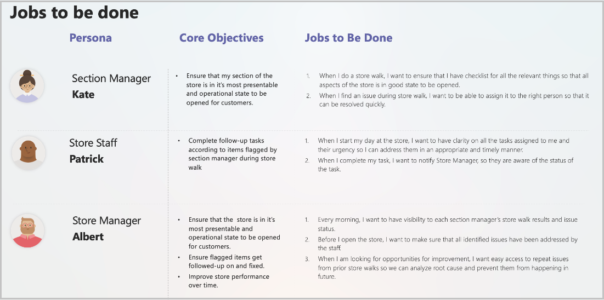
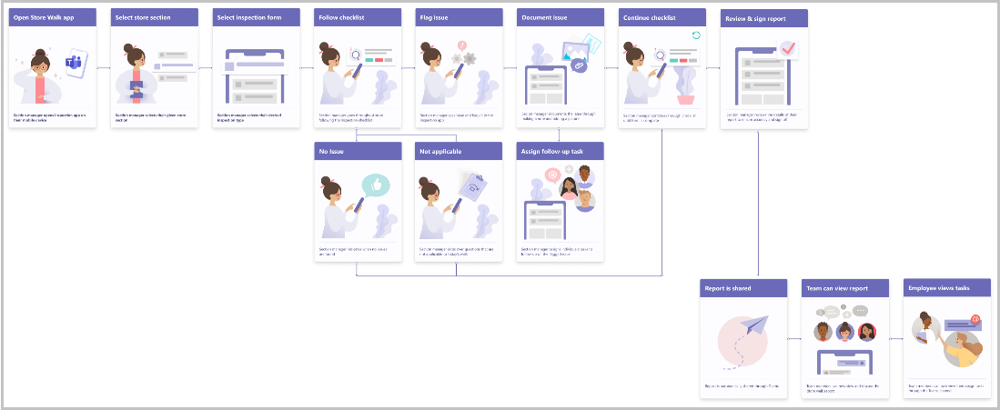
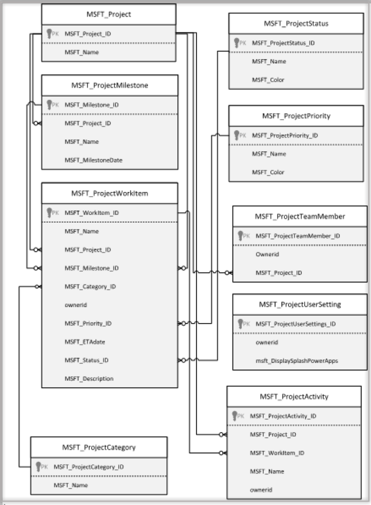
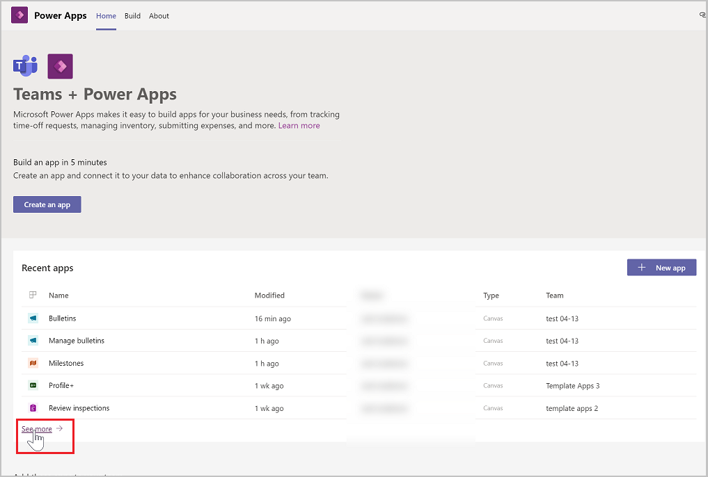
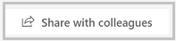
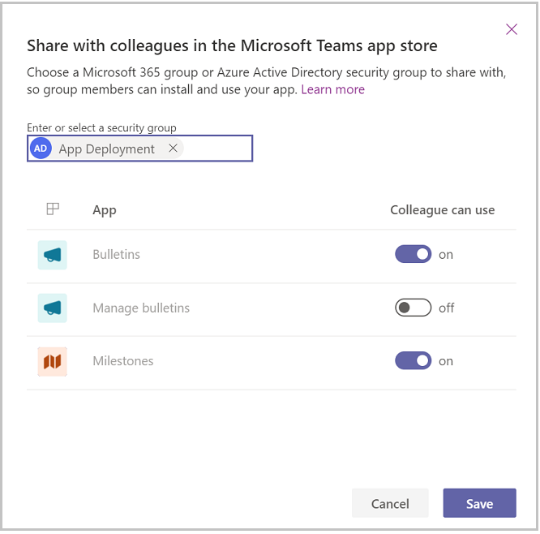

# How to build apps for Microsoft Teams

The [sample apps](use-sample-apps-from-teams-store.md) for Microsoft Teams are designed, and built with the following goals:

- Provide fully functional apps for Teams that have relevance across multiple industries.
- Provide examples of deeper integration of line-of-business data from Power Apps into collaborative elements of Teams to drive better more productive workloads.
- Provide examples of using good UX design with Teams and Power Apps.
- Provide extensible apps which users can modify and extend to suit their business requirements.

In this article, we'll review the process that we used to build these apps, and the steps that you can follow when building your own Power Apps.

> [!TIP]
> This article highlights some of the approaches taken when designing the Teams template apps. For additional resources on bet practices for building Power Apps, please refer to [Power Apps guidance documentation](/powerapps/guidance/planning/introduction) section of the Power Apps docs.

Watch this video to learn how the Power Apps templates for Microsoft Teams were made:
> [!VIDEO https://www.microsoft.com/videoplayer/embed/RWL0DQ]

## Define

Before designing and building, you need to have an idea&mdash;can be an idea for a solution to a business problem, an idea for modernizing a legacy or manual process, or an idea for an app that will make the life of your users easier.

Look to see if there are any existing solutions for the problem. Talk to the stakeholders, customers, or potential users of the app and get their input. Capture their requirements or user stories and prioritize based on what is the highest priority need or opportunity.

Identify “personas” or roles of users who will use your application. At this point, you want to focus on defining the user’s key problems&mdash;what are their unmet needs? How important is it for them to solve this problem?

Many teams tend to dive into solutioning before they've fully understood the user’s problem. One way to avoid this trap is to use the “Jobs to be done” framework. This framework helps us identify and understand the needs and goals of the users that are the original drivers of their actions or decisions. This artifact documents each of the persona’s core objective and jobs they want to accomplish in their language.

The above example shows personas and jobs to be done for Inspection sample app for store walk scenario.

## Design

Once you've identified and validated your idea, personas, and their jobs to be done, now is time to design your app. It can be tempting to jump into development at this point, but a bit more design planning will serve you well.

Having a plan will ensure a consistent user experience while enabling you to make the best design decisions for the app.

### Design user experience

Make your design plan by creating user flow and wireframes (blueprints) for each job statement. This process helps to ensure the process your solution takes are logical, efficient, and tackles the core of the problem at hand.

Playing with the flow can help you better understand the various pros and cons of different processes. This understanding allows you to select the flow and screen that will enable users to achieve their end goal smoothly. There are many tools available to help you achieve the design outcome. For example, Microsoft applications such as PowerPoint, Visio, or 3rd-party applications such as Figma, Adobe XD, Sketch, or even simple pen and paper.

This is also a good check point to get the feedback from end users. Share these high-level flows with your app users and get their feedback on the end to end experience. The iteration at this stage is lower risk as you can quickly make changes and compare options.  

Once the base layout is in, now you can have some fun. Do you want a clean and crisp app? Or something more playful. Think about the state of mind of the user and what would work best for them. Wireframing the app screens also helps you to plan out what data connectors will be needed, and giving you an artifact you can review with the stakeholders to get feedback before building the app to verify that the proposed design addresses the requirements.  

**Once you have identified the requirements and personas and prioritized the backlog, identify the set of features that will be needed to satisfy the “must have” items in the backlog. This is called the Minimum Viable Product (MVP).**

### Design data model

Along with the user experience, designing the data model of the app is also important. While Power Apps can connect to data from anywhere, you want to think through the data that is needed in the app and how it will be used. In Visio, or some other data diagraming tool, plan out the tables, fields, and relationships that will be needed to support your desired app functionality. Here's an example of the data model for Milestones app tables, and their relationships.

Think through how users will need to interact with the data as you plan what field data types to use. For example, drop-downs for Status, Priority, and Category are updatable in Milestones&mdash;that's why we created a table for these options and used a lookup to link them to the work item. For other infrequently changing list options that aren't editable by users in the app, we used choice data type fields. Make sure your data design fits the purpose and
usage patterns of your app and users.

## Develop

Now that you've got an idea and a design, start building the app in Power Apps. If you're building an app using Power Apps in Teams, we recommend creating a private team and limiting the members of the team to only those involved in the app development process.

Be sure to periodically review progress with stakeholders to get feedback. Once they see the app coming together, it will build excitement for the finished product, and they'll also provide feedback that you can use to iterate and improve the app experience.

## Validate

Once the app functionality is complete, thoroughly test the app:

- Test as each Persona

- Test in Teams Desktop

- Test in Teams Mobile

- Test as user who isn't a member of the team if your app will be shared for broad distribution (sharing with colleagues outside of the team).

- Verify **App Checker** to determine if there are any issues or accessibility problems with your app and address them.

- Run the app through the [Power Apps Code Review  Tool](https://powerapps.microsoft.com/blog/power-apps-code-review-tool/). This tool has been purpose built to highlight specific areas of potential improvement in the app across a range of areas such as performance, maintainability, and security.

## Deploy

Your app is now complete and fully tested. Now it's time to onboard users. With Teams, you've several options that you can use to give users access to your app:

- Add members to the team in which you developed the app.

- Create a solution and move the app and underlying tables to a different Team environment.

- Share the app for broad distribution.

To share an app for broad distribution, follow these steps:

1. In Teams, open the Power Apps app.

1. Under **Recent apps** select **See more**.

    

1. Select the team where your app is installed.

1. Select **Share with colleagues**.

    

1. In the **Enter or select a security group** field, enter a security group or team with which you want to share access to your app.

1. Toggle **Colleague can use** to **on** for the app that you wish to share.

    

1. Select **Save**.

Users will now be able to find your app in the Teams store in the **Built for[company name]** section.

> [!NOTE]
> You'll need to set table permissions for the Microsoft Dataverse tables included in your app before users will be able to use it. For more information on table permissions, see [Set permission and share apps with colleagues](set-perms-and-share.md).

### See also

- [Boards (preview) sample app](boards.md)
- [Bulletins sample app](bulletins.md)
- [Employee ideas sample app](employee-ideas.md)  
- [Inspection sample apps](inspection.md)  
- [Issue reporting sample apps](issue-reporting.md)
- [Milestones sample app](milestones.md)
- [Perspectives (preview) sample app](perspectives.md)
- [Profile+ (preview) sample app](profile-app.md)
- [Customize sample apps](customize-sample-apps.md)
- [Sample apps FAQs](sample-apps-faqs.md)

[!INCLUDE[footer-include](../includes/footer-banner.md)]
