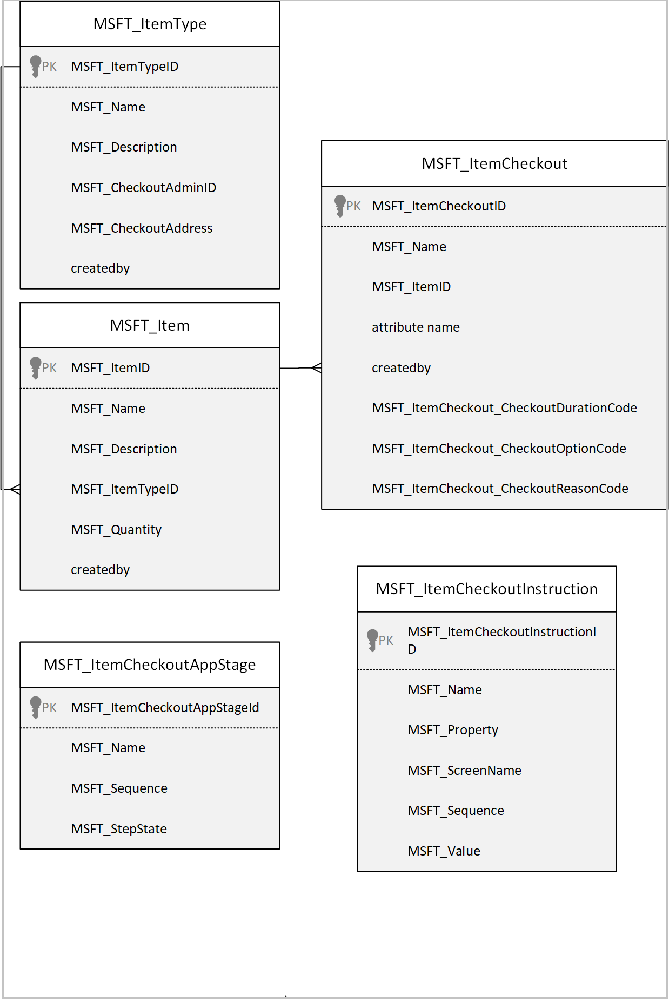
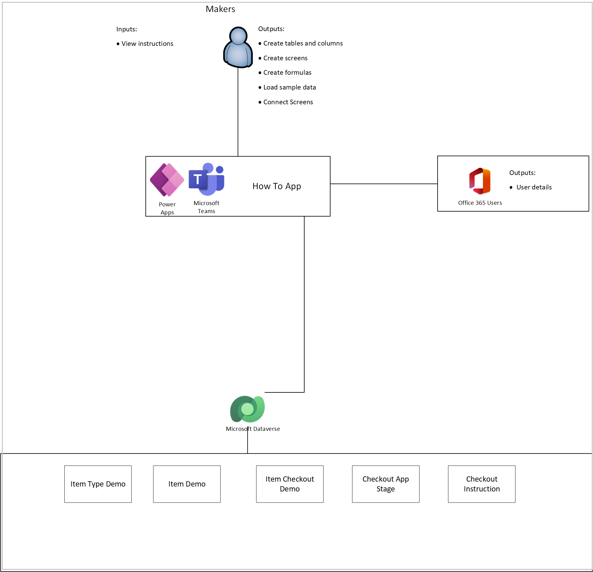

# Understand How to app sample app architecture (Preview)

[This article is pre-release documentation and is subject to change.]

In this article, you'll learn about the collections and global variables used by the How to app, and understand how to use them effectively.

## Prerequisites

To understand and use information in this article, you'll need to know about different controls, features, and capabilities of canvas apps.

- [Create and update a collection in a canvas app](../maker/canvas-apps/create-update-collection.md)
- [Collect, Clear, and ClearCollect functions in Power Apps](../maker/canvas-apps/functions/function-clear-collect-clearcollect.md)
- [Understand canvas-app variables in Power Apps](../maker/canvas-apps/working-with-variables.md)
- [Add and configure a canvas-app control in Power Apps](../maker/canvas-apps/add-configure-controls.md)
- [Add a screen to a canvas app and navigate between screens](../maker/canvas-apps/add-screen-context-variables.md)

> [!IMPORTANT]
> This is a preview feature.
> Preview features aren’t meant for production use and may have restricted functionality. These features are available before an official release so that customers can get early access and provide feedback.

## Data model
The following diagram shows the tables, columns, and relationships in the How to app solution:

## Tables

| Table                      | Description                                                  |
| -------------------------- | ------------------------------------------------------------ |
| Item Demo                  | How to app is designed to help new makers learn how to make Power Apps. This table is provided as an example of the table the users will create to store items that are available to be checked out. |
| Item Checkout Demo         | How to app is designed to help new makers learn how to make Power Apps. This table is provided as an example of the table that the users will create to store item checkout records. |
| Item Type Demo             | How to app is designed to help new makers learn how to make Power Apps. This table is provided as an example of the table that the users will create to store item types for classification of items. |
| Item Checkout  App Stage   | As the user goes through the lessons in the app, the app will store the status of their progress through the app, enabling the user to pick back up where they left off. |
| Item Checkout Instructions | The instructions for proceeding through the How to app are stored in the item checkout instructions table. |

## Architecture model
The following diagram illustrates the way that people, systems, and data interact in the How to app solution

### Connectors

The following connectors are used in the How to app:

- **Microsoft Dataverse** - Used to read and write data in Dataverse.
- **Office 365 Users** - Used to read Microsoft 365 user profile data.

## Collections 
The following collection is used in the How to app solution:

| Collection Name | Description                                                        | Screen Used                 |
|-----------------|--------------------------------------------------------------------|-----------------------------|
| colLocalization | Used to build a Localization Collection based on the User Language | OnStart property of the App |

## Global variables
The following global variables are used in the How to app solution:

| Variable Name                   | Type    | Description                                                           |
|---------------------------------|---------|-----------------------------------------------------------------------|
| gblUserLanguage                 | Text    | To check the logged in User’s Language.                                |
| gblThemeDark                    | Boolean | To check whether the Teams theme is set to Dark.                       |
| gblThemeHiCo                    | Boolean | To check whether the Teams theme is set to High Contrast.              |
| gblAppSetting_inputMobileOnWeb  | Boolean | Variables to Scale fonts for mobile-oriented apps, running in desktop. |
| gblAppSetting_inputScaleFontsby | Number  | Use this variable for scaling all fonts by a fixed amount.             |
| gblAppSetting_inputMobile       | Boolean | Variables to Scale fonts for mobile-oriented apps.                     |
| gblAppColors                    | Record  | Variable to set the Color value in the app.                            |
| gblAppSizes                     | Record  | Variable to set the Color value in the app.                            |
| gblAppStyles                    | Record  | Variable to set the Styling values in the app.                         |
| gblCurrUserEmail                | Record  | Global variable to store current user email address.                                                      |
| gblCurrUser                     | Record  | Global variable to store the current user record.                      |

## App OnStart
This section explains the collections, variables, and execution details used in the OnStart of How to app:

### OnStart collections
The following collections are used on start of the application:

| **Collection name** | **Description**                                       |
|---------------------|-------------------------------------------------------|
| colLocalization     | Collection of localized text based on users language. |

### OnStart variables
The following variables are used on start of the application:

| **Variable name**     | **Description**                                               |
|-----------------------|---------------------------------------------------------------|
| gblAppLoaded          | - global variable to check if the app has loaded completely.  |
| gblUserLanguage       | - global variable to store the user's language.                |
| **gblCurrUserEmail**  | - global variable to store the current user email address.     |
| gblCurrUser           | - global variable to store the current user record.            |

### OnStart execution details

1.  When a user accesses the app, **gblAppLoaded** is set to false. The user’s language code is stored in **gblUserLanguage**, with English - US being the default one.

2.  The user’s language is then used to collect localized text used throughout the app (label and button text) in **colLocalization**.

## Welcome Screen
This section explains the collections, variables, and execution details used in the welcome screen:

### Welcome screen collections
The following collections are used in the welcome screen:

| **Collection name** | **Description**                                        |
|---------------------|--------------------------------------------------------|
| colLocalization     | collection of localized text based on user’s language. |

### Welcome screen variables
The following variables are used in the welcome screen:

| **Variable name**               | **Description**                                                                                              |
|---------------------------------|--------------------------------------------------------------------------------------------------------------|
| **gblCurrUserEmail**            | Global variable to store the current user email address                                                    |
| gblThemeDark                    | Global variable to store if Teams is running in dark mode.                                                 |
| gblThemeHiCo                    | Global variable to store if Teams is running in contrast mode.                                             |
| gblAppColors                    | Global variable to store the app design colors                                                             |
| gblAppSizes                     | Global variable to store the app sizes for app in mobile and mobile on web                                 |
| gblAppStyles                    | Global variable to store styling properties for all controls (set on the OnVisible of the Loading Screen). |
| gblAppSetting_inputMobileOnWeb  | Global variable to scale fonts for mobile-oriented apps, running in desktop.                               |
| gblAppSetting_inputMobile       | Global variable to scale fonts for mobile-oriented apps.                                                   |
| gblAppSetting_inputScaleFontsBy | Global variable for scaling all fonts by a fixed amount.                                                   |

### Welcome screen execution details

1.  If **gblAppStyles** isn't blank (which means the styling variable has been loaded).

2.  The loading screen will initialize all the global variables like  **gblAppStyles, gblAppSizes,** gblAppColors to show the screen and color settings as per the user setup like dark mode or high contrast mode in Teams desktop or in browser.

3.  In this screen, you'll find **Preview App**. Selecting it will redirect to Assets Screen.

## Items screen
This section explains the collections, variables, and execution details used on the items screen.

### Items screen collections
The following collections are used on the items screen:

| **Variable name** | **Description**                                          |
|-------------------|----------------------------------------------------------|
| colLocalization   | Collection of localized text based on user’s language. |

### Items screen variables
The following variables are used on the items screen:

| **Variable name**        | **Description**                                                                                              |
|--------------------------|--------------------------------------------------------------------------------------------------------------|
| **locShowItems**         | Local variable to show the items based on item type.                                                       |
| **locSelectedItemType**  | Local variable to show the selected item types.                                                             |
| **gblThemeDark**         | Global variable to store if Teams is running in dark mode.                                                 |
| **gblThemeHiCo**         | Global variable to store if Teams is running in contrast mode.                                             |
| gblAppColors             | Global variable to store the app design colors.                                                             |
| **gblAppStyles**         | Global variable to store styling properties for all controls (set on the OnVisible of the Loading Screen). |

### Items screen execution details

1.  The items screen will show Item types with the number of items available under each item that are stored in galItemTypes_Demo.

2.  The items will be show in galItems_Demo when the user selects any of the item types in galItemTypes_Demo.

## Checkout Screen
This section explains the collections, variables, and execution details used on the checkout screen.
### Checkout screen collections

The following collections are used on the checkout screen:

| Collections     | Description                                            |
|-----------------|--------------------------------------------------------|
| colLocalization | collection of localized text based on user’s language. |

### Checkout screen collections

The following variables are used on the checkout screen:

| Variable name               | Description                                                            |
|-----------------------------|------------------------------------------------------------------------|
| gblAppStyles                | global variable to store styling properties for all controls.           |
| gblThemeDark                | global variable to store if Teams is running in dark mode.              |
| locShowCheckoutConfirmation | local variable to show the connection by randomly shuffling the userid. |
| gblAppColors                | global variable to store the app design colors.                         |
| gblThemeHiCo                | global variable to store if Teams is running in contrast mode.         |
| locSelectedItem             | global variable to store the current user email address.                |

### Checkout screen execution details

1.  When user selects any of the items that are needed, they can select checkout based on availability of the item that is stored in locSelectedItem item.

2.  After the item is checked out, the confirmation message will be shown from locShowCheckoutConfirmation.

## My Checkout Screen
This section explains the collections, variables, and execution details used on the My checkout screen.
### My checkout collections

The following collections are used on the My checkout screen:

| Variable name    | Description                                            |
|------------------|--------------------------------------------------------|
| colLocalization  | collection of localized text based on user’s language. |

### My checkout variables
The following variables are used on the My checkout screen:

| Variable name             | Description                                                                                                |
|---------------------------|------------------------------------------------------------------------------------------------------------|
| gblAppStyles              | Global variable to store styling properties for all controls (set on the OnVisible of the Loading Screen). |
| gblThemeDark              | Global variable to store if Teams is running in dark mode.                                                 |
| gblThemeHiCo              | Global variable to store if Teams is running in contrast mode.                                             |
| gblAppColors              | Global variable to store the app design colors.                                                             |
| locShowReturnConfirmation | Local variable to show the return confirmation message when user selects return button.                    |
| locSelectedItemType       | Local variable to show the selected item types.                                                             |
| locShowItems              | Local variable to show the items based on item types.                                                       |
| gblCurrUser               | Global variable to store the current user record.                                                           |
| locSelectedItemForReturn  | Local variable to return the selected item back to items.                                                   |

### My checkout execution details

1.  All the items checked out by the user will be show in this screen. The user will have option to return and show the days due for return

2.  After user selects return, the item will be returned back to items screen.

### See also

- [Use How to sample app (Preview)](how-to.md)
- [Customize sample apps](customize-sample-apps.md)
- [Sample apps FAQs](sample-apps-faqs.md)
- [Use sample apps from the Microsoft Teams store](use-sample-apps-from-teams-store.md)

[!INCLUDE[footer-include](../includes/footer-banner.md)]

