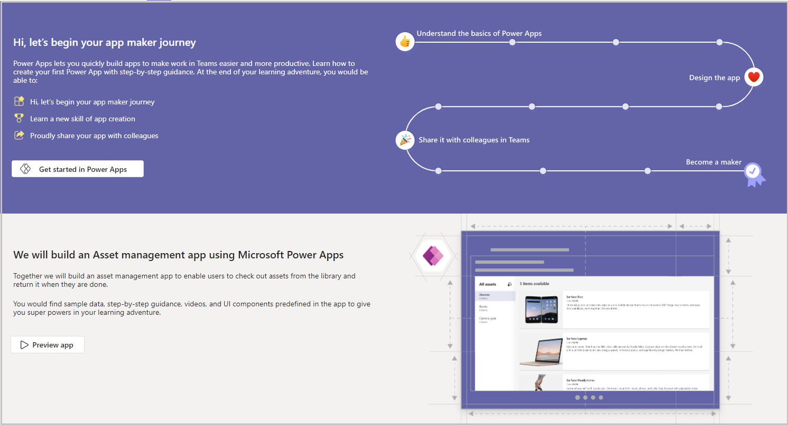
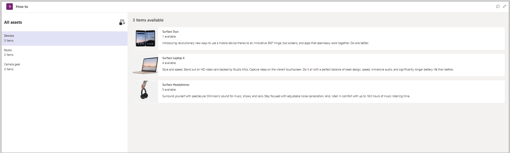
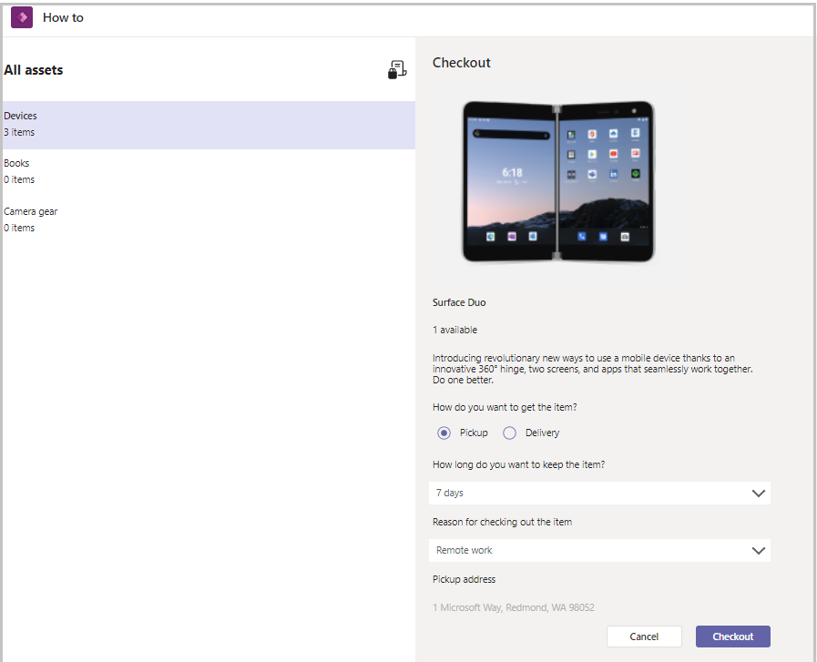
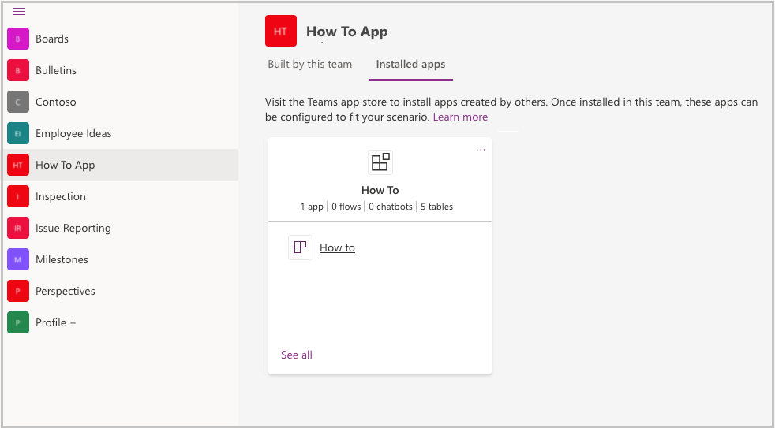
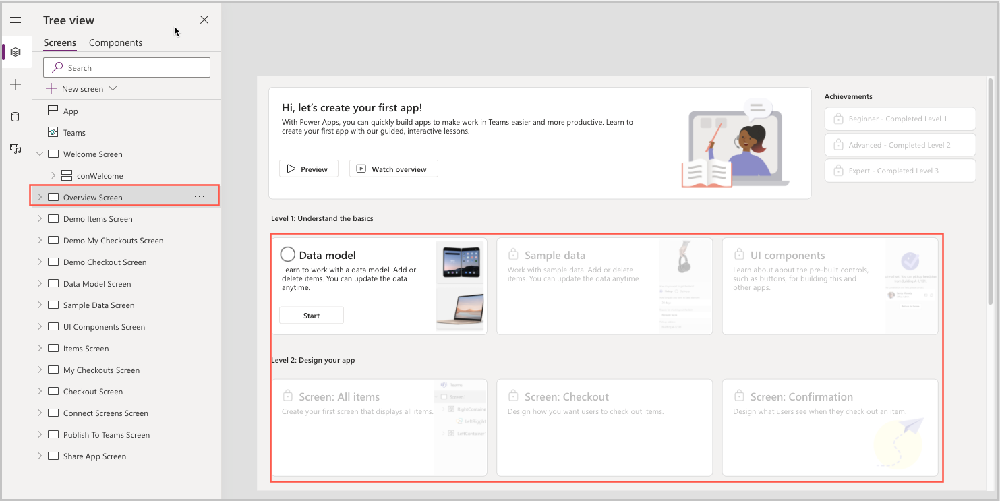

# Use How to sample app (preview)

[This article is pre-release documentation and is subject to change.]

The How-to template app for Microsoft Teams provides a simple way to learn how to be a Power Apps maker by walking you step-by-step through designing data model, screens, and connecting screens together to build a complete Power Apps asset checkout solution.

Benefits of using the How-to app:

- Understand the basics of Power Apps.
- Learn how to build apps in Teams.
- Share the asset checkout app you build with colleagues in Teams.
- Become a Maker

> [!NOTE]
> Before you can use this app, you may be asked for your permissions to use the connection. More information: [**Allow connections in sample apps**](use-sample-apps-from-teams-store.md#step-1---allow-connections)
> This app is available in three different Teams themes: Default, Dark and High contrast. When you [**change the theme in Teams**](https://support.microsoft.com/office/change-settings-in-teams-b506e8f1-1a96-4cf1-8c6b-b6ed4f424bc7) the app automatically updates to match the selected theme. More information: [**Get the Teams theme using the Teams integration object**](use-teams-integration-object.md#get-the-teams-theme)

> [!IMPORTANT]
> - This is a preview feature.
> - Preview features aren’t meant for production use and may have restricted functionality. These features are available before an official release so that customers can get early access and provide feedback.

## Prerequisites

Before using this app:

1. Install the How to app.
1. Set up the app for the first use.

For details about the above steps, go to [Use sample apps from the Teams store](use-sample-apps-from-teams-store.md).

## Building an Asset management app

In the How to app, we'll build an asset management app to enable users to check out assets from the library and return it when they're done. The instructions are included in the app, and makers who open the app in the Power Apps app in Teams will see the instructions in the studio.

This article includes the steps from the app for makers who prefer to read them outside of the app. For example, you've two monitors, and you want to have the instructions open on another screen, or you might want to print them out.

From the main screen, you can see a summary of the steps to build the How to app and have the ability to preview the app.

Selecting **Get started in Power Apps** will take you to the Teams Power Apps app, from which you can start the maker journey. Selecting **Preview App** which will redirects the user to Assets Screen, from which the user can use the asset checkout app, and see what the final experience will be when they finish the app.

In the asset checkout app, selecting an item will take you to a screen where you can check out the item.

In the top-left corner, you can select the icon for checkout items, which are available in your account.

## Start your maker journey in How to

How to is a self-contained lesson in how to build a Power Apps. All of the instructions are included in the app. To start learning, open How to app using Power Apps app in Teams:

1. In Teams, select **...** (ellipsis) from the left pane.

1. Search for **Power Apps** and select the Power Apps app.

1. Right-click on the Power Apps button, and select **Pop out app** to launch the Power Apps app in a new window to make it easier to use.

1. Select the Build tab.

1. Select the team with How to installed.

1. Select **Installed apps**.

1. In the How to tile, select the **How to** app. The app will open in the Power Apps app.

    

1. From the Tree view, select **Overview screen**.

    

## Understanding the overview screen

The overview screen is your guide to your maker journey. From the overview screen, you can see where you're in the process. To start a step, hold your keyboard **Alt** key, and select the **Start** button. This will take you to the relevant screen, from which you'll see the instructions to complete the step.

When done, return to the overview screen and select the button on the current step's tile to complete the step and move to the next lesson.

## Resetting your progress in How to

So if you've started to go through the lessons in How to, and you decide you would like to start over, you can restart the process by following these steps:

1. Right-click on Power Apps app in Teams, and select **Pop out**.

1. Select the **Build** tab.

1. Select the Team in which the How to app is installed.

1. Select the **Installed apps** tab.

1. In the How to tile, select **See all**.

1. Select **Tables**.

1. Select **Item Checkout App Stages**.

1. Select **Edit data**.

1. Select the rows in the table.

1. Select **Delete record(s)**.

## Learn to work with Data Model

In this step, we'll add three tables. Creating the table names as item types, items, and item checkouts. Tables are created to store the data.

For detailed instructions on how to create tables, see [Edit table data in Excel and publish it back to Dataverse for Teams](edit-data-in-excel.md)

Create the following tables and columns:

### Item Type

| Column name      | Date type | Value |
|------------------|-----------|-------|
| Checkout Admin   | Text      |  Not applicable     |
| Checkout Address | Text      |  Not applicable     |

### Item

| Column name | Date type      | Value                     |
|-------------|----------------|---------------------------|
| Quantity    | Whole number   |      Not applicable                     |
| Description | Multiline text |      Not applicable                     |
| Image       | Image          |      Not applicable                     |
| Item Type   | Lookup         | Related table = Item Type |

### Item Checkout

| Column name       | Date type   | Value                               |
|-------------------|-------------|-------------------------------------|
| Name              | Auto number |   Not applicable                                  |
| Item              | Lookup      | Related table = Item                |
| Checkout Reason   | Choice      | Remote work, New project assignment |
| Checkout Option   | Choice      | Pickup, Delivery                    |
| Checkout Duration | Choice      | 7 days, 30 days                     |
| Checkout Status   | Choice      | Active, Returned                    |

## Sample Data

In this step, we need to add data to the tables that we created earlier. This data will be the items and item types for the asset checkout process. For example, if you're using this app to manage the items such as mice and keyboards, you can define item types like computers, phones, or desks which people can check out.

We'll use the table editable grid to populate the sample data in the app. To user the table editable grid, follow these steps:

1. Open the Power Apps app in Teams.

1. Select the **Build** tab.

1. Select the Team in which the How to app is installed.

1. Select the **Installed apps** tab.

1. In the How to tile, select **See all**.

1. Select **Tables**.

1. Select **Item Checkout App Stages**.

1. Select **Edit data**.

> [!NOTE]
> The table editable grid cannot import photos.

The sample data screen includes a gallery that allows you to select items that were created in the previous step, and associate images with them.

## UI components

In this step, we're going to learn about the pre-built controls such as buttons, for building the apps. This app is built on Fluid UI framework. The new controls are Button, Check box, Combo box, Date picker, Label, Radio group, Rating, Slider, Text box, and Toggle.

To know more about Fluid UI framework and controls, go to [Fluent UI framework](https://www.microsoft.com/design/fluent) and [Use the Fluent UI controls for Power Apps Teams](use-the-fluent-ui-controls.md).

## Building asset screen

In this step, we're going to create your first screen that displays the items available to be checked out. This will be the primary screen of the application, from where the users will find items, and select them to check them out.

Follow these steps to start creating your app.

1. The horizontal container **conItemTypes** will be used to contain a header label and a gallery of item types. Set its properties as shown below:

    | **Property**      | **Value**                                                         |
    |-------------------|-------------------------------------------------------------------|
    | Name              | conItemTypes                                                      |
    | Gap               | 20                                                                |
    | Vertical Overflow | LayoutOverflow.Scroll                                             |
    | Minimum Width     | 300                                                               |
    | Padding Top       | 20                                                                |
    | Padding Bottom    | 20                                                                |
    | Fill              | If(gblThemeDark.ColorValue("\#141414"), gblThemeHiCo,Black,White) |

1. Add New Horizontal container to conItemTypes - **conItemTypesHeader**. It will contain a header label and an image.

    | **Property**   | **Value**          |
    |----------------|--------------------|
    | Name           | conItemTypesHeader |
    | Padding Right  | 10                 |
    | Minimum Height | 0                  |
    | Height         | 32                 |
    | Padding Left   | 20                 |

1. Add a label to conItemTypesHeader - **lblAllAssetsHeader**. It's a header label for the screen.

    | **Property**   | **Value**          |
    |----------------|--------------------|
    | Name           | lblAllAssetsHeader |
    | Font           | Segoe UI           |
    | Font weight    | Bold               |
    | Height         | 32                 |
    | Flexible Width | true               |
    | X              | 20                 |
    | Text           | "All assets"       |

1. Add an image to conItemTypesHeader - **imgCheckout**. It will be used to navigate users to their existing checkouts.

    | **Property** | **Value**                                               |
    |--------------|---------------------------------------------------------|
    | Name         | imgCheckout                                             |
    | Height       | 32                                                      |
    | Width        | 32                                                      |
    | Image        | If(gblThemeDark\|\|gblThemeHiCo,Checkout_Dark,Checkout) |

1. Add a blank vertical gallery to conItemTypes – **galItemTypes**. It's a gallery of item types. Selecting an item type will display its related items.

    | **Property**     | **Value**                                                                                                                    |
    |------------------|------------------------------------------------------------------------------------------------------------------------------|
    | Name             | galItemTypes                                                                                                                 |
    | Items            | Item Types                                                                                                                   |
    | Min Height       | 0                                                                                                                            |
    | Fill Portions    | 19                                                                                                                           |
    | Template Size    | 70                                                                                                                           |
    | Template Padding | 0                                                                                                                            |
    | OnSelect         | UpdateContext({ locSelectedItemType: ThisItem, locShowItems: true })                                                       |
    | Template Fill    | If(!('Items Screen'.Size = ScreenSize.Small), If(ThisItem.IsSelected, ColorValue("\#E2E2F6"), Transparent), Transparent) |

1. Add a label to galItemTypes – **lblName**. It's a label to display the item type name.

    | **Property** | **Value**                                                     |
    |--------------|---------------------------------------------------------------|
    | Name         | lblName                                                       |
    | Width        | Parent.Width                                                  |
    | Height       | 32                                                            |
    | X            | 20                                                            |
    | y            | 5                                                             |
    | Text         | ThisItem.Name                                                 |
    | Font weight  | If(ThisItem.IsSelected,FontWeight.Semibold,FontWeight.Normal) |
    | Font Size    | 10.5                                                          |

1. Add a label to galItemTypes – **lblItemCount**. It's a label to display the count of items belonging to a particular item type.

    | **Property** | **Value**                                 |
    |--------------|-------------------------------------------|
    | Name         | lblItemCount                              |
    | Width        | Parent.Width                              |
    | Height       | 32                                        |
    | X            | 20                                        |
    | y            | lblName.Y + lblName.Height                |
    | Text         | CountRows(ThisItem.Items.Item) & " items" |
    | Font Size    | 10.5                                      |

1. The horizontal container **conItems** will be used to contain a header label and a gallery of items for the select item type. Set its properties as shown below:

    | **Property**      | **Value**       |
    |-------------------|-----------------|
    | Name              | conItems        |
    | Gap               | 20              |
    | Padding Top       | 20              |
    | Padding Left      | 20              |
    | Padding Right     | 20              |
    | Vertical Overflow | Overflow.Scroll |

1. Add a label to conItems – **lblRelatedItemsHeader**. It's a label to display the count of items related to the selected item type.

    | **Property**       | **Value**                                                    |
    | ------------------ | ------------------------------------------------------------ |
    | Name               | lblRelatedItemsHeader                                        |
    | Text               | CountRows(locSelectedItemType.Items.Item) & " items available" |
    | Align in Container | AlignInContainer.Stretch                                     |
    | Font weight        | FontWeight.Semibold                                          |
    | Font Size          | 15                                                           |
    | X                  | 707\*1                                                       |
    | Y                  | 265\*1                                                       |

1. Add a blank vertical gallery to conItems – **galItems**. This is the gallery that will display items that belong to the selected item type.

    | **Property** | **Value**                 |
    | ------------ | ------------------------- |
    | Name         | galItems                  |
    | Items        | locSelectedItemType.Items |
    | TemplateSize | 130                       |

1. Add a button to galItems – **btnItemsBackground**. This is to add a white background for each item.

    | **Property** | **Value**                        |
    | ------------ | -------------------------------- |
    | Name         | btnItemsBackground               |
    | X            | 5                                |
    | y            | 0                                |
    | Fill         | White                            |
    | Height       | Parent.TemplateHeight - 20       |
    | Width        | Parent.TemplateWidth - Self.X\*2 |

1. Add an image to galItems – **imgItem**. This is to display the item's image or logo.

    | **Control**              | **Property**  | **Value**           |
    |--------------------------|---------------|---------------------|
    | Add an image to galItems | Name          | imgItem             |
    | imgItem                  | X             | 5                   |
    | imgItem                  | Y             | 0                   |
    | imgItem                  | Width         | 125                 |
    | imgItem                  | Height        | 110                 |
    | imgItem                  | ImagePosition | ImagePosition.Fill  |
    | imgItem                  | Image         | ThisItem.Image.Full |

1. Add a label to galItems – **lblItemName**. This is to display the item's name.

    | **Property** | **Value**                         |
    | ------------ | --------------------------------- |
    | Name         | lblItemName                       |
    | Y            | imgItem.Y + 5                     |
    | X            | imgItem.X + imgItem.Width +20     |
    | Text         | ThisItem.Name                     |
    | Width        | btnItemsBackground.Width - Self.X |
    | Font Size    | 10.5                              |
    | FontWeight   | FontWeight.Semibold               |

1. Add a label to galItems – **lblItemQuantity**. This is to display the count of an item available for checkout.

    | **Property**   | **Value**                                                    |
    | -------------- | ------------------------------------------------------------ |
    | Name           | lblItemQuantity                                              |
    | X              | lblItemName.X                                                |
    | Y              | lblItemName.Y + lblItemName.Height                           |
    | Text           | ThisItem.Quantity-CountRows(Filter('Item Checkouts',Item.Item=ThisItem.Item,'Checkout Status'='Checkout Statuses'.Active))&" available" |
    | Vertical align | Bottom                                                       |
    | Width          | btnItemsBackground.Width - Self.X                            |
    | Font Size      | 10.5                                                         |

1. Add a label to galItems - **lblItemDesc**. This is to display the item's description.

    | **Property**   | **Value**                                  |
    | -------------- | ------------------------------------------ |
    | Name           | lblItemDesc                                |
    | X              | lblItemName.X                              |
    | Y              | lblItemQuantity.Y + lblItemQuantity.Height |
    | Text           | ThisItem.Description                       |
    | Vertical align | Bottom                                     |
    | Width          | btnItemsBackground.Width - Self.X          |
    | Wrap           | false                                      |

1. Add a button to galItems – **btnItemsForeground**. This is an overlay button to make the entire row selectable.

    | **Value**                  | **Property**                     |
    | -------------------------- | -------------------------------- |
    | btnItemsForeground         | Name                             |
    | RGBA(128, 128, 128, .06) | HoverFill                        |
    | Transparent                | All other Fill except Hover Fill |
    | btnItemsBackground.X       | X                                |
    | btnItemsBackground.Y       | Y                                |
    | btnItemsBackground.Width   | Width                            |

Now set the Fill Portions property for the controls conItems and conItemTypes as shown below - item types covers 25% of the screen and the remaining 75% is covered by the list of items.

| **Control**  | **Property**  | **Value** |
| ------------ | ------------- | --------- |
| conItems     | Fill Portions | 3         |
| conItemTypes | Fill Portions | 1         |

## Building checkout screen

In this step, we're going to create the second screen, the item checkout screen. This screen displays the details of the item to be checked out and quantity available.

From this screen, the user provides details of the reason for checkout, duration, and other details and launches the checkout process.

| **Control**           | **Property**      | **Value**                                                        |
|-----------------------|-------------------|------------------------------------------------------------------|
| Checkout Screen       | OnVisible         | UpdateContext({locShowCheckoutConfirmation: false})              |
| parent container      | Name              | conParent_Checkout                                               |
| 1st child container   | Name              | conItemTypes_Checkout                                            |
| 2nd child container   | Name              | conCheckout                                                      |
| conItemTypes_Checkout | Gap               | 20                                                               |
| conItemTypes_Checkout | Vertical Overflow | LayoutOverflow.Scroll                                            |
| conItemTypes_Checkout | Minimum Width     | 300                                                              |
| conItemTypes_Checkout | Padding Top       | 20                                                               |
| conItemTypes_Checkout | Padding Bottom    | 20                                                               |
| conItemTypes_Checkout | Fill              | If(gblThemeDark.ColorValue("\#141414"),gblThemeHiCo,Black,White) |

1. Add a Horizontal container to conItemTypes_Checkout control - conItemTypesHeader_Checkout.

    | **Control**                                         | **Property**   | **Value**                   |
    |-----------------------------------------------------|----------------|-----------------------------|
    | Add a Horizontal container to conItemTypes_Checkout | Name           | conItemTypesHeader_Checkout |
    | conItemTypesHeader_Checkout                         | Padding Left   | 20                          |
    | conItemTypesHeader_Checkout                         | Padding Right  | 20                          |
    | conItemTypesHeader_Checkout                         | Minimum Height | 0                           |
    | conItemTypesHeader_Checkout                         | Height         | 32                          |

1. Add a label to conItemTypesHeader_Checkout control - lblAllAssetsHeader_Checkout.

    | **Control**                                | **Property**   | **Value**                   |
    |--------------------------------------------|----------------|-----------------------------|
    | Add a label to conItemTypesHeader_Checkout | Name           | lblAllAssetsHeader_Checkout |
    | lblAllAssetsHeader_Checkout                | Font           | Segoe UI                    |
    | lblAllAssetsHeader_Checkout                | Font Weight    | Bold                        |
    | lblAllAssetsHeader_Checkout                | Height         | 32                          |
    | lblAllAssetsHeader_Checkout                | Flexible Width | true                        |
    | lblAllAssetsHeader_Checkout                | Text           | "All assets"                |
    | lblAllAssetsHeader_Checkout                | Font Size      | 15                          |
    | lblAllAssetsHeader_Checkout                | Minimum Width  | 150                         |

1. Add an image to conItemTypesHeader_Checkout control - imgCheckout_Checkout.

    | **Control**                                 | **Property** | **Value**                                               |
    |---------------------------------------------|--------------|---------------------------------------------------------|
    | Add an image to conItemTypesHeader_Checkout | Name         | imgCheckout_Checkout                                    |
    | imgCheckout_Checkout                        | Height       | 32                                                      |
    | imgCheckout_Checkout                        | Weight       | 32                                                      |
    | imgCheckout_Checkout                        | Image        | If(gblThemeDark\|\|gblThemeHiCo,Checkout_Dark,Checkout) |

1. Add a blank vertical gallery to conItemTypes_Checkout control - galItemTypes_Checkout.

    | **Control**                                           | **Property**     | **Value**                                                      |
    |-------------------------------------------------------|------------------|----------------------------------------------------------------|
    | Add a blank vertical gallery to conItemTypes_Checkout | Name             | galItemTypes_Checkout                                          |
    | galItemTypes_Checkout                                 | Items            | Item Types                                                     |
    | galItemTypes_Checkout                                 | Minimum Height   | 0                                                              |
    | galItemTypes_Checkout                                 | Fill Portions    | 19                                                             |
    | galItemTypes_Checkout                                 | Template Size    | 70                                                             |
    | galItemTypes_Checkout                                 | Template Padding | 0                                                              |
    |                                                       | Template Fill    | If(ThisItem.IsSelected, ColorValue("\#E2E2F6"), Transparent) |

1. Add a label to galItemTypes_Checkout control - lblIName_Checkout.

    | **Control**                          | **Property** | **Value**                                                     |
    |--------------------------------------|--------------|---------------------------------------------------------------|
    | Add a label to galItemTypes_Checkout | Name         | lblIName_Checkout                                             |
    | lblIName_Checkout                    | Width        | Parent.Width                                                  |
    | lblIName_Checkout                    | Height       | 32                                                            |
    | lblIName_Checkout                    | X            | 20                                                            |
    | lblIName_Checkout                    | Y            | 5                                                             |
    | lblIName_Checkout                    | Text         | ThisItem.Name                                                 |
    | lblIName_Checkout                    | Font weight  | If(ThisItem.IsSelected,FontWeight.Semibold,FontWeight.Normal) |
    
1. Add a label to galItemTypes_Checkout control - lblItemCount_Checkout.

    | **Control**                          | **Property** | **Value**                                      |
    |--------------------------------------|--------------|------------------------------------------------|
    | Add a label to galItemTypes_Checkout | Name         | lblItemCount_Checkout                          |
    | lblItemCount_Checkout                | Width        | Parent.Width                                   |
    | lblItemCount_Checkout                | Height       | 32                                             |
    | lblItemCount_Checkout                | X            | 20                                             |
    | lblItemCount_Checkout                | Y            | lblIName_Checkout.Y + lblIName_Checkout.Height |
    | lblItemCount_Checkout                | Text         | CountRows(ThisItem.Items.Item) & " items"      |

1. Now set the Fill Portions property for the controls conMyCheckouts and conItemTypes_MyCheckouts as shown below - item types covers 25% of the screen and the remaining 75% is covered by the list of my checkouts".

    | **Control** | **Property**      | **Value**                    |
    |-------------|-------------------|------------------------------|
    | conCheckout | Gap               | 10                           |
    | conCheckout | Padding Top       | 20                           |
    | conCheckout | Padding Left      | 20                           |
    | conCheckout | Padding Right     | 20                           |
    | conCheckout | Vertical Overflow | Overflow.Scroll              |
    | conCheckout | Visible           | !locShowCheckoutConfirmation |

1. Add a label to conCheckout control - lblCheckoutHeader.

    | **Control**                | **Property**     | **Value**                |
    |----------------------------|------------------|--------------------------|
    | Add a label to conCheckout | Name             | lblCheckoutHeader        |
    | lblCheckoutHeader          | Text             | "Checkout"               |
    | lblCheckoutHeader          | Height           | 32                       |
    | lblCheckoutHeader          | AlignInContainer | AlignInContainer.Stretch |
    | lblCheckoutHeader          | Font Size        | 15                       |
    | lblCheckoutHeader          | Font Weight      | Semibold                 |

1. Add an image to conCheckout control - imgItem_Checkout.

    | **Control**                 | **Property**  | **Value**                  |
    |-----------------------------|---------------|----------------------------|
    | Add an image to conCheckout | Name          | imgItem_Checkout           |
    | imgItem_Checkout            | Image         | locSelectedItem.Image.Full |
    | imgItem_Checkout            | Width         | 375                        |
    | imgItem_Checkout            | Height        | 300                        |
    | imgItem_Checkout            | Border Radius | 8                          |

1. Add a label to conCheckout control - lblItemName_Checkout.

    | **Control**                | **Property** | **Value**            |
    |----------------------------|--------------|----------------------|
    | Add a label to conCheckout | Name         | lblItemName_Checkout |
    | lblItemName_Checkout       | Text         | locSelectedItem.Name |
    | lblItemName_Checkout       | Height       | 32                   |

1. Add a label to conCheckout control - lblItemQuantity_Checkout.

    | **Control**                | **Property** | **Value**                                                                                                                                             |
    |----------------------------|--------------|-------------------------------------------------------------------------------------------------------------------------------------------------------|
    | Add a label to conCheckout | Name         | lblItemQuantity_Checkout                                                                                                                              |
    | lblItemQuantity_Checkout   | Text         | locSelectedItem.Quantity-CountRows(Filter('Item Checkouts',Item.Item=locSelectedItem.Item,'Checkout Status'='Checkout Statuses'.Active))&" available" |
    | lblItemQuantity_Checkout   | Height       | 32                                                                                                                                                    |

1. Add a label to conCheckout control - lblItemDesc_Checkout.

    | **Control**                | **Property** | **Value**                   |
    |----------------------------|--------------|-----------------------------|
    | Add a label to conCheckout | Name         | lblItemDesc_Checkout        |
    | lblItemDesc_Checkout       | Text         | locSelectedItem.Description |
    | lblItemDesc_Checkout       | Height       | 59                          |

1. Add a label to conCheckout control – lblCheckoutOptionsHeader.

    | **Control**                | **Property** | **Value**                          |
    |----------------------------|--------------|------------------------------------|
    | Add a label to conCheckout | Name         | lblCheckoutOptionsHeader           |
    | lblCheckoutOptionsHeader   | Text         | "How do you want to get the item?" |
    | lblCheckoutOptionsHeader   | Height       | 32                                 |

1. Add a Radio Group to conCheckout control - rdoCheckoutOptions.

    | **Control**                      | **Property** | **Value**                   |
    |----------------------------------|--------------|-----------------------------|
    | Add a Radio Group to conCheckout | Name         | rdoCheckoutOptions          |
    | rdoCheckoutOptions               | Items        | Choices('Checkout Options') |
    | rdoCheckoutOptions               | Height       | 50                          |
    | rdoCheckoutOptions               | Fields       | Value                       |

1. Add a label to conCheckout control – lblCheckoutDurationHeader.

    | **Control**                | **Property** | **Value**                                |
    |----------------------------|--------------|------------------------------------------|
    | Add a label to conCheckout | Name         | lblCheckoutDurationHeader                |
    | lblCheckoutDurationHeader  | Text         | "How long do you want to keep the item?" |
    | lblCheckoutDurationHeader  | Height       | 32                                       |

1. Add a Combo Box to conCheckout control – drpCheckoutDurationHeader.

    | **Control**                    | **Property** | **Value**                     |
    |--------------------------------|--------------|-------------------------------|
    | Add a Combo Box to conCheckout | Name         | drpCheckoutDurationHeader     |
    | drpCheckoutDurationHeader      | Items        | Choices('Checkout Durations') |
    | drpCheckoutDurationHeader      | Fields       | Value                         |

1. Add a label to conCheckout control – lblCheckoutReasonHeader.

    | **Control**                | **Property** | **Value**                          |
    |----------------------------|--------------|------------------------------------|
    | Add a label to conCheckout | Name         | lblCheckoutReasonHeader            |
    | lblCheckoutReasonHeader    | Text         | "Reason for checking out the item" |
    | lblCheckoutReasonHeader    | Height       | 32                                 |

1. Add a Combo Box to conCheckout control – drpCheckoutReasonHeader.

    | **Control**                    | **Property** | **Value**                   |
    |--------------------------------|--------------|-----------------------------|
    | Add a Combo Box to conCheckout | Name         | drpCheckoutReasonHeader     |
    | drpCheckoutReasonHeader        | Items        | Choices('Checkout Reasons') |
    | drpCheckoutReasonHeader        | Fields       | Value                       |

1. Add a label to conCheckout control – lblPickupAddressHeader.

    | **Control**                | **Property** | **Value**                                                     |
    |----------------------------|--------------|---------------------------------------------------------------|
    | Add a label to conCheckout | Name         | lblPickupAddressHeader                                        |
    | lblPickupAddressHeader     | Text         | "Pickup address"                                              |
    | lblPickupAddressHeader     | Height       | 32                                                            |
    | lblPickupAddressHeader     | Visible      | rdoCheckoutOptions.Selected.Value = 'Checkout Options'.Pickup |

1. Add a label to conCheckout control – lblPickupAddress.

    | **Control**                | **Property** | **Value**                                                                                   |
    |----------------------------|--------------|---------------------------------------------------------------------------------------------|
    | Add a label to conCheckout | Name         | lblPickupAddress                                                                            |
    | lblPickupAddress           | Text         | LookUp('Item Types','Item Type'=locSelectedItem.'Item Type'.'Item Type').'Checkout Address' |
    | lblPickupAddress           | Height       | 32\*1                                                                                       |
    | lblPickupAddress           | Visible      | rdoCheckoutOptions.Selected.Value = 'Checkout Options'.Pickup                               |
    | lblPickupAddress           | DisplayMode  | Disabled                                                                                    |

1. Add a label to conCheckout control – lblDeliveryAddressHeader.

    | **Control**                | **Property** | **Value**                                                       |
    |----------------------------|--------------|-----------------------------------------------------------------|
    | Add a label to conCheckout | Name         | lblDeliveryAddressHeader                                        |
    | lblDeliveryAddressHeader   | Text         | "Delivery address"                                              |
    | lblDeliveryAddressHeader   | Height       | 32                                                              |
    | lblDeliveryAddressHeader   | Visible      | rdoCheckoutOptions.Selected.Value = 'Checkout Options'.Delivery |

1. Add a Text Box to conCheckout control – txtDeliveryAddress.

    | **Control**                   | **Property** | **Value**                                                       |
    |-------------------------------|--------------|-----------------------------------------------------------------|
    | Add a Text Box to conCheckout | Name         | txtDeliveryAddress                                              |
    | lblPickupAddress              | Height       | 32\*1                                                           |
    | lblPickupAddress              | Visible      | rdoCheckoutOptions.Selected.Value = 'Checkout Options'.Delivery |
    | lblPickupAddress              | Value        | "Enter address here"                                            |

1. Add a Horizontal container to conCheckout control – conCheckoutActions.

    | **Control**                               | **Property**         | **Value**                |
    |-------------------------------------------|----------------------|--------------------------|
    | Add a Horizontal container to conCheckout | Name                 | conCheckoutActions       |
    | conCheckoutActions                        | LayoutJustifyContent | LayoutJustifyContent.End |
    | conCheckoutActions                        | LayoutAlignItems     | LayoutAlignItems         |
    | conCheckoutActions                        | Gap                  | 20                       |
    | conCheckoutActions                        | Width                | 500                      |
    | conCheckoutActions                        | Fill Portions        | 1                        |
    | conCheckoutActions                        | Minimum Height       | 100                      |

1. Add a button to conCheckoutActions control – btnCancelCheckout.

    | **Control**                        | **Property** | **Value**         |
    |------------------------------------|--------------|-------------------|
    | Add a button to conCheckoutActions | Name         | btnCancelCheckout |
    | btnCancelCheckout                  | Height       | 32\*1             |
    | btnCancelCheckout                  | Width        | 110               |
    | btnCancelCheckout                  | Button Type  | Standard          |
    | btnCancelCheckout                  | Font weight  | Semibold          |

1. Add a button to conCheckoutActions control – btnSaveCheckout.

    | **Control**                        | **Property** | **Value**                                                                                                                                                                                                                                                                                                                                                                                                                                                                                                                  |
    |------------------------------------|--------------|----------------------------------------------------------------------------------------------------------------------------------------------------------------------------------------------------------------------------------------------------------------------------------------------------------------------------------------------------------------------------------------------------------------------------------------------------------------------------------------------------------------------------|
    | Add a button to conCheckoutActions | Name         | btnSaveCheckout                                                                                                                                                                                                                                                                                                                                                                                                                                                                                                            |
    | btnCancelCheckout                  | Height       | 32\*1                                                                                                                                                                                                                                                                                                                                                                                                                                                                                                                      |
    | btnCancelCheckout                  | Width        | 110                                                                                                                                                                                                                                                                                                                                                                                                                                                                                                                        |
    | btnCancelCheckout                  | Button Type  | Primary                                                                                                                                                                                                                                                                                                                                                                                                                                                                                                                    |
    | btnCancelCheckout                  | Font weight  | Semibold                                                                                                                                                                                                                                                                                                                                                                                                                                                                                                                   |
    | btnCancelCheckout                  | OnSelect     | Patch( 'Item Checkouts', Defaults('Item Checkouts'), { Item: locSelectedItem, Name: CountRows('Item Checkouts')+1000, 'Checkout Status': 'Checkout Statuses'.Active, 'Checkout Duration': drpCheckoutDurationHeader.Selected.Value, 'Checkout Option': rdoCheckoutOptions.Selected.Value, 'Checkout Reason': drpCheckoutReasonHeader.Selected.Value, 'Delivery Address': If( rdoCheckoutOptions.Selected.Value = 'Checkout Options'.Delivery, txtDeliveryAddress ) }); UpdateContext({locShowCheckoutConfirmation: true}) |

1. Add a Vertical Container to conParent_MyCheckouts control – conCheckoutConfirmation.

    | **Control**                                       | **Property**  | **Value**                   |
    |---------------------------------------------------|---------------|-----------------------------|
    | Add a Vertical Container to conParent_MyCheckouts | Name          | conCheckoutConfirmation     |
    | conCheckoutConfirmation                           | Gap           | 20                          |
    | conCheckoutConfirmation                           | Padding Left  | 20                          |
    | conCheckoutConfirmation                           | Padding Top   | 80                          |
    | conCheckoutConfirmation                           | Padding Right | 20                          |
    | conCheckoutConfirmation                           | Fill Portions | 3                           |
    | conCheckoutConfirmation                           | Visible       | locShowCheckoutConfirmation |

1. Add an image to conCheckoutConfirmation control – imgCheckoutConfirmation.

    | **Control**                             | **Property**  | **Value**               |
    |-----------------------------------------|---------------|-------------------------|
    | Add an image to conCheckoutConfirmation | Name          | imgCheckoutConfirmation |
    | imgCheckoutConfirmation                 | Width         | 200                     |
    | imgCheckoutConfirmation                 | Height        | 200                     |
    | imgCheckoutConfirmation                 | ImagePosition | ImagePosition.Fill      |
    | imgCheckoutConfirmation                 | Image         | confirmation            |

1. Add a label to conCheckoutConfirmation control – lblCheckoutInfoMessage.

    | **Control**                            | **Property** | **Value**                                                                                                                                                                                                                                                              |
    |----------------------------------------|--------------|------------------------------------------------------------------------------------------------------------------------------------------------------------------------------------------------------------------------------------------------------------------------|
    | Add a label to conCheckoutConfirmation | Name         | lblCheckoutInfoMessage                                                                                                                                                                                                                                                 |
    | lblCheckoutInfoMessage                 | X            | 707\*1                                                                                                                                                                                                                                                                 |
    | lblCheckoutInfoMessage                 | Y            | 225\*1                                                                                                                                                                                                                                                                 |
    | lblCheckoutInfoMessage                 | Text         | You're all set! \&If(rdoCheckoutOptions.Selected.Value='Checkout Options'.Delivery,"The "&locSelectedItem.Name&" will be delivered to "&txtDeliveryAddress&".","You can pickup the "&locSelectedItem.Name&" from "&locSelectedItem.'Item Type'.'Checkout Address'&".") |
    | lblCheckoutInfoMessage                 | Width        | 300\*1                                                                                                                                                                                                                                                                 |
    | lblCheckoutInfoMessage                 | Height       | 44                                                                                                                                                                                                                                                                     |
    | lblCheckoutInfoMessage                 | Font         | Segoe UI                                                                                                                                                                                                                                                               |
    | lblCheckoutInfoMessage                 | Font Size    | 10.5                                                                                                                                                                                                                                                                   |
    | lblCheckoutInfoMessage                 | Alignment    | Align.Center                                                                                                                                                                                                                                                           |

1. Add a label to conCheckoutConfirmation control – lblCheckoutHelpMessage.

    | **Control**                            | **Property**   | **Value**                                    |
    |----------------------------------------|----------------|----------------------------------------------|
    | Add a label to conCheckoutConfirmation | Name           | lblCheckoutHelpMessage                       |
    | lblCheckoutHelpMessage                 | X              | 707\*1                                       |
    | lblCheckoutHelpMessage                 | Y              | 225\*1                                       |
    | lblCheckoutHelpMessage                 | Text           | "For cancellation and help, please contact:" |
    | lblCheckoutHelpMessage                 | Width          | 400\*1                                       |
    | lblCheckoutHelpMessage                 | Height         | 32\*1                                        |
    | lblCheckoutHelpMessage                 | Font           | Segoe UI                                     |
    | lblCheckoutHelpMessage                 | Font Size      | 10.5                                         |
    | lblCheckoutHelpMessage                 | Vertical align | VerticalAlign.Bottom                         |

1. Add a vertical blank gallery conCheckoutConfirmation control – galCheckoutAdminContact.

    | **Control**                                          | **Property**  | **Value**                                                        |
    |------------------------------------------------------|---------------|------------------------------------------------------------------|
    | Add a vertical blank gallery conCheckoutConfirmation | Name          | galCheckoutAdminContact                                          |
    | galCheckoutAdminContact                              | TemplateSize  | 100                                                              |
    | galCheckoutAdminContact                              | Height        | 100                                                              |
    | galCheckoutAdminContact                              | Fill          | If(gblThemeDark.ColorValue("\#141414"),gblThemeHiCo,Black,White) |
    | galCheckoutAdminContact                              | Width         | 400                                                              |
    | galCheckoutAdminContact                              | ShowScrollbar | false                                                            |
    | galCheckoutAdminContact                              | Items         | [1]                                                              |

1. Add an image to galCheckoutAdminContact control - imgCheckoutAdmin_Photo.

    | **Control**                             | **Property** | **Value**                                                                                                                              |
    |-----------------------------------------|--------------|----------------------------------------------------------------------------------------------------------------------------------------|
    | Add an image to galCheckoutAdminContact | Name         | imgCheckoutAdmin_Photo                                                                                                                 |
    | imgCheckoutAdmin_Photo                  | X            | 10                                                                                                                                     |
    | imgCheckoutAdmin_Photo                  | Y            | (Parent.TemplateHeight - Self.Height) / 2                                                                                              |
    | imgCheckoutAdmin_Photo                  | Width        | 64                                                                                                                                     |
    | imgCheckoutAdmin_Photo                  | Height       | 64                                                                                                                                     |
    | imgCheckoutAdmin_Photo                  | Image        | If(!IsBlank(locSelectedItem.'Item Type'.'Checkout Admin'), Office365Users.UserPhotoV2(locSelectedItem.'Item Type'.'Checkout Admin') ) |

1. Add a label to galCheckoutAdminContact control - lblCheckoutAdmin_DisplayName.

    | **Control**                            | **Property**  | **Value**                                                                                                                                         |
    |----------------------------------------|---------------|---------------------------------------------------------------------------------------------------------------------------------------------------|
    | Add a label to galCheckoutAdminContact | Name          | lblCheckoutAdmin_DisplayName                                                                                                                      |
    | lblCheckoutAdmin_DisplayName           | X             | imgCheckoutAdmin_Photo.X + imgCheckoutAdmin_Photo.Width + 10                                                                                      |
    | lblCheckoutAdmin_DisplayName           | Y             | imgCheckoutAdmin_Photo.Y                                                                                                                          |
    | lblCheckoutAdmin_DisplayName           | Text          | If(!IsBlank(locSelectedItem.'Item Type'.'Checkout Admin'),Office365Users.UserProfileV2(locSelectedItem.'Item Type'.'Checkout Admin').displayName) |
    | lblCheckoutAdmin_DisplayName           | Height        | 32\*1                                                                                                                                             |
    | lblCheckoutAdmin_DisplayName           | Width         | Parent.Width - Self.X - 80                                                                                                                        |
    | lblCheckoutAdmin_DisplayName           | Font          | Segoe UI                                                                                                                                          |
    | lblCheckoutAdmin_DisplayName           | Font Size     | 10.5                                                                                                                                              |
    | lblCheckoutAdmin_DisplayName           | Font Weight   | Semibold                                                                                                                                          |
    | lblCheckoutAdmin_DisplayName           | VerticalAlign | VerticalAlign.Top                                                                                                                                 |

1. Add a label to galCheckoutAdminContact control - lblCheckoutAdmin_JobTitle.

    | **Control**                            | **Property**  | **Value**                                                                                                                                      |
    |----------------------------------------|---------------|------------------------------------------------------------------------------------------------------------------------------------------------|
    | Add a label to galCheckoutAdminContact | Name          | lblCheckoutAdmin_JobTitle                                                                                                                      |
    | lblCheckoutAdmin_JobTitle              | X             | imgCheckoutAdmin_Photo.X + imgCheckoutAdmin_Photo.Width + 10                                                                                   |
    | lblCheckoutAdmin_JobTitle              | Y             | lblCheckoutAdmin_DisplayName.Y+lblCheckoutAdmin_DisplayName.Height                                                                             |
    | lblCheckoutAdmin_JobTitle              | Text          | If(!IsBlank(locSelectedItem.'Item Type'.'Checkout Admin'),Office365Users.UserProfileV2(locSelectedItem.'Item Type'.'Checkout Admin').jobTitle) |
    | lblCheckoutAdmin_JobTitle              | Height        | 32\*1                                                                                                                                          |
    | lblCheckoutAdmin_JobTitle              | Width         | Parent.Width - Self.X - 80                                                                                                                     |
    | lblCheckoutAdmin_JobTitle              | Font          | Segoe UI                                                                                                                                       |
    | lblCheckoutAdmin_JobTitle              | Font Size     | 10.5                                                                                                                                           |
    | lblCheckoutAdmin_JobTitle              | Font Weight   | Semibold                                                                                                                                       |
    | lblCheckoutAdmin_JobTitle              | VerticalAlign | VerticalAlign.Top                                                                                                                              |

1. Add an image to galCheckoutAdminContact control - imgCheckoutAdmin_Chat.

     | **Control**                             | **Property**  | **Value**                                                    |
     | --------------------------------------- | ------------- | ------------------------------------------------------------ |
     | Add an image to galCheckoutAdminContact | Name          | imgCheckoutAdmin_Chat                                        |
     | imgCheckoutAdmin_Chat                   | X             | Parent.Width - Self.Width - 20                               |
     | imgCheckoutAdmin_Chat                   | Y             | (Parent.TemplateHeight - Self.Height)/2                      |
     | imgCheckoutAdmin_Chat                   | Width         | 32                                                           |
     | imgCheckoutAdmin_Chat                   | Height        | 32                                                           |
     | imgCheckoutAdmin_Chat                   | PaddingTop    | 4                                                            |
     | imgCheckoutAdmin_Chat                   | paddingBottom | 4                                                            |
     | imgCheckoutAdmin_Chat                   | PaddingLeft   | 4                                                            |
     | imgCheckoutAdmin_Chat                   | PaddingRight  | 4                                                            |
     | imgCheckoutAdmin_Chat                   | ImagePosition | ImagePosition.Fit                                            |
     | imgCheckoutAdmin_Chat                   | Image         | If(gblThemeDark\|\|gblThemeHiCo,ChatDark,Chat)               |
     | ImgCheckoutAdmin_Chat                   | OnSelect      | With(     {varUserName: Office365Users.UserProfileV2(locSelectedItem.'Item Type'.'Checkout Admin').userPrincipalName},     If(         Param("hostClientType") = "web",         Launch(             "https://teams.microsoft.com/l/chat/0/0?users=" & varUserName & "&topicName=&message=Hi!",             {},             LaunchTarget.New         ),         Launch(             "msteams://teams.microsoft.com/l/chat/0/0?users=" & varUserName & "&topicName=&message=Hi!",             {},             LaunchTarget.New         )     ) ) |

1. Add a button to conCheckoutConfirmation control – btnCheckoutBackToHome.

    | **Control**                             | **Property** | **Value**             |
    |-----------------------------------------|--------------|-----------------------|
    | Add a button to conCheckoutConfirmation | Name         | btnCheckoutBackToHome |
    | btnCheckoutBackToHome                   | X            | 40                    |
    | btnCheckoutBackToHome                   | Y            | 105                   |
    | btnCheckoutBackToHome                   | Width        | 160                   |
    | btnCheckoutBackToHome                   | Font Size    | 10.5                  |
    | btnCheckoutBackToHome                   | Font Weight  | Semibold              |
    | btnCheckoutBackToHome                   | Text         | "Return to home"      |
    | btnCheckoutBackToHome                   | Button Type  | Standard              |

## Building My checkout screen

In this step, we're going to build the final screen of the app, the My checkout screen. From this screen, a user can view the items that they've checked out and select to return the item.

| **Control**              | **Property**      | **Value**                                                        |
|--------------------------|-------------------|------------------------------------------------------------------|
| My Checkouts Screen      | OnVisible         | UpdateContext({locShowReturnConfirmation: false})                |
| parent container         | Name              | conParent_MyCheckouts                                            |
| 1st child container      | Name              | conItemTypes_MyCheckouts                                         |
| 2nd child container      | Name              | conMyCheckouts                                                   |
| conItemTypes_MyCheckouts | Gap               | 20                                                               |
| conItemTypes_MyCheckouts | Vertical Overflow | LayoutOverflow.Scroll                                            |
| conItemTypes_MyCheckouts | Minimum Width     | 300                                                              |
| conItemTypes_MyCheckouts | Padding Top       | 20                                                               |
| conItemTypes_MyCheckouts | Padding Bottom    | 20                                                               |
| conItemTypes_MyCheckouts | Fill              | If(gblThemeDark.ColorValue("\#141414"),gblThemeHiCo,Black,White) |

1. Add New Horizontal container to conItemTypes_MyCheckouts control - conItemTypesHeader_MyCheckouts.

    | **Control**                                              | **Property**   | **Value**                      |
    |----------------------------------------------------------|----------------|--------------------------------|
    | Add New Horizontal container to conItemTypes_MyCheckouts | Name           | conItemTypesHeader_MyCheckouts |
    | conItemTypesHeader_MyCheckouts                           | Padding Right  | 10                             |
    | conItemTypesHeader_MyCheckouts                           | Minimum Height | 0                              |
    | conItemTypesHeader_MyCheckouts                           | Height         | 32                             |
    | conItemTypesHeader_MyCheckouts                           | Padding Left   | 20                             |

1. Add a label to conItemTypesHeader_MyCheckouts - lblAllAssetsHeader_MyCheckouts

    | **Control**                                   | **Property**     | **Value**                      |
    |-----------------------------------------------|------------------|--------------------------------|
    | Add a label to conItemTypesHeader_MyCheckouts | Name             | lblAllAssetsHeader_MyCheckouts |
    | lblAllAssetsHeader_MyCheckouts                | Font             | Segoe UI                       |
    | lblAllAssetsHeader_MyCheckouts                | Font weight      | Bold                           |
    | lblAllAssetsHeader_MyCheckouts                | Height           | 32                             |
    | lblAllAssetsHeader_MyCheckouts                | Flexible Height  | false                          |
    | lblAllAssetsHeader_MyCheckouts                | AlignInContainer | AlignInContainer.Stretch       |
    | lblAllAssetsHeader_MyCheckouts                | Text             | "All assets"                   |

1. Add a blank vertical gallery to conItemTypes_MyCheckouts control - galItemTypes_MyCheckouts.

    | **Control**                                              | **Property**     | **Value**                                                                                                                    |
    |----------------------------------------------------------|------------------|------------------------------------------------------------------------------------------------------------------------------|
    | Add a blank vertical gallery to conItemTypes_MyCheckouts | Name             | galItemTypes_MyCheckouts                                                                                                     |
    | galItemTypes_MyCheckouts                                 | Items            | Item Types                                                                                                                   |
    | galItemTypes_MyCheckouts                                 | Fill Portions    | 19                                                                                                                           |
    | galItemTypes_MyCheckouts                                 | Template Size    | 70                                                                                                                           |
    | galItemTypes_MyCheckouts                                 | Template Padding | 0                                                                                                                            |
    | galItemTypes_MyCheckouts                                 | Template Fill    | If(!('Items Screen'.Size = ScreenSize.Small), If(ThisItem.IsSelected, ColorValue("\#E2E2F6"), Transparent), Transparent) |

1. Add a label to galItemTypes_MyCheckouts control - lblIName_MyCheckouts.

    | **Control**                             | **Property** | **Value**                                                     |
    |-----------------------------------------|--------------|---------------------------------------------------------------|
    | Add a label to galItemTypes_MyCheckouts | Name         | lblIName_MyCheckouts                                          |
    | lblIName_MyCheckouts                    | Width        | Parent.Width                                                  |
    | lblIName_MyCheckouts                    | Height       | 32                                                            |
    | lblIName_MyCheckouts                    | X            | 20                                                            |
    | lblIName_MyCheckouts                    | Y            | 5                                                             |
    | lblIName_MyCheckouts                    | Text         | Thisitem.Name                                                 |
    | lblIName_MyCheckouts                    | Font weight  | If(ThisItem.IsSelected,FontWeight.Semibold,FontWeight.Normal) |
    | lblIName_MyCheckouts                    | Font Size    | 10.5                                                          |

1. Add a label to galItemTypes_MyCheckouts control - lblItemCount_MyCheckouts.

    | **Control**                             | **Property** | **Value**                                            |
    |-----------------------------------------|--------------|------------------------------------------------------|
    | Add a label to galItemTypes_MyCheckouts | Name         | lblItemCount_MyCheckouts                             |
    | lblItemCount_MyCheckouts                | Width        | Parent.Width                                         |
    | lblItemCount_MyCheckouts                | Height       | 32                                                   |
    | lblItemCount_MyCheckouts                | X            | 20                                                   |
    | lblItemCount_MyCheckouts                | y            | lblIName_MyCheckouts.Y + lblIName_MyCheckouts.Height |
    | lblItemCount_MyCheckouts                | Text         | CountRows(ThisItem.Items.Item) & " items"            |
    | lblItemCount_MyCheckouts                | Font Size    | 10.5                                                 |

1. The horizontal container **conMyCheckouts** will be used to contain a header label and a gallery of checkouts. Set its properties as shown below.

    | **Control**    | **Property**      | **Value**                  |
    |----------------|-------------------|----------------------------|
    | conMyCheckouts | Gap               | 20                         |
    | conMyCheckouts | Padding Top       | 20                         |
    | conMyCheckouts | Padding Left      | 20                         |
    | conMyCheckouts | Padding Right     | 20                         |
    | conMyCheckouts | Vertical Overflow | Overflow.Scroll            |
    | conMyCheckouts | Visible           | !locShowReturnConfirmation |

1. Add a label to conMyCheckouts control – lblMyCheckoutsHeader.

    | **Control**                   | **Property**       | **Value**                |
    |-------------------------------|--------------------|--------------------------|
    | Add a label to conMyCheckouts | Name               | lblMyCheckoutsHeader     |
    | lblMyCheckoutsHeader          | Text               | "My checkouts"           |
    | lblMyCheckoutsHeader          | Align in Container | AlignInContainer.Stretch |
    | lblMyCheckoutsHeader          | Font weight        | FontWeight.Semibold      |
    | lblMyCheckoutsHeader          | Font Size          | 15                       |
    | lblMyCheckoutsHeader          | X                  | 707\*1                   |
    | lblMyCheckoutsHeader          | Y                  | 265\*1                   |

1. Add a blank vertical gallery to conMyCheckouts - galMyCheckouts

    | **Control**                                    | **Property** | **Value**                                                                                                                             |
    |------------------------------------------------|--------------|---------------------------------------------------------------------------------------------------------------------------------------|
    | Add a blank vertical gallery to conMyCheckouts | Name         | galMyCheckouts                                                                                                                        |
    | galMyCheckouts                                 | Items        | Sort(Filter('Item Checkouts','Created By'.User=gblCurrUser.User,'Checkout Status'='Checkout Statuses'.Active),'Created On',Ascending) |
    | galMyCheckouts                                 | TemplateSize | 130                                                                                                                                   |

1. Add a button to galMyCheckouts control - btnMyCheckouts_Background.

    | **Control**                    | **Property** | **Value**                        |
    |--------------------------------|--------------|----------------------------------|
    | Add a button to galMyCheckouts | Name         | btnMyCheckouts_Background        |
    | btnMyCheckouts_Background      | X            | 5                                |
    | btnMyCheckouts_Background      | y            | 0                                |
    | btnMyCheckouts_Background      | Fill         | White                            |
    | btnMyCheckouts_Background      | Height       | Parent.TemplateHeight - 20       |
    | btnMyCheckouts_Background      | Width        | Parent.TemplateWidth - Self.X\*2 |

1. Add an image to galMyCheckouts control - imgMyCheckouts_Item.

    | **Control**                    | **Property**  | **Value**                |
    |--------------------------------|---------------|--------------------------|
    | Add an image to galMyCheckouts | Name          | imgMyCheckouts_Item      |
    | imgMyCheckouts_Item            | X             | 5                        |
    | imgMyCheckouts_Item            | Y             | 0                        |
    | imgMyCheckouts_Item            | Width         | 125                      |
    | imgMyCheckouts_Item            | Height        | 110                      |
    | imgMyCheckouts_Item            | ImagePosition | ImagePosition.Fill       |
    | imgMyCheckouts_Item            | Image         | ThisItem.Item.Image.Full |

1. Add a label to galMyCheckouts control - lblIMyCheckouts_ItemName.

    | **Control**                   | **Property** | **Value**                                             |
    |-------------------------------|--------------|-------------------------------------------------------|
    | Add a label to galMyCheckouts | Name         | lblIMyCheckouts_ItemName                              |
    | lblIMyCheckouts_ItemName      | Y            | imgMyCheckouts_Item.Y + 5                             |
    | lblIMyCheckouts_ItemName      | X            | imgMyCheckouts_Item.X + imgMyCheckouts_Item.Width +20 |
    | lblIMyCheckouts_ItemName      | Text         | ThisItem.Name                                         |
    | lblIMyCheckouts_ItemName      | Width        | btnMyCheckouts_Background.Width - Self.X              |
    | lblIMyCheckouts_ItemName      | Font Size    | 10.5                                                  |
    | lblIMyCheckouts_ItemName      | FontWeight   | FontWeight.Semibold                                   |

1. Add a label to galMyCheckouts control - lblMyCheckouts_DueDate.

    | **Control**                   | **Property**   | **Value**                                                                                                                                                                                                                                                                                 |
    |-------------------------------|----------------|-------------------------------------------------------------------------------------------------------------------------------------------------------------------------------------------------------------------------------------------------------------------------------------------|
    | Add a label to galMyCheckouts | Name           | lblMyCheckouts_DueDate                                                                                                                                                                                                                                                                    |
    | lblMyCheckouts_DueDate        | X              | lblIMyCheckouts_ItemName.X                                                                                                                                                                                                                                                                |
    | lblMyCheckouts_DueDate        | Y              | lblIMyCheckouts_ItemName.Y + lblIMyCheckouts_ItemName.Height                                                                                                                                                                                                                              |
    | lblMyCheckouts_DueDate        | Text           | With({varDays:DateDiff(Today(),Switch(ThisItem.'Checkout Duration','Checkout Durations'.'7 days',DateAdd(ThisItem.'Created On',7,Days),'Checkout Durations'.'30 days',DateAdd(ThisItem.'Created On',30,Days)))},If(varDays\<0,"Overdue by "&0-varDays&" days","Due in "&varDays&" days")) |
    | lblMyCheckouts_DueDate        | Vertical align | Bottom                                                                                                                                                                                                                                                                                    |
    | lblMyCheckouts_DueDate        | Width          | btnMyCheckouts_Background.Width - Self.X                                                                                                                                                                                                                                                  |
    | lblMyCheckouts_DueDate        | Font Size      | 10.5                                                                                                                                                                                                                                                                                      |

1. Add a button to galMyCheckouts control – btnCheckoutsForeground.

    | **Control**                    | **Property**                     | **Value**                       |
    |--------------------------------|----------------------------------|---------------------------------|
    | Add a button to galMyCheckouts | Name                             | btnCheckoutsForeground          |
    | btnCheckoutsForeground         | HoverFill                        | RGBA(128, 128, 128, .06)      |
    | btnCheckoutsForeground         | All other Fill except Hover Fill | Transparent                     |
    | btnCheckoutsForeground         | X                                | btnMyCheckouts_Background.X     |
    | btnCheckoutsForeground         | Y                                | btnMyCheckouts_Background.Y     |
    | btnCheckoutsForeground         | Width                            | btnMyCheckouts_Background.Width |

1. Add a button to galMyCheckouts control - btnMyCheckouts_Return.

    | **Control**                    | **Property** | **Value**                                                                                                                                                                   |
    |--------------------------------|--------------|-----------------------------------------------------------------------------------------------------------------------------------------------------------------------------|
    | Add a button to galMyCheckouts | Name         | btnMyCheckouts_Return                                                                                                                                                       |
    | btnMyCheckouts_Return          | Text         | "Return"                                                                                                                                                                    |
    | btnMyCheckouts_Return          | X            | lblIMyCheckouts_ItemName.X + 20                                                                                                                                             |
    | btnMyCheckouts_Return          | Y            | lblMyCheckouts_DueDate.Y + lblMyCheckouts_DueDate.Height                                                                                                                    |
    | btnMyCheckouts_Return          | Width        | 96                                                                                                                                                                          |
    | btnMyCheckouts_Return          | OnSelect     | Patch('Item Checkouts',ThisItem,{'Checkout Status':'Checkout Statuses'.Returned});UpdateContext({locSelectedItemForReturn:ThisItem.Item,locShowReturnConfirmation: true }); |

1. Now set the Fill Portions property for the controls comMyCheckouts and conItemTypes_MyCheckouts as shown below - item types covers 25% of the screen and the remaining 75% is covered by the list of my checkouts.

    | **Control**              | **Property**  | **Value** |
    |--------------------------|---------------|-----------|
    | conMyCheckouts           | Fill Portions | 3         |
    | conItemTypes_MyCheckouts | Fill Portions | 1         |

1. Add a Vertical Container to conParent_MyCheckouts control – conReturnConfirmation.

    | **Control**                                       | **Property**  | **Value**                 |
    |---------------------------------------------------|---------------|---------------------------|
    | Add a Vertical Container to conParent_MyCheckouts | Name          | conReturnConfirmation     |
    | conReturnConfirmation                             | Gap           | 20                        |
    | conReturnConfirmation                             | Padding Left  | 20                        |
    | conReturnConfirmation                             | Padding Top   | 80                        |
    | conReturnConfirmation                             | Padding Right | 20                        |
    | conReturnConfirmation                             | Fill Portions | 3                         |
    | conReturnConfirmation                             | Visible       | locShowReturnConfirmation |

1. Add an image to conReturnConfirmation control – imgReturnConfirmation.

    | **Control**                           | **Property**  | **Value**             |
    |---------------------------------------|---------------|-----------------------|
    | Add an image to conReturnConfirmation | Name          | imgReturnConfirmation |
    | imgReturnConfirmation                 | Width         | 200                   |
    | imgReturnConfirmation                 | Height        | 200                   |
    | imgReturnConfirmation                 | ImagePosition | ImagePosition.Fill    |
    | imgReturnConfirmation                 | Image         | confirmation          |

1. Add a label to conReturnConfirmation control - lblReturnInfoMessage.

    | **Control**                          | **Property** | **Value**                                                                                                                                                     |
    |--------------------------------------|--------------|---------------------------------------------------------------------------------------------------------------------------------------------------------------|
    | Add a label to conReturnConfirmation | Name         | lblReturnInfoMessage                                                                                                                                          |
    | lblReturnInfoMessage                 | X            | 707\*1                                                                                                                                                        |
    | lblReturnInfoMessage                 | Y            | 225\*1                                                                                                                                                        |
    | lblReturnInfoMessage                 | Text         | "You're all set! Please return the "&locSelectedItemForReturn.Name&" to "&LookUp(Items,Item=locSelectedItemForReturn.Item).'Item Type'.'Checkout Address'&"." |
    | lblReturnInfoMessage                 | Width        | 300\*1                                                                                                                                                        |
    | lblReturnInfoMessage                 | Height       | 44                                                                                                                                                            |
    | lblReturnInfoMessage                 | Font         | Segoe UI                                                                                                                                                      |
    | lblReturnInfoMessage                 | Font Size    | 10.5                                                                                                                                                          |
    | lblReturnInfoMessage                 | Alignment    | Align.Center                                                                                                                                                  |

1. Add a label to conReturnConfirmation control – lblReturnHelpMessage.

    | **Control**                          | **Property**   | **Value**                                    |
    |--------------------------------------|----------------|----------------------------------------------|
    | Add a label to conReturnConfirmation | Name           | lblReturnHelpMessage                         |
    | lblReturnHelpMessage                 | X              | 707\*1                                       |
    | lblReturnHelpMessage                 | Y              | 225\*1                                       |
    | lblReturnHelpMessage                 | Text           | "For cancellation and help, please contact:" |
    | lblReturnHelpMessage                 | Width          | 400\*1                                       |
    | lblReturnHelpMessage                 | Height         | 32\*1                                        |
    | lblReturnHelpMessage                 | Font           | Segoe UI                                     |
    | lblReturnHelpMessage                 | Font Size      | 10.5                                         |
    | lblReturnHelpMessage                 | Vertical align | VerticalAlign.Bottom                         |

1. Add a vertical blank gallery conReturnConfirmation control – galReturnAdminContact.

    | **Control**                                        | **Property**  | **Value**                                                        |
    |----------------------------------------------------|---------------|------------------------------------------------------------------|
    | Add a vertical blank gallery conReturnConfirmation | Name          | galReturnAdminContact                                            |
    | galReturnAdminContact                              | TemplateSize  | 100                                                              |
    | galReturnAdminContact                              | Height        | 100                                                              |
    | galReturnAdminContact                              | Fill          | If(gblThemeDark.ColorValue("\#141414"),gblThemeHiCo,Black,White) |
    | galReturnAdminContact                              | Width         | 400                                                              |
    | galReturnAdminContact                              | ShowScrollbar | false                                                            |
    | galReturnAdminContact                              | Items         | [1]                                                              |

1. Add an image to galReturnAdminContact control - imgReturnAdmin_Photo.

    | **Control**                           | **Property** | **Value**                                                                                                                                                                                             |
    |---------------------------------------|--------------|-------------------------------------------------------------------------------------------------------------------------------------------------------------------------------------------------------|
    | Add an image to galReturnAdminContact | Name         | imgReturnAdmin_Photo                                                                                                                                                                                  |
    | imgReturnAdmin_Photo                  | X            | 10                                                                                                                                                                                                    |
    | imgReturnAdmin_Photo                  | Y            | (Parent.TemplateHeight - Self.Height) / 2                                                                                                                                                             |
    | imgReturnAdmin_Photo                  | Width        | 64                                                                                                                                                                                                    |
    | imgReturnAdmin_Photo                  | Height       | 64                                                                                                                                                                                                    |
    | imgReturnAdmin_Photo                  | Image        | If(!IsBlank(LookUp(Items,Item=locSelectedItemForReturn.Item).'Item Type'.'Checkout Admin'),Office365Users.UserPhotoV2(LookUp(Items,Item=locSelectedItemForReturn.Item).'Item Type'.'Checkout Admin')) |

1. Add a label to galReturnAdminContact control - lblReturnAdmin_DisplayName.

    | **Control**                          | **Property**  | **Value**                                                                                                                                                                                                           |
    |--------------------------------------|---------------|---------------------------------------------------------------------------------------------------------------------------------------------------------------------------------------------------------------------|
    | Add a label to galReturnAdminContact | Name          | lblReturnAdmin_DisplayName                                                                                                                                                                                          |
    | lblReturnAdmin_DisplayName           | X             | imgReturnAdmin_Photo.X + imgReturnAdmin_Photo.Width + 10                                                                                                                                                            |
    | lblReturnAdmin_DisplayName           | Y             | imgReturnAdmin_Photo.Y                                                                                                                                                                                              |
    | lblReturnAdmin_DisplayName           | Text          | If(!IsBlank(LookUp(Items,Item=locSelectedItemForReturn.Item).'Item Type'.'Checkout Admin'),Office365Users.UserProfileV2(LookUp(Items,Item=locSelectedItemForReturn.Item).'Item Type'.'Checkout Admin').displayName) |
    | lblReturnAdmin_DisplayName           | Height        | 32\*1                                                                                                                                                                                                               |
    | lblReturnAdmin_DisplayName           | Width         | Parent.Width - Self.X - 80                                                                                                                                                                                          |
    | lblReturnAdmin_DisplayName           | Font          | Segoe UI                                                                                                                                                                                                            |
    | lblReturnAdmin_DisplayName           | Font Size     | 10.5                                                                                                                                                                                                                |
    | lblReturnAdmin_DisplayName           | Font Weight   | Semibold                                                                                                                                                                                                            |
    | lblReturnAdmin_DisplayName           | VerticalAlign | VerticalAlign.Top                                                                                                                                                                                                   |

1. Add a label to galReturnAdminContact control - lblReturnAdmin_JobTitle.

    | **Control**                          | **Property**  | **Value**                                                                                                                                                                                                        |
    |--------------------------------------|---------------|------------------------------------------------------------------------------------------------------------------------------------------------------------------------------------------------------------------|
    | Add a label to galReturnAdminContact | Name          | lblReturnAdmin_JobTitle                                                                                                                                                                                          |
    | lblReturnAdmin_JobTitle              | X             | imgReturnAdmin_Photo.X + imgReturnAdmin_Photo.Width + 10                                                                                                                                                         |
    | lblReturnAdmin_JobTitle              | Y             | lblReturnAdmin_DisplayName.Y + lblReturnAdmin_DisplayName.Height                                                                                                                                                 |
    | lblReturnAdmin_JobTitle              | Text          | If(!IsBlank(LookUp(Items,Item=locSelectedItemForReturn.Item).'Item Type'.'Checkout Admin'),Office365Users.UserProfileV2(LookUp(Items,Item=locSelectedItemForReturn.Item).'Item Type'.'Checkout Admin').jobTitle) |
    | lblReturnAdmin_JobTitle              | Height        | 32\*1                                                                                                                                                                                                            |
    | lblReturnAdmin_JobTitle              | Width         | Parent.Width - Self.X - 80                                                                                                                                                                                       |
    | lblReturnAdmin_JobTitle              | Font          | Segoe UI                                                                                                                                                                                                         |
    | lblReturnAdmin_JobTitle              | Font Size     | 10.5                                                                                                                                                                                                             |
    | lblReturnAdmin_JobTitle              | Font Weight   | Semibold                                                                                                                                                                                                         |
    | lblReturnAdmin_JobTitle              | VerticalAlign | VerticalAlign.Top                                                                                                                                                                                                |

1. Add an image to galReturnAdminContact control - imgReturnAdmin_Chat.

     | **Control**                           | **Property**  | **Value**                                                    |
     | ------------------------------------- | ------------- | ------------------------------------------------------------ |
     | Add an image to galReturnAdminContact | Name          | imgReturnAdmin_Chat                                          |
     | imgReturnAdmin_Chat                   | X             | Parent.Width - Self.Width - 20                               |
     | imgReturnAdmin_Chat                   | Y             | (Parent.TemplateHeight - Self.Height)/2                      |
     | imgReturnAdmin_Chat                   | Width         | 32                                                           |
     | imgReturnAdmin_Chat                   | Height        | 32                                                           |
     | imgReturnAdmin_Chat                   | PaddingTop    | 4                                                            |
     | imgReturnAdmin_Chat                   | paddingBottom | 4                                                            |
     | imgReturnAdmin_Chat                   | PaddingLeft   | 4                                                            |
     | imgReturnAdmin_Chat                   | PaddingRight  | 4                                                            |
     | imgReturnAdmin_Chat                   | ImagePosition | ImagePosition.Fit                                            |
     | imgReturnAdmin_Chat                   | Image         | If(gblThemeDark\|\|gblThemeHiCo,ChatDark,Chat)               |
     | ImgReturnAdmin_Chat                   | OnSelect      | With(     {varUserName: Office365Users.UserProfileV2(locSelectedItem.'Item Type'.'Checkout Admin').userPrincipalName},     If(         Param("hostClientType") = "web",         Launch(             "https://teams.microsoft.com/l/chat/0/0?users=" & varUserName & "&topicName=&message=Hi!",             {},             LaunchTarget.New         ),         Launch(             "msteams://teams.microsoft.com/l/chat/0/0?users=" & varUserName & "&topicName=&message=Hi!",             {},             LaunchTarget.New         )     ) ) |

1. Add a button to conReturnConfirmation control - btnReturnBackToHome.

    | **Control**                           | **Property** | **Value**           |
    |---------------------------------------|--------------|---------------------|
    | Add a button to conReturnConfirmation | Name         | btnReturnBackToHome |
    | btnReturnBackToHome                   | X            | 40                  |
    | btnReturnBackToHome                   | Y            | 105                 |
    | btnReturnBackToHome                   | Width        | 160                 |
    | btnReturnBackToHome                   | Font Size    | 10.5                |
    | btnReturnBackToHome                   | Font Weight  | Semibold            |
    | btnReturnBackToHome                   | Text         | "Return to home"    |
    | btnReturnBackToHome                   | Button Type  | Standard            |

## Connecting screens

In this step, we're going to organize the screens you designed for your app and connect the three screens that we've created in the previous steps.

Update the following expressions to connect the screens in this app.

| **Control**              | **Property** | **Value**                                                                                                |
|--------------------------|--------------|----------------------------------------------------------------------------------------------------------|
| galItemTypes_Checkout    | OnSelect     | Navigate('Items Screen',ScreenTransition.Fade,{locSelectedItemType:ThisItem,locShowItems: true })        |
| imgCheckout_Checkout     | OnSelect     | Navigate('My Checkouts Screen',ScreenTransition.Fade)                                                    |
| btnCancelCheckout        | OnSelect     | Navigate('Items Screen',ScreenTransition.Fade)                                                           |
| btnCheckoutBackToHome    | OnSelect     | Navigate('Items Screen',ScreenTransition.Fade)                                                           |
| galItems                 | OnSelect     | Navigate('Checkout Screen',ScreenTransition.Fade,{locSelectedItem:ThisItem})                             |
| imgCheckout              | OnSelect     | Navigate('My Checkouts Screen',ScreenTransition.Fade)                                                    |
| galItemTypes_MyCheckouts | OnSelect     | Navigate( 'Items Screen', ScreenTransition.Fade, { locSelectedItemType: ThisItem, locShowItems: true }) |
| btnReturnBackToHome      | OnSelect     | Navigate('Items Screen',ScreenTransition.Fade)                                                           |

## Publish the app to Teams

In this step, we're going to publish the app to Teams.

1. Whenever you save changes to a canvas app, you automatically publish them only for yourself and anyone else who has permissions to edit the app.

1. When you finish making changes, you must explicitly publish them to make them available to everyone the app is shared with.

1. For detailed steps on how to publish your app to Teams, see [Publish your app in Teams](publish-and-share-apps.md).

## Share your app with colleagues

In this step, we're going to share the app with colleagues and its underlying data with other colleagues within your company who aren't members of the Team in which the app is installed.

For more information about how to share an app, see [Set permission and share apps with
colleagues](set-perms-and-share.md).

### See also

- [Understand How to sample app architecture](how-to-architecture.md)
- [Customize sample apps](customize-sample-apps.md)
- [Sample apps FAQs](sample-apps-faqs.md)
- [Use sample apps from the Microsoft Teams store](use-sample-apps-from-teams-store.md)

[!INCLUDE[footer-include](../includes/footer-banner.md)]

