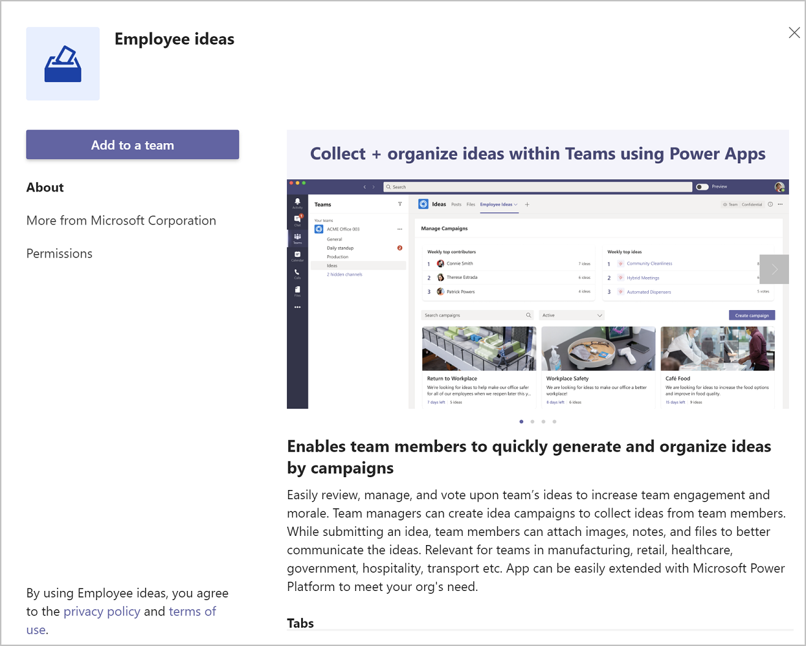
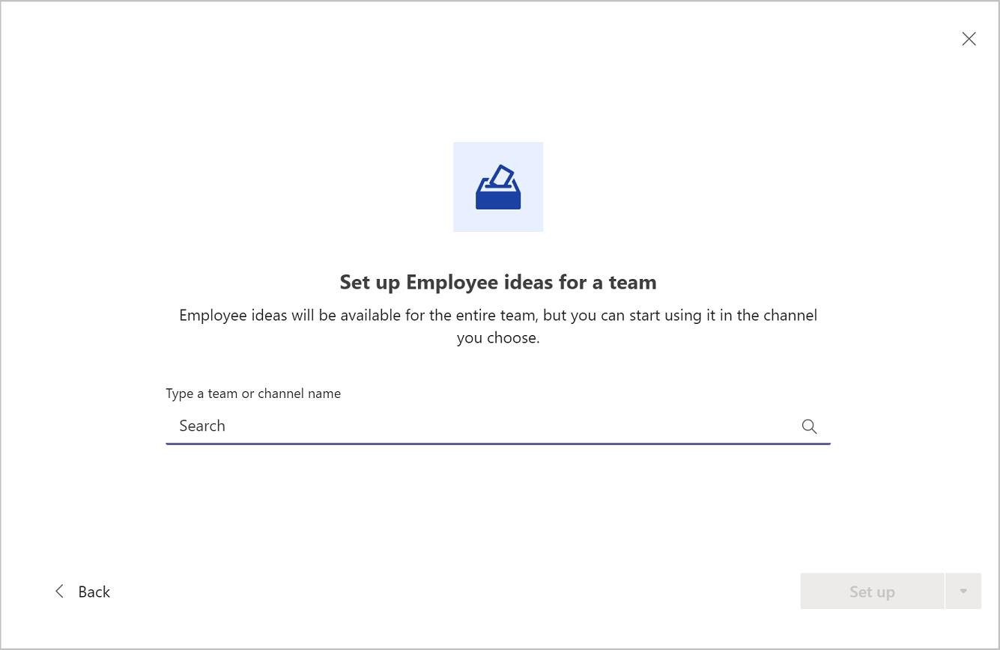
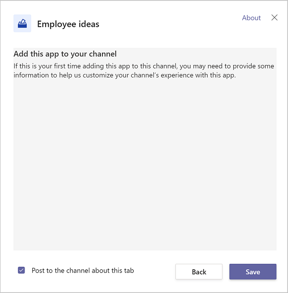
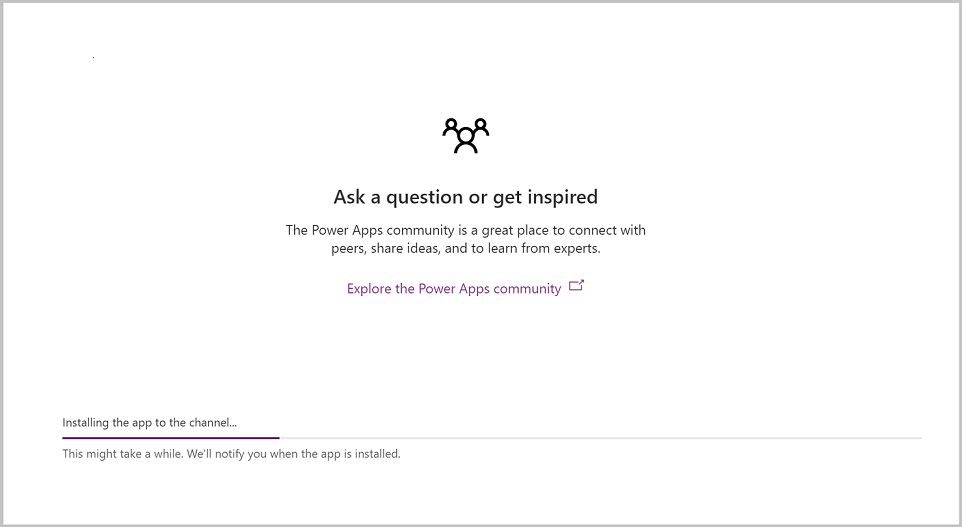
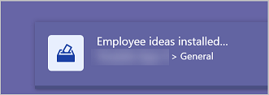
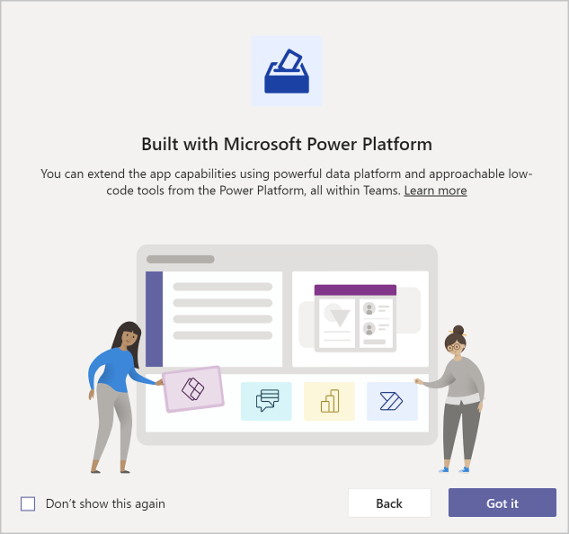

# Enable Power Apps and Dataverse for Teams in Microsoft Teams

**Microsoft Dataverse for Teams** is a built-in, low-code data platform for Microsoft Teams that empowers users to build custom apps, bots, and flows in Teams by using Power Apps, Power Virtual Agents, and Power Automate. Dataverse for Teams&mdash;built on Microsoft Dataverse&mdash;provides relational data storage, rich data types, enterprise-grade governance, and one-select solution deployment to the Teams app store. More information: [Dataverse for Teams overview](../overview-data-platform.md).

In this article, we'll cover how to provision Dataverse for Teams and Power Apps in your Teams team.

## Provisioning Dataverse for Teams

Dataverse for Teams is provisioned in Teams automatically when you create an app or install one of the pre-made sample or template apps for Teams.

### Build an app

The first way to provision Dataverse for Teams in Teams is to create a new app. You can create an app using the following steps.

1. Create the team in which you want to provision Dataverse for Teams.

1. From the left-pane, select **...** (ellipsis).

1. Search for and select **Power Apps**.

1. Right-click on Power Apps and select **Pop out app** to open Power Apps in a new window. This will prevent the app from being closed as you navigate Teams.

1. Select **Start now**.

1. Select the team where you want to create the app.

1. Select **create**.

    Dataverse for Teams will be provisioned in the team you selected. A message notifies you that the environment is being prepared.

    

1. Select **Done**.

1. Enter app a name, and select **Save**.

1. Create your data tables. More information: [Create a table in Teams](../create-table.md).

1. Create your app by adding screens, connections, and controls. More information: [Build an app in Teams using Power Apps and Dataverse for Teams to retrieve Power Platform videos for readiness](../tutorial-buildapp-retrieve-videos.md).

1. Publish your app. More information: [Publish your app using Power Apps app in Teams](../publish-and-share-apps.md).

You now have Dataverse for Teams and Power Apps in your Team!

## Install a sample app

The second way to provision Dataverse for Teams in your Team is by installing one of the ready-made sample apps for Teams. These are fully functional apps that provide a complete experience, but are also easy to enhance and configure to meet your specifications.

To learn more about the sample apps for Teams, see [Use sample apps from teams store](../use-sample-apps-from-teams-store.md).

In this example, we're going to install the [Employee Ideas](../employee-ideas.md) app.

## Installing Employee Ideas sample app

The Employee Ideas app template for Teams enables team members to quickly generate and organize ideas by campaigns. The app can be installed from the Teams store.

1. Create a team in Teams. If you continue from the earlier section, you can reuse the team created earlier.

1. Add users who should have access to the team, either as owners or team members

1. If you don’t want the app to be installed in the default "General" channel, add a channel to the team.

1. Go to <https://aka.ms/teamsemployeeideas>.

1. Select **Add to a team**.

    

1. Search for the channel in which you wish to install the app

    

1. By default, the app will notify team members that the app has been added to the team. If you don’t want to notify the team, uncheck the **Post to the channel about this tab** checkbox.

1. Select **Save**.

    

    The Employee Ideas app will be installed in the selected channel. The installation process will show you the installation progress, and helpful tips on how to get the most out of the app. You can navigate to other areas in Teams while the installation completes.

    

    When installation is complete, you'll receive a notification in the lower right corner of the Teams window.

    

1. Select **Allow** to allow connection to the connectors used by the app.

    

1. Verify the team and channel in which you want channel notifications to be installed, then Select **Let’s go.**

1. The splash screen will appear—if you don’t want to see the splash screen the next time you open the Employee ideas app, check the **Don’t show this again** checkbox.

1. Select **Got it.**

    

Dataverse for Teams is now provisioned in your Team and you can create or install other apps in the same Team.

### See also

- [Build an app to retrieve Power Platform videos for readiness](../tutorial-buildapp-retrieve-videos.md)
- [Use sample apps from the Microsoft Teams store](../use-sample-apps-from-teams-store.md)
