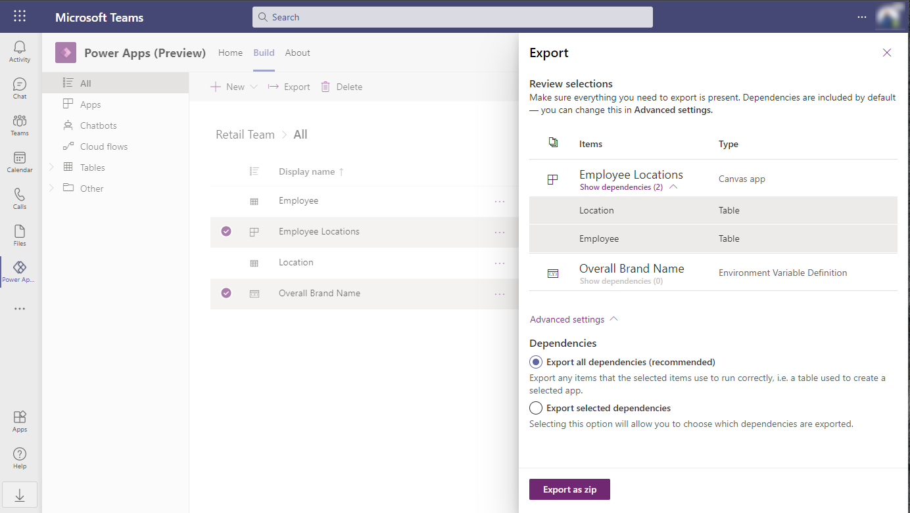
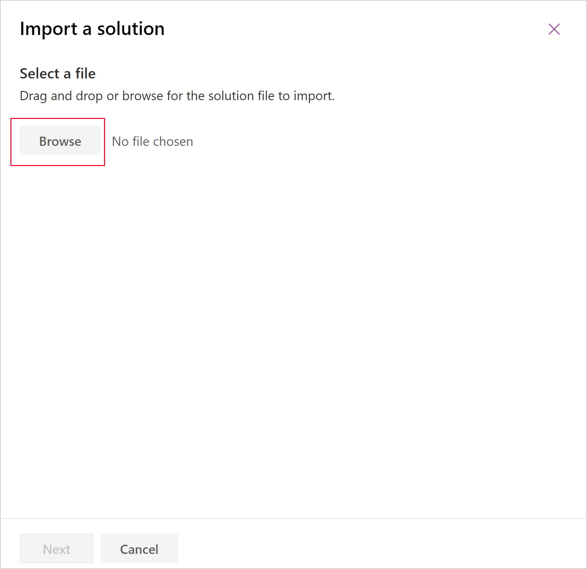
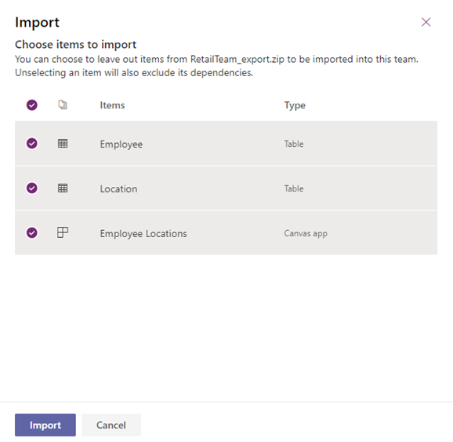
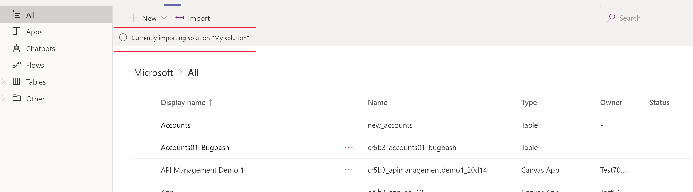

#  Move customizations between environments

Microsoft Dataverse for Teams provides a simplified way to transport customizations between Dataverse for Teams environments. Additionally, customizations can also be moved between Dataverse and Dataverse for Teams environments.

## Export customizations from Dataverse for Teams

Take the following steps to export your customizations from Dataverse for Teams. Notice that the solution packages you export from Dataverse for Teams are unmanaged.
1. From the Power Apps personal app in Teams, select the **Build** tab of the team where you want to export your customizations. More information: [Install the Power Apps personal app in Microsoft Teams](install-personal-app.md)
1. Select **See all**, and select the items you want to export. 
1. On the command bar, select **Export**.
1. You can now review your selected items. By default, all dependencies of the items you selected are added too.
   - We recommend that you keep the option **Export all dependencies**  under **Advanced settings** selected. By including all dependencies you are optimizing your success when importing your customizations into another environment.
   - If you prefer to manually select the dependencies of your items, you can change the value to **Export selected dependencies** under **Advanced settings**. Note that importing customizations that do not include all dependencies will fail if those dependencies are not already in the destination environment.

     
1. Select **Export as zip**. The selected items are exported as a compressed solution file (.zip). The solution file is automatically offered for download when the export completes.
   - Files you download from Microsoft Teams will show up in your device's downloads folder. In Microsoft Teams desktop, you can navigate to the **Downloads** section by select **Files** on the left side of the Teams client.

## Import customizations into Dataverse for Teams

Take the following steps to import your customizations into Dataverse for Teams:

1. From the Power Apps personal app in Teams, select the **Build** tab of the team where you want to import your customizations. More information: [Install the Power Apps personal app in Microsoft Teams](install-personal-app.md)
1. Select **See all**, and then on the command bar, select **Import**.
1. On the **Import a solution** page, select **Browse**.

    
1. Locate the compressed (.zip) file that contains the solution you want to import, select **Open**, and then select **Next**. 
1. Review the items that you want to import.
   - If you are importing an unmanaged solution, you can select the item that you want to import into your team. We recommend that you keep the default selection and import all of the items. This helps ensure that all items and their dependencies are imported. Import will fail when you exclude an item that is not already in the team and another item in the import is dependent on it.
   - If you are importing a managed solution, all the items will be imported.
 
   
1. Depending on the components in the solution, you might be prompted for additional information when you select **Next**.
   - If your solution contains connection references, you’ll be prompted to select the connections you want. If a connection does not already exist, create a new one.
   - If your solution contains environment variables, you'll be prompted to enter values. You will not see this page if values are already present in your solution or the target environment.
1. Select **Import**.

Your solution imports in the background and might take a while. A notification appears on the **Build** tab as the solution is imported.

After the import completes, a success or failure notification is displayed.
 
The location of your solution components is different depending on whether you imported a managed or unmanaged solution:
* With a managed solution, all your customizations appear on the **Build** tab under **Installed apps** using the name of the solution.
* With an unmanaged solution, all your customizations appear on the **Build** tab under **Built by this team**.

## Move customizations from Microsoft Dataverse to Dataverse for Teams
### Create a solution in a Dataverse environment
The first step to move your customizations from Microsoft Dataverse to Dataverse for Teams is to create a solution in Dataverse. Include only components that are fully supported for Dataverse for Teams. Solutions that include components that are not supported by Dataverse for Teams won’t import. 

The following custom components can be imported into Dataverse for Teams:

* Canvas apps
* Tables
* Flows
* Bots
* Connection references
* Environment variables

> [!NOTE]
> Only include items that you or your team have created. Solutions that contain any of the standard Dataverse or Dynamics 365 tables, such as account or contact, won’t import.

For information about the differences between Dataverse for Teams and Dataverse, go to [How are Dataverse for Teams and Dataverse different?](data-platform-compare.md)

For information about how to create a solution with Dataverse, go to [Create a solution](../maker/data-platform/create-solution.md).

### Export the solution from Dataverse

Typically, you want to export your solution from Dataverse as managed. However, if your goal is to transport your customizations to Dataverse for Teams and continue your development from there, export your solution as an unmanaged solution. More information: [Export solutions](../maker/data-platform/export-solutions.md) 

You can now import your solution into Dataverse for Teams. More information: [import customizations into dataverse for teams](#import-customizations-into-dataverse-for-teams).

## Troubleshooting import failures

If the import isn’t successful, you’ll see a notification on the solutions page that displays error or warning messages that were captured. Select **Download Log File** to capture details about what caused the import to fail. The most common cause for an import to fail is that the solution did not contain some required components.

When you download the log file, you will find an XML file in your browser's default download folder that you can open using an XML reader, such as Microsoft Excel, to view the contents.

## Known issues

When you are working with a new Dataverse for Teams environment, the **Import** command is missing because the **See all** link located on the **Build** tab is not displayed for that environment.  

To work around this issue, create and save an app in the environment. When an item exists in the environment, the **See all** link is available and you will be able to browse to the **Build** tab.

### See also

[Export solutions](../maker/data-platform/export-solutions.md)

[!INCLUDE[footer-include](../includes/footer-banner.md)]
