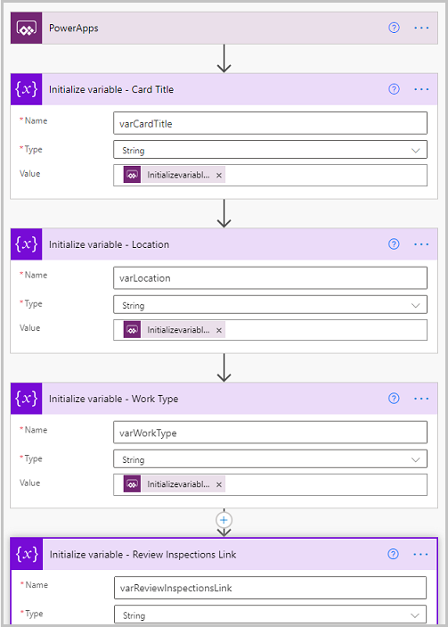
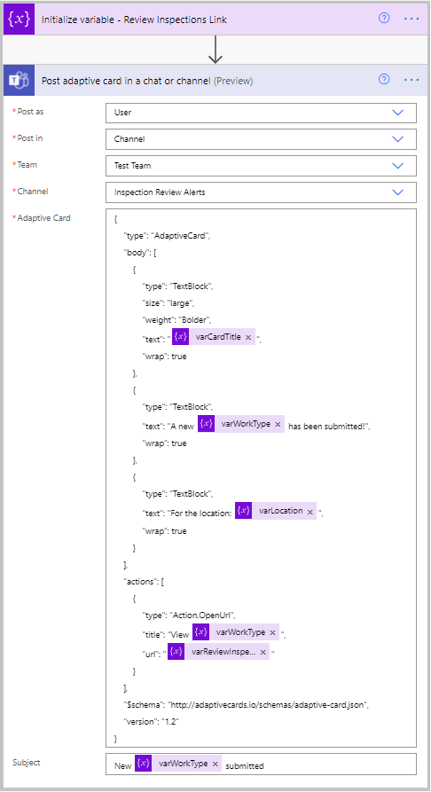
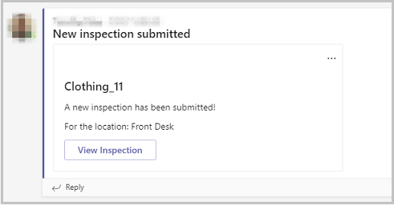

# Update inspection notification to use an adaptive card

In this article, you'll be changing the inspection notifications that come from the Inspections app from HTML-based messages to adaptive cards in Microsoft Teams.

Adaptive cards make notifications more interactive. Posts to channels are great, but they're a one-way communication. Adaptive cards offer more interactive notifications, allowing customization of the message, and the ability to hyperlink to the app or provide the ability to update the app data from the card.

## Prerequisites

Before you begin, you must have installed and configured [the Inspection sample apps](inspection.md) with the required permissions to edit the app in Teams.

## Create the Power Automate flow to generate the adaptive card

Start with Power Apps personal app in Teams, and locating the Inspection app. For the ease of use, you can right-click on the Power Apps logo in, Teams and select **Pop out app** to work with the Power Apps Studio in its own window. 

1. Select the Inspection app to open the Power Apps Studio in Teams, and begin editing the app.

1. In the top menu bar, select the vertical ellipsis to the right of the **Settings** option. This will reveal three options: **Power Automate**, **Collections**, and **Variables**.

1. Select **Power Automate** to open the **Data** sidebar menu on the right-side of the screen. You'll see any flows that are available here.

1. Select **Create a new flow**. This will launch the Power Automate studio in a separate browser window. Check to ensure that you are in the correct environment for the team containing the app you are trying to change before continuing.

1. In the upper left-hand area, you'll see that the flow has a name of **Untitled**. Select that text to change the name to **Inspection Adaptive Card To Teams**.

1. Add the Power Apps trigger. This will allow us to trigger the flow from Power Apps and to add values to pass from Power Apps to Power Automate.

1. Next, add four **Initialize Variable** actions. These actions will be used to store information from Power Apps for and to store a link to the Review Inspections app. Rename each of the actions as follows:

    - Initialize variable: Card Title
    - Initialize variable: Location
    - Initialize variable: Work Type
    - Initialize variable: Review Inspections Link

    

1. Set each of the "Type" values to "String", and add a name for each: **varCardTitle**, **varLocation**, **varWorkType**, and **varReviewInspectionLink**, respectively.

1. For the Card Title, Location, and Work Type actions, select the Value field area to reveal the Dynamic content menu. 

1. Select **Ask in Power Apps**. This will create a variable in the Power Apps trigger to allow passing data from the app to Power Automate.

1. For the Review Inspections Link action, we'll the link to the tab the app is in. Open the Review Inspections app in the Teams channel, and select the button in the upper right corner to pop out the app to its own window. From there, you can copy the direct URL to the app. Navigate back to the Power Automate studio. Right-click on the Value field area in the Review Inspection Link action and Paste the link.

    > [!TIP]
    > To learn about creating deep links in Microsoft Teams, see [Create deep link](/microsoftteams/platform/concepts/build-and-test/deep-links).

1. Add a **Post adaptive card in a chat or channel** action. Set the **Post as** value to *User* and the **Post in** value to *Channel*.

1. In the **Team** and **Channel** fields, select the Team and Channel that you would like to post the adaptive card to.

You can generate your adaptive card JSON by going to <https://adaptivecards.io>. In the **Adaptive Card** field, copy and paste the following:

```json
{
    "type": "AdaptiveCard",
    "body": [
{
    "type": "TextBlock",
    "size": "large",
    "weight": "Bolder",
    "text": "@{variables('varCardTitle')}",
    "wrap": true
},
{
    "type": "TextBlock",
    "text": "A new @{variables('varWorkType')} has been submitted!",
    "wrap": true
},
{
    "type": "TextBlock",
    "text": "For the location: @{variables('varLocation')}",
    "wrap": true
}
],
    "actions": [
{
    "type": "Action.OpenUrl",
    "title": "View @{variables('varWorkType')}",
    "url": "@{variables('varReviewInspectionsLink')}"
}
],
    "\$schema": "http://adaptivecards.io/schemas/adaptive-card.json",
    "version": "1.2"
}
```

1. In the Subject field, copy, and paste the following:

    ```
    New @{variables('varWorkType')} submitted
    ```

    

    This will set the adaptive card’s characteristics and use the variables from Power Apps in the adaptive card.

1. Save and test the flow to ensure it works properly. Selecting manually from the Test Flow sidebar will allow you to enter the Card Title, Location, and  Work Type variables.

## Add the flow to the Inspection app

Once you've verified that the flow is working properly, you can add it to the Inspection app.

1. Go back to the Power Apps Studio where the Inspection app was being edited.

1. In the Tree View on the left-hand side, select the Review Screen.

1. Select the Submit inspection button (named **btnContinueSubmitInspection** in the Tree View). We'll add the Power Automate flow we created to this button.

    

1. First, we'll copy the code currently in the OnSelect property of the button. One issue with adding Power Automate flows to controls in Power Apps is that any existing code on the control will be removed. To work around this, paste the copied code into a text editor, such as Notepad, and edit it to paste back in the OnSelect property when done. After pasting the code, ensure that all the code was added.

1. With the button still selected, select the vertical ellipsis to the right of the **Settings** from the top. Select Power Automate, which will reveal the **Data** sidebar.

1. You'll now see the **Inspection Adaptive Card To Teams** flow in the Available flows section. Select it to add it to the button.

1. You'll now need to edit the pasted code. Find and remove the following portion of the formula:

    ```powerapps-dot
    MicrosoftTeams.PostMessageToChannelV3(
    gblPlannerGroupId,
    gblRecordSettings.'Parameter (Notification Channel Id)',// gblParamChannelId,
    {
    content: Concatenate(
    With(
    {
    varDefault: "A new " & Lower(gblWorkType) & " has been submitted!",
    varOOBTextId: "\_translateCommon\__" & gblWorkType & "Submitted"
    },
    With(
    {
    varLocalizedText: LookUp(
    colLocalization,
    OOBTextID = varOOBTextId,
    LocalizedText
    )
    },
    Coalesce(
    varLocalizedText,
    varDefault
    )
    )
    ),
    //"A new " & Lower(gblWorkType) & " has been submitted!",
    "\<br\>\</br\>",
    "\<b\>" & With(
    {
    varDefault: "For the Location:",
    varOOBTextId: "\_translateCommon\_\_InspectionForLocation"
    },
    With(
    {
    varLocalizedText: LookUp(
    colLocalization,
    OOBTextID = varOOBTextId,
    LocalizedText
    )
    },
    Coalesce(
    varLocalizedText,
    varDefault
    )
    )
    ) & " " & "\</b\>",
    //"\<b\>For the Location: \</b\>",
    gblLastInspection.Location.Name
    ),
    contentType: "html"
    },
    {subject: gblLastInspection.Name}
    )
    ```

1. Replace the following code with the removed formula portion earlier:

    ```powerapps-dot
    InspectionAdaptiveCardToTeams.Run(gblLastInspection.Name,
    gblLastInspection.Location.Name, Lower(gblWorkType))
    ```

    This formula contains the reference to the flow we just added and the variables to pass to Power Automate.

1. Copy the entirety of the text that was edited and paste it back into the **OnSelect** property of the Submit inspection button. Verify that there are no errors on the button.

1. Select the Welcome Screen from the Tree View, preview the app, and input a test inspection to verify that the flow is posting the adaptive card to the Team channel that you defined in the flow.

    

### See also

- [Understand Inspection sample apps architecture](inspection-architecture.md)
- [Customize Inspection sample app](customize-inspections.md)
- [Customize sample apps](customize-sample-apps.md)
- [Sample apps FAQs](sample-apps-faqs.md)
- [Use sample apps from the Microsoft Teams store](use-sample-apps-from-teams-store.md)

[!INCLUDE[footer-include](../includes/footer-banner.md)]