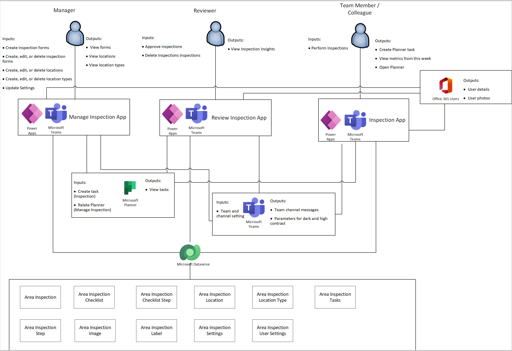

# Understand Inspection sample apps architecture

In this article, you'll learn about the collections and global variables used by the [Inspection](inspection.md) app, and understand how to use them effectively. If you want to learn more about how to install, and use the Inspection sample app instead, go to [Inspection sample apps](inspection.md).

## Prerequisites

To understand and use information in this article, you'll need to know about different controls, features, and capabilities of canvas apps.

- [Create and update a collection in a canvas app](../maker/canvas-apps/create-update-collection.md)
- [Collect, Clear, and ClearCollect functions in Power Apps](../maker/canvas-apps/functions/function-clear-collect-clearcollect.md)
- [Understand canvas-app variables in Power Apps](../maker/canvas-apps/working-with-variables.md)
- [Add and configure a canvas-app control in Power Apps](../maker/canvas-apps/add-configure-controls.md)
- [Add a screen to a canvas app and navigate between screens](../maker/canvas-apps/add-screen-context-variables.md)

You'll also need to know about how to [install](use-sample-apps-from-teams-store.md), and [use](inspection.md) the Inspection sample app.

## Data model

The following diagram explains the data model used by the Inspection sample app.

| Table name | Description |
| - | - |
| Area Inspection | An inspection is, most generally, an organized examination or formal evaluation exercise. This table holds the inspection checklist results using the area inspection step when an inspection is performed using a checklist/form. |
| Area Inspection Step | An inspection step is one of the checklist item results of an inspection, and holds the outcome and notes of that particular inspection step. |
| Area Inspection Location | An inspection location is place or item or audit that the user needs to inspect. All the inspection steps are performed on this location or item. One inspection can have multiple inspection steps that depend on the number of checklist steps that are made available for the inspection. |
| Area Inspection Checklist | A checklist is a list of all the things that you need to do while inspecting. It holds multiple Checklist steps, and is connected to the type of the inspection. During the inspection, all the associated checklists are available to the user to choose and perform the inspection. |
| Area Inspection Checklist Step | Checklist steps are the steps that are performed in a sequential order while inspecting an item/area using a checklist. Each checklist step is associated to only one checklist. A series of checklist steps make one checklist. |
| Area Inspection Image | All the images that are taken or uploaded during the inspection are stored in this table, and these images are associated to area inspection steps. |
| Area Inspection Location | This table holds the information of the area, asset, or items that needs to be inspected. |
| Area Inspection Location Type | This table holds the type or category that the area, asset, or item is aligned to. Based on the type of area, asset, or item, the associated checklists are made available for the user to start the inspection. |
| User Setting | User settings are used to store user preferences pertaining to seeing the Power Apps splash screen every time they log in to the app. There is one record for each user. |
| User Setting | Team settings are used to store Team, Channel, and Planner preferences while using the application. |

### Architecture Model

The following diagram shows how users interact with systems and data in the Inspection app.

### Connectors

The following connectors are used in the Issue Reporting app:

- **Microsoft Dataverse** - Used to read and write data in Dataverse.
- **Office 365 Users** - Used to read Microsoft 365 user profile data.
- **Location** - Used to capture the user's location for Planner tasks.
- **Microsoft Planner** - Used to create tasks.

### Collections

The following table lists the collections used by the inspection apps.

| Collection name       | Description                                                                                                   | Where used                                                                |
|-----------------------|---------------------------------------------------------------------------------------------------------------|----------------------------------------------------------------------------|
| colLocalization       | Used to build a localization collection based on the user's language.                                            | App OnStart                                                |
| colMenuAreaTypes      | Used to populate the collection with all area types.                                                           | App OnStart                                                |
| colAreaTypes          | Used to collect all area types and their associated Planner bucket ID.                                         | App OnStart                                                |
| colLocationTypeIcons  | Used to collect the name and order of the icons used in the app.                                               | App OnStart                                                |
| colWeekInspections    | To collect the total number of inspections in the last seven days from **Active Area Inspections - Last seven days** view | App OnStart                                                |
| colWeekIssues         | To collect the total number of issues recorded in the last seven days.                                       | App OnStart                                                |
| colTeamDurations      | To collect the team inspection duration in minutes                                                            | App OnStart                                                |
| colUserDurations      | To collect the logged in user’s inspection duration in minutes.                                                | App OnStart                                                |
| colStepOutcomes       | To collect the outcome and notes of inspection steps.                                                          | App OnStart                                                |
| colPlannerTasks       | To collect the list of Planner tasks in a particular plan based on the Plan and Group ID.                    | OnVisible property of the Welcome screen                                   |
| tasksforme            | To collect the list of Planner Tasks assigned to the logged in User.                                           | OnVisible property of the Welcome screen                                   |
| tasksforall           | To collect the list of Planner Tasks assigned to all the Users.                                                | OnVisible property of the Welcome screen                                   |
| overdue               | To collect the list of overdue Planner Tasks assigned to the logged in user.                         | OnVisible property of the Welcome screen                                   |
| ColGroupFroms         | To collect the available locations for the selected area type.                                                 | OnVisible property of the Forms screen                                     |
| colFormChecklistSteps | To collect the checklist steps for a selected location.                                                        | Items property of the individual area checklist gallery on Overview screen. |
| colAreaPlannerTasks   | To collect the task, step and the inspection IDs.                                                                 | OnSelect property of Add Task button on the Task Creation screen.           |
| colPlannerBuckets     | To collect the list of Planner buckets in a particular plan based on the Plan and Group IDs.                  | OnSelect property of Add Task button on the Task Creation screen.           |
| colTaskAssignments    | To collect the Planner task owners.                                                                            | OnSelect property of Add Task button on the Task Creation screen.           |
| colChecklistSteps     | To collect the inspection checklist steps for performing the inspection.                                      | OnVisible of the Checklist Step screen.                                     |

### Global variables

The following table lists the global variables used by the inspection apps.

| Variable name                   | Type     | Description                                                                                                                                                                                                |
|---------------------------------|----------|------------------------------------------------------------------------------------------------------------------------------------------------------------------------------------------------------------|
| gblAppLoaded                    | Boolean  | To check if the app is loaded.                                                                                                                                                              |
| gblUserLanguage                 | Text     | To check the logged in user’s language.                                                                                                                                                                     |
| gblWorkType                     | Text     | To fetch the work type from app settings (inspection, audit, or walk).                                                                                                                                      |
| gblThemeDark                    | Boolean  | To check if the Teams theme is set to Dark.                                                                                                                                                            |
| gblThemeHiCo                    | Boolean  | To check if the Teams theme is set to High Contrast.                                                                                                                                                   |
| gblIsHostClientMobile           | Boolean  | To check if the host client is Mobile.                                                                                                                                                          |
| gblAppMobileOnDesktop           | Boolean  | To check if the host client is a desktop, or web.                                                                                                                                                   |
| gblMobileMode                   | Boolean  | To set the value to true if the host client is Android or iOS.                                                                                                                                             |
| localeID                        | Text     | Locale value to populate Planner URL.                                                                                                                                                                       |
| gblParamTeamId                  | Text     | To set the Group ID from Planner.                                                                                                                                                                           |
| gblParamChannelId               | Text     | To set the Channel ID from Planner.                                                                                                                                                                         |
| gblParamTenantId                | Text     | To set the Tenant ID from Planner.                                                                                                                                                                          |
| gblRecordSettings               | Record   | To check Teams settings for current team and channel ID.                                                                                                                                                    |
| gblCheckLabelSettings           | Number   | To get the number of area type labels from the **Area Inspection Labels** view.                                                                                                                              |
| areaLabel                       | Text     | To set area label and area type label from settings. If no settings exist, use area and area type.                                                                                                          |
| gblCurrUserEmail                | Text     | To fetch the current user’s email ID.                                                                                                                                                                       |
| gblCurrUser                     | Record   | To fetch the current user’s record.                                                                                                                                                                         |
| gblTotalInspectionCount         | Number   | To fetch the total inspection count in the last seven days.                                                                                                                                                     |
| gblCurrentUserInspectionCount   | Number   | To get the total inspection count for the current in the last seven days.                                                                                                                                       |
| gblCurrentUserIssueCount        | Number   | To get the issue count for the current in the last seven days.                                                                                                                                                  |
| gblTotalIssueCount              | Number   | To get the total issue count in the last seven days.                                                                                                                                                            |
| gblTeamAvgTime                  | Number   | To get the average team inspection time.                                                                                                                                                                    |
| gblUserAvgTime                  | Number   | To get current user’s inspection duration.                                                                                                                                                                 |
| gblUpdateInspectionCount        | Boolean  | Variable to control updating of inspection count when a user navigates to the Welcome screen.                                                                                                               |
| gblGroupSelectedLocation        | Record   | Variable to control the selected area when starting an inspection for a group.                                                                                                                              |
| gblPlannerPlanID                | Text     | To get the Planner ID from parameters.                                                                                                                                                                      |
| gblPlannerGroupID               | Text     | To get the Group ID from parameters.                                                                                                                                                                        |
| gblSettingSharePointLocation    | Text     | To get the SharePoint location from  parameters.                                                                                                                                                             |
| gblSkipFormNav                  | Boolean  | Variable to control the back navigation from the summary screen based on number of related forms. If 1, then navigate back to assets screen, if more than 1, then navigate back to forms screen. |
| gblFormStepsCount               | Number   | To check the number of checklist steps in the selected form.                                                                                                                                                |
| gblDisplayNoStepWarning         | Boolean  | To display a warning if the number of checklist steps in the selected form is zero.                                                                                                                        |
| gblDisplayNoLocationWarning     | Boolean  | To display a warning if the number of locations in the selected group is zero.                                                                                                                             |
| gblselectedareainspection       | Boolean  | Variable to store the selected inspection.                                                                                                                                                                  |
| gblSelectedChecklist            | Record   | Variable to collect areas within the selected group and the forms relevant to that group.                                                                                                                   |
| gblSelectedGroup                | Record   | Set the value of the particular item if the selected group has more than one form.                                                                                                                           |
| gblLocationType                 | Record   | Variable to store the selected the location type.                                                                                                                                                               |
| gblSelectedLocation             | Record   | Variable to store the selected location.                                                                                                                                                                    |
| LastSynced                      | DateTime | Variable to set the last synchronization time.                                                                                                                                                                       |
| gblInspectionPatchComplete      | Boolean  | To reset the variable to be prepared for the next inspection.                                                                                                                                               |
| gblBackNav                      | Boolean  | To check whether last half completed inspection is being continued.                                                                                                                                         |
| gblSelectedGroupID              | Guid     | Variable to store the Guid of the selected group.                                                                                                                                                           |
| gblExpandVar                    | Boolean  | Variable to collapse all step instructions when the user navigates to the checklist steps. screen                                                                                                           |
| gblFocusStep                    | Guid     | Variable to set the selected record to control the scroll of the gallery in the checklist steps screen to that record.                                                                      |
| gblSelectedStepImage            | Record   | Variable to enlarge the step image.                                                                                                                                                                         |
| gblViewEnlargedImage            | Boolean  | Variable to set enlarged image visibility to true/false.                                                                                                                                                    |
| gblLastInspection               | Record   | Variable to get the newly created inspection.                                                                                                                                                               |
| gblResetTimer                   | Boolean  | Timer to reset the gallery so the gallery scrolls to the selected record.                                                                                                                                   |
| gblSelectedStep                 | Record   | Variable to set the focus at the last step being performed.                                                                                                                                                |
| currentPhoto                    | Image    | Variable to store the selected photo to be enlarged.                                                                                                                                                        |
| gblAppSetting_inputMobileOnWeb  | Boolean  | Variables to scale fonts for mobile-oriented apps, running in desktop.                                                                                                                                      |
| gblAppSetting_inputMobile       | Boolean  | Variables to scale fonts for mobile-oriented apps.                                                                                                                                                          |
| gblAppSetting_inputScaleFontsBy | Number   | Use this variable for scaling all fonts by a fixed amount.                                                                                                                                                  |
| gblAppColors                    | Record   | Variable to set the color value in the app.                                                                                                                                                                 |
| gblAppSizes                     | Record   | Variable to set the size values in the app.                                                                                                                                                                 |
| gblAppStyles                    | Record   | Variable to set the styling values in the app.                                                                                                                                                              |
| gblSelectedLocationType         | Record   | Variable to get the selected location type record.                                                                                                                                                         |
| gblSelectedLocationTest         | Text     | Variable to get the name of the selected location. type                                                                                                                                                     |
| gblTaskcreated                  | Boolean  | Variable to check whether a task is created or not.                                                                                                                                                        |
| gblFocusStep                    | Text     | Global variable to set the focus on the inspection checklist screen.                                                                                                                                        |
| Taskid                          | Record   | Variable used to set the ID of the created Planner task to the record.                                                                                                                                      |
| gblFirstGroupLocation           | Table    | Variable to store the image of the first area in the selected group.                                                                                                                                        |
| gblImage1                       | Record   | Variable to set the primary image of the selected item.                                                                                                                                                     |
| gblGroupLocation                | Text     | Variable to pass the group location while creating a new task.                                                                                                                                              |

## Manage inspections app

This section explains collections, global variables used by the [Manage inspection](inspection.md#manage-inspections-app) app, and execution details for the app.

### App OnStart

This section explains app OnStart collections, variables, and execution details.

#### OnStart collections

Collections used during app OnStart:

| Collection name | Description |
| - | - |
| colLocalization | Collection of localized text based on user’s language. |
| colLabelSettings | Collection to store the value and icons for labels. |
| colUserSettings | Collection of the user settings from Area Inspection User Settings table |
| colLocationTypeIcons | Collection of location type icons used in the app. |
| colLocConfig | Collection used to set the name and type of the main and the sub sections. |
| colLocTypeSettings | Used to collect the different setting types available in the app.
| colInspections | Collection to store area inspections. |
| colPlannerBuckets | Collection of Planner buckets. |
| colPlannerTasks | Collection of Planner buckets. |
| colCharsWidth | Collection of widths for each character used for auto width labels. |

#### OnStart variables

Variables used during app OnStart:

| Variable name | Description |
| - | - |
| gblAppLoaded | Global variable to check if the app has loaded completely. |
| gblAppContext | Global variable to check the context of where the app is running. |
| gblUserLanguage | Global variable to store the user’s language. |
| gblFirstRun | Global variable to check whether the app is being run for the first time. |
| gblWorkType | Global variable to store type of work. |
| gblSelectedWorkType | Global variable to check the selected type of work. |
| gblParamTeamId | Global variable to set the Planner Group ID from parameters. |
| gblParamChannelId | Global variable to set the Planner Channel ID from parameters. |
| gblThemeDark | Global variable to store if Teams is running in dark mode. |
| gblThemeContrast | Global variable to store if Teams is running in contrast mode. |
| gblAppManager | Global variable check whether the user has the app manager privilege. |
| gblRecordUserSettings | Global variable to store the latest area inspection user settings records for the current user. |
| gblFontSizes | Global variable to store the font sizes used in the app. |
| gblPadding | Global variable to set the padding values. |
| gblScreenHeightMin | Global variable to set the minimum screen height. |
| gblScreenWidthMin | Global variable to set the minimum screen width. |
| gblEditLocation | Global variable to check whether a location is being edited. |
| gblView | Global variable to store the view to be displayed. |
| gblViewInspection | Global variable that indicates an inspection is being viewed.
| gblManageLocationTypes | Global variable to check if location type exists. |
| gblTempAddLocType | Global variable to check for adding location type. |
| gblWarningType | Global variable that controls which warning message to be displayed. |
| gblDisplayWarning | Global variable to control visibility of warning messages. |
| gblAddLocation | Global variable to show or hide location button. |
| gblShowLocationTypeIcons | Global variable to control visibility of location type icons. |
| gblFirstTimeNavigation | Global variable to check whether the user viewing for the first time. |
| gblParamTenantId | Global variable to set the tenant ID from parameters. |
| gblParamLocaleId | Global variable to set the locale ID from parameters. |
| gblCheckLabelSettings | Global variable to store the active area inspection label. |
| gblRecordSettings | Global variable used to set the Team and Channel ID to the Area Inspection Settings table. |
| gblSettingPlannerPlanId | Global variable to get the Planner ID from the record settings. |
| gblSettingTeamId | Global variable to get the Team ID from the record settings. |
| gblLocation | Global variable to set the first area inspections location. |
| gblNavToSettings | Global variable to denote navigation to settings from other screens.

#### OnStart execution details

1. When a user accesses the app, the **gblAppLoaded** variable is set to false. The user’s language code is stored in **gblUserLanguage** variable, with "English - US" as the default. The **gblAppContext** checks where the app is running.

1. The user’s language is then used to collect localized text used throughout the app (such as label and button text) in **colLocalization** collection.

1. The value and icons of the labels are stored in the **colLabelSettings** collection. The work type is set using the **gblWorkType** and **gblSelectedWorkType** variables. It's set to inspections if other values do not exist.

1. The channel, group, tenant, and locale IDs from the parameter values are stored in the **gblParamTeamId**, **gblParamChannelId**, **gblParamTenantId**, and **gblParamLocaleId** variables.

1. User's Teams theme is checked: Default, Dark, or High Contrast. The **gblThemeDark** and **gblThemeHiCo** variables are set accordingly.

1. The **gblAppManager** variable checks the parameters if the user has a user team role.

1. User details from the Area Inspection User Settings table are collected in **colUserSettings** collection. If no records exist, a new project user setting record is created. If there are multiple area inspection user settings records exist, the oldest record is selected and stored in the **gblRecordUserSettings** variable.

1. Predefined font sizes, padding values, minimum screen height, and width values are stored in the **gblFontSizes**, **gblPadding**,
    **gblScreenHeightMin**, and **gblScreenWidthMin** variables.

1. The **gblView** variable that controls the view to be displayed is set to “Locations”.

1. The order, name, and the icon values used in the app are collected in the **colLocationTypeIcons** collection. The number of active area inspection labels are stored in the **gblCheckLabelSettings** variable.

1. The main and sub section values are collected in the **colLocConfig** collection. If they are blank, the values are set to area and area type.

1. The team and channel IDs from the area inspection settings are stored in the **gblRecordSettings** variable.

1. The location type settings are collected in the **colLocTypeSettings** collection.

1. If there are no area inspection user settings records (**gblRecordSettings**), the **gblFirstRun** variable is set to true which in turn controls the visibility of the splash dialog.

1. The final values for the Planner and Team ID are stored in the **gblSettingPlannerPlanId** and **gblSettingTeamId** variables.

1. The inspections from the Area Inspections table are stored in the **colInspections** collection.

1. The first area inspection location is set to the **gblLocation** variable**. The Planner buckets and tasks are collected in the **colPlannerBuckets**, and **colPlannerTasks** collections.

1. The size and font of each character used for auto width of header buttons are collected in the **colCharsWidth** collection.

### Locations screen

This section explains app [locations screen](inspection.md#add-locations) collections, variables, and execution details. Locations screen includes the first run experience, the list of locations on the left-pane, and the list of inspections based on the location.

#### Displaying the first run experience

This section explains the first run experience for locations.

##### First run experience collections

First run experience for locations doesn't use any variables.

##### First run experience variables

Variables used during the first run experience for locations:

| Variable name | Description |
| - | - |
| locShowCustomize | Local variable to check whether to show the option to customize. |
| locShowRestricted | Local variable to show locations with restrictions. |
| locShowSetupChannelPlanner | Local variable to show Planner setup channel. |
| locShowSetup | Local variable to show setup option. |
| locShowFirstRun | Local variable to indicate if the current run of the app is the first run for the user. |
| locShowPowerAppsPrompt | Local variable to indicate either to show or hide the splash screen. |

##### First run execution details

1. On visible of project screen a dialog pop-up appears if either of the variables&mdash;**locShowFirstRun** or **locShowPowerAppsPrompt**, are true. If not, the app proceeds with loading the project data.

1. **locShowFirstRun** is set to true/false depending on the project settings records.

#### Displaying the list of locations

This section explains the process of displaying the list of locations.

##### Collections used when displaying the list of locations

Collections used when displaying the list of locations:

| Collection name | Description |
| - | - |
| colInspections | Used to collect inspection records. |

##### Variables used when displaying the list of locations

Variables used when displaying the list of locations:

| Variable name | Description |
| - | - |
| locAreaSortOrder | Local variable used to control the sorting order of locations. |
| locInspectionSortBy | Local variable to signify the field used to sort inspection records. |

##### Execution details when displaying the list of locations

1. The list of locations in the Area Inspection Locations table is displayed in the **galAreas** gallery along with the location types.

1. The locations can be searched based on their names. Using the sort button toggles the value of **locAreaSortOrder** variable that sorts the locations in ascending or descending order based on the name.

1. Selecting any location in the **galAreas** gallery updates the **locInspectionSortBy** variable to date. The value of the **gblLocation** variable is set to the selected location.

1. The list of area inspections for the selected location is collected in the **colInspections** collection.

1. The **galInspections** gallery displays the list of inspections for the selected location in the descending order of the created-on date.

1. The count of inspection whose review status code is either "Pending Review" or "Pending Action" is displayed next to the locations. This behavior is achieved by filtering the items of the **galAreaInspections** gallery based on the review status code.

#### Displaying the list of inspections based on the selected location

This section explains the process of displaying the list of locations.

##### Collections used when displaying the list of inspections based on the selected location

Collections used when displaying the list of inspections based on the selected location:

| Collection name | Description |
| - | - |
| colInspections | Used to collect inspection records. |

##### Variables used when displaying the list of inspections based on the selected location

Variables used when displaying the list of inspections based on the selected location:

| Variable name | Description |
| - | - |
| locInspectionSortBy | Local variable to denote on what field should the inspection records be sorted. |
| locInspectionSortOrder | Local variable used to control the sorting order of the inspection records. |
| gblLocation | Global variable to store the selected location. |
| gblInspection | Global variable to store the inspection record. |

##### Execution details when displaying the list of inspections based on the selected location

1. The title and the primary image of the location is displayed using the **gblLocation** variable.

1. Location is displayed under the grouped location header using the **gblLocation** variable, if location is part of the group.

1. The **galInspections** gallery displays the list of inspections collected in the **colInspections** collection based on the selected location.

1. The Inspection Form name, Submitted By, Number of days since the inspection was submitted, Status and the number of issues columns are shown.

1. **locInspectionSortBy** variable is used to control the sorting of the columns.

1. The **gblInspection** variable is filtered for the number of inspections where the issue outcome is as issue.

1. Selecting any of the column headings toggles the value of the **locInspectionSortOrder** variable that ends up sorting the values.

1. Checkbox next to the inspection name is used to select the inspection for deletion. Selecting the checkbox next to the inspection header selects all inspection records.

### Deleting inspections

This section explains collections, variables, and execution details when deleting inspections. Inspections can be deleted from the [locations tab](inspection.md#add-locations) by selecting one or more inspections.

#### Collections used when deleting inspections

The following collections are used when deleting inspections.

| Collection name | Description |
| - | - |
| colInspections | Used to collect inspection records. |
| colRemoveInspections | Used to collect deleted inspection records. |

#### Variables used when deleting inspections

The following variables are used when deleting inspections.

| Variable name | Description |
| - | - |
| gblDisplayWarning | Global variable to control visibility of warning messages. |
| gblWarningType | Global variable that controls which warning message to be displayed. |

#### Execution details when deleting inspections

1. Inspection records can be deleted from the locations screen. Select checkbox next to an inspection to delete one record, or the checkbox from the header to delete all records.

1. **Delete** button is only enabled after one or more inspection records are selected.

1. Selecting **Delete** sets the value of the **gblDisplayWarning** variable to true. This change ends up displaying the **conWarning** container that in turn displays the delete confirmation dialog.

1. The value of **gblWarningType** variable is set to **inspectiondelete** indicating an inspection is being deleted.

1. Selecting **I understand** enables the delete button. And selecting **Delete** sets the **gblDisplayWarning** variable value to false to hide the delete dialog.

1. Deleted inspection record is added to the **colRemoveInspections** collection, and removed from the Area Inspections table. The **colInspections** collection is cleared and collected to have the updated records.

### Editing location types

This section explains collections, variables, and execution details when [editing location types](inspection.md#add-location-types). Location types can be edited from the **Locations** tab upon selecting **Location type**.

#### Collections used when editing location types

The following collections are used when deleting inspections.

| Collection name | Description |
| - | - |
| colInspections | Used to collect inspection records. |

#### Variables used when editing location types

The following variables are used when deleting inspections.

| Variable name | Description |
| - | - |
| gblEditLocation | Global variable to denote if a location is being edited. |
| gblAreaChanged | Global variable to indicate that the location has been updated. |
| gblLocation | Global variable to store the location in the current context. |
| gblLocType | Global variable to store the location type. |
| gblCurrentLocation | Variable to store the location that is being edited. |
| gblAddLocationImage | Global variable to store the image added as part of a location.

#### Execution details when editing location types

1. The location type can be edited by selecting *Edit** Locations screen.

1. Selecting **Edit** updates the value of the **gblEditLocation** variable to true which in turn disables the **galAreas** gallery and hide the **galInspections** gallery.

1. The Title and the Location Type dropdown fields are enabled and can be updated.

1. Selecting to edit picture allows user to upload a new image.

1. Selecting to manage location type button takes the user to location type section on the Settings screen.

1. **Save** is only enabled if fields are updated. Selecting **Save** updates the details to the Area Inspection Locations table.

1. The details are updated to the Area Inspection Locations table. The **gblCurrentLocation** variable is set to the location being edited.

1. The value of **gblAreaChanged** variable is updated to true and the Area Inspection Locations table is refreshed.

1. The location type of the edited location is stored in the **gblLocType** variable.

### Review submitted inspections

This section explains collections, variables, and execution details when [reviewing submitted inspections](inspection.md#review-submitted-inspections).

#### Collections used when reviewing submitted inspections

The following collections are used when deleting inspections.

| Collection name | Description |
| - | - |
| colInspections | Used to collect inspection records. |

#### Variables used when reviewing submitted inspections

The following variables are used when deleting inspections.

| Variable name | Description |
| - | - |
| gblViewInspection | Global variable to denote if a location is being edited. |
| gblInspection | Global variable for the inspection record in the current context. |
| gblParamTenantId | Global variable to set the tenant ID from parameters. |
| gblParamLocaleId | Global variable to set the locale ID from parameters. |
| gblParamTeamId | Global variable to set the Planner Group ID from parameters. |
| gblSettingPlannerPlanId | Global variable to get the Planner ID from the record settings. |
| gblCurrentLocation | Global variable to store the current location being reviewed. |
| gblLocation | Global variable that denotes the location in the current context. |

#### Execution details when reviewing submitted inspections

1. The performed inspections can be reviewed by selecting the required record in the **galInspections** gallery.

1. Selecting an inspection record sets the value of the **gblViewInspection** variable to true that controls the visibility of the **galIssues** and **galNoIssues** galleries.

1. The items property of both the galleries are filtered based on the **gblInspection** value.

    1. **galIssues** gallery for inspections where the outcome is an issue.

    1. **galNoIssues** gallery for inspections where the Outcome is OK or N/A.

1. The users can see the notes, attachments, and tasks created while performing the inspection.

1. Selecting the task launches Planner with the selected task open based on the values of the Tenant, Locale, Team, and Plan ID collected during the start of the app.

1. The "Review status" field has Pending Review, Pending Action, Closed and Incomplete as choices. Changing the value will update the Area Inscriptions table and the **colInspections** collection with the selected status and saves the record.

1. Selecting **Back** updates the **gblCurrentLocation** and **gblLocation** variables to the location in context taking the user back to the location details view.

### Review inspection insights

This section explains collections, variables, and execution details when [reviewing inspection insights](inspection.md#review-inspection-insights).

#### Collections used when reviewing inspection insights

The following collections are used when reviewing inspection insights.

| Collection name | Description |
| - | - |
| colInspections | Used to collect inspection records. |
| colTeamDurations | Used to collect the date difference between the inspection start and end dates in minutes. |
| colBarChartTemp | Used to collect the active area inspections grouped by owner in the last seven days. |
| colBarChart | Used to collect the count of inspections grouped by owner. |
| colLineChartForms | Used to collect the average inspection time grouped by forms. |
| colLineChart | Used to collect the average inspection time grouped by forms. |
| colLocTypesTemp | Used to collect the location types. |
| colInspectionsByLocTypeID | Used to collect inspection records by location types. |

#### Variables used when reviewing inspection insights

The following variables are used when reviewing inspection insights.

| Variable name | Description |
| - | - |
| gblInspectionsCount | Variable to count the number of inspections. |
| gblView | Variable to denote the view being displayed. |
| gblTeamAvgTime | Global variable to store the average completion time of the inspections. |
| gblAreaChanged | Global variable to indicate that the location has been updated. |
| gblChartView | Global variable to set the default value of the chart view to seven days. |
| gblBarChartView | Global variable to set the default value of the bar chart view to seven days. |
| gblFormBarChartView | Global variable to set the default value of the form bar chart view to seven days. |
| gblLineChartView | Global variable to set the default value of the line chart view to seven days. |

#### Execution details when reviewing inspection insights

1. When the insights screen is loaded, the **gblInspectionsCount** variable is used to count the total number of inspections to decide if charts should be visible or should zero state images be shown. The **gblView** variable is set to insights indicating that the insights screen is being shown.

1. The date difference between the inspection start and end dates in minutes is collected in the **colTeamDurations** collection.

1. The average inspection time (duration of all completed inspections divided by the total number of inspections) is calculated using the **colTeamDurations** collection value and is stored in the **gblTeamAvgTime** variable.

1. The top contributors bar chart (count of inspections grouped by owner) for the last seven days is collected using the **colBarChartTemp** and **colBarChart** collections.

1. The average inspection time for line chart (inspection time for inspections in the last seven days grouped by form) is collected using the **colLineChartForms** and **colLineChart** collections.

1. The **conInspectionStats** container displays the number of inspections that are pending review, pending action, closed inspections and the average completion time.

1. The Area Inspections table is filtered based on the Review Status code to get the count of inspections that are completed, pending review and pending action.

1. The **galAvgInspectionTime** gallery displays the average inspection time data in the **colLineChart** collection in descending order.

1. The **colPieChart** displays a pie chart depicting the open inspections based on the location type. The legend next to the pie chart displays the list of location types that have at least one or more inspections.

1. The **galTopContributors** gallery displays the top contributors’ details (having at least one or more inspections) from the **colBarChart** collection.

1. Each chart can show data based on the past 7, 30 and 60 days. Users can select required range by selecting the duration.

    - Selecting the number of days on the open inspections pie chart sets the **gblChartView** variable to either 30 or 60 days based on the selection. The open inspection count by location type ID, type and name for the last 30 or 60 days is collected in the **colInspectionsByLocTypeID**, **colInspectionsByLocType**, and **colInspectionsByLocTypeName** collections. The pie chart data stored in the **colPieChart** collection is refreshed and displayed accordingly.

    - Selecting the number of days on the average inspection time sets the **gblLineChartView** variable to 30 or 60 days based on the selection. The average inspections time for inspections in the last 30 or 60 days grouped by form are collected in the **colLineChartForms** and **colLineChart** collections. The stored data is refreshed and displayed.

    - Selecting the number on top of the inspection report contributor bar chart sets the **gblBarChartView** variable to 30 or 60 based on the selection. The count of inspections grouped by owner for the last 30 o 60 days grouped is collected using the **colBarChartTemp** and **colBarChart** collections. The stored data is refreshed and displayed.

### Inspection forms screen

This section explains collections, variables, and execution details on the [inspection forms screen](inspection.md#add-inspection-forms).

#### Displaying the list of inspection forms

The inspection forms list shows up on the inspection forms screen on the left side.

##### Collections used when displaying the list of inspection forms

The following collections are used when displaying the list of inspection forms.

| Collection name | Description |
| - | - |
| colChecklistStepsTemp | Used to collect the area inspection checklist steps based on the ID. |
| colChecklistSteps | Used to collect area inspection checklist steps for the selected inspection form.
| colChecklistStepsOutput1 | Used to store details of the inspection form. |
| colChecklistStepsImage | Used to collect the cover image of the checklist steps for the selected inspection form. |

##### Variables used when displaying the list of inspection forms

The following collections are used when displaying the list of inspection forms.

| Variable name | Description |
| - | - |
| gblFormClick | Local variable used to control the sorting order of locations. |
| gblForm | Local variable used to determine the field used to sort inspection records by. |

##### Execution details when displaying the list of inspection forms

1. The list of inspection forms in the Area Inspection Checklists table is displayed in the **galForms** gallery along with the number of checklist steps in the ascending order of their names.

1. Selecting location in the **galForms** gallery updates the **gblFormClick** variable to true. The **gblForm** variable is set to the selected inspection form.

1. The collections **colChecklistStepsTemp**, **colChecklistSteps**, **colChecklistStepsOutput1**, and **colChecklistStepsImage** are updated to show the details of the selected inspection form.

1. Based on the collected information, the checklist steps for the selected inspection form are displayed in the **galFormChecklistSteps** gallery.

#### Displaying the list of checklist steps based on the selected inspection form

The list of checklist steps shows upon selecting an inspection form from the Inspection forms screen.

##### Collections used when displaying the list of checklist steps based on the selected inspection form

The following collections are used when displaying the list of checklist steps based on the selected inspection form.

| Collection name | Description |
| - | - |
| colChecklistSteps | Used to collect area inspection checklist steps for the selected inspection form. |
| colChecklistStepsImage | Used to collect the cover image of the checklist steps for the selected inspection form. |

##### Variables used when displaying the list of checklist steps based on the selected inspection form

The following variables are used when displaying the list of checklist steps based on the selected inspection form.

| Variables name | Description |
| - | - |
| gblForm | Used to store the inspection form being edited. |

##### Execution details when displaying the list of checklist steps based on the selected inspection form

1. The title and the location type details are displayed based on the **gblForm** variable.

1. The checklist steps for the selected inspection form are displayed in the **galFormChecklistSteps** gallery based on the values stored in the **colChecklistSteps** collection.

1. The title, action buttons, instructions, and the reference image for each checklist step is displayed.

#### Creating an inspection form

Inspection forms can be created using the create inspection form option.

##### Collections used when creating an inspection form

The following collections are used when creating an inspection form.

| Collection name | Description |
| - | - |
| colChecklistStepsOutput1 | Used to store the checklist information. |
| colChecklistSteps | Used to collect the checklist steps of an inspection form. |
| colChecklistStepsImage | Used to collect the cover image of a checklist step. |
| colPatchSteps1 | Used to collect the checklist steps of an inspection form. |

##### Variables used when creating an inspection form

The following variables are used when creating an inspection form.

| Collection name | Description |
| - | - |
| gblAddForm | Variable to enable the **Add Checklist Step** button when a new inspection form is created. |
| gblStepChanged | Global variable to indicate that the checklist step has been updated. |
| gblImageChanged | Global variable to indicate that the cover image has been updated. |
| gblTempAdd | Variable to add checklist step fields when the user tries to add a new step. |

##### Execution details when creating an inspection form

1. A new inspection form can be created by selecting the **+ New Inspection Form** button above the **galForms** gallery.

1. After selecting the **+ New Inspection Form** button, the value of the **gblAddForm** variable is set to true and the **colChecklistSteps**, **colChecklistStepsOutput1, and **colChecklistStepsImage** collections are cleared.

1. As the value of the **gblAddForm** is true, a new inspection form is displayed to the user.

1. A new checklist step can be added by selecting the **+ Add Step** button.

1. A new checklist step is added with the title, location types, checklist steps, and the reference image being blank.

1. The action button values are by default set to Pass, Fail, and N/A. These values can be modified as required.

1. The N/A option can be hidden if desired by using the **Step Unhide** button (**imgNAStepUnhide**). This button updates the
    **colChecklistStepsOutput1** collection for this step and updates the **gblStepChanged** value to true.

1. Adding a new checklist step updates the **colChecklistSteps**, **colChecklistStepsOutput1**, and **colChecklistStepsImage** collections with the details.

1. The checklist step can be duplicated by selecting on the duplicate icon present on the respective step. This action updates the sequence of the step in the collections **colChecklistSteps**, **colChecklistStepsOutput1**, and **colChecklistStepsImage**.

1. The details (title, instructions, action button values, and reference image) from the parent step is copied to the newly created checklist step and the **colChecklistSteps**, **colChecklistStepsOutput1**, and **colChecklistStepsImage** collections are updated.

1. The sequence of the checklist steps can be updated by selecting the Up and Down arrows present next Step.

1. The Up-arrow button is disabled for the first checklist step and the down arrow button is disabled for the last step in the gallery. The display mode is controlled by the value of **msft_sequence** field.

1. The **colChecklistStepsOutput1, colChecklistStepsImage, and **colChecklistSteps** collections are updated based on the value of the **msft_sequence** field and the value of **gblStepChanged** is updated to true.

1. A new checklist step can be added by selecting the **+ Add Step** button. This action updates the **colChecklistSteps**, **colChecklistStepsOutput1**, and **colChecklistStepsImage** collections.

1. A new checklist step is created with the title, location types, checklist steps, and the reference image being blank.

1. The values of the variables **gblImageChanged, gblTempAdd**, and **gblStepChanged** are set to true.

1. Selecting **Delete** icon present in each step removes the checklist step and updates the **msft_sequence** field in **colChecklistStepsOutput1**, **colChecklistStepsImage**, and **colChecklistSteps** collections.

1. After all the required details are entered, selecting **Save** (enabled only when the title, location type and at least one checklist step is present) renames the columns in the colChecklistStepsOutput1, and stores the details in **colPatchSteps1** collection. The newly created checklist steps are updated in the Area Inspection Checklist Steps table and the newly created inspection form is updated to the Area Inspections Checklists table.

1. Selecting **Cancel** sets the **gblStepChanged**, **gblImageChanged**, **gblAddForm**, and **gblEditForm** variables to false and navigate back to the inspection form view with the first record in the **galForms** gallery being selected.

#### Editing an inspection form

Inspection forms can be edited by selecting the edit option on the inspection form screen.

##### Collections used when editing an inspection form

The following collections are used when editing an inspection form.

| Collection name | Description |
| - | - |
| colChecklistStepsRemoveTemp | Used to store removed inspection steps. |
| colChecklistStepsOutput1 | Used to update the details of inspection steps. |
| colPatchSteps1 | Used to store the saved inspection form step details. |
| colChecklistStepsImage | Used to collect the cover image of a checklist step. 

##### Variables used when editing an inspection form

The following variables are used when editing an inspection form.

| Variable name | Description |
| - | - |
| gblEditForm | Variable to indicate that the inspection form is being edited. |
| gblAreaChanged | Global variable to check whether location has been edited. |
| gblCountSteps | Global variable to count the number of checklist steps. |

##### Execution details while editing an inspection form

1. An existing inspection form can be edited by selecting **Edit** on the inspection forms screen.

1. Selecting **Edit** updates the value of the **gblEditForm** variable to true which in turn disables the **galForms** gallery.

1. The value of the **gblEditForm** variable set to true indicates that the inspection form is editable, and the user can update all the fields.

1. The users can update the title, location type, duplicate, delete, and rearrange the checklist steps.

1. Once the required changes are made, selecting **Save renames the columns in the colChecklistStepsOutput1 and stores the details in **colPatchSteps1** collection. The modified checklist steps are updated in the Area Inspection Checklist Steps table. Inspection form is updated to the Area Inspections Checklists table.

1. The removed inspection steps are stored in the **colChecklistStepsRemoveTemp** collection, and the **gblCountSteps** variable is used to store the number of checklist steps in the selected inspection form. The changed images are updated in the **colChecklistStepsImage** collection.

#### Duplicating an inspection form

An inspection form can be duplicated using the **Duplicate** button.

##### Collections used when duplicating an inspection form

The following collections are used when duplicating an inspection form.

| Collection name | Description |
| - | - |
| colPatchSteps1 | Used to store the saved inspection form step details. |
| colChecklistStepsOutput1 | Used to update the details of inspection steps. |
| colChecklistSteps | Used to collect the checklist steps of an inspection form. |

##### Variables used when duplicating an inspection form

The following variables are used when duplicating an inspection form.

| Variable name | Description |
| - | - |
| gblNewForm | Global variable to indicate that an inspection form is being created. |
| gblStepChanged | Global variable to indicate that the checklist step has been updated. |
| gblImageChanged | Global variable to indicate that the cover image has been updated. |

##### Execution details while duplicating an inspection form

1. An existing inspection form can be duplicated by selecting **Duplicate** button while it is being edited.

1. The duplicate button is disabled if either the value of **gblStepChanged** or **gblStepChanged** variables is true indicating that the inspection record cannot be duplicated if any of the steps, or the image is updated and not saved.

1. When duplicating, columns in the **colChecklistStepsOutput1** and store the details in **colPatchSteps1** collection.

1. The title of the newly created inspection form is appended with *(COPY)* which is handled by the **gblNewForm** variable and the location type values are blank.

1. The details in the **colChecklistSteps**, **colChecklistStepsOutput1**, and ""colChecklistStepsImage** collections are copied to the duplicated inspection form.

1. Users can make required changes and save the inspection form.

#### Deleting an inspection form

An inspection form can be duplicated using the **Delete** button.

##### Collections used when deleting an inspection form

The following collections are used when deleting an inspection form.

| Collection name | Description |
| - | - |
| colChecklistSteps | Used to collect the checklist steps of an inspection form. |

##### Variables used when deleting an inspection form

The following variables are used when deleting an inspection form.

| Variable name | Description |
| - | - |
| gblWarningType | Global variable that controls which warning message to be displayed. |
| gblDisplayWarning | Global variable to control visibility of warning messages. |

##### Execution details while deleting an inspection form

1. An existing inspection form can be deleted by selecting **Delete**.

1. Delete action sets the **gblWarningType** variable to "formdelete" and the value of **gblDisplayWarning** variable to true displaying the **conWarning** container that displays the delete confirmation dialog.

1. Checking **I understand** enables the **Delete** button, which when selected, sets the **gblDisplayWarning** value to false hiding the delete dialog. And removes the deleted inspection form from the Area Inspection Checklists table. The collection **colChecklistSteps** is also cleared.

### About screen

This section explains collections, and variables used, and execution details of the about screen.

#### About screen collections

The about screen doesn't use any collections.

#### About screen variables

The about screen doesn't use any variables.

#### About screen execution details

1. **Customize using Power Apps** button on the **conHeader_About** container opens Power Apps in Microsoft Teams.

1. **galAbout_HelpLinks** gallery stores the help links.

1. **Learn how to customize this app** button takes you to an external link that explains on how to make customizations on the app.

1. **Send us your ideas** button takes you to an external link where ideas can be posted for the app.

1. **Engage with community** button takes you to the Power Apps Community page.

1. **conAbout_AppVideo** container contains the video link that provides an overview of the app.

1. **galAbout_OtherApps** gallery contains the links to other Power Apps in Teams store.

1. **View app** button takes you to the app page in the Microsoft Teams app store.

1. **App Overview** button takes you to the app overview video.

1. **conAbout_Version** gives information about the app versioning.

### Settings screen

This section explains collections, and variables used, and execution details of the [settings](inspection.md#edit-the-app-configuration) screen.

#### General section

This section explains details about the general settings section.

##### General section collections

The general section in settings screen doesn't use any collections.

##### General section variables

The following variables are used by the general section in settings screen.

| Variable name | Description |
| - | - |
| gblParamTeamId | Global variable to set the Planner Group ID from parameters. |
| gblLocTypeSetting | Global variable to set the location type. |
| gblManageLocationTypes | Global variable to denote whether the location types are being edited. |
| gblSettingTeamId | Global variable to get the Team ID from the record settings. |
| gblRecordSettings | Global variable used to set the Team and Channel ID to the Area Inspection settings table. |
| gblSettingPlannerPlanId | Global variable to get the Planner ID from the record settings. |

##### Execution details of general section

1. The users have the feasibility to update whether only Team owners will be able to add campaigns and select the channel where messages will be posted.

1. The list of channels in the dropdown is from the **gblParamTeamId** variable.

1. The list of Planner instances in the dropdown is from the **gblSettingTeamId** variable.

1. **Save** button is enabled when the dropdown value selected or the Team Owner restricted value is different from the value stored in the variable gblRecordSettings (which is set at app OnStart).

1. When **Save** is selected, the details are updated in the Area Inspection Settings table. The notification channel and the Planner instance details are updated using the **gblSettingPlannerPlanId** variable and takes the user to the locations screen.

1. Selecting **Cancel** takes the user back to the previous screen.

#### Location Type section

This section explains details about the location type section.

##### Location Type collections

The following collections are used by the location type section.

| Collection name | Description |
| - | - |
| colLocTypeSettings | Used to collect the different setting types available in the app. |
| colGalIconLocationTypes | Used to collect the selected icon. |
| colGalLocationTypes | Used to collect location types, and the location is removed when deleted from this collection.  |
| colTempGalGroup | Used for the helper screen. |

##### Location Type variables

The following variables are used by the location type section.

| Variable name | Description |
| - | - |
| gblShowLocationTypeIcons | Global variable to control the visibility of the location type icons. |
| gblTypeChanged | Global variable to indicate that the location type has been updated. |
| gblWarningType | Global variable that controls which warning message to be displayed. |
| colGroupCounter | Used to store the number of grouped locations available. |
| gblDisplayWarning | Global variable to control visibility of warning messages. |

##### Execution details of location type screen

1. The **galAreaTypes** gallery displays the list of available Location Types with the Title, Menu Label, Icon, and the cover image.

1. Selecting each of the fields allows the user to update the values. Selecting the update icon set the values of **gblShowLocationTypeIcons**, and **gblDisplayWarning** global variables to true, displaying the **galIconPicker** gallery.

1. Upon selecting any icon, the updated icon is stored in the **colGalIconLocationTypes** collection, and the value of **gblShowLocationTypeIcons** global variable is set to false, hiding the icon picker. The value of the **gblTypeChanged** global variable is set to true enabling the save button.

1. A location type can be deleted by selecting the delete icon next to the record. When deleting, the value of the **gblWarningType** variable is set to **locationtypedelete** in case there are no locations associated with the type.

1. If there are locations associated to the type, the value of the **gblWarningType** variable is set to **locationtypenodelete** collection, displaying relevant message.

1. When **I understand** is checked, the delete button is enabled. Selecting delete removes the type from the **colGalLocationTypes**, and **colGalIconLocationTypes** collections, and from the Area Inspection Location Types table.

1. Selecting the **+ Add vehicle type** creates a new record in the **colLocationTypes** collection with the name, menu label, and cover image being blank.

1. Selecting the save button updates the colLocationTypes and Area Inspection Location Types table.

#### Grouped location section

This section explains details about the location type section.

##### Grouped location collections

The following collections are used by the location type section.

| Collection name | Description |
| - | - |
| colGalGroups | Used to collect the list of grouped locations. |
| colLocTypeSettings | Used to collect the different setting types available in the app. |
| colGroupCounter | Used to store the number of grouped locations available. |
| colTempGalGroup | Used for the helper screen. |

##### Grouped location variables

The following collections are used by the location type section.

| Variable name | Description |
| - | - |
| gblTempAddGroupType | Variable to check whether a new group is being created from the settings screen. |
| gblGroupChanged | Global variable to indicate that the checklist step has been updated. |
| gblDontChangeAreaType | Variable to handle whether the Area type should be allowed to change or not. |
| gblSelectedGroup | Global variable that denotes the selected group. |
| gblResetAreaDropdown | Global variable to reset the Area Dropdown. |

##### Grouped location execution details

1. The **galGroups** gallery displays the list of available group locations with the Title, Locations, and Location Type Label from the **colGalGroups** collection in the ascending order.

1. The dropdown values for the Locations are from the Area Inspection Locations table and the Location type values are from the Area Inspection Location Types table.

1. Selecting **+ Add Group** sets the values of **gblTempAddGroupType**, **gblGroupChanged**, and **gblDontChangeAreaType** variables to true.

1. A new record created in **colGalGroups** collection is set to **gblSelectedGroup** variable, and the value of **gblResetAreaDropdown** variable is set to true.

1. A new grouped location is created with the title, Location, and Location type values as blank.

1. A grouped location can be deleted using **Delete** next to the record. Deleting updates the **gblWarningType** variable to **locationgroupdelete** and **gblDisplayWarning** to true, displaying the delete dialog.

1. When **I understand** checkbox is checked, the delete button is enabled. When selected, the group is removed from the Area inspection Groups table. The **colGroupCounter** collection is set to 1 and the **colGalGroups** collection is updated.

#### Customize experience section

This section explains details about the customize experience section.

##### Customize experience collections

The following collections are used by the customize experience section.

| Collection name | Description |
| - | - |
| colLocConfig | Collection used to set the name and type of the main section and subsection. |
| colLocTypeSettings | Used to collect the different setting types available in the app. |

##### Customize experience variables

The following variables are used by the customize experience section.

| Variable name | Description |
| - | - |
| gblTempAddGroupType | Global variable set to true when a new group added. |
| gblLabelChanged | Global variable to indicate that the checklist step has been updated. |
| gblWorkType | Used to store the work type value that is in context. |
| gblSelectedWorkType | Used to store the selected work type. |

##### Customize experience execution details

1. The **colLocTypeSettings** collection is used to display the list of available setting types in the **galSettings** gallery.

1. Users can update the verbiage used in the app. Inspection, Audit, and Walk are the available options. Selecting any of these updates the **gblSelectedWorkType** variable to the selected value, and **gblLabelChanged** to true indicating the label has been changed, enabling the save button.

1. Users can also update the main and subsection names stored in the **colLocConfig** collection.

1. Selecting **Save** sets the value of the **gblWorkType** global variable to **gblSelectedWorkType**, and update the Area Inspection Labels table.

## Inspection app

This section explains collections, global variables used by the [Inspection](inspection.md#inspection-app) app, and execution details for the app.

### Inspection app OnStart

This section explains app OnStart collections, variables, and execution details.

### Inspection app OnStart collections

Collections used during app OnStart:

| Collection name | Description |
| - | - |
| staticLocalizations | Collection of localized text based on user’s language. |
| colMenuAreaTypes | Collection of all area type with addition to "All". |
| colAreaTypes | Collection of available areas/assets types on which a user can perform inspection and their associated Planner buckets. |
| colLabelSettings | Collection of labels for each of the area/asset type. |
| colLocationTypeIcons | Collection of area/asset type icons. |
| colWeekInspections | Collection of total inspections in the last seven days. |
| colWeekIssues | Collection of total issues in last seven days. |
| colTeamDurations | Collection of all durations for the inspections. |
| colUserDurations | Collection of all durations for the inspections completed by the current user. |

### Inspection app OnStart variables

Variables used during app OnStart:

| Variable name | Description |
| - | - |
| gblAppLoaded | Global variable to check if the app has loaded completely. |
| gblAppContext | Global variable to check the context of where the app is running. |
| gblUserLanguage | Global variable to store the user’s language. |
| gblParamTeamId | Global variable to set the Group ID from Planner. |
| gblParamChannelId | Global variable to set the Channel ID from Planner. |
| gblRecordSettings | Global variable used to set the Team and Channel ID to the Employee Ideas settings table. |
| gblPlannerPlanId | Global variable to store the Planner ID. |
| gblPlannerGroupId | Global variable to store the Team ID. |
| gblToday | Global variable to store the present day’s date. |
| gblUserFirstName | Global variable to store the User’s first name. |
| gblCurrentUserIssueCount | Global variable to store the number of inspection issues that are submitted by the current user for the last seven days. |
| gblTotalIssueCount | Global variable to store the total number of inspection issues that are submitted for the last seven days. |
| gblTeamAvgTime | Global variable to store the team’s average time spent on an inspection. |
| gblUserAvgTime | Global variable to store the user’s average time spent on an inspection. |
| gblCurrUser | Global variable to store the current user details. |
| gblWorkType | Global variable to fetch work type from settings to use inspection, audit, or walk. If there's no setting, use inspection instead. |
| gblThemeDark | Global variable to set the app theme to dark if the app is running in dark theme else use default theme. |
| gblThemeHiCo | Global variable to set the app theme to High Contrast if the app is running in High Contrast theme else use default theme. |
| gblIsHostClientMobile | Global variable to check if the user is on mobile or not. |
| gblAppMobileOnDesktop | Global variable to check if the user is running mobile app on desktop. |
| gblMobileMode | Global variable to check if the user is on Android or iOS. |
| gblCheckLabelSettings | Global variable to check settings record to get the labels/verbiage in the app, if there is no such setting app to use area and area type, else app will get the labels/verbiage it from the settings record. |
| areaLabel | Global variable to hold the verbiage for "Area". |
| areaTypeLabel | Global variable to hold the verbiage for "Area Type". |

### Inspection app OnStart execution details

1. When a user accesses the app, **gblAppLoaded** variable is set to false. The user’s language code is stored in the **gblUserLanguage**, with "English - US" being the default. The **gblAppContext** variable checks the context of where the app is running.

1. The user’s language is then used to collect localized text used throughout the app (such as, label and button text) in the **staticLocalizations** collection.

1. The Group ID and Channel ID received from parameters are stored in the **gblParamTeamId** and **gblParamChannelId** variables, respectively.

1. The settings record is fetched using **gblParamTeamId** and **gblParamChannelId** variables; and stored in **gblRecordSettings** variable.

1. The Planner and Team IDs are stored in the **gblPlannerPlanId** and **gblPlannerGroupId** variables.

1. The app checks for the theme in Teams, and adopt to the selected theme using parameters from **gblThemeDark and gblThemeHiCo** global variables.

1. The inspections that are created from the last seven days are being collected in to the **colWeekInspections** collection. And the related issues are collected in to the **colWeekIssues** collection for statistics that will be display on the first screen of the app.

1. The inspection’s durations for whole team and current user are being collected at **colTeamDurations** and **colUserDurations** collections respectively for displaying the statistics of average team’s duration versus the current users average duration for completing an inspection for the last seven days.

1. The verbiage used across the app is stored in at **arealabel** and **areaTypeLabel** labels, fetched from the settings record.

### Welcome screen

This section explains app [welcome](inspection.md#home-screen) screen collections, variables, and execution details.

#### Welcome screen collections

The following collections are used by the welcome screen.

| Collection name | Description |
| - | - |
| colWeekInspections | Collection of total inspections in the last seven days (works only when the user completes the inspection and returns to this screen). |
| colWeekIssues | Collection of total issues in last seven days (works only when the user completes the inspection and return to this screen). |
| colTeamDurations | Collection of all durations for the inspections works only when the user completes the inspection and return to this screen. |
| colUserDurations | Collection of all durations for the inspections completed by current user (works only when the user completes the inspection and return to this screen). |
| colPlannerTasks | Collection of Planner tasks associated to the Planner that the application is associated to. |
| tasksforme | Collection of Planner tasks owned by current user. |
| tasksforall | Collection of all Planner tasks. |
| overdue | Collection of all overdue tasks owned by the current user. |

#### Welcome screen variables

The following variables are used by the welcome screen.

| variables name | Description |
| - | - |
| gblTotalInspectionCount | Global variable to store the total number active inspections for the last seven days. |
| gblCurrentUserInspectionCount | Global variable to store the number of active inspections submitted by current user for the last seven days. |
| gblCurrentUserIssueCount | Global variable to store the number of inspection issues that are submitted by the current user for the last seven days. |
| gblTotalIssueCount | Global variable to store the total number of inspection issues that are submitted for the last seven days. |
| gblTeamAvgTime | Global variable to store the team’s average time spent on an inspection. |
| gblUserAvgTime | Global variable to store the user’s average time spent on an inspection. |
| gblCurrUser | Global variable to store the current user details. |

#### Welcome screen execution details

1. **gblCurrUser** global variable is used to get the first name of the current user and to greet the user is greeted with a welcome message on the Insights screen.

1. **tasksforme, tasksforall, and **overdue** global variables are used to show the planer stats

1. **gblTotalInspectionCount** and **gblCurrentUserInspectionCount** are used to compare the total inspections submitted by the team versus the total inspections submitted by the current user for the last seven days (used only when the user returns to this screen after submitting an inspection).

1. The inspections that are created from last seven days are being collected in to **colWeekInspections** and the issues are collected in to **colWeekIssues** for statistics that will be display on the first screen of the app (used only when the user returns to this screen after submitting an inspection).

1. **gblTotalIssueCount** and **gblCurrentUserIssueCount** global variables are used to compare the total inspection issues submitted by the team versus the total inspection issues submitted by the current user for the last seven days (used only when the user returns to this screen after submitting an inspection).

1. The inspection’s durations for whole team and current user are being collected at **colTeamDurations** and **colUserDurations** respectively for displaying the statistics of average team’s duration versus the current user's average duration for completing an inspection for the last seven days (used only when the user returns to this screen after submitting an inspection).

1. **gblTeamAvgTime** and **gblUserAvgTime** global variables are used to compare the average inspection time by the team versus the average inspection time by the current user for the last seven days (used only when the user returns to this screen after submitting an inspection).

### Locations screen in inspection app

This section explains app [Locations](inspection.md#choose-a-location-to-inspect) screen collections, variables, and execution details.

#### Inspection app locations screen collections

The following collections are used by the locations screen.

| Collection name | Description |
| - | - |
| colMenuAreaTypes | Collection of all area/asset/item types including "All" as a type. "All" is used to show all the areas/assets/items without filtering them with associated type. |
| colSelectedLocation | Collection of the selected area/asset/item. |
| colFormChecklistSteps | Collection of checklist steps that are going to be used for the inspection if there is only one Checklist (form) associated to the area/asset/item type. |
| colChecklistSteps | Collection of checklist steps associated to the selected checklist. |

#### Inspection app locations screen variables

The following variables are used by the locations screen.

| Variable name | Description |
| - | - |
| gblSkipFormNav | Global variable to control whether the user should be taken to the forms screen or directly to the checklist overview screen. |
| gblFormStepsCount | Global variable to store number of checklist steps in the selected form. |
| gblDisplayNoStepWarning | Global variable to display warning if the number of checklist steps for the selected form is zero. |
| gblSelectedLocation | Global variable to store the selected area/asset/item. |
| gblSelectedChecklist | Global variable to store the checklist associated to the type of the selected area/asset/item. Applicable only when there's a single checklist for the area/asset/item type. |

#### Location screen execution details

1. **colMenuAreaTypes** collection is used to show the available area/asset/item types by its label. The text is truncated if the length of the text is more than nine letters.

1. All the areas/assets/items are shown by default on this screen and user can pick any area/asset/item to start the inspection.

1. On selecting any of the area/asset/item types by the menu, the list of the areas/assets/items will be filtered based on the type selected.

1. On selecting any of the area/asset/item, it is stored in the **gblSelectedLocation** global variable. If there's only one checklist associated to the type, then the checklist is stored in **gblSelectedChecklist** global variable instead.

1. The associated checklist steps of gblSelectedChecklist global variable are collected into the **colFormChecklistSteps** collection.

1. Based on the number of associated checklists for the **gblSelectedLocation** global variable, the app takes to either the Forms screen in case if there are more than one checklist for the type the **gblSelectedLocation** global variable is associated to, or takes to the Overview screen if there's only one checklist.

### Inspection form screen

This section explains app [inspection form](inspection.md#inspection-form) screen collections, variables, and execution details.

#### Inspection form collections

The following collections are used by the locations screen.

| Collection name | Description |
| - | - |
| ColGroupFroms | Collection of checklists associated to the selected area/asset/item type. |
| colFormChecklistSteps | Collection of checklist steps associated to the selected checklist. |

#### Inspection form variables

The following variables are used by the locations screen.

| Variable name | Description |
| - | - |
| gblFormStepsCount | Global variable to store number of checklist steps in the selected form. |
| gblDisplayNoStepWarning | Global variable to display warning if the number of checklist steps for the selected form is zero. |
| gblSelectedChecklist | Global variable to store the selected checklist. |

#### Inspection form execution details

1. When a checklist is selected, the **gblSelectedChecklist** global variable is used to store the selected checklist and the associated checklist steps are collected using the **colFormChecklistSteps** collection.

1. If the checklist steps count if less than or equal to zero, then the app shows a warning message that the user can’t perform an inspection. This behavior is controlled by the **gblDisplayNoStepWarning** global variable.

1. If the checklist steps count is greater than zero, then the app takes the user to the Overview screen.

### Overview screen

This section explains app [Overview](inspection.md#inspection-overview) screen collections, variables, and execution details.

#### Overview screen collections

The following collections are used by the locations screen.

| Collection name | Description |
| - | - |
| colFormChecklistSteps | Collection of checklist steps that are associated to the selected checklist. |

#### Overview screen variables

The following variables are used by the locations screen.

| Variable name | Description |
| - | - |
| gblLocationType | Global variable to store the selected area/asset/item type. |
| gblSelectedLocation | Global variable to store the selected area/asset/item. |

#### Overview screen execution details

1. When this screen is visible, the **gblLocationType** global variable is set to the selected area/asset/item type.

1. The screen shows the image of the selected area/asset/item using the **gblSelectedLocation** global variable.

1. The list of checklists is displayed in a sequential order using the collection **colFormChecklistSteps**.

1. User can select any of the checklist steps to go to the inspection screen with the focus of selected checklist step, or select **Begin Inspection** to start the inspection in the sequential order shown.

### Checklist steps screen

This section explains app [checklist steps](inspection.md#inspection-overview) screen collections, variables, and execution details. The checklist steps screen shows up when you select a checklist from the form.

#### Checklist steps collections

The following collections are used by the checklist steps screen.

| Collection name | Description |
| - | - |
| colActiveInspections | Collection of all active inspections. |
| colLastInspection | Collection of inspection details used to create inspection record. |
| colChecklistSteps | Collection of checklist steps. |
| colLastInspectionSteps | Collection of checklist steps for the inspection being carried out. |
| colStepDetails | Collection of variables to control visibility of subcomponents of a checklist step, such as notes and photo. |
| colStepOutcomes | Collection to hold outcome and notes of inspection steps. |
| colImages | Collection to store the images uploaded to the inspection step. |
| colAreaPlannerTasks | Collection to store Planner task details. |

#### Checklist steps variables

The following variables are used by the checklist steps screen.

| Variables name | Description |
| - | - |
| gblSelectedStepImage | Global variable used to enlarge the image uploaded. |
| gblViewEnlargedImage | Global variable used to control the visibility of enlarged image. |
| gblLastInspection | Global variable to hold the newly created inspection. |
| gblInspectionPatchComplete | Global variable to check if the checklist steps are updated with step outcomes into Dataverse. |

#### Checklist steps execution details

1. On visible of this screen, the checklist steps are loaded for the inspection from the **colChecklistSteps** collection.

1. User selects the outcome, and adds notes that are then stored using the **colStepOutcomes** collection.

1. The collection **colStepDetails** is used to control the visibility of the controls while performing an inspection.

1. When the user uploads an image for an inspection step, the images are stored in the **colImages** collection.

1. After completing all checklist steps, the user goes to the next screen using **Review Inspection**.

### Review inspection screen

This section explains app [review inspection](inspection.md#review-inspection) screen collections, variables, and execution details.

#### Review inspection screen collections

The following collections are used by the review inspection screen.

| Collection name | Description |
| - | - |
| colLastChecklistSteps | Collection of checklist steps that are associated to the inspection being carried out. |
| colStepOutcomes | Collection to hold outcome and notes of inspection steps. |
| colLastInspection | Collection of recent inspection being carried out. |
| colLastInspectionSteps | Collection of inspection steps that are associated to the inspection being carried out. |
| colImages | Collection to store the images uploaded to the inspection step. |
| colAreaPlannerTasks | Collection to store Planner task details. |

#### Review inspection screen variables

The following variables are used by the review inspection screen.

| Variable name | Description |
| - | - |
| gblLastInspection | Global variable to hold the newly created inspection. |

#### Review inspection screen execution details

1. On visible of this screen, it shows all the inspection steps associated to the inspection being carried using the **colLastChecklistSteps** collection.

1. A visual representation based on the outcome of the inspection step is shown on this screen using the collection **colStepOutcomes** so the user knows if any inspection step is incomplete.

1. If all the steps are completed, the user can **Submit inspection**, otherwise **Continue inspection** to complete the missed inspection steps.

1. When selecting **Submit inspection**, the **colLastInspection** collection is cleared so that the collection is ready for next inspection. And using **colLastChecklistSteps** collection, the app creates inspection steps and associates them to the inspection that has the information of the step outcomes and the notes.

1. If there are any images attached to any inspection step, using **colImages** collection, the app creates inspection image records and associates them to the inspection steps respectively.

1. If there are any Planner tasks for the inspection, using the **colAreaPlannerTasks’** collection, the app creates inspection task records that help in associating the Planner tasks to the inspection.

### See also

[Inspection sample apps](inspection.md)  
[Use sample apps from the Microsoft Teams store](use-sample-apps-from-teams-store.md)  
[Customize sample apps installed from Teams store](customize-sample-apps.md)  
[Frequently Asked Questions (FAQs) for sample apps](sample-apps-faqs.md)
