# Inspection sample apps

In this tutorial, learn about the Inspection (User) and Manage inspections (Manager) apps, and how to use them effectively.

## Overview

The Inspection solution for Microsoft Teams is a general inspection app that can be used
to inspect anything from a location&mdash;such as a retail store or manufacturing
plant&mdash;to assets and equipment, such as vehicles and machines. There are two apps in this solution, each intended for different kinds of users.

- [Manage inspections app](#manage-inspections-app) is used by a manager to perform the following actions:

    - View and close inspections.
    - Create and edit inspection forms.
    - View insights about inspection history.
    - Manage settings for Inspection app, such as Planner and Teams channel for messages.

- [Inspection app](#inspection-app) is used by employees to perform the following actions:

    - Inspect something, such as an asset or an area within a building or other location, in the course of completing their job. The app provides inspection checklists so that multiple locations can be inspected. For example, a store employee can use this app to inspect a section of a retail store to verify that the store is ready to open for the day.
    - Log an issue when an issue is found during the inspection and assign it to the right person so that it can be resolved quickly.

Watch this video for a demonstration of this app.
> [!VIDEO https://www.microsoft.com/videoplayer/embed/RE4LRsh]

> [!NOTE]
> Before you can use this app, you may be asked for your permissions to use the connection. More information: [Allow connections in sample apps](use-sample-apps-from-teams-store.md#step-1---allow-connections)

## Prerequisites

Before using this app:

1. Find the app in Teams store.
2. Install the app.
3. Set up the app for the first use.

For details about the above steps, go to [Use sample apps from the Teams store](use-sample-apps-from-teams-store.md).

## Label setup

The labels describing the items being inspected and their associated types can
be modified in the **Manage inspections** app.

To change labels used in the app:

1. Sign in to Teams.

1. Select the team.

1. Select the **Manage inspections** tab in Teams.

1. Select  from the upper-right corner.

1. Select **Customize experience** on the left pane.

1. Enter labels in the **Main section** field for the main category of items to be inspected such as assets, areas, or locations.

1. Enter labels in the **Secondary section** field for the secondary category of items such as type of assets, areas, or locations.

1. Select **Save** to save the changes to label setup.

    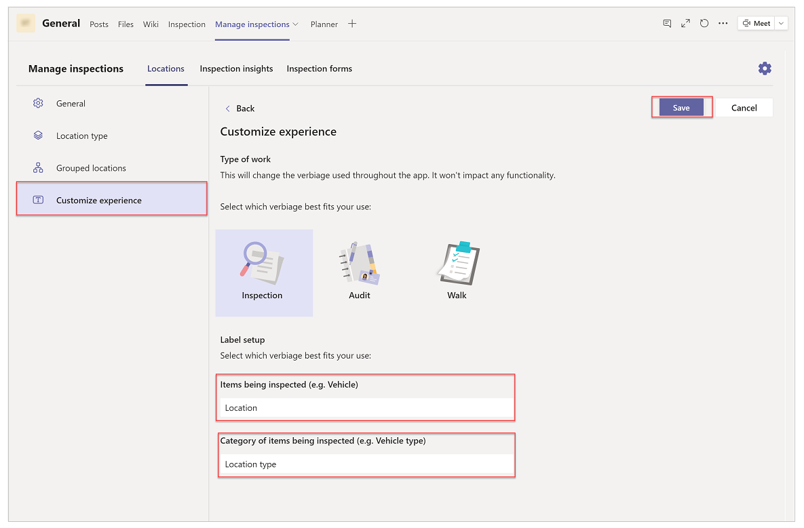

## Manage inspections app

The Manage inspections app gives a manager the following capabilities:

- [Configure the app](#configure-the-app)
- [Edit the app configuration](#edit-the-app-configuration)
- [Add location types](#add-location-types)
- [Add locations](#add-locations)
- [Review submitted inspections](#review-submitted-inspections)
- [Review inspection insights](#review-inspection-insights)

> [!NOTE]
> For the example in this tutorial, the items being inspected are referred to as **Location** and **Location types**. This is based around a retail scenario where retail employees inspect sections of a store before opening or closing for the day. These views can differ based on how you've configured your application. For example, when inspecting a fleet of vehicles, the labels might be **Vehicle** and **Vehicle Category**.

### Configure the app

To configure the app:

1. Sign in to Teams.

1. Select the team.

1. Select the **Manage inspections** tab in Teams.

1. Configure or skip Planner integration:

    - If your Teams channel has a Planner tab, select **I've a planner tab**.
    - To continue app configuration without Planner integration, select **I'll set up later**.

        > [!IMPORTANT]
        > Without Planer integration, the app will still work, but the tasks will not be created during the inspections.    

    - To set up the Planner tab first, go back to the Teams channel, set up the Planner tab, and reopen the **Manage inspections** tab.

        > [!TIP]
        > Give your Planner a distinct name, such as “Inspection tasks”. When you select the Planner instance later to configure the **Manage inspections** app, you'll be able to identify the right Planner based on this name. The list of Planner instances inside the app as options shows Planner names, and not the name on the Teams tab for the Planner.

    

1. If you want, change the channel where the messages will be posted.

1. If available, select the *Tasks* (Planner) instance to integrate the app with Planner.

    > [!NOTE]
    > - If you selected **I'll set up later** for Planner integration, you won't be able to select the *Tasks* (Planner) instance.

    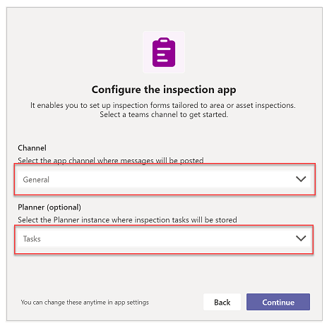

1. Select **Continue**.

1. Select **Let's go**.

    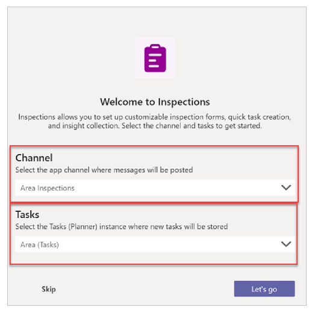

### Edit the app configuration

To edit the app configuration:

1. Go to the **Manage inspections** tab in Teams.

1. Select  from the upper-right corner.

1. Select **General** from the settings menu.

1. Change the required settings.

1. Select **Save**.

    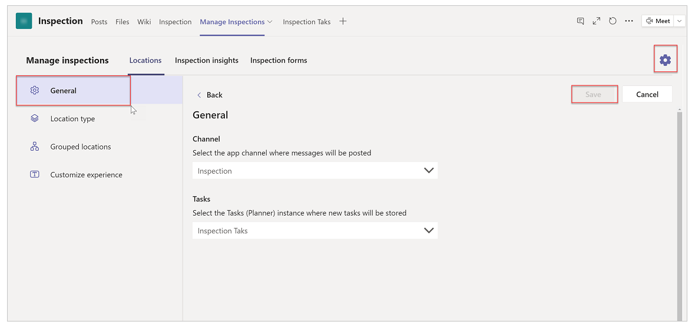

### Add location types

The location types define the classes of different areas that can be added to the app for inspection.

To add the area types:

1. Select the **Manage inspections** tab in Teams.

1. Select the **Locations** tab in the app.

1. Select  from the upper-right corner.

1. Select **Location type** on the left pane in the app.

1. Add, update, or delete location types as required. Examples: Interior, Food, Shopping.   For each location, you can enter *Title*, *Menu label*, and the update icon.

1. Select **Save**.

    

### Add locations

Locations are the areas that need to be inspected.

To add locations:

1. Select the **Manage inspections** tab in Teams.

1. Select **Add location** on the left pane in the app.

1. Enter the area details, such as *Title*.

1. Select the **Location type** from the drop-down menu.

1. Select **Save**.

    

### Add inspection forms

Inspection forms are tied to location types. You can define more than one inspection form for each location type. Each inspection form can be tied to more than one location types.

To add inspection forms:

1. Select the **Manage inspections** tab in Teams.

1. Select the **Inspection forms** tab.

1. Select **Add a form** to create a new inspection form.

   - Enter a *Title*.
   - Select **Associated location types**.
   - Add checklist steps by using **Add step**.

     Copy, delete, or move checklist steps up and down as required. You can enter one or more checklist steps for the inspection form. Each checklist step can have a *Title*, *Detailed Instructions*, and an *Image*. Each checklist item can also have up to three action buttons associated, reflecting "Ok", "Issue" and "Not Applicable" outcomes. The labels of the buttons can be customized.

1. Select **Save**.

    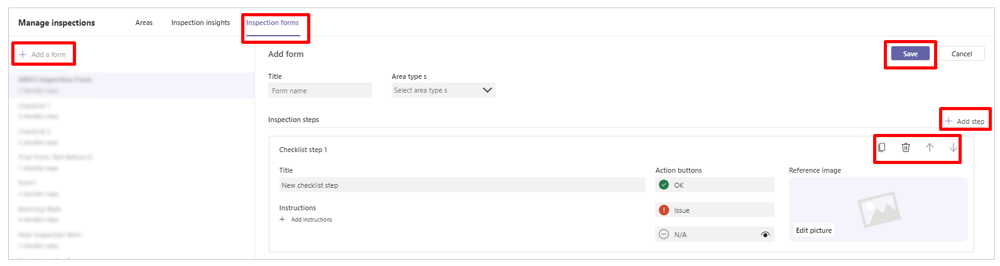

## Review inspections app

The Review inspections app gives a manager the following capabilities:

- [Review submitted inspections](#review-submitted-inspections)
- [Review inspection insights](#review-inspection-insights)

### Review submitted inspections

To review submitted inspection:

1. Select the **Review inspections** tab in Teams.

1. Select the **Locations** tab.

1. Select a location on the left pane.

1. In the **Inspections** section, select a submitted inspection.

    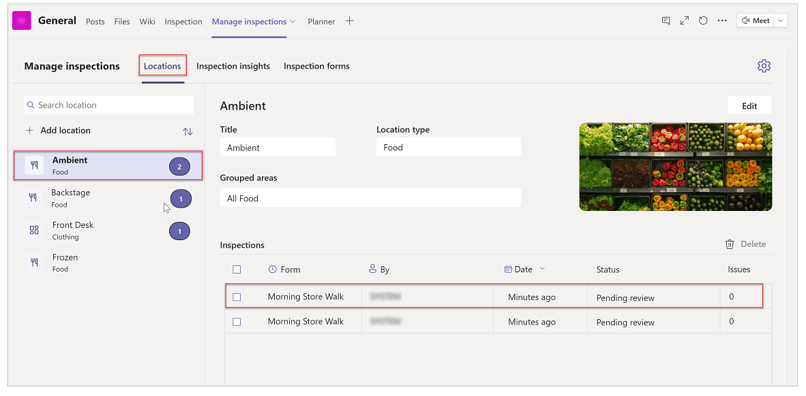

1. Review the submitted inspection details as required.

    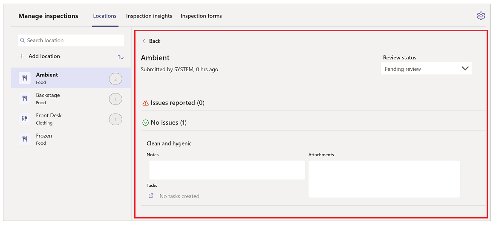

### Review inspection insights

Inspection insights provide managers with a dashboard of insights about inspection history.

To view the inspection insights:

1. Select the **Review inspections** tab in Teams.

1. Select **Inspection insights** tab inside the app.

    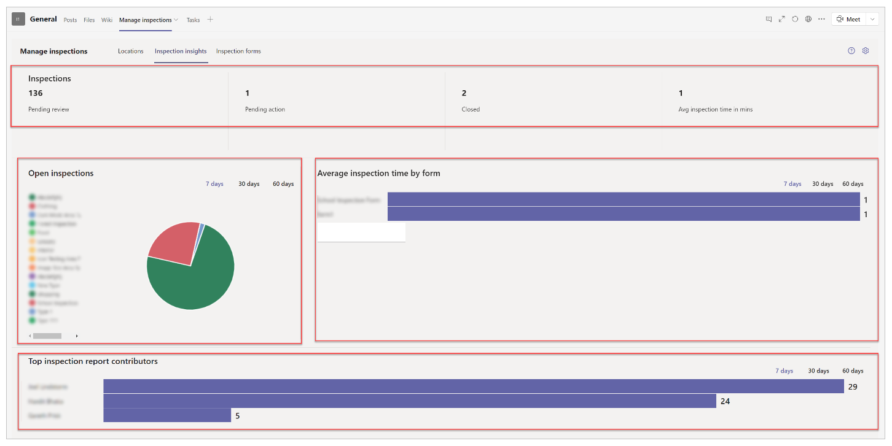

The following table explains dashboard areas in detail.

| Dashboard area | Details |
| - | - |
| **Inspections** | Shows inspection KPIs for pending, closed inspections, and average inspection time.   **Note**: If you don’t see any results in the *Closed* KPI, you may have completed inspections that haven't been closed. Go back to the **Locations** tab and close inspections. |
| **Open inspections** | A pie chart that shows inspections that have not been closed, grouped by category. Date range filters: 7/30/60 days.   **Note**: If you don't see the pie chart, all of the inspection records have been changed to closed status. |
| **Average inspection time by form** | A bar chart that shows the average time to complete inspections per form. This average includes both open and closed inspections. Date range filters: 7/30/60 days. |
| **Top inspection report contributors** | Shows the number of inspection forms completed by employees. Date range filters: 7/30/60 days. |

## Inspection app

The Inspection app enables employees to complete a full inspection of the locations.

> [!NOTE]
> To use the **Inspection** app, select the **Inspection** tab in the Teams channel.

The **Inspection** app provides following capabilities:

- [Home screen](#home-screen)
- [Choose a location to inspect](#choose-a-location-to-inspect)
- [Select an inspection form](#select-an-inspection-form)
- [Inspection overview](#inspection-overview)
- [Inspection form](#inspection-form)
- [Add Planner task to an inspection step](#add-a-planner-task-to-an-inspection-step)
- [Review inspection](#review-inspection)

### Home screen

The app greets you based on your time of the day. If Planner is integrated from the manager app, statistics of the Planner tasks and all inspections for the last seven days are displayed.

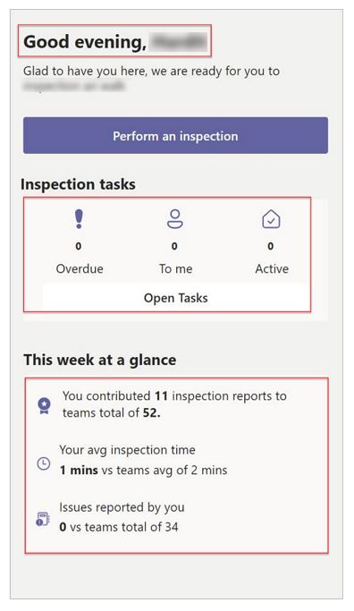

If Planner isn't integrated from the manager app, a screen as shown in the following image is displayed when you select **Open Tasks**. Selecting **Close** takes you back to the previous screen.

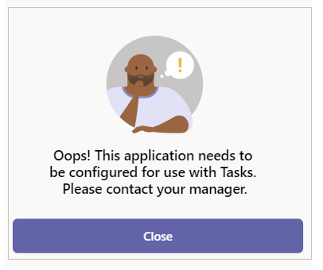

### Choose a location to inspect

Selecting **Inspect a location** takes you to the next screen, which allows
you to select the location that needs to be inspected.

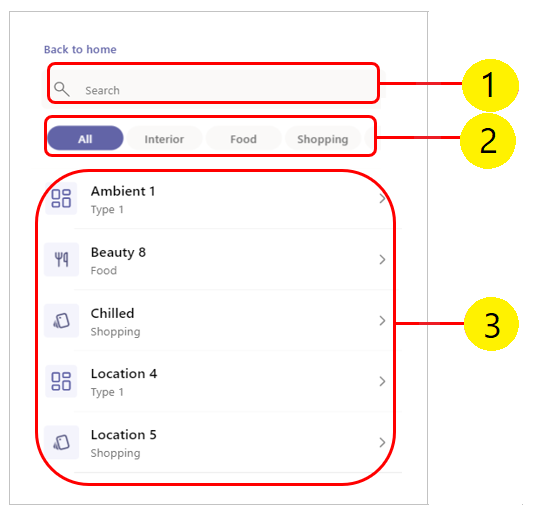

1. **Search box** - searches for a location based on the location type selected.

1. **Location types** - lists all the location types with an additional option. Default: *All*.

1. **Locations** - lists all the locations based on selected area. If *All* is selected, all the locations are listed by default.

### Select an inspection form

If more than one inspection form is associated to the location type, the app allows you to choose one of the inspection forms. Otherwise, the app takes you to *Inspection overview* screen.

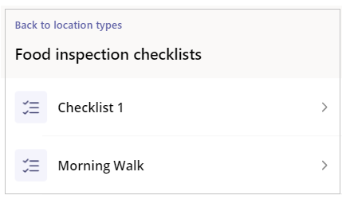

### Inspection overview

This screen shows the image of the location with the checklist and the checklist steps that were configured in the manager app. To start an inspection, select **Begin inspection** or any of the checklist items.

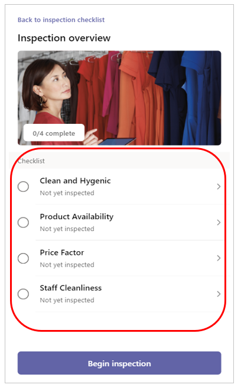

### Inspection form

Inspect the location, and fill in the details on the inspection form. The checklist instructions configured in the manager app are displayed.

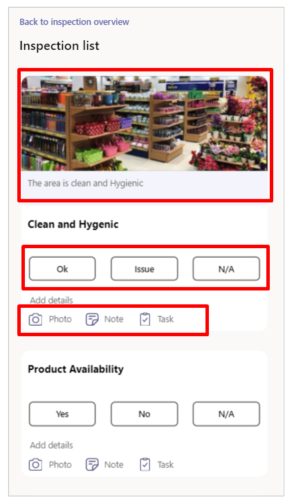

Select **Ok**, **Issue**, or **N/A** against each checklist. Select **Photo** to add an image, **Note** to add a note, and **Task** to add a Planner task.

### Add a Planner task to an inspection step

You can add a task that automatically creates a Planner task in the team to complete.

1. Select **Task** from the inspection step. This action updates the *Images* and *Notes*.

1. Select **Assign** to search for the users who you want to assign the task to.

1. Select a due date.

1. If necessary, update the description.

1. Select **Add Task**.

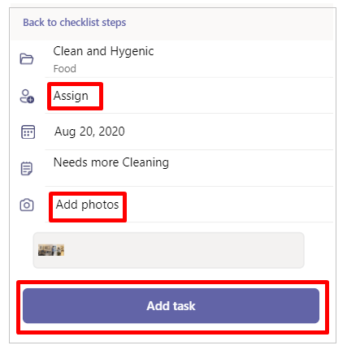

If the Planner isn't integrated from the manager app, you can't create tasks and the following screen is displayed.

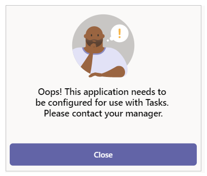

Selecting **Close** takes you to the previous screen.

### Review inspection

Select the checklist step to go back to the previous screen and
modify the outcome. Or, select **Submit inspection** to submit the inspection form.

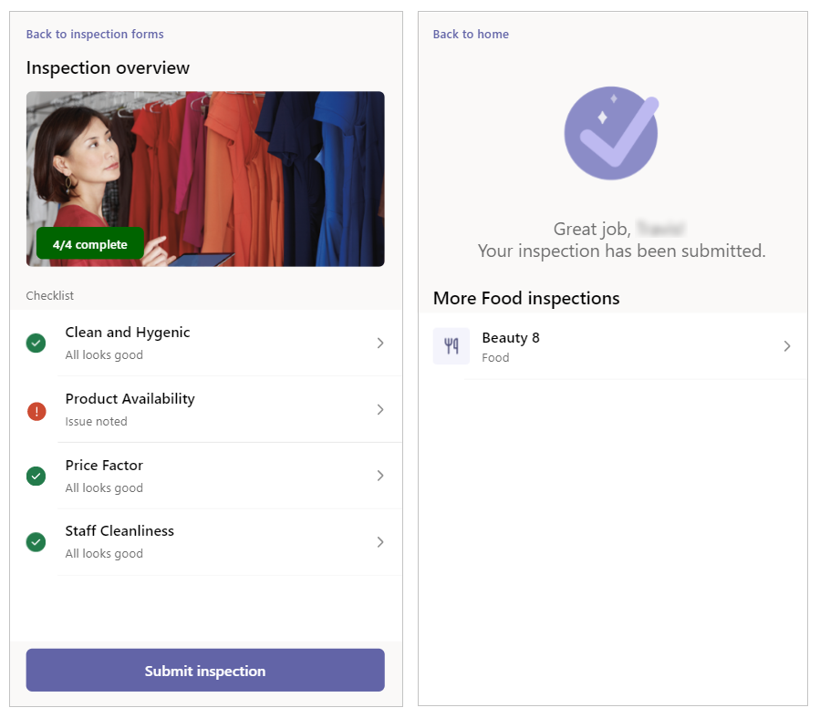

After the inspection is submitted, the app takes you to the next screen that shows the status of the submission and the list of all the locations of the current location type.

### See also

- [Understand Inspection sample apps architecture](inspection-architecture.md)
- [Customize Inspection sample app](customize-inspections.md)
- [Customize sample apps](customize-sample-apps.md)
- [Sample apps FAQs](sample-apps-faqs.md)
- [Use sample apps from the Microsoft Teams store](use-sample-apps-from-teams-store.md)

[!INCLUDE[footer-include](../includes/footer-banner.md)]