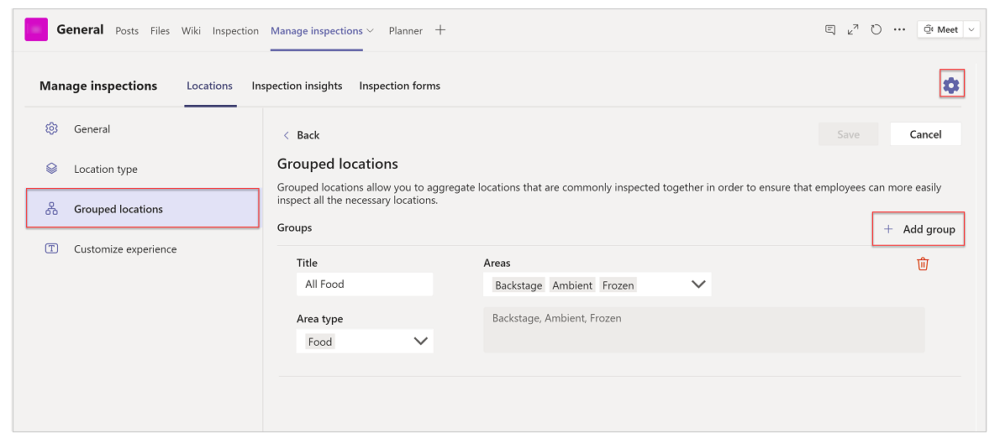
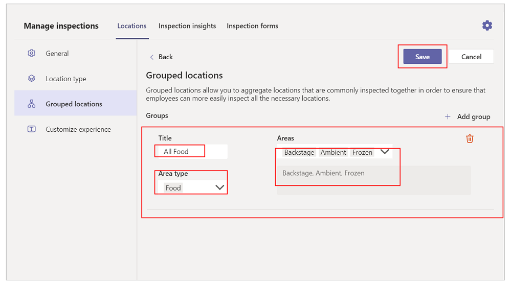
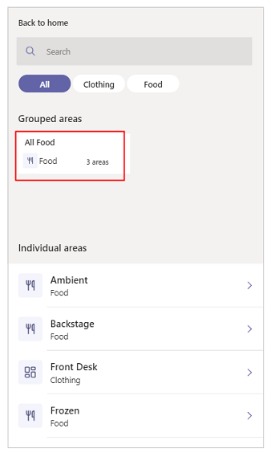
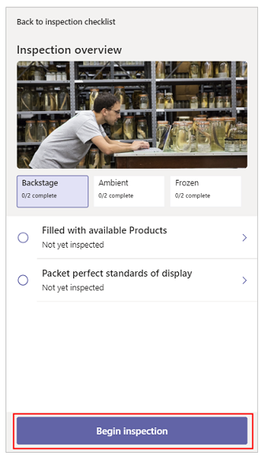
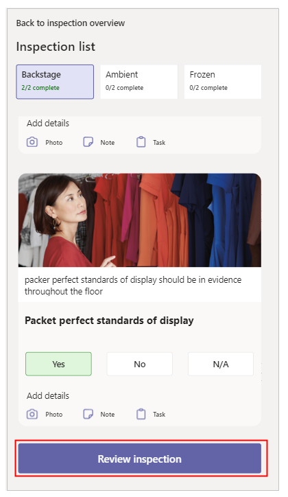
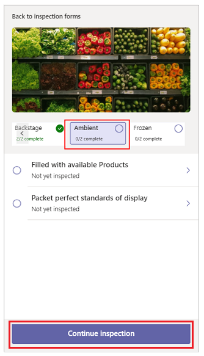
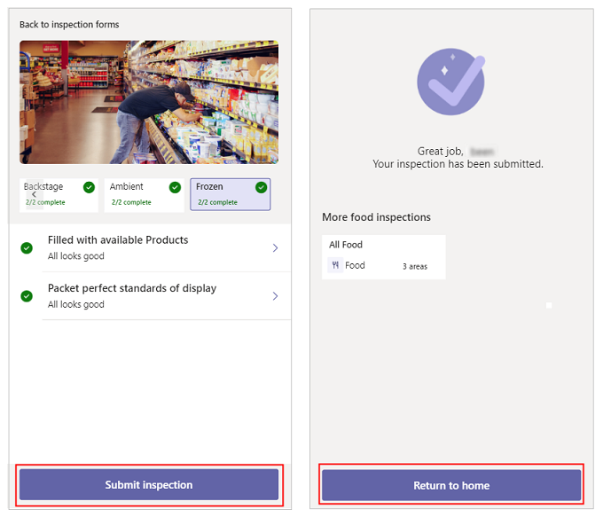

# Inspection

[!INCLUDE [cc-beta-prerelease-disclaimer.md](../includes/cc-beta-prerelease-disclaimer.md)]

In this tutorial, learn about the **Inspection** (User) and **Manage Inspections** (Manager) apps, and how to use them effectively.

## Overview

The Inspection solution for Teams is a general inspection app that can be used
to inspect anything from a location, such as a retail store or manufacturing
plant to assets and equipment such as vehicles and machines. There are two apps in this solution, each intended for different kinds of users.

- [Manage Inspections app](#manage-inspections-app)

    This app is used by a manager to perform the following actions:

    - App configuration.
    - Configure inspection forms and define outcome.
    - Gain visibility to inspection results and issue status.
    - Ensure that all the identified issues have been addressed by the staff.
    - Identify repeat issues from prior inspections, analyze root cause, and
    prevent future occurrence.

- [Inspection app](#inspection-app)

    This app is used by employees to perform the following actions:

    - Inspect something, such as an asset or an area within a building or other location in the course of completing their job. The app provides inspection   checklists so that multiple locations can be inspected. For example, a store  employee can use this app to inspect a section of a retail store to verify that the store is ready to open for the day.
    - When an issue is found during the inspection, the employee can log the issue and assign it to the right person so that it can be resolved quickly.

## Prerequisites

Before using this app:

- Find the app in Teams store.
- Install the app.
- Set up the app for the first use.

For details about the above steps, go to [Use sample apps from the Teams store](use-sample-apps-from-teams-store.md).

## Label setup

The labels describing the items being inspected and their associated types can
be modified in the **Manage Inspections** app.

To change labels used in the app:

1. Sign in to Teams.

1. Select the team.

1. Select **Manage Inspections** tab in Teams.

1. Select  from the top-right corner.

1. Select **Customize experience** from the left pane.

1. Enter labels in the **Main section** field for the main category of items to be inspected such as assets, areas, or locations.

1. Enter labels in the **Secondary section** field for the secondary category of items such as type of assets, areas, or locations.

1. Select **Save** to save the changes to label setup.

    

## Manage Inspections app

Manager app gives the manager the following capabilities:

- [Configure the app](#configure-the-app)
- [Edit the app configuration](#edit-the-app-configuration)
- [Add location types](#add-location-types)
- [Add locations](#add-locations)
- [Group locations](#group-locations)
- [Review submitted inspection](#review-submitted-inspection)

> [!NOTE]
> The example in this tutorial, the items being inspected are referred to as **Location** and **Location types**. This is based around a retail scenario where retail employees inspect sections of a store before opening or closing for the day. These views may differ based on how you have configured your application. For example, when inspecting a fleet of vehicles, the labels might be **Vehicle**, and **Vehicle Category**.

### Configure the app

To configure the app:

1. Sign in to Teams.

1. Select the team.

1. Select the **Manage Inspections** tab in Teams.

1. Select the *Channel* where the messages will be posted.

1. (Optional) Select the *Tasks* (Planner) instance to integrate the app with Planner.

1. Select **Let’s go** if you selected a *Tasks* (Planner) instance in the previous step, otherwise select **Skip**.

    

### Edit the app configuration

To edit the app configuration:

1. Go to the **Manage Inspections** tab in Teams.

1. Select  from the top-right corner.

1. Select **General** from the settings menu.

1. Change the required settings.

1. Select **Save**.

    

### Add location types

The location types define the classes of different areas that can be added to the app for inspection.

To add the area types:

1. Select the **Manage Inspections** tab in Teams.

1. Select **Locations** tab inside the app.

1. Select  from the top-right corner.

1. Select **Location type** from the left-pane inside the app.

1. Add, update, or delete location types as required. Examples: Interior, Food, Shopping.   For each location, you can enter *Title*, *Menu label*, and update icon.

1. Select **Save**.

    

### Add locations

Locations are the areas that need to be inspected.

To add locations:

1. Select **Manage Inspections** tab in Teams.

1. Select **Add location** from the left-pane inside the app.

1. Enter the area details, such as *Title*.

1. Select the **Location type** from the dropdown.

1. Select **Save**.

    

### Group locations

Grouped locations allow users to aggregate locations that are commonly inspected together to ensure that employees can more easily inspect all the necessary locations.

To group locations:

1. Select **Manage Inspections** tab in Teams.

1. Select  from the top-right corner.

1. Select **Grouped locations**.

1. Select **Add group** to add a new group.

    

1. Enter *Title*.

1. Select locations and location types as required - such as area details.

1. Select areas as applicable.

1. Choose the Required Location from the locations dropdown

1. Select **Save**.

    

### Add inspection forms

Inspections forms are tied to location types. You can define more than one inspection form for each location type. Each inspection form can be tied to more than one location types.

To add inspection forms:

1. Select **Manage Inspections** tab in Teams.

1. Select **Inspection forms** tab.

1. Select **Add a form** to create a new inspection form.
    - Enter *Title*.
    - Select *Associated location types*.
    - Add checklist steps using **Add step**.

    Copy, delete, or move checklist steps up and down as required. You can enter one or more checklist steps for the inspection form. Each checklist step can have a *Title*, *Detailed Instructions*, and an *Image*. Each checklist item can also have up to three action buttons associated, reflecting "Ok", "Issue" and "Not Applicable" outcomes. The labels of the buttons can be customized.

1. Select **Save**.

    

### Review submitted inspection

To review submitted inspection:

1. Select **Manage Inspections** tab in Teams.

1. Select **Locations** tab.

1. Select a location from the left-pane.

1. In the **Inspections** section, select a submitted inspection.

    

1. Review the submitted inspection details as required.

    

## Inspection app

The Inspection app enables employees to complete a full inspection of the locations.

> [!NOTE]
> To use the **Inspection** app, select the **Inspection** tab inside the Teams channel.

The **Inspection** app provides following capabilities:

- [Home screen](#home-screen)
- [Choose a location to inspect](#choose-a-location-to-inspect)
- [Select an inspection form](#select-an-inspection-form)
- [Inspection overview](#inspection-overview)
- [Inspection form](#inspection-form)
- [Add Planner task to an inspection step](#add-a-planner-task-to-an-inspection-step)
- [Review inspection](#review-inspection)
- [Submit inspection for grouped locations](#submit-inspection-for-grouped-locations)

### Home screen

The app greats you based on your time of the day. If Planner is integrated from the manager app, statistics of the Planner tasks, and all inspections for last seven days are displayed.

If Planner isn't integrated from the manager app, below screen is displayed when selecting **Open Tasks**. Selecting **Close** takes you back to the previous screen.

### Choose a location to inspect

Selecting **Inspect a location** takes you to the next screen that allows
you to select the location that needs to be inspected.

1. **Search box** - searches for location based on the location type selected.

1. **Location types** - lists all the location types with and additional option. Default: *All*.

1. **Locations** - lists all the locations based on selected area. If *All* is selected, all the locations are listed by default.

### Select an inspection form

If there are more than one inspection forms associated to the location type, the app allows you to choose one of the inspection forms. Otherwise, the app takes you to *Inspection overview* screen.

### Inspection overview

This screen shows the image of the location with the checklist, and checklist steps configured in the manager app. To start an inspection, select **Begin inspection**, or any of the checklist items.

### Inspection form

Inspect the location and fill in the details on the inspection form. The checklist instructions configured in the manager app are displayed.

Select **Ok**, **Issue**, or **N/A** against each checklist. Select **Photo** to add an image, **Note** to add a note, and **Task** to add a Planner task.

### Add a Planner task to an inspection step

You can add task that automatically creates a Planner task inside the team to complete.

1. Select **Task** from the inspection step. This action updates the *Images* and *Notes*.

1. Add more images using **Add Photos**, or delete the unwanted images by selecting the images.

1. Select **Assign** to search for the user(s) that you wanted to assign the task to.

1. Select a due date.

1. If necessary, update the description.

1. Select **Add Task**.

You can't create tasks and the following screen is displayed if the Planner isn't integrated from the manager app.

Selecting **Close** takes you to the previous screen.

### Review inspection

Select the checklist step to go back to the previous screen, and
modify the outcome. Or, select **Submit inspection** to submit the inspection form.

Once inspection is submitted, the app takes you to the next screen that shows the status of the submission, and the list of all the locations of the current location type.

### Submit inspection for grouped locations

To submit inspection of grouped locations:

1. Open **Inspection** tab in Teams.

1. Select **Inspect location**.

1. Select the group from **Grouped locations** section.

    

1. Select **Begin inspection**.

    

1. Respond to the inspection steps on screen.

1. Select **Review inspection**.

    

1. Select the next location in the tab.

1. Select **Continue inspection**.

    

1. Respond to the inspection steps on screen.

1. Select **Submit inspection**.

    

### See also

- [Employee Ideas](employee-ideas.md)
- [Issue Reporting](issue-reporting.md)
