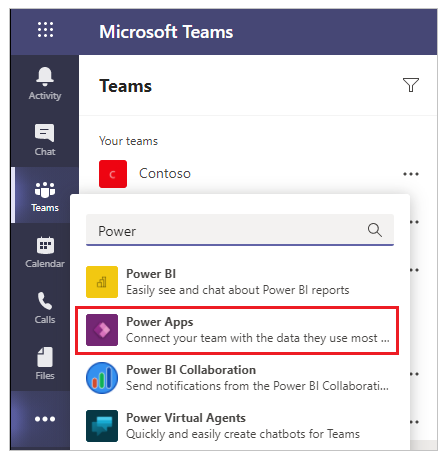
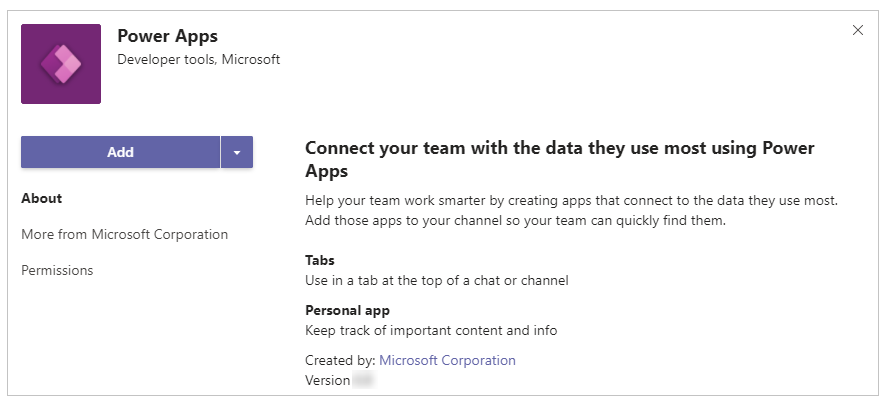

# Install the Power Apps personal app in Microsoft Teams

A *personal app* is a Teams application that has a personal scope. Power Apps is by default available for you to select and add to a tab in the Teams channel of your choice. More information: [Personal apps](/microsoftteams/platform/concepts/design/personal-apps)

1. Open Microsoft Teams, and then select **More added apps** (...).

1. Search for **Power Apps**.

   

1. Select **Add**.

   

Power Apps is now added to Teams. You can access the app in Teams from the left pane.

> [!TIP]
> As an alternative to using the flyout menu, you can select **Apps** from the lower-left corner in Teams, and then search for **Power Apps** to install the app.

## Pin Power Apps to Teams

To easily access Power Apps app, **right click** the Power Apps app from  , and then select **Pin**.

This action adds Power Apps to the Teams left rail for quick access.

When you pin Power Apps app, the text of the app icon in the Teams rail changes from italicized to normal to reflect the pinned app.

You can unpin Power Apps app anytime with a **right click** on the Power Apps app from the left rail, and then by selecting **Unpin**.

## Pop out app

If you're using [Microsoft Teams desktop app](https://www.microsoft.com/microsoft-teams/download-app), you can use the **Pop up out** option to open Power Apps in a separate window for ease of use.

This way, you can continue to use Microsoft Teams for day-to-day interactions and still be able to interact with Power Apps separately.

### Next steps

[Create your first app in Teams](create-first-app.md) 
[Overview of the Power Apps app](overview-of-the-power-apps-app.md)

[!INCLUDE[footer-include](../includes/footer-banner.md)]