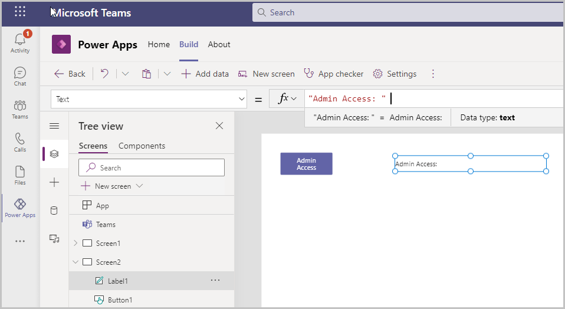
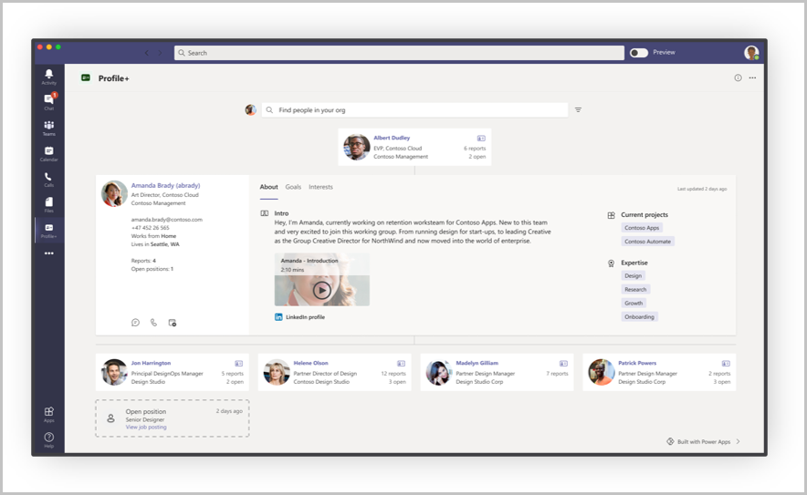

# Integrate with Azure Active Directory

In this article, we'll learn about how to integrate apps created using Power Apps in Microsoft Teams with Azure Active Directory (AD).

Integration with Azure AD enables many deep capabilities within your organization hierarchy, the people in your organizations, and groups. For example, you can get information about a person, their job title, department, or photo. You can also get information about the user's organization hierarchy, such as their manager.

This integration can also be used to grant access to app functionality based on their role or group membership, and therefore, be used to control security to sensitive data or functionality.

In this article, we'll create a Power Apps app with a button with administrative access on it. The visibility of the button will depend on whether the user is a member of the admin group or not.

## Prerequisites

To complete this lesson, we'd need the ability to create apps within Teams that will be available as part of select Microsoft 365 subscriptions. We'll also need access to Azure AD to create the admin group and assign members to it.

## Sign in to Teams

Login into Teams using either the Desktop app or the web app.

## Create a new Team

In this section, we'll create a new team, and then create an app within that team. Skip this section if you already have a team that you want to use instead of creating a new one.

1. To create a new team, select the Teams tab, and then select **Join or create a team** on the left bottom of the screen.

1. Select **Create Team** > **From Scratch** > **Public**, give the team a name such as "Azure AD Integration", and select **Create**.

1. (Optional) If you have any members in your organization that you'd like to add to the team for testing purposes, select them, and add them in the popup for adding members.

1. Select **Close**.

The new team gets created, and is listed under the Teams tab.

## Create a new Azure AD Group

1. Sign in to [Azure portal](https://portal.azure.com) with the same account that you logged into Teams with earlier.

1. On the top search bar, search for and select **Groups**.

1. Select **+ New Group**.

1. Set up the group with the following values:

    | Option | Value |
    | - | - |
    | Group type | Microsoft 365 |
    | Group name | Admin Access |
    | Group email address | Automatically updated |
    | Group description | Group for users with Admin access |

1. Select **Create**.

1. Copy the group's object ID from the group overview screen for use later.

## Create a new app

We'll create an app with a button that will only show up if the user is a member of the team we created above.

1. Open the Teams app.

1. Select **Power Apps**.

1. Select **+ New app** under **Recent apps**.

1. Select the team created earlier, and then select **Create**.

1. The app gets created, and the Power Apps Studio opens to allow editing the app.

1. Enter a name for the app, such as "Integrate with Azure AD", and then select **Save**.

1. Select **Data** > **Add data**.

1. In the connectors list, search for Azure AD, and select it to add that as a connection.

1. Select **Connect**.

1. Sign in, and select **Accept** to connect.

1. In the **Tree view**, select **+ New screen** to add a new screen to the app.

1. Select **+** (Insert) icon on the left-pane.

1. Select **Button**.

1. Set the "Text" property of the button to “Admin access”.

1. Select **+** (Insert) again, and then select label control to add.

1. Update the label text to "Admin level: ".

    

1. Select the app from the tree view, and open the **OnStart** property from the top-left of the screen.

1. Enter the following formula for the app OnStart:

    ```powerapps-dot
    If(
        !IsEmpty(
            AzureAD.CheckMemberGroups(
                User().Email,
                ["Enter your Azure group ID here"]
            ).Value
        ),
        Set(varAdmin,true),
        Set(varAdmin,false)
    )
    ```

    > [!NOTE]
    > Update the formula with the group ID (GUID) for the group you copied [earlier](#create-a-new-azure-ad-group).

1. Select **...** (ellipsis) next to the app, and then select **Run OnStart**.

1. Select **...** (ellipsis) next to **Settings** on the top ribbon, and select to view variables. **varAdmin** is set to False.

1. Select Screen 2 from the Tree view, and update the Text formula for the label to `"Admin Level: " & varAdmin`. The label will currently show as "Admin level: false" on the screen.

    We'll now control the visibility of the Admin Access button so that it only shows up when the user is an admin (for example, belongs to the Admin access group in Azure AD)

1. Select the button, and set the **Visible** property to "varAdmin".

    The button doesn't show up anymore since we don't have admin access.

## Testing the integration

1. Sign in to [Azure portal](https://portal.azure.com).

1. Select the group created earlier.

1. Select **Members** under **Manage** from the left-pane.

1. Select **+ Add members** to add members to the group/

1. Select users from the list of users under **Add members** to add to the group.

1. Select **Select**. Selected users get added to the group.

1. Go back to Teams.

1. Select **Tree view**.

1. Select the app > **Run OnStart**.

The admin access button is now visible on Screen 2, and the label shows admin level as **true** since we're now members of the Admin access group.

## See Azure AD integration in action

You can see an example of Azure AD integration in the **Profile+** sample app for Teams.



- **Office 365 Users** connector is used to retrieve the user profile, including name, photo, manager, and other details.
- **Office 365 Groups** connector is used to retrieve the people who report to a selected user.

### See also

- [Boards (preview) sample app](boards.md)
- [Bulletins sample app](bulletins.md)
- [Employee ideas sample app](employee-ideas.md)
- [Get connected (preview)](get-connected.md)  
- [Inspection sample apps](inspection.md)  
- [Issue reporting sample apps](issue-reporting.md)
- [Milestones sample app](milestones.md)
- [Perspectives (preview) sample app](perspectives.md)
- [Profile+ (preview) sample app](profile-app.md)
- [Customize sample apps](customize-sample-apps.md)
- [Sample apps FAQs](sample-apps-faqs.md)

[!INCLUDE[footer-include](../includes/footer-banner.md)]
